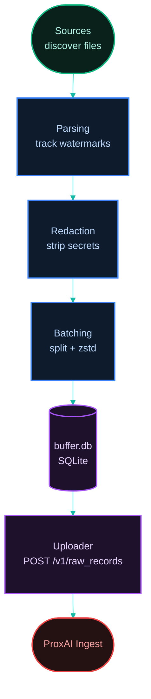
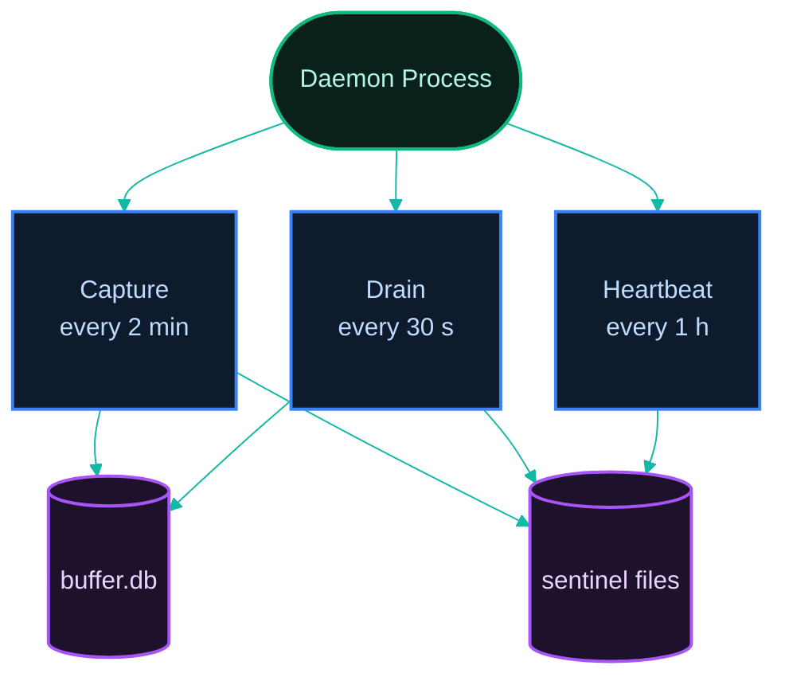

[Index](../../README.md) · [Next: 1.2 Tech Stack →](./1.2-tech-stack.md)

# 1.1 Overview & Mental Model

*Last Updated: 2026-05-27*

> The single-paragraph answer to "what is this thing and how does it fit together?"

proxai_gateway is a standalone native binary that runs as a managed background service and ships local coding-agent session data to the ProxAI ingest backend. It does not intercept HTTP traffic, install a proxy, or attach to any agent process. Every byte it sends originates from on-disk files the agents (Claude Code, Cursor, Codex, Gemini CLI) write themselves.

The gateway reads those files, redacts secrets with an on-device rule pipeline, compresses the result with zstd — Zstandard, a fast compression algorithm with a tunable level; the gateway uses level 3 as a balanced default for short-lived live data — and stores it in a local SQLite buffer until the uploader drains it. SQLite is the gateway's persistence layer because Bun (the JavaScript/TypeScript runtime the gateway is built on; provides native SQLite, zstd, fast install, and `--compile` for single-binary output) ships it built-in.



Six subsystems in a single straight pipeline: [sources](../02-capture/2.1-sources.md) discover and read files, [parsing](../02-capture/2.2-parsing-and-watermarks.md) tracks how far each file has been consumed via watermarks (per-file `[start, end)` byte or row offsets), [redaction](../02-capture/2.4-redaction.md) strips secrets, [batching](../02-capture/2.3-batching-and-compression.md) splits and compresses, the [buffer](../03-buffer/3.1-buffer.md) holds pending batches and progress receipts, and the [uploader](../04-daemon-loops/4.2-drain-cycle.md) ships them via the [backend protocol](../05-backend/5.1-backend-protocol.md). A platform-specific [service unit](../06-operations/6.2-daemon-and-service-unit.md) handles auto-start at login on macOS, Linux, and Windows.

## Three independent daemon loops

The daemon runs three loops in parallel under one process. They do not coordinate in memory — they communicate through SQLite rows and [sentinel files](../04-daemon-loops/4.4-sentinels.md) (tiny files on disk whose mere presence gates a loop) on disk. The same sentinels are how external CLI commands (`setup new` clears `AUTH_FAILED`, the drain cycle clears `BUFFER_FULL`) signal the running daemon without IPC. Each daemon owns its own copy of every sentinel under its profile directory — see [the dual-profile model](#what-is-the-prod-dev-profile-model) below.



- **[Capture](../04-daemon-loops/4.1-capture-cycle.md)** every 2 min (bounds 30 s – 30 min) — chosen because it's low enough to feel near-real-time yet high enough that idle hosts barely consume CPU. Walks every source, appends new batches to the buffer, writes the `BUFFER_FULL` sentinel if pending bytes pass the soft-pause threshold.
- **[Drain](../04-daemon-loops/4.2-drain-cycle.md)** every 30 s (bounds 5 s – 5 min): pulls the oldest pending batches, ships them, prunes receipts and failed rows past their retention, clears `BUFFER_FULL` once pending drops below the resume threshold.
- **[Heartbeat](../04-daemon-loops/4.3-heartbeat-cycle.md)** every 1 h (bounds 5 min – 24 h): checks GitHub for a newer release, runs the stale-binary policy, persists `latest_known_version`. Watermark sync from the server is **not** part of the heartbeat — it runs at daemon startup when the cursor table is empty.

Each loop is gated by sentinel files before it does work: `AUTH_FAILED` halts capture and drain, `BUFFER_FULL` halts capture only, and the heartbeat loop runs ungated so it can always recover the daemon via auto-upgrade.

## What stays local, what leaves

The gateway never sees, and never transmits, raw machine UUIDs, terminal scrollback, live HTTP traffic, anything matched by a redaction rule, or any file outside the per-agent watched directories. The [identity model](../05-backend/5.2-identity-auth-and-privacy.md) sends only a sha256-derived `host_id`, an ingestion key in an HTTP header, and the post-redaction body bytes plus their watermark metadata.

## What does it capture, and what doesn't it?

It captures the bytes the agents commit to disk: jsonl session logs (`claude-code`, `codex` rollouts, `gemini-cli` chats) and sqlite tables (`cursor` workspace storage, `codex` state). It does not capture live HTTP traffic, terminal scrollback, files outside the watched directories, or anything redacted by the on-device rule set before buffering. The only things uploaded are the redacted compressed slices plus their watermark metadata.

## What are the major components?

Six subsystems, in the order data flows through them:

- **Sources** (`src/sources/<app>/`) discover files matching a per-agent glob and decide which slices are new.
- **Parsing & watermarks** track per-file progress as byte offsets (jsonl) or rowid ranges (sqlite — `rowid` is SQLite's implicit primary-key column for any rowid table). Each cursor row is keyed by `(source_app, source_path_hash, source_inode, watermark_table)`, where the inode is the filesystem-level file identifier — tracking it lets the gateway notice when a path now points to a different underlying file (e.g., a log rotation).
- **Redaction** (`src/services/redaction/`) is the single pass that runs the 13 rule categories against decoded slice text before it touches the buffer.
- **Buffer** (`src/services/buffer/`) is the per-profile SQLite database `buffer.db` (under each profile's config directory) holding pending batches, cursors, receipts, metadata, and daemon state.
- **Uploader** (`src/services/uploader/`) drains pending batches via `POST /v1/raw_records`, applies rate-limit pacing, and writes receipts on success.
- **Service unit** (`src/cli/service-unit/`) is the platform-specific descriptor (launchd plist, systemd user unit, Scheduled Task XML — each is its respective OS's per-user service-manager config: launchd is macOS's, systemd is Linux's, Task Scheduler is Windows') that auto-starts the daemon at login.

## Where things live in the source tree

The gateway repo's `src/` is divided into four top-level areas:

```
src/
├── main.ts                  (CLI entry — commander wiring)
├── cli/                     (commands, wiring, service-unit writers, service-manager runners)
├── core/                    (io [fs / sqlite / jsonl], system [host-id, boot-id], log, utils)
├── services/                (buffer, polling, uploader, redaction, contract, config, http, upgrade, uninstall, state-machines)
└── sources/                 (claude-code, cursor, codex, gemini-cli)
```

- `cli/` owns everything the user types: subcommand handlers, dependency wiring for each command, the per-platform service-unit writers (launchd plist, systemd unit, Scheduled Task XML), and the service-manager runners that wrap `launchctl` / `systemctl` / `schtasks` — the user-space CLIs that talk to each platform's service manager.
- `core/` is the platform-agnostic plumbing — filesystem helpers, the sqlite open / read-only helpers, the structured logger, the host-id and boot-id derivation, generic utilities.
- `services/` is each long-running subsystem in the daemon: the SQLite buffer, the polling (capture) cycle, the uploader (drain) cycle, the redaction pipeline, the backend contract types, the config loader, the HTTP wrapper, the upgrade engine, the uninstall engine, and the state-machine-driven actors and coordination loops.
- `sources/` is one folder per supported coding-agent CLI; each owns its own discovery glob, parser, and watermark advancement.

The build, release, and npm-prep scripts live one level up at `scripts/`. The platform-specific binary entry-points are produced by `scripts/build.ts` from a single `src/main.ts`. The npm shim and postinstall lives at `npm/`. See [tech stack](./1.2-tech-stack.md) for the runtime and dependency choices, and [cross-platform binaries](./1.3-cross-platform-binaries.md) for how the six per-platform binaries are produced and shipped.

## Where does state live on disk?

The gateway uses fully-isolated profile subdirectories under its primary state directories for config, databases, sentinels, sockets, and log files.

### On-Disk Profile Paths

| Platform | Profile | Config + buffer + sentinels | Logs | Control Socket / Pipe | Service Unit Name |
| --- | --- | --- | --- | --- | --- |
| **macOS** | `prod` | `~/.proxai/proxai-gateway/prod/` | `~/Library/Logs/proxai/proxai-gateway/prod/` | `~/.proxai/proxai-gateway/prod/control.sock` | `co.proxai.gateway.plist` |
| | `dev` | `~/.proxai/proxai-gateway/dev/` | `~/Library/Logs/proxai/proxai-gateway/dev/` | `~/.proxai/proxai-gateway/dev/control.sock` | `co.proxai.gateway.dev.plist` |
| **Linux** | `prod` | `~/.proxai/proxai-gateway/prod/` | `~/.local/state/proxai/proxai-gateway/log/prod/` | `~/.proxai/proxai-gateway/prod/control.sock` | `proxai-gateway.service` |
| | `dev` | `~/.proxai/proxai-gateway/dev/` | `~/.local/state/proxai/proxai-gateway/log/dev/` | `~/.proxai/proxai-gateway/dev/control.sock` | `proxai-gateway-dev.service` |
| **Windows**| `prod` | `%LOCALAPPDATA%\proxai\proxai-gateway\prod\` | `%LOCALAPPDATA%\proxai\proxai-gateway\Logs\prod\` | `\\.\pipe\proxai-gateway-control-prod` | Scheduled Task `ProxAI Gateway` |
| | `dev` | `%LOCALAPPDATA%\proxai\proxai-gateway\dev\` | `%LOCALAPPDATA%\proxai\proxai-gateway\Logs\dev\` | `\\.\pipe\proxai-gateway-control-dev` | Scheduled Task `ProxAI Gateway (dev)` |

The config directory for each profile holds its own `config.toml`, its SQLite buffer `buffer.db` (along with `.db-wal` and `.db-shm` files), its control socket or named pipe, and its unique sentinel files (`AUTH_FAILED`, `BUFFER_FULL`, `SESSION_STOPPED`, `CONSENT_ACCEPTED`, `UPDATE_AVAILABLE`).

## What is the prod / dev profile model?

The gateway runs as one of two **profiles** — `prod` and `dev` — and the two are fully isolated from each other. A single host can run **two independent daemons at once**: a prod daemon shipping to the production ingest backend, and a dev daemon shipping to a local backend. Each profile is a self-contained install: its own `config.toml`, `buffer.db`, sentinel files, control socket, log directory, and backend endpoint. The two never share state.

A single path constructor, `buildProfileContext('prod' | 'dev')` (`src/core/io/fs/profile.ts`), is the source of truth for every per-profile path. The two profiles differ only in their nested path segment and their default backend (nest) base URL:

| | `prod` | `dev` |
| --- | --- | --- |
| Default backend (nest base URL) | `https://proxainest-production.up.railway.app` | `http://localhost:3001` |
| Config / buffer / sentinels / socket | `<root>/prod/` | `<root>/dev/` |
| Logs | `<logRoot>/prod/` | `<logRoot>/dev/` |

`<root>` and `<logRoot>` are the per-platform base directories listed in the table above. The legacy flat layout (everything directly under `~/.proxai/proxai-gateway/` with no profile segment) is gone, along with the old zero-argument `bufferDbPath()` / `configDir()` helpers — nothing reads them anymore.

* **Independent lifecycles.** Each daemon runs the same three-loop pipeline independently. A configured profile's daemon auto-starts at login via its [service unit](../06-operations/6.2-daemon-and-service-unit.md). Turning on the `dev` daemon never stops or pauses the `prod` daemon; both run concurrently.
* **Coordinated upgrades.** When the prod heartbeat loop applies an auto-upgrade, it coordinates the dev daemon across the binary swap so both end up on the new binary. See [dev mode and profiles](../06-operations/6.5-dev-mode-and-profiles.md) for the full handshake.

### Dev mode and the command surface

**Dev mode** is a boot-scoped CLI *perspective* — distinct from the dev *daemon*. It is recorded by a single `DEV_MODE` file at the profile root (`profileRootDir()/DEV_MODE`, `src/core/io/fs/dev-mode-sentinel.ts`) storing the current `boot_id` (`src/core/system/boot-id.ts`). Because the stored boot id is compared against the live boot id on every read, **dev mode self-clears on reboot** and never survives a restart.

Dev mode is never auto-activated. A developer turns it on with `dev on`; `dev off` clears the flag but **never stops the dev daemon** (the daemon keeps running in the background). While active, dev mode changes three CLI behaviors (`src/main.ts`): commands that read the flag (`setup`, `logs`, `doctor`) default to the `dev` profile instead of `prod`, `status` shows both profiles side-by-side (the same as passing `--all`), and the god-mode commands become visible in `--help`. Passing `--profile <name>` overrides the target on any command.

The command surface splits into two tiers:

* **Everyone:** `setup`, `start`, `stop`, `restart`, `upgrade`, `uninstall`, `status`, `logs`, `doctor`.
* **God-mode (registered with `{ hidden: !godMode }`, so hidden unless dev mode is active):** `dev`, `tail`, `inspect`, `redaction`, `replay`, `xstate`. `xstate` additionally errors out if invoked outside dev mode. The internal `run` command (used by the service unit) is always hidden and is not gated on dev mode.

The two newest everyone-tier commands are `logs` (a ledger of uploaded, queued, and failed records; `src/cli/commands/logs/`) and `doctor` (reliability diagnostics for common failure scenarios; `src/cli/commands/doctor/`).

## What is the identity model?

Three identifiers, all derived locally on first setup:

- **`host_id`** — `sha256(machine_uuid + ":" + user_id)`. Stable across daemon restarts on the same machine for the same user. Sent on every upload as the only persistent device tag.
- **`user_id`** — returned by `POST /ingestion/verify-key` when the ingestion key is validated; stored in the account section of `config.toml`.
- **`install_source`** — one of `bun`, `pnpm`, `yarn`, `npm`, `brew`, `github_release`. Reported on setup via `--install-source` and read back by `--version` and the auto-upgrade branch (`brew` uses the sentinel path because Homebrew owns the install location; the others replace the binary in place).

`boot_id` is read per process (sysctl on macOS, `/proc/sys/kernel/random/boot_id` on Linux, `LastBootUpTime` on Windows) and embedded in the `SESSION_STOPPED` sentinel so a stale stop from a previous boot is cleared automatically.

[Index](../../README.md) · [Next: 1.2 Tech Stack →](./1.2-tech-stack.md)
