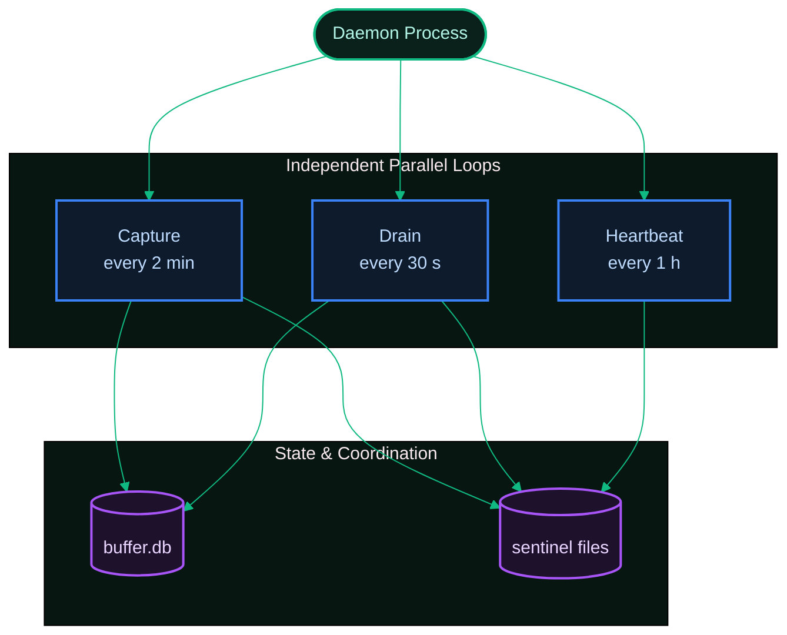

[Index](../../README.md) · [Next: 1.2 Tech Stack →](./1.2-tech-stack.md)

# 1.1 Overview & Mental Model

*Last Updated: 2026-05-27*

> The single-paragraph answer to "what is this thing and how does it fit together?"

proxai_gateway is a standalone native binary that runs as a managed background service and ships local coding-agent session data to the ProxAI ingest backend. It does not intercept HTTP traffic, install a proxy, or attach to any agent process. Every byte it sends originates from on-disk files the agents (Claude Code, Cursor, Codex, Gemini CLI) write themselves.

The gateway reads those files, redacts secrets with an on-device rule pipeline, compresses the result with zstd — Zstandard, a fast compression algorithm with a tunable level; the gateway uses level 3 as a balanced default for short-lived live data — and stores it in a local SQLite buffer until the uploader drains it. SQLite is the gateway's persistence layer because Bun (the JavaScript/TypeScript runtime the gateway is built on; provides native SQLite, zstd, fast install, and `--compile` for single-binary output) ships it built-in.

```mermaid
%%{init: { 'flowchart': { 'useMaxWidth': false, 'htmlLabels': true, 'curve': 'basis', 'nodeSpacing': 60, 'rankSpacing': 80, 'padding': 20 }, 'theme': 'base', 'themeVariables': { 'background': '#081612', 'primaryColor': '#081612', 'primaryTextColor': '#b3f5e6', 'primaryBorderColor': '#10b981', 'lineColor': '#10b981', 'secondaryColor': '#0a201b', 'tertiaryColor': '#081612', 'fontSize': '15px' }, 'themeCSS': ' .flowchart-link, .marker { stroke: #10b981 !important; filter: drop-shadow(0px 0px 4px rgba(16, 185, 129, 0.8)) !important; } .edgePath .path { stroke: #10b981 !important; stroke-width: 2px !important; } .node rect, .node circle, .node polygon, .node path { stroke-width: 2px !important; } .node.startNode rect, .node.startNode circle, .node.startNode polygon, .node.startNode path { fill: #0a201b !important; stroke: #10b981 !important; filter: drop-shadow(0px 0px 6px rgba(16, 185, 129, 0.7)) !important; } .node.startNode .label { color: #b3f5e6 !important; } .node.stopNode rect, .node.stopNode circle, .node.stopNode polygon, .node.stopNode path { fill: #241212 !important; stroke: #ef4444 !important; filter: drop-shadow(0px 0px 6px rgba(239, 68, 68, 0.7)) !important; } .node.stopNode .label { color: #fca5a5 !important; } .node.decNode rect, .node.decNode circle, .node.decNode polygon, .node.decNode path { fill: #241c0e !important; stroke: #f59e0b !important; filter: drop-shadow(0px 0px 6px rgba(245, 158, 11, 0.7)) !important; } .node.decNode .label { color: #fde68a !important; } .node.processNode rect, .node.processNode circle, .node.processNode polygon, .node.processNode path { fill: #0d1b2d !important; stroke: #3b82f6 !important; filter: drop-shadow(0px 0px 6px rgba(59, 130, 246, 0.7)) !important; } .node.processNode .label { color: #bfdbfe !important; } .node.actionNode rect, .node.actionNode circle, .node.actionNode polygon, .node.actionNode path { fill: #1e112c !important; stroke: #a855f7 !important; filter: drop-shadow(0px 0px 6px rgba(168, 85, 247, 0.7)) !important; } .node.actionNode .label { color: #e9d5ff !important; } .node.default rect, .node.default circle, .node.default polygon, .node.default path { fill: #0a201b !important; stroke: #14b8a6 !important; filter: drop-shadow(0px 0px 6px rgba(20, 184, 166, 0.7)) !important; } .node.default .label { color: #ccfbf1 !important; } ' } }%%
flowchart TD
  subgraph INGESTION ["1. Ingestion Phase"]
    sources([Sources<br/>discover files]) --> parsing[Parsing<br/>track watermarks]
  end

  subgraph PROCESSING ["2. Processing Phase"]
    redaction[Redaction<br/>strip secrets] --> batching[Batching<br/>split + zstd]
  end

  subgraph RETENTION ["3. Storage & Upload Phase"]
    buffer[(buffer.db<br/>SQLite)] --> uploader[Uploader<br/>POST /v1/raw_records]
  end

  parsing --> redaction
  batching --> buffer
  uploader --> backend([ProxAI Ingest])

  classDef startNode fill:#0a201b,stroke:#10b981,stroke-width:2px,color:#b3f5e6;
  classDef stopNode fill:#241212,stroke:#ef4444,stroke-width:2px,color:#fca5a5;
  classDef decNode fill:#241c0e,stroke:#f59e0b,stroke-width:2px,color:#fde68a;
  classDef processNode fill:#0d1b2d,stroke:#3b82f6,stroke-width:2px,color:#bfdbfe;
  classDef actionNode fill:#1e112c,stroke:#a855f7,stroke-width:2px,color:#e9d5ff;
  classDef default fill:#0a201b,stroke:#14b8a6,stroke-width:2px,color:#ccfbf1;

  class sources startNode;
  class parsing processNode;
  class redaction processNode;
  class batching processNode;
  class buffer actionNode;
  class uploader actionNode;
  class backend stopNode;
```



Six subsystems in a single straight pipeline: [sources](../02-capture/2.1-sources.md) discover and read files, [parsing](../02-capture/2.2-parsing-and-watermarks.md) tracks how far each file has been consumed via watermarks (per-file `[start, end)` byte or row offsets), [redaction](../02-capture/2.4-redaction.md) strips secrets, [batching](../02-capture/2.3-batching-and-compression.md) splits and compresses, the [buffer](../03-buffer/3.1-buffer.md) holds pending batches and progress receipts, and the [uploader](../04-daemon-loops/4.2-drain-cycle.md) ships them via the [backend protocol](../05-backend/5.1-backend-protocol.md). A platform-specific [service unit](../06-operations/6.2-daemon-and-service-unit.md) handles auto-start at login on macOS, Linux, and Windows.

## Three independent daemon loops

The daemon runs three loops in parallel under one process. They do not coordinate in memory — they communicate through SQLite rows and [sentinel files](../04-daemon-loops/4.4-sentinels.md) (tiny files on disk whose mere presence gates a loop) on disk. The same sentinels are how external CLI commands (`pause`, `resume`, `setup`) signal the running daemon without IPC.



- **[Capture](../04-daemon-loops/4.1-capture-cycle.md)** every 2 min (bounds 30 s – 30 min) — chosen because it's low enough to feel near-real-time yet high enough that idle hosts barely consume CPU. Walks every source, appends new batches to the buffer, writes the `BUFFER_FULL` sentinel if pending bytes pass the soft-pause threshold.
- **[Drain](../04-daemon-loops/4.2-drain-cycle.md)** every 30 s (bounds 5 s – 5 min): pulls the oldest pending batches, ships them, prunes receipts and failed rows past their retention, clears `BUFFER_FULL` once pending drops below the resume threshold.
- **[Heartbeat](../04-daemon-loops/4.3-heartbeat-cycle.md)** every 1 h (bounds 5 min – 24 h): checks GitHub for a newer release, runs the stale-binary policy, persists `latest_known_version`. Watermark sync from the server is **not** part of the heartbeat — it runs at daemon startup when the cursor table is empty.

Each loop is gated by sentinel files before it does work: `AUTH_FAILED` halts capture and drain, `BUFFER_FULL` halts capture only, and the heartbeat loop runs ungated so it can always recover the daemon via auto-upgrade.

## What stays local, what leaves

The gateway never sees, and never transmits, raw machine UUIDs, terminal scrollback, live HTTP traffic, anything matched by a redaction rule, or any file outside the per-agent watched directories. The [identity model](../05-backend/5.2-identity-auth-and-privacy.md) sends only a sha256-derived `host_id`, an ingestion key in an HTTP header, and the post-redaction body bytes plus their watermark metadata.

## What does it capture, and what doesn't it?

It captures the bytes the agents commit to disk: jsonl session logs (`claude-code`, `codex` rollouts, `gemini-cli` chats) and sqlite tables (`cursor` workspace storage, `codex` state). It does not capture live HTTP traffic, terminal scrollback, files outside the watched directories, or anything redacted by the on-device rule set before buffering. The only things uploaded are the redacted compressed slices plus their watermark metadata.

## What are the major components?

Six subsystems, in the order data flows through them:

- **Sources** (`src/sources/<app>/`) discover files matching a per-agent glob and decide which slices are new.
- **Parsing & watermarks** track per-file progress as byte offsets (jsonl) or rowid ranges (sqlite — `rowid` is SQLite's implicit primary-key column for any rowid table). Each cursor row is keyed by `(source_app, source_path_hash, source_inode, watermark_table)`, where the inode is the filesystem-level file identifier — tracking it lets the gateway notice when a path now points to a different underlying file (e.g., a log rotation).
- **Redaction** (`src/services/redaction/`) is the single pass that runs the 13 rule categories against decoded slice text before it touches the buffer.
- **Buffer** (`src/services/buffer/`) is the SQLite database at `~/.proxai/proxai-gateway/buffer.db` holding pending batches, cursors, receipts, metadata, and daemon state.
- **Uploader** (`src/services/uploader/`) drains pending batches via `POST /v1/raw_records`, applies rate-limit pacing, and writes receipts on success.
- **Service unit** (`src/cli/service-unit/`) is the platform-specific descriptor (launchd plist, systemd user unit, Scheduled Task XML — each is its respective OS's per-user service-manager config: launchd is macOS's, systemd is Linux's, Task Scheduler is Windows') that auto-starts the daemon at login.

## Where things live in the source tree

The gateway repo's `src/` is divided into four top-level areas:

```
src/
├── main.ts                  (CLI entry — commander wiring)
├── cli/                     (commands, wiring, service-unit writers, service-manager runners)
├── core/                    (io [fs / sqlite / jsonl], system [host-id, boot-id], log, utils)
├── services/                (buffer, polling, uploader, redaction, contract, config, http, upgrade, uninstall, state-machines)
└── sources/                 (claude-code, cursor, codex, gemini-cli)
```

- `cli/` owns everything the user types: subcommand handlers, dependency wiring for each command, the per-platform service-unit writers (launchd plist, systemd unit, Scheduled Task XML), and the service-manager runners that wrap `launchctl` / `systemctl` / `schtasks` — the user-space CLIs that talk to each platform's service manager.
- `core/` is the platform-agnostic plumbing — filesystem helpers, the sqlite open / read-only helpers, the structured logger, the host-id and boot-id derivation, generic utilities.
- `services/` is each long-running subsystem in the daemon: the SQLite buffer, the polling (capture) cycle, the uploader (drain) cycle, the redaction pipeline, the backend contract types, the config loader, the HTTP wrapper, the upgrade engine, the uninstall engine, and the state-machine-driven actors and coordination loops.
- `sources/` is one folder per supported coding-agent CLI; each owns its own discovery glob, parser, and watermark advancement.

The build, release, and npm-prep scripts live one level up at `scripts/`. The platform-specific binary entry-points are produced by `scripts/build.ts` from a single `src/main.ts`. The npm shim and postinstall lives at `npm/`. See [tech stack](./1.2-tech-stack.md) for the runtime and dependency choices, and [cross-platform binaries](./1.3-cross-platform-binaries.md) for how the six per-platform binaries are produced and shipped.

## Where does state live on disk?

| Platform | Config + buffer + sentinels | Logs | Service unit |
| --- | --- | --- | --- |
| macOS | `~/.proxai/proxai-gateway/` | `~/Library/Logs/proxai/proxai-gateway/` | `~/Library/LaunchAgents/co.proxai.gateway.plist` |
| Linux | `~/.proxai/proxai-gateway/` | `~/.local/state/proxai/proxai-gateway/log/` | `~/.config/systemd/user/proxai-gateway.service` |
| Windows | `%LOCALAPPDATA%\proxai\proxai-gateway\` | `%LOCALAPPDATA%\proxai\proxai-gateway\Logs\` | Scheduled Task `ProxAI Gateway` |

The config directory holds `config.toml`, `buffer.db`, the control socket (`control.sock` / `\\.\pipe\proxai-gateway-control`), and the sentinel files (`AUTH_FAILED`, `BUFFER_FULL`, `SESSION_STOPPED`, `CONSENT_ACCEPTED`, `UPDATE_AVAILABLE`).

## What is the identity model?

Three identifiers, all derived locally on first setup:

- **`host_id`** — `sha256(machine_uuid + ":" + user_id)`. Stable across daemon restarts on the same machine for the same user. Sent on every upload as the only persistent device tag.
- **`user_id`** — returned by `POST /ingestion/verify-key` when the ingestion key is validated; stored in the account section of `config.toml`.
- **`install_source`** — one of `bun`, `pnpm`, `yarn`, `npm`, `brew`, `github_release`. Reported on setup via `--install-source` and read back by `--version` and the auto-upgrade branch (`brew` uses the sentinel path because Homebrew owns the install location; the others replace the binary in place).

`boot_id` is read per process (sysctl on macOS, `/proc/sys/kernel/random/boot_id` on Linux, `LastBootUpTime` on Windows) and embedded in the `SESSION_STOPPED` sentinel so a stale stop from a previous boot is cleared automatically.

[Index](../../README.md) · [Next: 1.2 Tech Stack →](./1.2-tech-stack.md)
