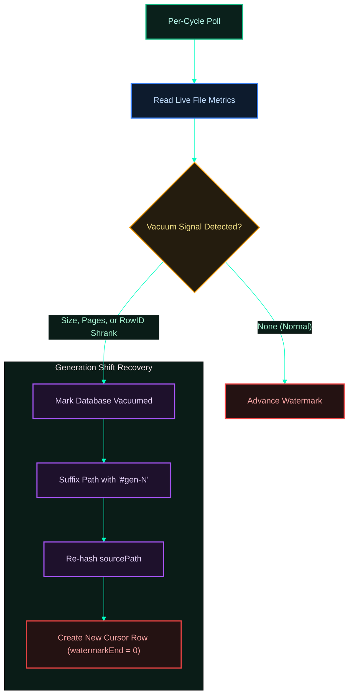

[← Previous: 2.1 Sources](./2.1-sources.md) · [Index](../README.md) · [Next: 2.3 Batching & Compression →](./2.3-batching-and-compression.md)

# 2.2 Parsing & Watermarks

*Last Updated: 2026-05-27*

> How "what's new in this file?" is decided, persisted, and resumed after a daemon restart.

A watermark is a half-open `[start, end)` interval over a per-file coordinate space — a way to say "everything below `end` has been captured; the next capture starts from `end`." The gateway uses two coordinate spaces:

- **`byte_range`** for jsonl files (Claude Code, Codex rollouts, Gemini CLI chats). The coordinate is a byte offset into the file, always advanced to the next newline boundary so partial lines never cross the boundary.
- **`rowid_range`** for sqlite tables (Cursor's `cursorDiskKV`, Codex state tables). The coordinate is sqlite's `rowid` (the implicit primary-key column for any rowid table), advanced to `max(rowid) + 1` after each successful read.

[Sources](./2.1-sources.md) are append-only streams the gateway re-reads on every [capture cycle](../04-daemon-loops/4.1-capture-cycle.md). Without a persistent cursor, the daemon would either reship every byte of every file every two minutes or miss bytes appended while it was down.

The cursor row is the per-file checkpoint and lives in the `source_cursors` table inside [`buffer.db`](../03-buffer/3.1-buffer.md). Its composite primary key is `(source_app, source_path_hash, source_inode, watermark_table)` — four fields chosen so a file rotation, a rebuild via `VACUUM`, a path move, or a sqlite table inside a multi-table source each produces a distinct cursor without colliding with the others. (`VACUUM` is SQLite's maintenance operation that rebuilds the database file to reclaim free pages and defragment storage; the page count change is one of the regression signals the gateway watches.)

## Two persistence paths: cursors and receipts

The same watermark fields ride along with every batch on the wire (`watermark_kind`, `watermark_start`, `watermark_end`, `watermark_table`) and are persisted on the matching `upload_receipts` row after upload. That redundancy is deliberate: the gateway can prove progress from either pending batches or already-delivered receipts, and the server-side watermark sync (`GET /v1/watermarks`) lets a fresh `buffer.db` resume from where the previous one left off.

When the server detects that a batch's `watermark_end` is *behind* the watermark it has already acknowledged, it rejects the upload with an HTTP 400 `watermark_regression` and the gateway runs a recovery handshake that jumps the cursor forward and appends an audit row to a dedicated `resync_events` table. See [How does watermark-regression recovery work?](#how-does-watermark-regression-recovery-work) below.

## Three special cases

Three special cases warrant their own paths through the parser:

- A jsonl file that is mid-write at capture time is trimmed back to the last `\n`, so partial trailing bytes wait for the next cycle.
- A sqlite file that shrank (`VACUUM` or wholesale rebuild) is detected by comparing `last_seen_size_bytes` / `last_seen_page_count` against the live file. The path is mutated with a `#gen-N` suffix and rehashed so the old cursor cannot be reused, and capture starts from rowid 0 on the new identity.
- An individual sqlite row whose redacted body exceeds the 10 MiB decompressed cap is recorded as metadata-only in the `quarantined_records` table (no body retained), and the cursor still advances past it so the cycle continues making progress.

All three are documented in the FAQs below.

## How does jsonl byte-range advancement work?

For every jsonl source, `collect` reads the current file size, calls `readJsonlRange(path, watermarkStart, fileSize)`, and trims the result to the last `\n` byte. The returned `endByte` is the exclusive watermark end — always on a newline boundary. Any trailing bytes after the final newline are left for the next cycle, which prevents partial-line splits when the agent is still appending.

`watermarkStart` for a fresh cursor is `0` (gemini-cli is the exception: the first capture skips the header line, so the first stored watermark end equals the offset of byte 1 of the second line). If the file shrank below the cursor (`file.sizeBytes <= watermarkStart`), the source returns without doing anything and waits for further writes.

## How does sqlite rowid-range advancement work?

For `cursor` and `codex` state tables, `collect` queries `SELECT … FROM <table> WHERE rowid > ? ORDER BY rowid ASC` where `?` is `cursor.watermark_end − 1`. New rows are read, redacted, sliced for size, inserted as batches, and the watermark advances to `max(rowid) + 1`. The watermark is the rowid of the next row not yet captured.

Both Cursor and Codex state reads run against a transactionally consistent, isolated Bun database snapshot (`snapshotSqlite` using SQLite's native `VACUUM INTO` command) so the parent agent's live writer is never blocked and the capture sees a consistent point-in-time view of the database.

To safeguard database snapshots from locking conflicts (such as `SQLITE_CANTOPEN` or "unable to open database file" errors caused by active WAL/journal locks by the parent agents), the snapshot engine implements a robust double-attempt open fallback pattern:
1. **Initial Attempt**: The engine attempts to open the source database in standard read-only mode (`openReadOnly`).
2. **Rescue Fallback**: If the initial open throws *any* error (indicating file locks or access conflicts), it immediately falls back and attempts to open it with `immutable: true` mode. This instructs SQLite to bypass active locks and journals, guaranteeing safe point-in-time read access. If even the immutable mode fails, the original error is re-thrown so real system problems (e.g. corruption or missing files) are never masked.


## What does a cursor row look like?

Schema in `buffer.constants.ts`:

```
source_app           TEXT NOT NULL
source_path_hash     TEXT NOT NULL
source_path          TEXT NOT NULL
source_inode         INTEGER NOT NULL DEFAULT 0
watermark_table      TEXT    NOT NULL DEFAULT ''
watermark_end        INTEGER NOT NULL DEFAULT 0
last_polled_at       TEXT NOT NULL
consecutive_errors   INTEGER NOT NULL DEFAULT 0
last_seen_size_bytes INTEGER
last_seen_page_count INTEGER
PRIMARY KEY (source_app, source_path_hash, source_inode, watermark_table)
```

Two sentinels make the composite key total over nullable fields: `NO_INODE_SENTINEL = 0` for sources that don't track inodes (cursor, codex state), and `NO_TABLE_SENTINEL = ''` for sources without a watermark table.

`source_inode` anchors the row to a specific file identity. If the file is rotated or rebuilt, the new inode produces a new cursor row at `watermark_end = 0`, so the new file is captured from the start without the gateway needing to remember "was this the same file or a renamed sibling?". `getCursorWithFallback` first looks up by exact inode; if no row matches it retries with the no-inode sentinel, which lets server-side watermark sync (where inode is unknown) seed cursors that the on-device discovery then takes over.

## How does the gateway resume after a daemon restart?

The buffer database is persistent. On daemon start the source pollers re-discover files, look up their cursor row by `(source_app, source_path_hash, source_inode, watermark_table)`, and resume reading from `watermark_end`. Pending batches that were not shipped before the restart stay in `upload_batches` with `status = pending` and are picked up by the next drain cycle. Upload receipts already in `upload_receipts` are never re-uploaded because they are not in `upload_batches`.

There is no separate "checkpoint" file — the SQLite cursor row is the checkpoint, written transactionally with the batches it covers. SQLite was chosen here because atomic transactions give crash-safety for free; a flat-file checkpoint would need its own fsync dance.

## How is sqlite VACUUM detected?



`detectVacuum` in `services/buffer/vacuum-detect.ts` flags a rebuild when any of three signals fire:

1. `current.sizeBytes < cursor.last_seen_size_bytes` (file shrank).
2. `current.page_count < cursor.last_seen_page_count` (pages dropped).
3. `current.max(rowid) + 1 < cursor.watermark_end` (rowid space regressed).

The cursor row records `last_seen_size_bytes` and `last_seen_page_count` on each successful poll precisely to support this check. When vacuum is detected the source path is mutated with the next `#gen-N` suffix, re-hashed via `sha256Hex`, and treated as a brand-new source identity. The old cursor row stays behind for forensic value but is no longer matched by discovery.

## How does parsing stay aligned with what the agent has flushed?

jsonl readers trim to the last newline (anything after it stays in `partialTail`). sqlite reads (for both Cursor and Codex state databases) always go through `snapshotSqlite` to create a transactionally consistent copy of the file before reading, so readers see a consistent point-in-time view and never uncommitted pages. 

To safeguard snapshot generation from active writes, the snapshot engine wraps database opening in a generic, double-attempt rescue block. If a standard read-only connection to the original file fails due to active write locks or WAL/journal locks, it instantly retries with `{ immutable: true }` to guarantee consistent reads without blocking or crashing. If the agent is mid-write when discovery runs, the worst case is "no new bytes this cycle"; the next tick picks them up.


## How does watermark sync from the server fit in?

`syncServerWatermarks` calls `GET /v1/watermarks?host_id=…`, gets the highest watermark per `(source_app, source_path_hash, watermark_table)` the server has acknowledged, and upserts them into the cursor table with `source_inode = 0`. It runs at daemon startup when `countCursors(buffer) === 0` (fresh buffer, e.g. first-ever run or after `uninstall --reset`) — never inside the capture, drain, or heartbeat cycles. A failure on the startup sync is logged as `watermark_sync.failed` and capture proceeds from zero rather than blocking the daemon.

## How does watermark-regression recovery work?

Watermark sync only seeds cursors on a *fresh* buffer. The runtime equivalent — a cursor that is behind the server while the daemon is already draining — is handled by the upload path instead. When a batch carries a `watermark_end` that is behind the server's acknowledged watermark for the same `(source_app, source_path_hash, watermark_table)`, the server returns HTTP 400 with `{ error: 'watermark_regression', current_server_watermark_end, source_path_hash }`. `dispatchSuccessOrThrow` (`services/http/error-mapping.ts`) maps that body to a `WatermarkRegressionError`, and `classifyAndPersist` in `services/uploader/upload-batch.ts` runs the recovery handshake:

1. **`setCursorFromRegression(db, batch, currentServerWatermarkEnd)`** jumps the cursor's `watermark_end` straight to the server's value. This is the only code path allowed to move a watermark *backward* relative to the batch in flight — the server is the source of truth. It preserves the prior `last_seen_size_bytes` / `last_seen_page_count` so the next poll's `VACUUM` check does not false-fire.
2. **`recordResyncEvent(db, …)`** appends one row to the new `resync_events` buffer table capturing `source_app`, `source_path_hash`, `watermark_kind`, `server_watermark_end`, `skipped_units` (`currentServerWatermarkEnd − batch.watermarkEnd`), and `recovered_at`.
3. **`deleteBatch(db, captureId)`** drops the now-redundant local batch — the server already has everything up to its watermark, so the batch is never retried.
4. The upload returns `UploadOutcome.kind = 'recovered'`. A recovery is **not** a failure: it does not bump retriable backoff counters or `attempts`, and it logs `event: upload.watermark_recovered`.

The `resync_events` table is the audit trail for "the local cursor was stale and the server pulled it forward." Each row records how many units (`skipped_units`) the cursor skipped to catch up — useful when diagnosing a `buffer.db` restored from a stale backup, a reinstall with a fresh buffer, or the same source path captured by two hosts sharing a home directory.

```
id                   INTEGER PRIMARY KEY AUTOINCREMENT
source_app           TEXT NOT NULL
source_path_hash     TEXT NOT NULL
watermark_kind       TEXT NOT NULL
server_watermark_end INTEGER NOT NULL
skipped_units        INTEGER NOT NULL
recovered_at         TEXT NOT NULL
```

The table is indexed by `recovered_at` (`idx_resync_events_recovered_at`) so the most recent recoveries are cheap to surface. Like every other buffer table it is created with `CREATE TABLE IF NOT EXISTS` and is additive-only — see [3.1 Buffer](../03-buffer/3.1-buffer.md).

## What happens if a jsonl line is incomplete when capture runs?

`readJsonlRange` finds the last `\n` in the range and reports `endByte` at that newline. Any partial trailing line is excluded from the slice and stays on disk; the cursor never advances past it. The next capture cycle re-reads from the same `watermarkEnd`, so once the agent finishes the line and writes its newline the line lands in the next batch. There is no risk of half-records reaching the buffer.

## How are parse errors counted and surfaced?

Each collector wraps its per-file work in a try/catch and records `{ sourcePath, reason }` into `result.errors`. The capture cycle increments `consecutive_errors` on the matching cursor row, exposed by `status` as a per-source error counter (`tail --level=warn` shows the underlying `capture.error` events). The cursor's `watermark_end` is not advanced when the slice fails, so the next cycle reattempts the exact same range — a corrupted jsonl line will keep failing until the agent overwrites it or the file is rotated.

## What happens when a sqlite row is too big?

`splitRowsByCompressedSize` returns one-row slices when a single row's redacted JSON exceeds `BODY_MAX_DECOMPRESSED_BYTES = 10 MiB` (`services/contract`). The cursor and codex state-table collectors catch this per-row instead of throwing the whole file's slice work away:

1. The oversized slice is **not** turned into an `upload_batches` row.
2. `recordQuarantine(buffer, …)` writes one `quarantined_records` row with `sourceApp`, `sourcePath`, `sourcePathHash`, `watermarkTable`, the slice's last `rowid` as `watermarkPosition` and `rowPk`, the redacted-size in bytes, `reason = 'oversized_decompressed'`, `quarantinedAtUtc`, and `gatewayVersion`. The row's actual body is **never** retained — only this metadata.
3. The cursor advances past the oversized rowid (`watermarkEnd = lastRowidInSlice + 1`) so the next cycle does not re-attempt the same row.
4. `consecutive_errors` is bumped by one for each quarantined slice; if other slices in the same cycle succeed, the final `consecutive_errors` reflects only the quarantined ones.
5. `result.errors` carries one entry per quarantined row (`reason: decompressed slice exceeded N bytes (M); row quarantined`), and the structured log line `event: oversized_row.quarantined` records `source_path_hash`, `watermark_table`, `watermark_position`, `redacted_size_bytes`, and `cap` for observability. A separate `event: quarantine.write_failed` is emitted if the insert itself throws — the cycle then continues without quarantine bookkeeping for that row.

Call sites: `src/sources/codex/collect-state-table.ts` for codex state tables and `src/sources/cursor/process-rows.ts` for cursor's `cursorDiskKV` rows. The jsonl sources (claude-code, codex rollouts, gemini-cli) do not hit this path — the size splitter operates on newline-bounded slices, and an individual record is bounded by however much the agent wrote before the newline; if `OversizedDecompressedSliceError` is thrown there it propagates up and the whole file's cycle fails (the per-file catch logs and skips the file rather than quarantining).

[← Previous: 2.1 Sources](./2.1-sources.md) · [Index](../README.md) · [Next: 2.3 Batching & Compression →](./2.3-batching-and-compression.md)
