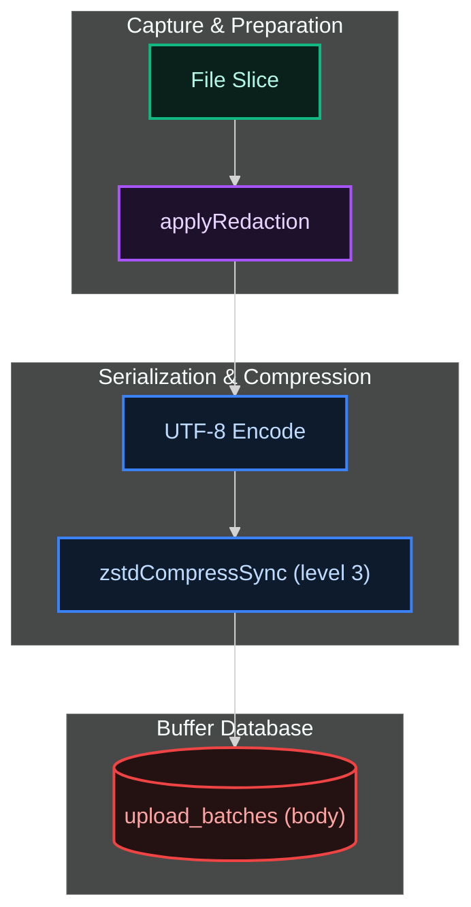

[← Previous: 2.2 Parsing & Watermarks](./2.2-parsing-and-watermarks.md) · [Index](../README.md) · [Next: 2.4 Redaction →](./2.4-redaction.md)

# 2.3 Batching & Compression

*Last Updated: 2026-06-16*

> What a "batch" is, how big it can get, and what gets stored alongside the compressed body.

A batch is the unit of work that flows from capture to upload. One file slice becomes one `upload_batches` row, and the [drain cycle](../04-daemon-loops/4.2-drain-cycle.md) ships one batch per HTTP request to the [backend](../05-backend/5.1-backend-protocol.md).



The batching layer exists because the wire protocol caps each request at 2 MiB compressed and 10 MiB decompressed, and the backend dedupes on a per-batch primary key, so the natural unit of idempotent retry — an idempotent request returns the same effect whether sent once or many times — is a single batch rather than an entire cycle's worth of data.

## Why UUIDv7 capture_id

Every batch carries a UUIDv7 `capture_id` generated at insert time. UUIDv7 is a time-sortable UUID variant: the leading bits encode a millisecond timestamp, so naturally-sorted IDs are also chronologically sorted. Client-side oldest-first iteration (`ORDER BY created_at ASC, capture_id ASC`) and server-side dedup both fall out of the same property.

The primary-key constraint on `capture_id` in `upload_batches` is the gateway's own guarantee that a given slice is never inserted twice; the server's idempotency check on `capture_id` is the corresponding guarantee that even a re-shipped batch (after a network blip plus daemon restart) is stored exactly once.

## The size budget

The size budget is computed against the post-redaction body, not the raw input, so the on-wire cap is exactly what `BODY_MAX_COMPRESSED_BYTES = 2 MiB` and `BODY_MAX_DECOMPRESSED_BYTES = 10 MiB` target.

Two splitters in `core/utils/` — one for jsonl by newline boundary, one for sqlite rows — binary-search the largest prefix that fits both budgets and recurse on the remainder, so a 9 MiB capture becomes roughly five 1.8 MiB batches without splitting any record.

## What rides with every batch

Each row stores not just the compressed body but the full identifying tuple: `source_app`, optional `source_platform`, `source_kind`, `source_path`, `source_path_hash`, optional `source_inode`, the watermark fields, `agent_schema_version` (reported by the source), `gateway_version`, `captured_at_utc`, `body_format`, `body_compression`, plus drain-side bookkeeping (`status`, `attempts`, `last_error`, `failed_at`, `created_at`). The full schema is in `BATCH_COLS` and gets covered field-by-field in the FAQs below.

## What are the size limits?

Declared in `contract.constants.ts`:

| limit | bytes | meaning |
| --- | --- | --- |
| `BODY_MAX_COMPRESSED_BYTES` | `2 * 1024 * 1024` (2 MiB) | hard cap on the compressed body. Server returns 413 if exceeded. |
| `BODY_TARGET_COMPRESSED_BYTES` | `Math.floor(2 MiB * 0.9)` (~1.8 MiB) | the split-for-size target. The splitter packs as much as fits under this. |
| `BODY_MAX_DECOMPRESSED_BYTES` | `10 * 1024 * 1024` (10 MiB) | hard cap on the raw body. The collector throws `OversizedDecompressedSliceError` before insert; if an oversized batch somehow reaches upload, the uploader catches the same error class and marks the row `failed` with `kind: fatal`. |
| `BODY_TARGET_DECOMPRESSED_BYTES` | `Math.floor(10 MiB * 0.9)` (~9 MiB) | the per-slice decompressed budget passed to splitters (overridable via `capture.max_decompressed_bytes`). |

A capture that produces 9 MiB of new bytes will become roughly five 1.8-MiB-compressed batches; a single 1 KiB append becomes one batch.

## How does compression work?

`Bun.zstdCompressSync(input, { level: 3 })`, in `core/utils/compress.ts`. zstd (Zstandard) is a fast compression algorithm with a tunable level; level 3 is the published default — chosen because it's zstd's sweet spot of speed and ratio for short live data, where archival ratios aren't worth the CPU cost. The constant `DEFAULT_ZSTD_LEVEL = 3` is the only level currently configured. Every body in the buffer is zstd-compressed; there is no other body compression and `body_compression` on the wire is always the literal string `zstd`.

## How is oversize splitting done?

Two splitters, one per body shape, share the same "find the largest prefix that fits both budgets" pattern via binary search.

- `splitJsonlAtBoundary` (`core/utils/jsonl-split.ts`) splits jsonl at `\n` boundaries. It enumerates every newline index in the input, then binary-searches the highest split point whose redacted+compressed prefix is `<= targetCompressedBytes` **and** raw bytes are `<= maxDecompressedBytes`. The remaining tail recurses until consumed.
- `splitRowsByCompressedSize` (`core/utils/rowid-split.ts`) does the same on sqlite row arrays, advancing one rowid at a time at minimum so even a single oversized row makes forward progress (and will then throw `OversizedDecompressedSliceError` if its raw size still exceeds the decompressed cap).

Each split produces a fresh `capture_id`; each emits its own watermark sub-range. The collector logs `event: capture.split_for_size` when `slices > 1` so it is easy to grep for oversized cycles.

## What metadata travels with every batch?

The `upload_batches` row, defined in `BATCH_COLS`:

```
capture_id           TEXT  (UUIDv7, primary key)
source_app           TEXT
source_platform      TEXT  (optional source platform)
source_kind          TEXT
source_path          TEXT  (absolute path on this host)
source_path_hash     TEXT  (sha256 of source_path)
source_inode         INTEGER nullable
watermark_kind       TEXT
watermark_start      INTEGER
watermark_end        INTEGER
watermark_table      TEXT nullable
agent_schema_version TEXT  (agent-reported version)
gateway_version      TEXT  (PACKAGE_VERSION at insert)
captured_at_utc      TEXT  (ISO-8601 UTC)
body_format          TEXT  (one of jsonl, kv_pairs_json, sqlite_rows_json)
body_compression     TEXT  ('zstd')
body                 BLOB  (compressed payload)
status               TEXT  ('pending' on insert)
attempts             INTEGER
created_at           TEXT  (server-irrelevant; used for drain ordering and prune cutoffs)
last_error           TEXT nullable
failed_at            TEXT nullable
```

`source_path_hash` is what the server keys watermarks on, so renaming or moving a file changes the hash and creates a new logical source.

## How does the source kind map to the body format?

One-to-one through `SOURCE_VARIANTS`:

| source kind | body format | body shape |
| --- | --- | --- |
| `jsonl_append` | `jsonl` | the raw newline-delimited bytes between `watermark_start` and `watermark_end`, redacted. |
| `sqlite_kv_snapshot` | `kv_pairs_json` | `JSON.stringify` of `{rowid, key, value}[]` from `cursorDiskKV`, redacted. |
| `sqlite_table_snapshot` | `sqlite_rows_json` | `JSON.stringify` of `{rowid, …}[]` from one named codex state table, redacted. |

The validator in `services/contract/validate.ts` enforces the pairing on every DTO build, so a misconfigured source can't accidentally produce, say, a jsonl batch for cursor.

[← Previous: 2.2 Parsing & Watermarks](./2.2-parsing-and-watermarks.md) · [Index](../README.md) · [Next: 2.4 Redaction →](./2.4-redaction.md)
