[← Previous: 2.3 Batching & Compression](./2.3-batching-and-compression.md) · [Index](../README.md) · [Next: 3.1 Buffer →](../03-buffer/3.1-buffer.md)

# 2.4 Redaction

> The local rule pipeline that strips secrets before any byte is buffered.

Redaction is the on-device pass that strips secrets out of each slice before it touches the [buffer](../03-buffer/3.1-buffer.md). It runs after parsing and before compression, exactly once per slice, against the decoded text. The buffer never holds an un-redacted body, and the wire never carries one — the rule pipeline is the only place where the raw bytes meet the regex set, and the redacted output is what every downstream subsystem operates on.

The rule set lives in `services/redaction/rules/` and is organized into 13 categories declared in `services/redaction/rules/index.ts`: crypto keys, LLM providers, source control, cloud providers, generic tokens, communication tools, payment processors, auth services, CI and package managers, SaaS tools, HTTP headers, connection strings, and a final keyword-anchored generic catch.

`ALL_RULES` is the flat concatenation in declaration order — `crypto-keys` first, `keyword-secret` last — so the high-precision provider patterns match before the generic shape-based fallbacks. `applyRedaction(input)` walks the array, counts each rule's matches, applies the rule's `replacement` string (always a literal, never a callback), and returns `{ redacted, matchCount, ruleHits }`.

## Why single-pass design matters

The single-pass design is load-bearing — single-pass means one walk over the bytes with zero accumulator, giving constant memory regardless of input size. The [batching](./2.3-batching-and-compression.md) splitter calls `applyRedaction` inside its `measureCompressed` callback so the size budget is computed against the post-redaction body, not the raw input.

That means the post-redaction body is exactly what the wire-size cap (`BODY_MAX_COMPRESSED_BYTES = 2 MiB`) targets, and the splitter can't accidentally pack a slice that fits raw but overflows after redaction (a real failure mode if redaction ran after the splitter). The `ruleHits` count is what `redaction test --show-rules` surfaces, and what the test suite uses to verify a fixture was redacted as expected.

## The inverse contract: preserved tokens

A small `preserve.ts` module declares the inverse contract — `PRESERVED_TOKENS` (JSON punctuation, agent roles, tool names, identity keys like `sessionId` and `rowid`) and `PRESERVED_FIELD_CONTEXTS` (JSON-shaped fixtures like `{"role": "user"}`) that must round-trip unchanged. The `auditRulesAgainstFixtures` helper fails CI if any rule matches any preserved item. Tokens not on the list are fair game for a redaction rule to attack.

## CLI surface

The CLI surface is small: `redaction list` prints the categories and their rules; `redaction test <file>` reads a local file, runs the full pipeline, and emits the redacted text on stdout (the file is never transmitted, never buffered). Both commands are read-only and operate on the live rule set, so an operator can audit exactly what would happen to a given input before committing to ship anything.

## Where in the pipeline does redaction happen?

Right after decode, before compression, before insert. Every collector follows the same shape:

```mermaid
%%{init: {'flowchart': {'useMaxWidth': false, 'htmlLabels': true, 'curve': 'basis', 'nodeSpacing': 60, 'rankSpacing': 80, 'padding': 20}, 'sequence': {'useMaxWidth': false, 'mirrorActors': false, 'actorMargin': 100, 'messageMargin': 50, 'boxMargin': 20, 'wrap': true}, 'stateDiagram': {'useMaxWidth': false, 'nodeSpacing': 60, 'rankSpacing': 80}, 'themeVariables': {'fontSize': '15px'}}}%%
flowchart LR
  raw[Raw bytes] --> decode[decode text]
  decode --> redact[applyRedaction]
  redact --> encode[encode redacted text]
  encode --> zstd[zstdCompressSync]
  zstd --> insert[insertBatch]
```



Redaction is a single pass per slice — the rules run sequentially against the same working string, and matches accumulate into `matchCount` / `ruleHits` without ever leaving the device.

## What categories does the rule set cover?

Thirteen categories, declared in `services/redaction/rules/index.ts`:

| category | what it matches |
| --- | --- |
| `crypto-keys` | PEM, SSH, age, PGP, PuTTY, GCP service account JSON blobs |
| `llm-providers` | OpenAI, Anthropic, Cohere, Mistral, Groq, etc. |
| `source-control` | GitHub, GitLab, Bitbucket, Gitea, Azure DevOps |
| `cloud-providers` | AWS, GCP, Azure, Cloudflare, Linode, etc. |
| `generic-tokens` | Long hex / session IDs / UUID-near-auth-keyword shapes |
| `communication` | Slack, Discord, Teams, Mattermost, etc. |
| `payment` | Stripe, Shopify, PayPal, Razorpay, Plaid, etc. |
| `auth-services` | Okta, Auth0, Twilio, SendGrid, etc. |
| `ci-package-managers` | CircleCI, Travis, npm, PyPI, etc. |
| `saas-tools` | Datadog, New Relic, Segment, Algolia, PagerDuty, etc. |
| `http-headers` | `Authorization`, `X-API-Key`, cookie auth values, AWS SigV4 |
| `connection-strings` | Database URIs with embedded credentials |
| `keyword-secret` | Generic `key=value` patterns anchored on `password`, `token`, `secret`, etc. |

`ALL_RULES = RULE_CATEGORIES.flatMap(c => c.rules)` is the flat list applied by `applyRedaction`. The rules run in the order declared above — `crypto-keys` first, `keyword-secret` last — so the high-precision provider patterns match before the generic-shape fallbacks.

## What does a rule look like?

Four fields, declared by the `RedactionRule` interface in `services/redaction/redaction.types.ts`:

```
{
  id:          'rule-name',  // string
  description: '…',          // string
  pattern:     /…/g,         // RegExp (typically with the `g` flag so all matches are replaced)
  replacement: 'REDACTED',   // literal string only — no callback variant
}
```

`applyRedaction(input)` walks the array; for each rule it counts the matches first, then does `working = working.replace(rule.pattern, rule.replacement)`. The return value is `{ redacted, matchCount, ruleHits }`. `ruleHits` is a `Record<string, number>` so the `redaction test --show-rules` output can list which rules fired and how many times.

## What does the gateway deliberately not redact?

`preserve.ts` lists two safety nets used by the test suite to verify that protocol-shape tokens never trip a rule:

- `PRESERVED_TOKENS` is a flat list of tokens that must round-trip unchanged. It includes JSON punctuation (`{ } [ ] , : "`), agent roles (`user`, `assistant`, `system`, `tool`), Anthropic and OpenAI event tags (`content_block_delta`, `tool_use`, `chat.completion`, `stop_reason: end_turn`), tool names (`Read`, `Write`, `Edit`, `Bash`, `read_file`, `exec_command`, `apply_patch`), and identity keys the gateway itself depends on (`sessionId`, `composerId`, `bubbleId`, `cwd`, `model`, `usage`, `rowid`).
- `PRESERVED_FIELD_CONTEXTS` is a list of JSON-shaped fixtures (e.g. `{"role": "user"}`, `{"finish_reason": "tool_calls"}`) that must survive intact.

`auditRulesAgainstFixtures(rules, fixtures)` is the test helper that fails CI if any rule matches any preserved fixture. The list is the explicit contract: anything not on it is fair game for a redaction rule to attack.

## What do `redaction list` and `redaction test` do?

`redaction list` (no flags) prints every category and rule with the regex and replacement, then closes with `Total: N rules across 13 categories`. `--categories` collapses each category to a single line with its rule count, then prints the same `Total:` line. `--category <name>` restricts the output to one category (rules-only, no `Total:` summary footer); an unknown name exits with `EXIT_CODE.validationError` (2) and prints the list of valid categories. `--json` swaps the human-readable table for a JSON payload (suitable for piping to jq); when combined with `--categories` the payload is a summary-only structure.

`redaction test <file> [--show-rules]` reads the file from disk, runs `applyRedaction` against the full contents, and emits the redacted text on stdout. The file is never transmitted; it never even touches the buffer. `--show-rules` prepends a sorted summary of which rules matched and how many times.

Exit codes follow the standard CLI set: `EXIT_CODE.fileUnreadable` (7) when the input file is missing or unreadable, `EXIT_CODE.validationError` (2) for an unknown `--category`, otherwise `EXIT_CODE.ok` (0).

[← Previous: 2.3 Batching & Compression](./2.3-batching-and-compression.md) · [Index](../README.md) · [Next: 3.1 Buffer →](../03-buffer/3.1-buffer.md)
