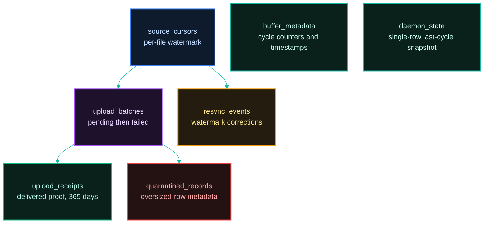
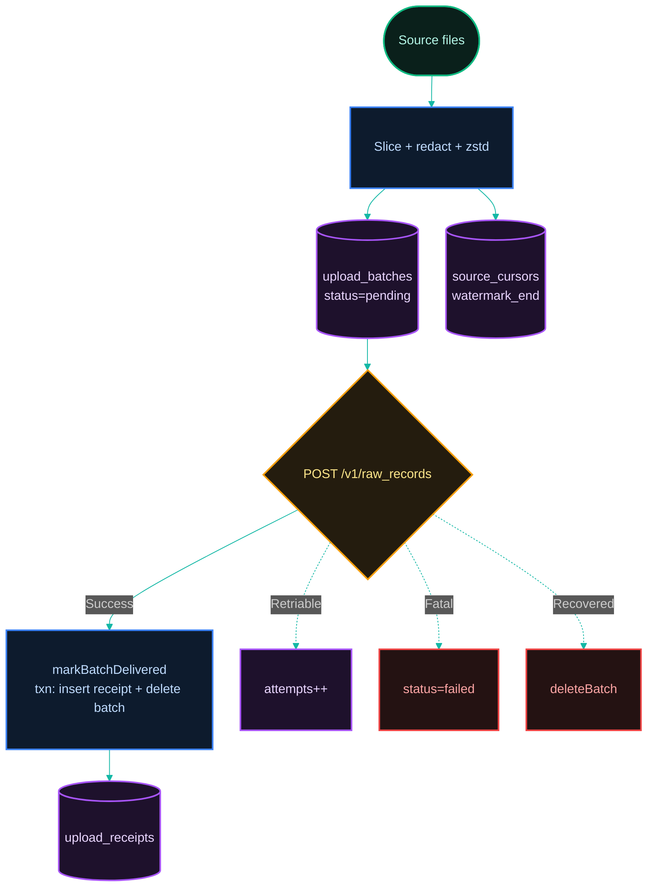

[← Previous: 2.4 Redaction](../02-capture/2.4-redaction.md) · [Index](../../README.md) · [Next: 3.2 Buffer Pressure & Pruning →](./3.2-buffer-pressure-and-pruning.md)

# 3.1 Buffer (SQLite)

*Last Updated: 2026-05-27*

> The local SQLite database that holds everything the gateway needs to survive a restart and re-prove progress.

The buffer is the single source of truth between [capture](../04-daemon-loops/4.1-capture-cycle.md) and [upload](../04-daemon-loops/4.2-drain-cycle.md). It is a SQLite database at `~/.proxai/proxai-gateway/<profile>/buffer.db` (or `%LOCALAPPDATA%\proxai\proxai-gateway\<profile>\buffer.db` on Windows) — the path is **profile-nested**, so the production daemon (`prod` profile) and the dev daemon (`dev` profile) each own a fully separate `buffer.db`. It holds every pending batch, every per-file cursor, every receipt of a delivered batch, every metadata counter the daemon maintains, the most recent drain snapshot, a metadata-only ledger of quarantined oversized rows, and a ledger of watermark-resync corrections.

Everything the gateway needs to resume cleanly after a daemon restart — including the watermarks for resuming each source mid-file — lives in this one file.

## Why SQLite

SQLite was chosen over a flat-file queue or an in-memory ring because the gateway needs durable, atomic, transactional progress tracking across a process exit — and because Bun ships sqlite as a standard-library module, so adding it costs no extra binary dependency. WAL mode (`PRAGMA journal_mode = WAL`) plus `PRAGMA synchronous = NORMAL` gives crash-safe concurrent reads (so the CLI's `status`/`tail` can open the same file read-only while the daemon writes) without paying the full `fsync` cost of `synchronous = FULL`.

WAL — Write-Ahead Logging, a SQLite journaling mode where writes append to a separate `.db-wal` file before being merged into the main database, allowing concurrent readers while a single writer commits — means three on-disk artifacts: `buffer.db`, `buffer.db-wal`, `buffer.db-shm`. The gateway never forces a checkpoint of its own — SQLite handles it on its standard cadence.

`synchronous = NORMAL` flushes after each transaction commit but not on every write inside a transaction; it trades a tiny crash-recovery window for substantial throughput.

## The seven tables at a glance

| table | role |
| --- | --- |
| `upload_batches` | pending and failed batches keyed by `capture_id` UUIDv7 (a time-sortable UUID variant whose leading bits encode a millisecond timestamp, so natural ordering is also chronological) |
| `source_cursors` | per-file checkpoint with composite key `(source_app, source_path_hash, source_inode, watermark_table)` |
| `upload_receipts` | delivered-batch proof of progress, kept for a 1-year retention window |
| `buffer_metadata` | key/value scratchpad for daemon-cycle counters and maintenance timestamps (status **totals** are derived from rows, not from here — see below) |
| `daemon_state` | single-row snapshot of the last drain cycle plus latest per-source capture counts |
| `quarantined_records` | metadata-only ledger of oversized source rows skipped during capture |
| `resync_events` | ledger tracking database watermark sync regression corrections |

The schema is all declared with `CREATE TABLE IF NOT EXISTS` so opening a freshly-installed binary against an existing database is always safe.

The seven tables relate by lifecycle, not by foreign keys (the buffer has no FK constraints between these tables; `capture_id` is the logical link a batch carries into its receipt). The exhaustive column-level schema diagram lives in [the SQLite buffer schema diagram](../architecture/diagrams/4-sqlite-buffer-schema.md); the map below shows only how the tables hand work to one another:



## How data flows through



Data flows in two strictly one-way halves. The write half — capture — slices each source file, redacts, compresses, and inserts one batch per slice with `status = pending`. The read half — drain — pops the oldest pending batch, ships it via `POST /v1/raw_records`, and converts the row to a receipt (with `markBatchDelivered` running the insert-receipt + delete-batch as one transaction).

No data path runs the other direction: the drain loop never writes a new batch and the capture loop never touches receipts. The only feedback signal between the two halves is the `BUFFER_FULL` sentinel covered in [pressure and pruning](./3.2-buffer-pressure-and-pruning.md).

## Detailed Database Structure

The buffer database (`buffer.db`) is composed of exactly **seven** SQLite tables. Below is the comprehensive schema documentation for every table, detailing columns, SQLite types, nullability, constraints, defaults, indexes, and composite keys.

### 1. `upload_batches`
Stores redacted, zstd-compressed slices of developer activity pending delivery to the Nest server.

| Column | SQLite Type | Nullability | Constraints / Default | Description |
| --- | --- | --- | --- | --- |
| `capture_id` | `TEXT` | `NOT NULL` | `PRIMARY KEY` | Unique UUIDv7 representing the batch capture ID. Chronological by design. |
| `source_app` | `TEXT` | `NOT NULL` | | Source application name (`claude-code`, `cursor`, `gemini-cli`, `codex`). |
| `source_kind` | `TEXT` | `NOT NULL` | | Collector source category (`file` or `sqlite`). |
| `source_path` | `TEXT` | `NOT NULL` | | Absolute local file system path to the active log or DB file. |
| `source_path_hash` | `TEXT` | `NOT NULL` | | SHA-256 hash of `source_path` for indexing. |
| `source_inode` | `INTEGER` | `NULL` | | File system Inode number, aiding in rotation tracking. |
| `watermark_kind` | `TEXT` | `NOT NULL` | | The cursor style used (`rowid_range` or `timestamp_range`). |
| `watermark_start` | `INTEGER` | `NOT NULL` | | Starting cursor watermark of this batch. |
| `watermark_end` | `INTEGER` | `NOT NULL` | | Ending cursor watermark of this batch. |
| `watermark_table` | `TEXT` | `NULL` | | The table name tracked for database sources (e.g. `messages`). |
| `agent_schema_version`| `TEXT` | `NOT NULL` | | The version of the source parser layout. |
| `gateway_version` | `TEXT` | `NOT NULL` | | The version of the gateway that compiled this batch. |
| `captured_at_utc` | `TEXT` | `NOT NULL` | | ISO-8601 UTC timestamp when the batch was compiled. |
| `body_format` | `TEXT` | `NOT NULL` | | Serialization format of payload, typically `ndjson`. |
| `body_compression` | `TEXT` | `NOT NULL` | | Compression method, typically `zstd`. |
| `body` | `BLOB` | `NOT NULL` | | Compressed binary payload containing the redacted records. |
| `status` | `TEXT` | `NOT NULL` | `DEFAULT 'pending'` | Batch transmission status: `'pending'` or `'failed'`. |
| `attempts` | `INTEGER` | `NOT NULL` | `DEFAULT 0` | Cumulative count of transmission attempts. |
| `created_at` | `TEXT` | `NOT NULL` | | ISO-8601 UTC timestamp of row insertion. |
| `last_error` | `TEXT` | `NULL` | | Error message captured from the last failed upload attempt. |

* **Indexes**:
  * `idx_upload_batches_status_created` ON `upload_batches (status, created_at)`: Used to order FIFO uploads.
  * `idx_upload_batches_path_hash` ON `upload_batches (source_path_hash)`: For rapid file lookup.

### 2. `source_cursors`
Tracks high-water mark positions for sequential reading, preventing duplication and data gaps.

| Column | SQLite Type | Nullability | Constraints / Default | Description |
| --- | --- | --- | --- | --- |
| `source_app` | `TEXT` | `NOT NULL` | `PRIMARY KEY` (composite) | Source application name. |
| `source_path_hash` | `TEXT` | `NOT NULL` | `PRIMARY KEY` (composite) | SHA-256 hash of the target source path. |
| `source_path` | `TEXT` | `NOT NULL` | | Absolute local file system path to the monitored source. |
| `source_inode` | `INTEGER` | `NOT NULL` | `PRIMARY KEY` (composite), `DEFAULT 0` | Inode number, or `0` (`NO_INODE_SENTINEL`) if absent. |
| `watermark_table` | `TEXT` | `NOT NULL` | `PRIMARY KEY` (composite), `DEFAULT ''` | Monitored database table name, or empty string (`NO_TABLE_SENTINEL`). |
| `watermark_end` | `INTEGER` | `NOT NULL` | `DEFAULT 0` | High-water mark of successfully batched data. |
| `last_polled_at` | `TEXT` | `NOT NULL` | | ISO-8601 UTC timestamp of the last poll attempt. |
| `consecutive_errors` | `INTEGER` | `NOT NULL` | `DEFAULT 0` | Count of back-to-back failures; resets to `0` on success. |
| `last_seen_size_bytes`| `INTEGER` | `NULL` | | File size in bytes during last poll. Tracks file truncations. |
| `last_seen_page_count`| `INTEGER` | `NULL` | | SQLite page count during last poll. Tracks database vacuums. |

### 3. `upload_receipts`
Retains delivered-batch proofs of progress, storing metadata and the redacted user prompt for operational logs, analysis, and auditing (365-day retention). The first nine columns are the original receipt; the **nine trailing nullable columns** (`user_prompt` through `shipped_bytes`) are additive (`ALTER TABLE … ADD COLUMN`, guarded by `columnExists` in `migrateReceiptDisplayColumns`).

| Column | SQLite Type | Nullability | Constraints / Default | Description |
| --- | --- | --- | --- | --- |
| `capture_id` | `TEXT` | `NOT NULL` | `PRIMARY KEY` | Unique batch capture ID UUIDv7. |
| `source_app` | `TEXT` | `NOT NULL` | | Source application name. |
| `source_path_hash` | `TEXT` | `NOT NULL` | | SHA-256 hash of the source path. |
| `watermark_kind` | `TEXT` | `NOT NULL` | | Watermark tracking type (`rowid_range` or `timestamp_range`). |
| `watermark_start` | `INTEGER` | `NOT NULL` | | The starting watermark position of the delivered batch. |
| `watermark_end` | `INTEGER` | `NOT NULL` | | The ending watermark position of the delivered batch. |
| `watermark_table` | `TEXT` | `NULL` | | Table name tracked for SQLite database sources. |
| `delivered_at` | `TEXT` | `NOT NULL` | | ISO-8601 UTC timestamp indicating when the batch was accepted. |
| `idempotent_on_server`| `INTEGER`| `NOT NULL` | `DEFAULT 0` | `1` if this batch was flagged as a duplicate by the server; `0` otherwise. |
| `user_prompt` | `TEXT` | `NULL` | | Extracted and redacted user prompt string for log auditing. |
| `user_prompt_added_at`| `TEXT` | `NULL` | | ISO-8601 timestamp indicating when the prompt was appended. |
| `source_path` | `TEXT` | `NULL` | | Absolute local file system path to the source. |
| `agent_schema_version`| `TEXT` | `NULL` | | Schema layout version of the source agent. |
| `gateway_version` | `TEXT` | `NULL` | | Gateway version that compiled the batch. |
| `captured_at_utc` | `TEXT` | `NULL` | | ISO-8601 UTC capture timestamp. |
| `attempts` | `INTEGER` | `NULL` | | Total upload attempts required to deliver this batch. |
| `source_inode` | `INTEGER` | `NULL` | | File system Inode number of the source. |
| `shipped_bytes` | `INTEGER` | `NULL` | | Total payload bytes successfully delivered. |

* **Indexes**:
  * `idx_upload_receipts_path_hash` ON `upload_receipts (source_path_hash)`
  * `idx_upload_receipts_delivered_at` ON `upload_receipts (delivered_at)`: Dictates receipt pruning expiration.

**Why the extra nine columns exist.** The original receipt held only enough to prove progress (capture/watermark identity, `delivered_at`, `idempotent_on_server`). The additive columns turn the receipt table into a queryable history surface for three concrete consumers:

- **Developer debugging** — `source_path`, `agent_schema_version`, `gateway_version`, `captured_at_utc`, `attempts`, and `source_inode` let an operator reconstruct exactly which file, parser version, gateway build, and retry count produced a given delivered batch, without re-opening the (now-deleted) batch row.
- **The `doctor` command** — `shipped_bytes` makes per-source uploaded-byte totals derivable straight from receipts (no separate counter table), which `doctor` reconciles against pending/failed pressure.
- **The `status` recent-uploads ledger** — `user_prompt` retains the redacted prompt extracted at delivery time, and `user_prompt_added_at` timestamps when it was appended; the `status` command's "Last Uploads" section renders the most recent delivered prompts by reading these directly (`queryLastUploads` in `status-queries.ts`, consumed by `status/gather-snapshot.ts`). The `logs` command lists recent uploads as well, but does not surface the prompt text.

### 4. `buffer_metadata`
Stores simple key/value state parameters, daemon-cycle counters, and garbage-collection timestamps. The `METADATA_KEYS` constant still defines maintenance, capture-cycle, and drain-cycle keys (plus per-source generated keys), and `daemon_state` / legacy renderings still read them — but the upload **totals** reported by `status` and `doctor` are now derived directly from `upload_receipts` rows, not from cumulative counters here (see "Where do upload totals come from?" below).

| Column | SQLite Type | Nullability | Constraints / Default | Description |
| --- | --- | --- | --- | --- |
| `key` | `TEXT` | `NOT NULL` | `PRIMARY KEY` | The metadata setting or counter key. |
| `value` | `TEXT` | `NOT NULL` | | Textual string value (coerced by readers). |

### 5. `daemon_state`
Maintains a single-row status dashboard, recording details from the last completed drain and capture cycles to feed CLI commands (e.g. `proxai-gateway status`).

| Column | SQLite Type | Nullability | Constraints / Default | Description |
| --- | --- | --- | --- | --- |
| `id` | `INTEGER` | `NOT NULL` | `PRIMARY KEY CHECK (id = 1)` | Enforces a single-row constraint on the table. |
| `last_cycle_started_at`| `TEXT` | `NULL` | | ISO-8601 UTC start timestamp of the last drain cycle. |
| `last_cycle_completed_at`| `TEXT`| `NULL` | | ISO-8601 UTC completion timestamp of the last drain cycle. |
| `last_cycle_duration_ms`| `INTEGER`| `NULL` | | Duration of the last drain cycle in milliseconds. |
| `last_drain_attempted`| `INTEGER`| `NULL` | | Number of batches attempted during the last upload sweep. |
| `last_drain_accepted` | `INTEGER`| `NULL` | | Number of successfully delivered batches. |
| `last_drain_retriable` | `INTEGER`| `NULL` | | Number of batches encountering temporary retriable upload failures. |
| `last_drain_fatal` | `INTEGER`| `NULL` | | Number of batches encountering permanent fatal errors. |
| `last_drain_recovered` | `INTEGER`| `NULL` | | Number of batches marked as recovered (e.g., cleared by server-side status). |
| `last_upload_error` | `TEXT` | `NULL` | | Raw error message text captured from the most recent upload failure. |
| `last_consecutive_retriable_break` | `INTEGER` | `NULL` | | `1` if consecutive network failures broke the drain early; `0` otherwise. |
| `last_source_captures`| `TEXT` | `NULL` | | JSON string tracking source collector tallies (processed files, captured batches, and captured bytes). |
| `machine_snapshots` | `TEXT` | `NULL` | added via `ALTER ADD COLUMN` | JSON-serialized XState state machine configurations for active loops. |

This table is **single-row** (the `CHECK (id = 1)` constraint guarantees it). There is no `host_id`, `user_id`, or `installed_at` column — older drafts of this doc invented those; the live `DAEMON_STATE_TABLE_DDL` (`daemon-state.ts`) carries only the cycle-summary fields above plus the `machine_snapshots` column added via `migrateDaemonStateMachineSnapshots`.

### 6. `quarantined_records`
A ledger recording metadata for oversized data rows that exceeded limit thresholds and had to be skipped to prevent buffer exhaustion.

| Column | SQLite Type | Nullability | Constraints / Default | Description |
| --- | --- | --- | --- | --- |
| `id` | `INTEGER` | `NOT NULL` | `PRIMARY KEY AUTOINCREMENT`| Unique auto-incrementing quarantine ledger entry ID. |
| `source_app` | `TEXT` | `NOT NULL` | | Source application name. |
| `source_path` | `TEXT` | `NOT NULL` | | Absolute path to the source file or database. |
| `source_path_hash` | `TEXT` | `NOT NULL` | | SHA-256 hash of the source path. |
| `source_inode` | `INTEGER` | `NULL` | | Inode number of the target file system source. |
| `watermark_table` | `TEXT` | `NULL` | | Database table name containing the oversized row. |
| `watermark_position` | `INTEGER` | `NOT NULL` | | The numeric cursor watermark/position of the quarantined row. |
| `row_pk` | `TEXT` | `NULL` | | Primary key identifier of the skipped row. |
| `redacted_size_bytes`| `INTEGER` | `NOT NULL` | | Post-redaction payload size that triggered the skip (limit 10 MiB). |
| `reason` | `TEXT` | `NOT NULL` | | Reason for quarantine (e.g. `Oversized decompress size`). |
| `quarantined_at_utc` | `TEXT` | `NOT NULL` | | ISO-8601 UTC timestamp of quarantine action. |
| `gateway_version` | `TEXT` | `NOT NULL` | | Gateway version that skipped the row. |

* **Indexes**:
  * `idx_quarantined_records_source_app` ON `quarantined_records (source_app)`
  * `idx_quarantined_records_quarantined_at` ON `quarantined_records (quarantined_at_utc)`

### 7. `resync_events`
Tracks instances of watermark regression corrections, capturing synchronization adjustments applied to database watermarks to correct gaps or errors.

| Column | SQLite Type | Nullability | Constraints / Default | Description |
| --- | --- | --- | --- | --- |
| `id` | `INTEGER` | `NOT NULL` | `PRIMARY KEY AUTOINCREMENT`| Unique auto-incrementing resync identifier. |
| `source_app` | `TEXT` | `NOT NULL` | | Source application name. |
| `source_path_hash` | `TEXT` | `NOT NULL` | | SHA-256 hash of the source path. |
| `watermark_kind` | `TEXT` | `NOT NULL` | | Watermark tracking type (`rowid_range` or `timestamp_range`). |
| `server_watermark_end`| `INTEGER`| `NOT NULL` | | Ending watermark cursor received from the server. |
| `skipped_units` | `INTEGER` | `NOT NULL` | | Number of data rows/units rolled back/resynced due to regression. |
| `recovered_at` | `TEXT` | `NOT NULL` | | ISO-8601 UTC timestamp when the resync event was recorded. |

* **Indexes**:
  * `idx_resync_events_recovered_at` ON `resync_events (recovered_at)`

## Service & Daemon Loop Database Operations

The following three core daemon cycles are the primary consumers and writers of `buffer.db`. Each interacts with explicit tables and columns as defined in their operational contracts:

### 1. Capture Cycle
The capture loop processes local logs and database sources, writing newly acquired activity to the queue.

* **Reads**:
  * `source_cursors` (via `getCursorWithFallback`): Reads `watermark_end`, `last_seen_size_bytes`, and `last_seen_page_count` to detect new lines, vacuums, or changes.
  * `daemon_state` (via `getDaemonState`): Retrieves existing `last_source_captures` JSON to preserve existing source metrics.
* **Writes**:
  * `upload_batches` (via `recordBatch`): Inserts fresh batches with `status = 'pending'`, population of full capture/watermark data, and compressed `body`.
  * `source_cursors` (via `setCursor`): Updates `watermark_end`, `last_polled_at` to the current time, resets `consecutive_errors` to `0` (or increments on failure), and sets `last_seen_size_bytes` or `last_seen_page_count`.
  * `quarantined_records` (via `recordQuarantine`): Appends a ledger entry containing metadata of skipped rows exceeding size limits.
  * `daemon_state` (via `persistSourceCaptures`): Serializes cumulative metrics into the `last_source_captures` field.
  * `resync_events` (via `recordResyncEvent`): Logs a watermark regression event when the server sync detects that the local high-water mark has regressed behind the server’s baseline, requiring watermark resets.

### 2. Drain Cycle
The drain loop reads compiled activity from the database queue and coordinates delivery to the Nest upload endpoints.

* **Reads**:
  * `upload_batches` (via `nextPendingBatch` / `nextPendingBatchAfter`): Queries batches where `status = 'pending'`, ordered by `created_at ASC, capture_id ASC`.
  * `daemon_state` (via `getDaemonState`): Evaluates historical failures, consecutive errors, and state machine snapshots.
  * `buffer_metadata` (via metadata readers): Fetches upload throttling configurations, prune bounds, and auto-upgrade version blocks.
* **Writes**:
  * `upload_batches` (via transactional deletion or update):
    * On successful delivery, the batch row is **deleted**.
    * On a retriable error (e.g. network timeout), updates `attempts = attempts + 1` and `last_error = error_msg`.
    * On a fatal error (e.g. payload validation failure), updates `status = 'failed'` and `last_error = error_msg`.
  * `upload_receipts` (via transactional insert): On successful delivery, a new receipt row is inserted (along with the optional extracted `user_prompt` and `shipped_bytes` metadata) in the same transaction that deletes the batch.
  * `daemon_state` (via `persistDaemonState`): Persists details of the drain sweep (`last_drain_attempted`, `last_drain_accepted`, `last_drain_retriable`, `last_drain_fatal`, `last_drain_recovered`, `last_upload_error`, `last_consecutive_retriable_break`).
  * `buffer_metadata` (via `incrementMetadataCounter`): Multiplies shipped counts and bytes to long-running metrics keys (e.g. `drain_total_batches_shipped` and `upload_batches_shipped_by_source.<source_app>`).

### 3. Prune Cycle
The prune loop maintains database sanity and limits space exhaustion by garbage collecting stale rows.

* **Reads**:
  * `buffer_metadata`: Reads last prune timestamp (`last_prune_at`).
* **Writes**:
  * `upload_receipts`: Deletes receipt rows where `delivered_at` is older than the retention threshold (**1 year** / 365 days).
  * `upload_batches`: Deletes failed batch rows (`status = 'failed'`) where `created_at` is older than the retention threshold (**1 year**).
  * `quarantined_records`: Deletes quarantined rows where `quarantined_at_utc` is older than the retention threshold (**1 year**).
  * `resync_events`: Deletes resync event rows where `recovered_at` is older than the retention threshold (**1 year**).
  * `buffer_metadata` (via `setMetadata`): Updates `'last_prune_at'` to the current UTC timestamp.

## Where does the buffer live?

The buffer is **profile-nested**: `~/.proxai/proxai-gateway/<profile>/buffer.db` on macOS and Linux, `%LOCALAPPDATA%\proxai\proxai-gateway\<profile>\buffer.db` on Windows, where `<profile>` is `prod` for the production daemon and `dev` for the dev daemon. The path is resolved by `buildProfileContext(profile).bufferDbPath` in `core/io/fs/profile.ts` (it is `join(configDir, 'buffer.db')`, and `configDir` is `join(profileRootDir(), profile)`). The old zero-argument `bufferDbPath()` helper in `core/io/fs/paths.ts` has been **deleted** — every caller now threads a `ProfileContext` so the two profiles can never collide on one file. It is still overridable via `capture.buffer_path` in that profile's `config.toml`.

`openBufferDb(path)` opens it read-write through `openReadWrite` in `core/io/sqlite/open.ts`. That helper:

- Creates the file if missing (`{ create: true }`).
- Runs `PRAGMA journal_mode = WAL` and `PRAGMA synchronous = NORMAL` for crash-safe concurrent reads and acceptable write latency.
- Runs `PRAGMA foreign_keys = ON`.
- `chmod 0o600` on the `.db`, `-wal`, and `-shm` files on macOS/Linux (silent failure on permission errors; skipped on Windows).

`initializeSchema(db)` then runs all **seven** table DDLs and every index (`idx_upload_batches_status_created`, `idx_upload_batches_path_hash`, `idx_upload_receipts_path_hash`, `idx_upload_receipts_delivered_at`, the two `quarantined_records` indexes, and `idx_resync_events_recovered_at`). It also runs the guarded additive migrations: `migrateCursorVacuumColumns` (the `last_seen_size_bytes` / `last_seen_page_count` cursor columns), `migrateReceiptDisplayColumns` (the nine trailing receipt columns), and `migrateDaemonStateMachineSnapshots` (the `machine_snapshots` column). The DB is closed on daemon shutdown but never deleted: receipts, metadata, and daemon state are intentionally preserved across restarts.

## What tables are in the schema?

Seven tables, names exported from `BUFFER_TABLES`:

- **`upload_batches`** — pending and failed batches. Primary key `capture_id`. Indexed by `(status, created_at)` for drain ordering and by `source_path_hash` for per-file lookups.
- **`source_cursors`** — per-file watermark state. Composite PK `(source_app, source_path_hash, source_inode, watermark_table)`. The `consecutive_errors` column is actively maintained by every source collector: on a per-file failure the catch block reads the prior cursor, calls `setCursor(...)` with `consecutiveErrors: priorErrors + 1` while leaving `watermarkEnd` unchanged so the next cycle re-attempts the same range; a successful poll calls `setCursor(...)` with `consecutiveErrors: 0`, resetting the counter. Codex state has a dedicated `bumpConsecutiveErrors` helper in `src/sources/codex/collect-state.ts`; the other sources (claude-code, codex rollouts, cursor) inline the same read-then-upsert pattern in their catch blocks.
- **`upload_receipts`** — delivered batches. PK `capture_id`. Indexed by `source_path_hash` and `delivered_at` (the latter feeds the prune cutoff).
- **`buffer_metadata`** — key/value scratchpad for daemon-cycle counters, last-prune timestamp, last-version-check timestamp, latest-known-version, and per-source tallies. The keys still exist and feed `daemon_state` and legacy renderings, but upload **totals** are derived from receipt rows (see below), not from these counters.
- **`daemon_state`** — single-row table (PK constrained to `id = 1`) holding the last drain cycle's summary and the most recent per-source capture totals. Used to render the "Last cycle" line in `status`.
- **`quarantined_records`** — metadata-only ledger of source rows the gateway refused to ship because their redacted body exceeded `BODY_MAX_DECOMPRESSED_BYTES = 10 MiB`. PK is the autoincremented `id`. Indexed by `source_app` and `quarantined_at_utc`. Columns: `id`, `source_app`, `source_path`, `source_path_hash`, `source_inode`, `watermark_table`, `watermark_position`, `row_pk`, `redacted_size_bytes`, `reason`, `quarantined_at_utc`, `gateway_version`. The row's actual content is **never** stored — only the identifying tuple plus the post-redaction size. Inserted by `recordQuarantine` (`services/buffer/quarantine.ts`) when `src/sources/codex/collect-state-table.ts` or `src/sources/cursor/process-rows.ts` skip an oversized row; pruned alongside failed batches (see [pressure and pruning](./3.2-buffer-pressure-and-pruning.md)).
- **`resync_events`** — ledger of watermark-regression corrections. PK is the autoincremented `id`, indexed by `recovered_at`. Each row records that a server-issued watermark handshake jumped the local cursor forward (`server_watermark_end`) and how many local units were skipped (`skipped_units`) as a result. Inserted by `recordResyncEvent` (`services/buffer/resync.ts`) on the `recovered` upload outcome; surfaced by `status` / `doctor` via `queryResyncStats`; pruned on the receipt cutoff (see [pressure and pruning](./3.2-buffer-pressure-and-pruning.md)).

The full DDL strings (`BATCH_TABLE_DDL`, `CURSOR_TABLE_DDL`, `QUARANTINE_TABLE_DDL`, `RESYNC_EVENTS_TABLE_DDL`, etc.) live in `buffer.constants.ts` for grep-friendliness (`daemon_state`'s DDL lives in `daemon-state.ts`).

## What is a batch status?

Two values in `VALID_BATCH_STATUSES`: `pending` and `failed`. There is no `delivered` status — once the server accepts a batch, the row is deleted and a receipt is inserted in the same transaction (`markBatchDelivered`). A batch becomes `failed` only on a fatal upload outcome (`ValidationError`, `GatewayError`, `OversizedDecompressedSliceError`). Retriable errors (network, 5xx, 429, auth-unconfirmed) just bump `attempts` and update `last_error`; the row stays `pending`.

## How is the next batch picked?

`nextPendingBatch(db)` runs:

```
SELECT * FROM upload_batches
WHERE status = 'pending'
ORDER BY created_at ASC, capture_id ASC
LIMIT 1
```

That ordering plus the `idx_upload_batches_status_created` index means drain is strictly FIFO over creation time, with `capture_id` as a deterministic tie-breaker for batches produced in the same millisecond. There is also a `nextPendingBatchAfter(cursor)` variant used by the drain loop to walk pending batches without re-reading the freshly retriable ones in the same cycle.

`dropOldestPending(db)` exists for a future operator escape hatch — it deletes the row at the head of that same FIFO ordering and returns its `capture_id`. As of today it is not wired into any cycle.

## What is the cursor row key?

`(source_app, source_path_hash, source_inode, watermark_table)`. Two sentinels keep the PK total over nullable values:

- `NO_INODE_SENTINEL = 0` — used by sqlite snapshot sources (cursor, codex state) that don't have a stable inode, and by `syncServerWatermarks` which doesn't know the local inode.
- `NO_TABLE_SENTINEL = ''` — used by sources whose `watermarkTableRequired` is false.

`getCursorWithFallback(db, key)` does the lookup: exact match first, then if no row was found and `key.sourceInode` is set, retry with `sourceInode = 0`. That fallback is how server-seeded cursor rows (always inode=0) take effect for newly-discovered local files.

`setCursor(...)` is an `INSERT ... ON CONFLICT DO UPDATE` upsert that touches the PK + `source_path` (so a file that has moved keeps its watermark when the path changes), `watermark_end`, `last_polled_at = nowIsoUtc()`, `consecutive_errors`, and the two `last_seen_*` vacuum-detection columns. The `last_polled_at` write is the per-source liveness heartbeat that `status` displays.

## What does a receipt store and why keep it?

A receipt has eighteen columns: the original nine (capture/watermark identity, `delivered_at`, `idempotent_on_server`) plus nine additive nullable columns (`user_prompt`, `user_prompt_added_at`, `source_path`, `agent_schema_version`, `gateway_version`, `captured_at_utc`, `attempts`, `source_inode`, `shipped_bytes`). The full schema and per-column types are in [section 3 above](#3-upload_receipts).

Receipts are the local proof of progress, and now also the *source* of upload totals. Their uses:

1. They are the rows that `status` and `doctor` aggregate to report totals (count, bytes, last-success, idempotent resends, per-source breakdown) — see "Where do upload totals come from?" below.
2. They are indexed on `delivered_at` so the prune cycle can drop rows past the retention window cheaply.
3. The `idempotent_on_server` bit records whether the server treated the upload as a duplicate (server-side dedup keyed on `capture_id`), useful when reconciling re-shipped batches after a network blip.
4. `shipped_bytes` carries the delivered payload size so byte totals survive the deletion of the batch row.
5. `user_prompt` retains the redacted prompt so the `status` command's "Last Uploads" section can show recent activity without re-reading deleted batches.

Receipts are pruned, not deleted on success — the gateway intentionally holds them for the receipt retention window (default **365 days**, `DEFAULT_RECEIPT_RETENTION_DAYS`) so observability tools can see a full year of what shipped.

## Where do upload totals come from?

Upload totals are **derived from rows** at read time, not maintained as cumulative counters. `derivedUploadStats` (`services/buffer/stats.ts`) runs a handful of aggregate queries over `upload_receipts`:

| Reported figure | Derivation |
| --- | --- |
| `totalBatchesUploaded` | `COUNT(*)` over `upload_receipts` |
| `totalBytesUploaded` | `SUM(shipped_bytes)` over `upload_receipts` |
| `lastSuccessAt` | `MAX(delivered_at)` over `upload_receipts` |
| `idempotentResends` | `COUNT(*) WHERE idempotent_on_server = 1` |
| per-source totals (`bySource`) | `GROUP BY source_app` over `upload_receipts` |

Captured-byte totals layer pending and failed body bytes on top: `derivedCapturedBytes(db, uploadedBytes)` returns `uploadedBytes + SUM(LENGTH(body))` over **all** `upload_batches` rows (pending and failed are the in-flight bytes that have not yet become receipts).

Status counts come from the batch table plus receipts: `countByStatus` runs `GROUP BY status` over `upload_batches` for `pending`/`failed` and sets `delivered = COUNT(upload_receipts)`. `countsBySource` does the same per source — `GROUP BY (source_app, status)` over `upload_batches` for pending/failed bytes-and-counts, plus a `GROUP BY source_app` over `upload_receipts` for the delivered count.

`METADATA_KEYS` still exist in `buffer.constants.ts` and are still written (they back `daemon_state` and legacy renderings), but the totals above no longer read them. The consequence: pruning old receipts shrinks the reported totals, because totals are an aggregate of currently-retained rows — within the 365-day window that is by design.

## Which metadata keys does the buffer track?

Names in `METADATA_KEYS` (`buffer.constants.ts`). Grouped by purpose:

- Maintenance: `last_prune_at`, `last_version_check_at`, `latest_known_version`.
- Capture cycle: `capture_cycles_total`, `capture_cycles_with_errors`, `capture_last_cycle_at`, `capture_last_cycle_duration_ms`.
- Drain cycle: `drain_cycles_total`, `drain_cycles_with_errors`, `drain_last_cycle_at`, `drain_last_cycle_duration_ms`, `drain_total_batches_shipped`, `drain_total_bytes_shipped`.
- Legacy combined counters retained for backwards compatibility with older renderings: `cycles_total`, `cycles_with_errors`, `upload_total_batches_shipped`, `upload_total_bytes_shipped`, `upload_last_success_at`, `upload_last_success_batches`, `upload_last_success_bytes`.

Per-source generated keys still exist via helpers — `uploadBatchesShippedKey('claude-code')` returns `"upload_batches_shipped_by_source.claude-code"` and `uploadBytesShippedKey('claude-code')` returns `"upload_bytes_shipped_by_source.claude-code"`. Note, however, that the per-source breakdown surfaced by `status` / `doctor` is now derived from `upload_receipts` via `GROUP BY source_app` (`derivedUploadStats` / `countsBySource`), not from these counter keys; the keys remain for legacy compatibility.

The `metadata-readers.ts` module provides `readNumber`, `readNumberOrNull`, `readNumberWithFallback(primary, legacy)`, and `getMetadataWithFallback`. The fallback variants are how the split capture/drain cycle counters degrade gracefully when only the legacy combined counter has data (e.g. immediately after upgrading from a pre-split build).

## How does daemon state differ from metadata?

`daemon_state` is the most-recent snapshot of one drain cycle, persisted via `setDaemonState` after every successful drain. Columns: `last_cycle_started_at`, `last_cycle_completed_at`, `last_cycle_duration_ms`, `last_drain_attempted`, `last_drain_accepted`, `last_drain_retriable`, `last_drain_fatal`, `last_drain_recovered`, `last_upload_error`, `last_consecutive_retriable_break`, `last_source_captures` (a JSON-encoded map), and `machine_snapshots` (JSON string of active state-machine states). Metadata is the long-running counters; `daemon_state` is "what happened on the cycle that just finished".

Both cycles write to this row:

- Capture cycle's `persistSourceCaptures` reads the existing row, merges the latest per-source results into `lastSourceCaptures`, leaves the drain fields untouched, and writes back.
- Drain cycle's `persistDaemonState` writes the new drain summary fields and preserves `lastSourceCaptures` via `existing?.lastSourceCaptures ?? {}`.

The `id = 1` `CHECK` constraint ensures the table is always exactly one row. `getDaemonState` JSON-parses `last_source_captures` defensively (try/catch with `{}` fallback on parse failure) so a single corrupt write can't poison subsequent reads.

## How big does the buffer get in practice?

A useful back-of-envelope per row:

- `upload_batches` body column: zstd-compressed payload, typically 50 KB – 200 KB per batch, hard-capped at `BODY_MAX_COMPRESSED_BYTES = 2 MiB`.
- `source_cursors` row: roughly 200 bytes, one row per `(source_app, file, table)` tuple.
- `upload_receipts` row: roughly 200 bytes (this is the `RECEIPT_BYTES_PER_ROW` constant used by `pruneBuffer` to estimate freed bytes).
- `quarantined_records` row: roughly 300 bytes, only written for oversized rows that hit the 10 MiB redacted-body cap.

Pending pressure tracking measures only `LENGTH(body)` over pending batches (see `totalPendingBytes` in `services/buffer/stats.ts`); SQLite indexes, WAL, and freelist pages are not counted. The 50 GiB soft-pause threshold is therefore strictly a body-bytes budget, not a file-size budget.

## How does the buffer survive a crash?

Three crash classes:

1. **Daemon killed mid-cycle.** WAL mode plus `synchronous = NORMAL` guarantees the committed-transaction boundary; an interrupted `markBatchDelivered` is rolled back by SQLite at next open (either the receipt was committed and the batch deleted, or neither). On next start `runDaemonLoops` re-opens the DB and runs the next capture cycle from each cursor's `watermark_end`.
2. **`buffer.db-wal` left behind.** SQLite replays the WAL on the next `openReadWrite`. No gateway action required.
3. **Source file rotated or vacuumed while daemon was down.** Cursor's `last_seen_size_bytes` / `last_seen_page_count` is compared to the current file on next poll via `detectVacuum`; if regression is detected, the source re-keys the path with a `#gen-N` suffix and seeds a fresh cursor at watermark 0 ([parsing](../02-capture/2.2-parsing-and-watermarks.md) covers the rotation semantics in full).

The DB itself is never deleted by the gateway. `proxai-gateway uninstall` removes the install directory but leaves the profile's `~/.proxai/proxai-gateway/<profile>/buffer.db` in place by default — receipts and cursors are kept so a future re-install resumes cleanly.

## What concurrency guarantees does the buffer give?

Each daemon is single-process. Within one daemon, all three loops (capture, drain, heartbeat) run in the same Bun process via `Promise.all` in `runDaemonLoops`, and SQLite serialises writes through the WAL. Reads from the CLI (`status`, `doctor`) open the same file via `openBufferDb` (which opens read-write under the hood); WAL allows concurrent readers without blocking the daemon's writes.

The production daemon (`prod` profile) and the dev daemon (`dev` profile) **can run simultaneously** — that is the supported dev-mode story. They never contend for one file because each profile resolves its own `buffer.db` under `~/.proxai/proxai-gateway/<profile>/`: `prod` writes to `prod/buffer.db`, `dev` writes to `dev/buffer.db`. The isolation is the whole point; there is no shared buffer and no "one daemon refuses to start" guard between profiles. Within a single profile, the install pipeline still registers exactly one launchd/systemd/Windows service unit so two daemons never target the *same* profile's `buffer.db` at once. SQLite's own `.db` / `-shm` file locks are the only cross-process write lock; they apply per file, so per-profile isolation makes them moot across profiles.

Two transactions per drain matter: `markBatchDelivered` (insert receipt + delete batch) and `pruneBuffer` (delete old receipts + delete old failed batches + delete old quarantined + update `last_prune_at`) both run in `db.transaction(() => ...)`. Capture-side, every per-row redact-and-insert pair is its own implicit transaction — there is no batch-level "all or nothing" wrap, which is intentional so a single bad row inside a poll cycle can't lose the rest of the cycle's progress.

## What happens on an empty database?

`status` against a brand-new buffer renders zeros: `nextPendingBatch` returns `null`, `countByStatus` returns `{ pending: 0, failed: 0, delivered: 0 }`, `countCursors` returns 0, `getDaemonState` returns `null`. The CLI handles all four cases without crashing.

`runDrainCycle` against an empty pending set produces a `DrainResult` with `attempted: 0, accepted: 0, ...` and short-circuits the per-source bookkeeping loop — `drainTotalBatchesShipped` is left untouched in metadata, `drain_cycles_total` increments by 1, and `daemon_state` records the zero-counts row.

## How does the schema get migrated?

The schema is additive: every DDL is `CREATE TABLE IF NOT EXISTS` and every index is `CREATE INDEX IF NOT EXISTS`. The explicit migrations are all guarded `ALTER TABLE ... ADD COLUMN` calls, each gated by `columnExists`:

- `migrateCursorVacuumColumns(db)` — adds `last_seen_size_bytes` and `last_seen_page_count` to `source_cursors`.
- `migrateReceiptDisplayColumns(db)` — adds the nine trailing `upload_receipts` columns (`user_prompt`, `user_prompt_added_at`, `source_path`, `agent_schema_version`, `gateway_version`, `captured_at_utc`, `attempts`, `source_inode`, `shipped_bytes`).
- `migrateDaemonStateMachineSnapshots(db)` — adds `machine_snapshots` to `daemon_state`.

There is no `schema_version` table — `IF NOT EXISTS` plus the `columnExists` guards make the open-time DDL idempotent.

Implication: rolling back to an older gateway binary leaves the newer columns in place but unused. Rolling forward to a binary that adds new columns adds them on the next open. Rolling backward and forward across DDLs that change column types or drop columns is **not supported** — there is no down-migration path.

[← Previous: 2.4 Redaction](../02-capture/2.4-redaction.md) · [Index](../../README.md) · [Next: 3.2 Buffer Pressure & Pruning →](./3.2-buffer-pressure-and-pruning.md)
