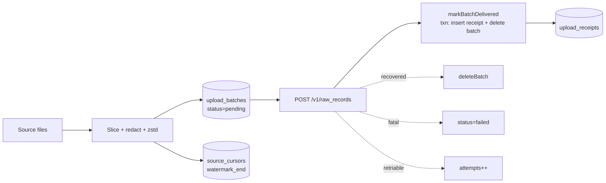

[← Previous: 2.4 Redaction](../02-capture/2.4-redaction.md) · [Index](../README.md) · [Next: 3.2 Buffer Pressure & Pruning →](./3.2-buffer-pressure-and-pruning.md)

# 3.1 Buffer (SQLite)

> The local SQLite database that holds everything the gateway needs to survive a restart and re-prove progress.

The buffer is the single source of truth between [capture](../04-daemon-loops/4.1-capture-cycle.md) and [upload](../04-daemon-loops/4.2-drain-cycle.md). It is a SQLite database at `~/.proxai/proxai-gateway/buffer.db` (or `%LOCALAPPDATA%\proxai\proxai-gateway\buffer.db` on Windows) that holds every pending batch, every per-file cursor, every receipt of a delivered batch, every metadata counter the daemon maintains, the most recent drain snapshot, and a metadata-only ledger of quarantined oversized rows.

Everything the gateway needs to resume cleanly after a daemon restart — including the watermarks for resuming each source mid-file — lives in this one file.

## Why SQLite

SQLite was chosen over a flat-file queue or an in-memory ring because the gateway needs durable, atomic, transactional progress tracking across a process exit — and because Bun ships sqlite as a standard-library module, so adding it costs no extra binary dependency. WAL mode (`PRAGMA journal_mode = WAL`) plus `PRAGMA synchronous = NORMAL` gives crash-safe concurrent reads (so the CLI's `status`/`tail` can open the same file read-only while the daemon writes) without paying the full `fsync` cost of `synchronous = FULL`.

WAL — Write-Ahead Logging, a SQLite journaling mode where writes append to a separate `.db-wal` file before being merged into the main database, allowing concurrent readers while a single writer commits — means three on-disk artifacts: `buffer.db`, `buffer.db-wal`, `buffer.db-shm`. The gateway never forces a checkpoint of its own — SQLite handles it on its standard cadence.

`synchronous = NORMAL` flushes after each transaction commit but not on every write inside a transaction; it trades a tiny crash-recovery window for substantial throughput.

## The six tables at a glance

| table | role |
| --- | --- |
| `upload_batches` | pending and failed batches keyed by `capture_id` UUIDv7 (a time-sortable UUID variant whose leading bits encode a millisecond timestamp, so natural ordering is also chronological) |
| `source_cursors` | per-file checkpoint with composite key `(source_app, source_path_hash, source_inode, watermark_table)` |
| `upload_receipts` | delivered-batch proof of progress, kept for a 30-day retention window |
| `buffer_metadata` | key/value scratchpad for cumulative counters and timestamps |
| `daemon_state` | single-row snapshot of the last drain cycle plus latest per-source capture counts |
| `quarantined_records` | metadata-only ledger of oversized source rows |

The schema is all declared with `CREATE TABLE IF NOT EXISTS` so opening a freshly-installed binary against an existing database is always safe.

## How data flows through



Data flows in two strictly one-way halves. The write half — capture — slices each source file, redacts, compresses, and inserts one batch per slice with `status = pending`. The read half — drain — pops the oldest pending batch, ships it via `POST /v1/raw_records`, and converts the row to a receipt (with `markBatchDelivered` running the insert-receipt + delete-batch as one transaction).

No data path runs the other direction: the drain loop never writes a new batch and the capture loop never touches receipts. The only feedback signal between the two halves is the `BUFFER_FULL` sentinel covered in [pressure and pruning](./3.2-buffer-pressure-and-pruning.md).

## Crash-safety contract

The buffer is also the gateway's crash boundary. WAL plus `synchronous = NORMAL` guarantees the committed-transaction boundary: an interrupted `markBatchDelivered` is rolled back at next open so either the receipt was committed and the batch deleted, or neither. A `kill -9` during a capture leaves at most one in-flight insert lost; the cycle that just finished is durably committed.

The DB file itself is never deleted by the gateway — even `uninstall` leaves it in place by default, so a future re-install resumes from the same cursors.

## Concurrency model

Concurrency is handled by SQLite's own file-level locking. The daemon is single-process and runs the three loops ([capture](../04-daemon-loops/4.1-capture-cycle.md), [drain](../04-daemon-loops/4.2-drain-cycle.md), [heartbeat](../04-daemon-loops/4.3-heartbeat-cycle.md)) in the same Bun process under `Promise.all`, so within-process writes are serialized by SQLite. Cross-process reads (CLI commands) use `openReadOnly` and never block the daemon. The install pipeline registers exactly one service unit per host so two daemons never race against the same `buffer.db`.

## Where does the buffer live?

`~/.proxai/proxai-gateway/buffer.db` on macOS and Linux, `%LOCALAPPDATA%\proxai\proxai-gateway\buffer.db` on Windows. Path resolved by `bufferDbPath()` in `core/io/fs/paths.ts`; overridable via `capture.buffer_path` in `config.toml`.

`openBufferDb(path)` opens it read-write through `openReadWrite` in `core/io/sqlite/open.ts`. That helper:

- Creates the file if missing (`{ create: true }`).
- Runs `PRAGMA journal_mode = WAL` and `PRAGMA synchronous = NORMAL` for crash-safe concurrent reads and acceptable write latency.
- Runs `PRAGMA foreign_keys = ON`.
- `chmod 0o600` on the `.db`, `-wal`, and `-shm` files on macOS/Linux (silent failure on permission errors; skipped on Windows).

`initializeSchema(db)` then runs all six table DDLs, the three indexes (`idx_upload_batches_status_created`, `idx_upload_batches_path_hash`, `idx_upload_receipts_path_hash`, `idx_upload_receipts_delivered_at`, plus the two `quarantined_records` indexes), and the cursor `ADD COLUMN` migrations for `last_seen_size_bytes` and `last_seen_page_count`. The DB is closed on daemon shutdown but never deleted: receipts, metadata, and daemon state are intentionally preserved across restarts.

## What tables are in the schema?

Six tables, names exported from `BUFFER_TABLES`:

- **`upload_batches`** — pending and failed batches. Primary key `capture_id`. Indexed by `(status, created_at)` for drain ordering and by `source_path_hash` for per-file lookups.
- **`source_cursors`** — per-file watermark state. Composite PK `(source_app, source_path_hash, source_inode, watermark_table)`. The `consecutive_errors` column is actively maintained by every source collector: on a per-file failure the catch block reads the prior cursor, calls `setCursor(...)` with `consecutiveErrors: priorErrors + 1` while leaving `watermarkEnd` unchanged so the next cycle re-attempts the same range; a successful poll calls `setCursor(...)` with `consecutiveErrors: 0`, resetting the counter. Codex state has a dedicated `bumpConsecutiveErrors` helper in `src/sources/codex/collect-state.ts`; the other sources (claude-code, codex rollouts, cursor) inline the same read-then-upsert pattern in their catch blocks.
- **`upload_receipts`** — delivered batches. PK `capture_id`. Indexed by `source_path_hash` and `delivered_at` (the latter feeds the prune cutoff).
- **`buffer_metadata`** — key/value scratchpad for cumulative counters, last-prune timestamp, last-version-check timestamp, latest-known-version, and per-source cumulative tallies.
- **`daemon_state`** — single-row table (PK constrained to `id = 1`) holding the last drain cycle's summary and the most recent per-source capture totals. Used to render the "Last cycle" line in `status`.
- **`quarantined_records`** — metadata-only ledger of source rows the gateway refused to ship because their redacted body exceeded `BODY_MAX_DECOMPRESSED_BYTES = 10 MiB`. PK is the autoincremented `id`. Indexed by `source_app` and `quarantined_at_utc`. Columns: `id`, `source_app`, `source_path`, `source_path_hash`, `source_inode`, `watermark_table`, `watermark_position`, `row_pk`, `redacted_size_bytes`, `reason`, `quarantined_at_utc`, `gateway_version`. The row's actual content is **never** stored — only the identifying tuple plus the post-redaction size. Inserted by `recordQuarantine` (`services/buffer/quarantine.ts`) when `src/sources/codex/collect-state-table.ts` or `src/sources/cursor/process-rows.ts` skip an oversized row; pruned alongside failed batches (see [pressure and pruning](./3.2-buffer-pressure-and-pruning.md)).

The full DDL strings (`BATCH_TABLE_DDL`, `CURSOR_TABLE_DDL`, `QUARANTINE_TABLE_DDL`, etc.) live in `buffer.constants.ts` for grep-friendliness.

## What is a batch status?

Two values in `VALID_BATCH_STATUSES`: `pending` and `failed`. There is no `delivered` status — once the server accepts a batch, the row is deleted and a receipt is inserted in the same transaction (`markBatchDelivered`). A batch becomes `failed` only on a fatal upload outcome (`ValidationError`, `GatewayError`, `OversizedDecompressedSliceError`). Retriable errors (network, 5xx, 429, auth-unconfirmed) just bump `attempts` and update `last_error`; the row stays `pending`.

## How is the next batch picked?

`nextPendingBatch(db)` runs:

```
SELECT * FROM upload_batches
WHERE status = 'pending'
ORDER BY created_at ASC, capture_id ASC
LIMIT 1
```

That ordering plus the `idx_upload_batches_status_created` index means drain is strictly FIFO over creation time, with `capture_id` as a deterministic tie-breaker for batches produced in the same millisecond. There is also a `nextPendingBatchAfter(cursor)` variant used by the drain loop to walk pending batches without re-reading the freshly retriable ones in the same cycle.

`dropOldestPending(db)` exists for a future operator escape hatch — it deletes the row at the head of that same FIFO ordering and returns its `capture_id`. As of today it is not wired into any cycle.

## What is the cursor row key?

`(source_app, source_path_hash, source_inode, watermark_table)`. Two sentinels keep the PK total over nullable values:

- `NO_INODE_SENTINEL = 0` — used by sqlite snapshot sources (cursor, codex state) that don't have a stable inode, and by `syncServerWatermarks` which doesn't know the local inode.
- `NO_TABLE_SENTINEL = ''` — used by sources whose `watermarkTableRequired` is false.

`getCursorWithFallback(db, key)` does the lookup: exact match first, then if no row was found and `key.sourceInode` is set, retry with `sourceInode = 0`. That fallback is how server-seeded cursor rows (always inode=0) take effect for newly-discovered local files.

`setCursor(...)` is an `INSERT ... ON CONFLICT DO UPDATE` upsert that touches the PK + `source_path` (so a file that has moved keeps its watermark when the path changes), `watermark_end`, `last_polled_at = nowIsoUtc()`, `consecutive_errors`, and the two `last_seen_*` vacuum-detection columns. The `last_polled_at` write is the per-source liveness heartbeat that `status` displays.

## What does a receipt store and why keep it?

```
capture_id           TEXT  (primary key)
source_app           TEXT
source_path_hash     TEXT
watermark_kind       TEXT
watermark_start      INTEGER
watermark_end        INTEGER
watermark_table      TEXT nullable
delivered_at         TEXT  (ISO-8601)
idempotent_on_server INTEGER  (0 or 1)
```

Receipts are the local proof of progress. Three uses:

1. The `status` command counts them to report cumulative "successful uploads tracked".
2. They are indexed on `delivered_at` so the prune cycle can drop rows past the retention window cheaply.
3. The `idempotent_on_server` bit records whether the server treated the upload as a duplicate (server-side dedup keyed on `capture_id`), which is useful when reconciling re-shipped batches after a network blip.

Receipts are pruned, not deleted on success — the gateway intentionally holds them for the receipt retention window (default 30 days) so observability tools can see what shipped recently.

## Which metadata keys does the buffer track?

Names in `METADATA_KEYS` (`buffer.constants.ts`). Grouped by purpose:

- Maintenance: `last_prune_at`, `last_version_check_at`, `latest_known_version`.
- Capture cycle: `capture_cycles_total`, `capture_cycles_with_errors`, `capture_last_cycle_at`, `capture_last_cycle_duration_ms`.
- Drain cycle: `drain_cycles_total`, `drain_cycles_with_errors`, `drain_last_cycle_at`, `drain_last_cycle_duration_ms`, `drain_total_batches_shipped`, `drain_total_bytes_shipped`.
- Legacy combined counters retained for backwards compatibility with older `status` renderings: `cycles_total`, `cycles_with_errors`, `cycles_total_duration_ms`, `upload_total_batches_shipped`, `upload_total_bytes_shipped`, `upload_last_success_at`, `upload_last_success_batches`, `upload_last_success_bytes`.

Per-source totals use generated keys via helpers: `uploadBatchesShippedKey('claude-code')` returns the string `"upload_batches_shipped_by_source.claude-code"`. Each drain cycle increments these alongside the global counters, which lets `status` render the per-source shipped breakdown without a separate table.

The `metadata-readers.ts` module provides `readNumber`, `readNumberOrNull`, `readNumberWithFallback(primary, legacy)`, and `getMetadataWithFallback` for status rendering. The fallback variants are how the modern split capture/drain counters degrade gracefully when only the legacy combined counter has data (e.g. immediately after upgrading from a pre-split build).

## How does daemon state differ from metadata?

`daemon_state` is the most-recent snapshot of one drain cycle, persisted via `setDaemonState` after every successful drain. Columns: `last_cycle_started_at`, `last_cycle_completed_at`, `last_cycle_duration_ms`, `last_drain_attempted`, `last_drain_accepted`, `last_drain_retriable`, `last_drain_fatal`, `last_drain_recovered`, `last_upload_error`, `last_consecutive_retriable_break`, and a JSON-encoded `last_source_captures` map. Metadata is the long-running counters; `daemon_state` is "what happened on the cycle that just finished".

Both cycles write to this row:

- Capture cycle's `persistSourceCaptures` reads the existing row, merges the latest per-source results into `lastSourceCaptures`, leaves the drain fields untouched, and writes back.
- Drain cycle's `persistDaemonState` writes the new drain summary fields and preserves `lastSourceCaptures` via `existing?.lastSourceCaptures ?? {}`.

The `id = 1` `CHECK` constraint ensures the table is always exactly one row. `getDaemonState` JSON-parses `last_source_captures` defensively (try/catch with `{}` fallback on parse failure) so a single corrupt write can't poison subsequent reads.

## How big does the buffer get in practice?

A useful back-of-envelope per row:

- `upload_batches` body column: zstd-compressed payload, typically 50 KB – 200 KB per batch, hard-capped at `BODY_MAX_COMPRESSED_BYTES = 2 MiB`.
- `source_cursors` row: roughly 200 bytes, one row per `(source_app, file, table)` tuple.
- `upload_receipts` row: roughly 200 bytes (this is the `RECEIPT_BYTES_PER_ROW` constant used by `pruneBuffer` to estimate freed bytes).
- `quarantined_records` row: roughly 300 bytes, only written for oversized rows that hit the 10 MiB redacted-body cap.

Pending pressure tracking measures only `LENGTH(body)` over pending batches (see `totalPendingBytes` in `services/buffer/stats.ts`); SQLite indexes, WAL, and freelist pages are not counted. The 700 MiB soft-pause threshold is therefore strictly a body-bytes budget, not a file-size budget.

## How does the buffer survive a crash?

Three crash classes:

1. **Daemon killed mid-cycle.** WAL mode plus `synchronous = NORMAL` guarantees the committed-transaction boundary; an interrupted `markBatchDelivered` is rolled back by SQLite at next open (either the receipt was committed and the batch deleted, or neither). On next start `runDaemonLoops` re-opens the DB and runs the next capture cycle from each cursor's `watermark_end`.
2. **`buffer.db-wal` left behind.** SQLite replays the WAL on the next `openReadWrite`. No gateway action required.
3. **Source file rotated or vacuumed while daemon was down.** Cursor's `last_seen_size_bytes` / `last_seen_page_count` is compared to the current file on next poll via `detectVacuum`; if regression is detected, the source re-keys the path with a `#gen-N` suffix and seeds a fresh cursor at watermark 0 ([parsing](../02-capture/2.2-parsing-and-watermarks.md) covers the rotation semantics in full).

The DB itself is never deleted by the gateway. `proxai-gateway uninstall` removes the install directory but leaves `~/.proxai/proxai-gateway/buffer.db` in place by default — receipts and cursors are kept so a future re-install resumes cleanly.

## What concurrency guarantees does the buffer give?

The daemon is single-process. All three loops (capture, drain, heartbeat) run in the same Bun process via `Promise.all` in `runDaemonLoops`, and SQLite serialises writes through the WAL. Reads from the CLI (`status`, `tail`) open the same file read-only via `openReadOnly`; WAL allows concurrent readers without blocking the daemon's writes.

There is **no cross-process write lock** beyond what SQLite itself provides via the file locks on the `.db` and `-shm` files. Two daemons against the same `buffer.db` would interleave writes; the install pipeline guards against this by registering a launchd/systemd/Windows service unit, and the `dev` command refuses to start a second daemon (it doesn't share a buffer with the production daemon by default).

Two transactions per drain matter: `markBatchDelivered` (insert receipt + delete batch) and `pruneBuffer` (delete old receipts + delete old failed batches + delete old quarantined + update `last_prune_at`) both run in `db.transaction(() => ...)`. Capture-side, every per-row redact-and-insert pair is its own implicit transaction — there is no batch-level "all or nothing" wrap, which is intentional so a single bad row inside a poll cycle can't lose the rest of the cycle's progress.

## What happens on an empty database?

`status` against a brand-new buffer renders zeros: `nextPendingBatch` returns `null`, `countByStatus` returns `{ pending: 0, failed: 0, delivered: 0 }`, `countCursors` returns 0, `getDaemonState` returns `null`. The CLI handles all four cases without crashing.

`runDrainCycle` against an empty pending set produces a `DrainResult` with `attempted: 0, accepted: 0, ...` and short-circuits the per-source bookkeeping loop — `drainTotalBatchesShipped` is left untouched in metadata, `drain_cycles_total` increments by 1, and `daemon_state` records the zero-counts row.

## How does the schema get migrated?

The schema is additive: every DDL is `CREATE TABLE IF NOT EXISTS` and every index is `CREATE INDEX IF NOT EXISTS`. The only explicit migrations are the two `ALTER TABLE ... ADD COLUMN` calls in `migrateCursorVacuumColumns(db)`, guarded by `columnExists(db, 'source_cursors', '...')`. There is no `schema_version` table — `IF NOT EXISTS` makes the open-time DDL idempotent.

Implication: rolling back to an older gateway binary leaves the newer columns in place but unused. Rolling forward to a binary that adds new columns adds them on the next open. Rolling backward and forward across DDLs that change column types or drop columns is **not supported** — there is no down-migration path.

[← Previous: 2.4 Redaction](../02-capture/2.4-redaction.md) · [Index](../README.md) · [Next: 3.2 Buffer Pressure & Pruning →](./3.2-buffer-pressure-and-pruning.md)
