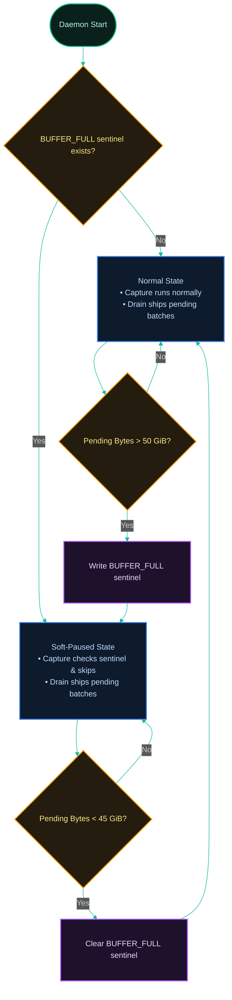

[← Previous: 3.1 Buffer](./3.1-buffer.md) · [Index](../../README.md) · [Next: 4.1 Capture Cycle →](../04-daemon-loops/4.1-capture-cycle.md)

# 3.2 Buffer Pressure & Pruning

*Last Updated: 2026-06-16*

> How the gateway keeps `buffer.db` from growing without bound, and how it back-pressures captures when the uploader can't keep up.

The [buffer](./3.1-buffer.md) is bounded on two timescales:

- On the short timescale, the **soft-pause / soft-resume** machinery throttles capture when the uploader cannot keep up. If the server is down, the network is partitioned, or the rate-limiter is paced too slowly, pending batches accumulate, and the gateway must stop pulling more data from sources before the local disk fills.
- On the long timescale, the **prune cycle** trims old artifacts that no longer serve a purpose: delivered receipts past their retention window, failed batches past theirs, and quarantined-record metadata past the same cutoff.

Together they keep `buffer.db` at a steady saw-tooth shape around an informal 50 GiB design target.

## Soft-pause hysteresis

Soft-pause operates as a hysteresis loop — hysteresis is the two-threshold deadband pattern: cross the high one to enter a state, cross the low one to leave, avoiding rapid toggling at a single boundary — between two thresholds: `buffer_soft_pause_bytes` (default 50 GiB) and `buffer_soft_resume_bytes` (default 45 GiB).



When pending bytes exceed the higher threshold, the [capture cycle](../04-daemon-loops/4.1-capture-cycle.md) writes the `BUFFER_FULL` sentinel and the next capture tick short-circuits with `reason: buffer_full`. When pending bytes drop below the lower threshold, the [drain cycle](../04-daemon-loops/4.2-drain-cycle.md) clears the sentinel and capture resumes on the next tick.

The 5 GiB gap prevents flapping — a single batch's worth of churn at the boundary cannot cause the sentinel to toggle every cycle. Capture writes the sentinel; only drain clears it; the asymmetry is intentional because drain is the only loop that reduces pending bytes.

## How pressure is measured

Pressure is measured as `SUM(LENGTH(body))` over `upload_batches` where `status = pending`. This counts only the compressed body bytes, not the row overhead, the indexes, the WAL, or the SQLite freelist. A pending bucket of 100 small batches and a pending bucket of one giant batch summing to the same byte count are treated identically.

The query is sub-millisecond in steady state and tens of milliseconds under extreme back-pressure; `LENGTH(blob)` does not decompress the body.

## What pruning trims

Pruning runs after every drain cycle via `pruneBuffer`. Four artifacts get trimmed, all in one transaction:

- `upload_receipts` rows with `delivered_at` older than `DEFAULT_RECEIPT_RETENTION_DAYS = 365` days (the **receipt cutoff**).
- `upload_batches` rows where `status = failed` and `created_at` is older than `DEFAULT_FAILED_RETENTION_DAYS = 365` days (the **failed cutoff**).
- `quarantined_records` rows with `quarantined_at_utc` older than the failed cutoff.
- `resync_events` rows with `recovered_at` older than the receipt cutoff.

All four deletes plus the `last_prune_at` metadata write run inside one transaction, so a partial failure cannot leave the counters skewed. Pending batches are never pruned by time — they only leave the buffer when shipped, or when an operator explicitly drops them.

## No VACUUM on the buffer

The buffer database itself is never `VACUUM`ed by the gateway. (`VACUUM` is SQLite's maintenance operation that rebuilds the database file to reclaim free pages and defragment storage; running it on the buffer would also reset rowids and make crash-recovery harder.) SQLite reuses free pages from deleted rows, and the receipt and failed-batch volumes are small enough that the file size stays bounded. A long-running daemon's `buffer.db` typically settles into a saw-tooth around the soft-pause threshold during pressure events, then plateaus near the steady-state pending volume once the queue catches up.

The `detectVacuum` helper exists for a different purpose — detecting a `VACUUM` on a *source* sqlite file (Cursor's database, Codex's state file) so the gateway can re-key the cursor; that mechanism is covered in [parsing](../02-capture/2.2-parsing-and-watermarks.md).

## The sentinel surface

The sentinel surface is a single JSON file (`BUFFER_FULL`) under the profile's config directory (`~/.proxai/proxai-gateway/<profile>/`) whose body carries `{ pending_bytes, threshold, set_at }`. The sentinel itself is a 0-byte presence check from the capture-cycle gate's perspective — the body is only read by `status` to render a human-readable pressure line.

Manual edits are legitimate operator practice: drop a `BUFFER_FULL` file in place to emergency-stop captures, the drain loop will not undo it until pending drops below `softResumeBytes`, and `status` will surface the manual sentinel the same as a daemon-written one. The full sentinel mechanism is documented in [sentinels](../04-daemon-loops/4.4-sentinels.md).

## What gets retained, and for how long?

Two retention windows, both defaulting to **365 days** (`src/services/config/config.constants.ts`):

- `DEFAULT_RECEIPT_RETENTION_DAYS = 365` — `upload_receipts` rows whose `delivered_at` is older than 365 days are pruned. `resync_events` rows share this receipt cutoff (pruned when `recovered_at` is older than 365 days).
- `DEFAULT_FAILED_RETENTION_DAYS = 365` — `upload_batches` rows with `status = failed` and `created_at` older than 365 days are pruned. `quarantined_records` rows share this failed cutoff.

Both are overridable in `config.toml` (`capture.receipt_retention_days`, `capture.failed_retention_days`). The validator allows any non-negative integer (minimum 0); setting either to 0 means "delete everything older than 'now'", which effectively wipes the artifact on the very next drain. Pending batches are never pruned by time — they only leave the buffer when shipped or when the daemon (or a future tool) explicitly drops them.

## What are the soft-pause and soft-resume thresholds?

- Defaults in `src/services/config/config.constants.ts`:

- `DEFAULT_BUFFER_SOFT_PAUSE_BYTES = 50 * 1024 * 1024 * 1024` (50 GiB).
- `DEFAULT_BUFFER_SOFT_RESUME_BYTES = 45 * 1024 * 1024 * 1024` (45 GiB).

Validation in `validateCapture` (`services/config/validate.ts`):

- `buffer_soft_pause_bytes` minimum 1, no maximum.
- `buffer_soft_resume_bytes` minimum 0, no maximum.
- `buffer_soft_resume_bytes >= buffer_soft_pause_bytes` is rejected with `capture.buffer_soft_resume_bytes must be less than capture.buffer_soft_pause_bytes`.

Setting `buffer_soft_resume_bytes = 0` means the sentinel can only clear when the pending bucket is literally empty — a useful debug knob, painful in production. Setting `buffer_soft_pause_bytes` to a value smaller than a single batch (~2 MiB) means the first batch ever written trips the sentinel; the gateway will still attempt to drain on the next 30-second tick, but every capture tick will skip.

The 50 GiB design target is informal — the soft-pause boundary at 50 GiB exists to keep pending well under that target even when the uploader is briefly stuck (e.g. retry-after backoff). The hard ceiling is whatever the filesystem and SQLite tolerate; there is no enforced upper bound.

## How is pressure measured?

`checkPendingPressure` in `services/buffer/pressure.ts` runs `totalPendingBytes` (a `SUM(LENGTH(body))` over `upload_batches` where `status = pending`) and returns:

```
{ pendingBytes, shouldPause: pendingBytes > softPauseBytes,
                shouldResume: pendingBytes < softResumeBytes }
```

It is called twice per cycle: at the end of `runCaptureCycle` (to potentially write `BUFFER_FULL`) and at the end of `runDrainCycle` (to potentially clear it). Capture writes the sentinel; drain clears it. The asymmetry is intentional — drain is the only loop that reduces pending bytes, so it owns the "resume" decision.

## What's the cost of the pressure check?

`SELECT COALESCE(SUM(LENGTH(body)), 0)` over the pending-status portion of `upload_batches`. SQLite walks the `idx_upload_batches_status_created` index for the `WHERE status = 'pending'` filter, then reads each row's `body` to compute `LENGTH`. For a steady-state bucket of a few hundred pending rows the query is sub-millisecond; under extreme back-pressure (thousands of pending rows because the uploader is offline), the query touches more rows but still runs in the tens of milliseconds because `LENGTH(blob)` doesn't decompress the body. Either way, the pressure check is the smallest expense in the cycle.

## When does pruning run?

Every drain cycle, after the actual upload work, via `pruneBuffer` in `services/buffer/prune.ts`. The function:

1. Counts and deletes receipts older than `now - receiptRetentionDays`.
2. Counts and sums byte length of failed batches older than `now - failedRetentionDays`, then deletes them.
3. Deletes quarantined-records rows older than `now - failedRetentionDays` via `pruneQuarantinedOlderThan(db, failedCutoff)` — quarantined rows share the failed-batch retention window (default 1 year), because both are "kept for review then garbage-collected" surface area.
4. Deletes resync-events rows older than `now - receiptRetentionDays` via a delete statement on `resync_events` using the `receiptCutoff` (default 1 year).
5. Writes `last_prune_at = now` to `buffer_metadata`.

All deletes run in one transaction so a partial failure can't leave inconsistent states. The return value reports `receiptsDeleted`, `failedBatchesDeleted`, `quarantinedDeleted`, `resyncEventsDeleted`, `receiptBytesFreed` (computed as `receiptsDeleted * 200` bytes — the constant `RECEIPT_BYTES_PER_ROW = 200` is the rough average row size), and `failedBytesFreed` (the actual `SUM(LENGTH(body))`).

If prune throws, the drain cycle catches the error, logs `event: buffer.prune_failed`, and continues. The next drain will try again 30 seconds later.

## What does the prune algorithm look like in pseudo-code?

```
pruneBuffer({ db, receiptRetentionDays, failedRetentionDays, now = new Date(), logger }):
  receiptCutoff = (now - receiptRetentionDays * 86_400_000).toISOString()
  failedCutoff  = (now - failedRetentionDays  * 86_400_000).toISOString()

  begin transaction:
    receiptsDeleted ← count receipts where delivered_at < receiptCutoff
    if receiptsDeleted > 0: delete those receipts

    failedBatchesDeleted, failedBytesFreed
      ← count(*), sum(LENGTH(body)) from failed batches where created_at < failedCutoff
    if failedBatchesDeleted > 0: delete those batches

    quarantinedDeleted ← pruneQuarantinedOlderThan(db, failedCutoff)

    resyncEventsDeleted ← delete from resync_events where recovered_at < receiptCutoff

    setMetadata(db, 'last_prune_at', now.toISOString())
  commit

  log event=buffer.prune {receipts_deleted, failed_batches_deleted,
                          quarantined_deleted, resync_events_deleted,
                          receipt_bytes_freed, failed_bytes_freed,
                          receipt_cutoff, failed_cutoff}

  return { receiptsDeleted, failedBatchesDeleted, quarantinedDeleted, resyncEventsDeleted,
           receiptBytesFreed = receiptsDeleted * 200, failedBytesFreed }
```

The `receiptBytesFreed = receiptsDeleted * 200` estimate is a constant-time approximation — actual receipt rows are 150–250 bytes depending on path-hash length and watermark-kind variation, but the prune is mostly bookkeeping anyway; the figure exists so the log event has a comparable units to `failedBytesFreed`.

## How does VACUUM detection interact with pruning?

`detectVacuum` in `services/buffer/vacuum-detect.ts` is a source-side check, not a buffer-side one. It compares the agent's sqlite file against the cursor's `last_seen_size_bytes` / `last_seen_page_count` / watermark; if the file shrank or rowids regressed, the gateway re-keys the source path with a `#gen=N` suffix and starts a fresh cursor at watermark 0. Three reasons it returns `vacuumed = true`:

- `size_decreased` — `current_size_bytes < cursor.last_seen_size_bytes`.
- `page_count_decreased` — `current_page_count < cursor.last_seen_page_count`.
- `rowid_regressed` — `current_max_rowid + 1 < cursor.watermark_end`.

The buffer database itself is **never VACUUMed** by the gateway — SQLite reuses free pages from deleted rows, and the receipt/failed-batch volumes are small enough that the file size stays bounded.

## How does this feed the BUFFER_FULL sentinel?

The sentinel is at `~/.proxai/proxai-gateway/<profile>/BUFFER_FULL` (the path is profile-nested, taken from `ProfileContext.sentinels.bufferFull` — `join(configDir, 'BUFFER_FULL')` — and threaded to the cycle as `ctx.bufferFullSentinelPath`). Its body is JSON: `{ pending_bytes, threshold, set_at }`.

- **Capture cycle** writes it via `writeBufferFullSentinel` when `pressure.shouldPause` flips true. The capture cycle does not skip itself on the same tick — it still finishes the current cycle's per-source polls and the sentinel takes effect from the next tick onward.
- **Capture cycle**'s pre-cycle gate (`isBufferFull(...)`) checks the sentinel and returns early with `reason: buffer_full` when it exists. Drain and heartbeat are not gated on `BUFFER_FULL` — drain is the only way to clear pressure, and heartbeat doesn't touch the buffer in a way that grows it.
- **Drain cycle** calls `clearBufferFullSentinel` after a drain whenever `pressure.shouldResume` is true AND the sentinel is currently present.

The sentinel is therefore self-healing: capture stops on overflow, drain shrinks the buffer, drain clears the sentinel, capture resumes on the next tick.

## What does the sentinel file look like on disk?

`writeBufferFullSentinel` JSON-stringifies `{ pending_bytes, threshold, set_at }`:

```json
{"pending_bytes": 53687091200, "threshold": 53687091200, "set_at": "2026-05-08T14:22:01.123Z"}
```

`readBufferFullSentinel` parses defensively: a malformed JSON file is treated as "exists but unreadable" and `readBufferFullSentinel` returns `null`. `isBufferFull` is a simple existence check, so even a zero-byte sentinel still gates capture. `clearBufferFullSentinel` calls the shared `sentinelHandle(path).remove()` which is a best-effort `unlink` that ignores ENOENT.

## What happens at extreme thresholds?

- **`buffer_soft_pause_bytes` set to 0 or 1.** Validation requires minimum 1. Setting 1 means even an empty buffer is in pressure (`pendingBytes > 1` is true the moment a single capture lands). Capture writes the sentinel every cycle; drain clears it only when pending is zero (since `shouldResume = pendingBytes < softResumeBytes` and `softResumeBytes` must be less than 1, i.e. 0). Effectively: gateway captures one batch, pauses, drains one batch, resumes, captures the next. A useful integration test, never a useful production knob.
- **`buffer_soft_pause_bytes` set to multi-GiB.** Filesystem and SQLite tolerate this fine, but the daemon process retains the WAL on disk; if the host is short on storage the gateway will fail with `SQLITE_FULL` long before the soft-pause trips. There is no early warning for that path.
- **`receipt_retention_days = 0`.** Every receipt is older than `now - 0 days`, so every drain deletes the receipt that the same transaction just inserted. The `delivered` count in `status` is permanently 0. Cursors and metadata are unaffected.
- **`failed_retention_days = 0`.** Same shape: every failed batch is deleted on the next drain. Quarantined rows are deleted on the same cutoff, so the quarantine ledger is effectively disabled.

## What does the operator see when pressure triggers?

Three observable surfaces:

- Log event `event: buffer.soft_pause` at WARN level with `pending_bytes` and `threshold`. Emitted on every capture cycle that ends with `pressure.shouldPause` true; in practice, that means once per capture tick while pressure persists, not just on the first trip.
- Log event `event: buffer.soft_resume` at INFO level on the drain cycle that clears the sentinel.
- `proxai-gateway status` reads the sentinel and renders a "buffer pressure: paused" line.

The `event: capture.cycle.skipped` log entry with `reason: buffer_full` also fires on every capture tick while the sentinel is on disk — that's the per-cycle confirmation that capture is being throttled.

## Could pressure ever be wrong?

Three corner cases worth knowing:

1. **Race between `checkPendingPressure` and the next batch insert.** `checkPendingPressure` runs at the end of a cycle, after capture has finished writing this cycle's batches. A drain tick that runs concurrently will see the same row set — there is no read-skew window where the sentinel gets written and immediately cleared.
2. **Manual edits to `BUFFER_FULL` on disk.** Anyone with write access to the profile directory `~/.proxai/proxai-gateway/<profile>/` can drop a `BUFFER_FULL` file in place; the next capture tick for that profile will skip until drain clears it. That's a legitimate emergency-stop knob, not a bug. Because the sentinel is profile-nested, dropping it under `prod/` does not pause the `dev` daemon and vice versa.
3. **Stale sentinel after a long pause+kill+restart.** If the gateway pauses on pressure, then the user `kill -9`s the daemon, then restarts after running a manual cleanup, the `BUFFER_FULL` sentinel persists across restart. The first drain cycle on the new daemon will clear it if and only if `pendingBytes < softResumeBytes`. If the user manually emptied the DB, pending is zero, sentinel clears on first drain tick (30s after start).

[← Previous: 3.1 Buffer](./3.1-buffer.md) · [Index](../../README.md) · [Next: 4.1 Capture Cycle →](../04-daemon-loops/4.1-capture-cycle.md)
