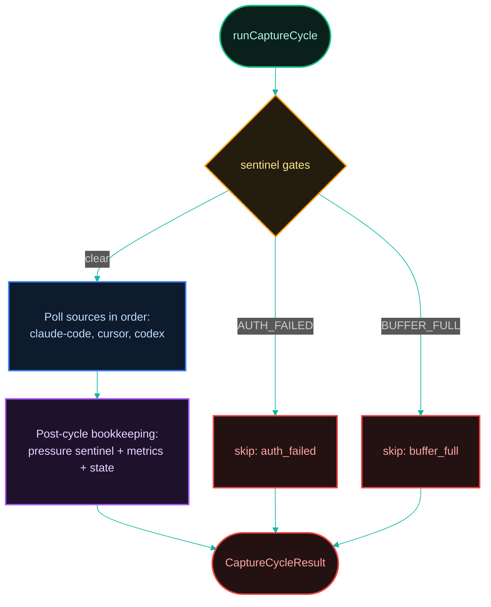
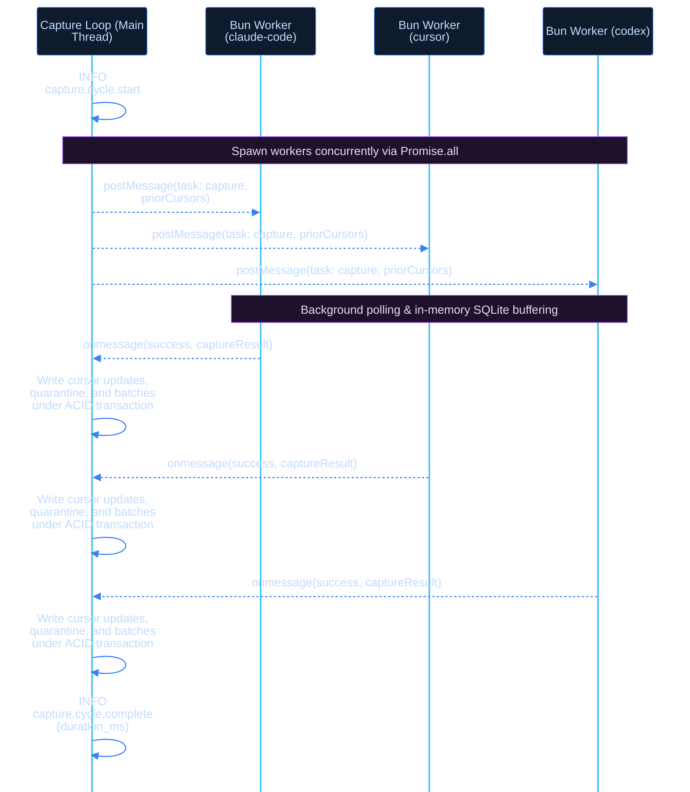

[← Previous: 3.2 Buffer Pressure & Pruning](../03-buffer/3.2-buffer-pressure-and-pruning.md) · [Index](../../README.md) · [Next: 4.2 Drain Cycle →](./4.2-drain-cycle.md)

# 4.1 Capture Cycle

*Last Updated: 2026-06-16*

> One of the four supervised daemon loops — walks every source, decides what's new, buffers it.

The capture cycle is the loop that pulls new bytes from every supported [source](../02-capture/2.1-sources.md) and writes them into the [buffer](../03-buffer/3.1-buffer.md). It runs every 2 minutes (`CAPTURE_INTERVAL_MS = 120_000`) inside the gateway daemon, in parallel with the [drain cycle](./4.2-drain-cycle.md), [heartbeat cycle](./4.3-heartbeat-cycle.md), and auth recovery loop under `Promise.all` in `runDaemonLoops`. The 2-minute cadence is low enough to feel near-real-time yet high enough that idle hosts barely consume CPU.

The loop body is `runCaptureCycle` in `services/polling/capture-cycle.ts`. The production daemon uses the default 2-minute interval; tests and the `dev` command override it via `DaemonLoopOptions.captureIntervalMs`.



Each cycle has a fixed three-phase shape: gate, poll, post-cycle bookkeeping. The gate phase checks two [sentinels](./4.4-sentinels.md) in order — `AUTH_FAILED`, then `BUFFER_FULL` — and short-circuits with a `capture.cycle.skipped` log line on the first hit.

The ordering matters: auth-failed is the most absorbing state (only an operator can clear it); buffer-full is a transient self-healing condition. A skipped cycle returns flags on its result and does not increment `capture_cycles_total`, so the metadata counter reflects only completed cycles.

## Database Schema and Table Operations

The Capture Cycle reads and updates specific tables and columns in `buffer.db` to maintain sequental progress state and enqueue telemetry data under strict ACID transactions:

### 1. Database Reads (Telemetries and Checkpoints)
* **`source_cursors`** (composite primary key `source_app`, `source_path_hash`, `source_inode`, `watermark_table`):
  * Reads the column `watermark_end` to discover the high-water mark of previously-read records.
  * Reads `last_seen_size_bytes` and `last_seen_page_count` to evaluate file sizes and page structures for vacuum or truncation anomalies (see `detectVacuum`).
* **`daemon_state`** (primary key `id = 1`):
  * Reads `last_source_captures` (JSON string) to retrieve the historical per-source polling counts before writing merged totals.

### 2. Database Writes (Acquisitions and Errors)
To prevent write conflicts, background poll workers compile acquired records into isolated in-memory tables and post them back to the main thread. The main thread then serializes the following writes within a single atomic ACID block:
* **`upload_batches`** (inserts new rows, primary key `capture_id` UUIDv7):
  * Populates metadata columns: `source_app`, `source_kind`, `source_path`, `source_path_hash`, `source_inode`, `watermark_kind`, `watermark_start`, `watermark_end`, `watermark_table`, `agent_schema_version`, `gateway_version`, `captured_at_utc`, `body_format`, `body_compression`, and `created_at`.
  * Encodes the compressed, redacted payload byte sequence into the binary `body` column.
  * Defaults `status` to `'pending'` and `attempts` to `0`.
* **`source_cursors`** (upserts existing or missing cursors):
  * Writes to the key columns (`source_app`, `source_path_hash`, `source_inode`, `watermark_table`) and updates the watermark cursor (`watermark_end`), absolute location (`source_path`), poll timestamp (`last_polled_at`), consecutive failure count (`consecutive_errors`), and vacuum-tracking properties (`last_seen_size_bytes` or `last_seen_page_count`).
* **`quarantined_records`** (inserts new entries on oversize limit trips):
  * Inserts rows including `source_app`, `source_path`, `source_path_hash`, `source_inode`, `watermark_table`, `watermark_position`, `row_pk`, `redacted_size_bytes` (exceeding the decompressed 10 MiB limit), `reason` (`'Oversized decompress size'`), `quarantined_at_utc`, and `gateway_version`.
* **`daemon_state`** (updates `id = 1` row):
  * Overwrites `last_source_captures` with a merged, JSON-serialized summary of the active capture run (numbers of processed files, successfully compiled batches, and total captured bytes).

The capture cycle does **not** write `resync_events`. That table (the 7th buffer table) is appended only by the [drain cycle](./4.2-drain-cycle.md)'s upload path when the server returns a watermark-regression. The capture side never advances a watermark backward, so it has no recovered-handshake row to record.

## Concurrent worker-based polling

To maximize efficiency and keep CPU consumption on the primary thread minimal, the poll phase executes the worker-eligible default sources (`claude-code`, `cursor`, `codex`) concurrently in background Bun Worker threads (`services/polling/poll-worker.ts`) using `Promise.all`. Every other registered source — `claude-desktop` (a default source) as well as any custom or mock source — cleanly falls back to direct main-thread linear polling via its in-process poller. (The worker's `handleCapture` only implements the three worker sources; `claude-desktop` capture lives in its in-process poller, while the worker's `handleInspect` does cover `claude-desktop` for the `inspect` dry-run.)

### Compiled Binaries In-Process Fallback
When the gateway is packaged and running as a compiled standalone binary, spawning separate thread-based Bun Workers is either unsupported or experiences resolution issues with virtual filesystems. The capture cycle dynamically checks for this condition using `__deps.isCompiledBinary()`, which validates if the active file URL matches `import.meta.url.includes('$bunfs')` or `import.meta.url.includes('bun:wrap')`.

If a compiled binary is detected, the gateway dispatches the capture via `runInProcessWorker` instead of `runThreadedWorker`. This runs the worker task (`handleCapture`) on the main thread rather than in a spawned worker thread. It retains identical SQLite `:memory:` database isolation, scanning/redaction pipelines, and sequential main-thread transaction commits.

Each default source context (either threaded or in-process) is executed using this structure:
1. **Prior Cursors Fetching**: The main thread reads all existing cursors for the source from `source_cursors` in `buffer.db` and passes them to the spawned Bun Worker (or in-process runner).
2. **Worker Isolation**: The worker (or runner) initializes a dedicated temporary in-memory database (`:memory:`). It populates this memory DB with the prior cursors.
3. **Independent Capture Execution**: Within the isolated worker thread, the matching source poller discovers candidate files (mtime-bounded by the initial-scan window for fresh installs), queries SQLite tables with `readonly: true` or parses log streams line-by-line, runs the [redaction](../02-capture/2.4-redaction.md) pipeline, slices records, and stores the resulting batches, quarantined records, and updated cursors locally in its private memory database.
4. **Main Thread Safe Commit**: Once the worker completes its capture, it terminates and posts a message back to the main thread with the captured buffers. The main thread then wraps all database writes in a single safe, atomic SQLite transaction (`ctx.buffer.transaction(() => { ... })`) to commit the batches, quarantine records, and cursors sequentially. This guarantees that `buffer.db` is never blocked or locked by concurrent database writes during heavy scanning.

Per-file failures inside the workers are caught and returned in the result's errors rather than thrown; the `consecutive_errors` column on `source_cursors` tracks how many cycles in a row a given file has been failing.

### Worker Pipeline & DB Isolation Architecture

```
                     +-----------------------------------+
                     |   Main Daemon Thread (Loop Cycle) |
                     +-------------------+---------------+
                                         |
                                         |  1. Read Cursors from buffer.db
                                         v
                     +-------------------+---------------+
                     |   Build worker-inputs & config    |
                     +-------------------+---------------+
                                         |
            +----------------------------+----------------------------+
            | (Parallel Spawning via Bun Worker - Promise.all)        |
            v                                                         v
  +---------+---------+                                     +---------+---------+
  | Bun Worker 1      |                                     | Bun Worker N      |
  | (claude-code)     |                                     | (cursor)          |
  +---------+---------+                                     +---------+---------+
            |                                                           |
            | 2. Init Isolated DB                                       | 2. Init Isolated DB
            v                                                           v
  +---------+---------+                                     +---------+---------+
  | SQLite :memory:   |                                     | SQLite :memory:   |
  +---------+---------+                                     +---------+---------+
            |                                                           |
            | 3. Scan & Redact Files                                    | 3. Scan & Redact Files
            v                                                           v
  +---------+---------+                                     +---------+---------+
  | Buffer Batches    |                                     | Buffer Batches    |
  | & Cursor updates  |                                     | & Cursor updates  |
  +---------+---------+                                     +---------+---------+
            |                                                           |
            | 4. postMessage(captureResult)                             | 4. postMessage(captureResult)
            +----------------------------+------------------------------+
                                         |
                                         v  (Collect all results)
                     +-------------------+---------------+
                     |  Acquire buffer.db WRITE Lock    |
                     +-------------------+---------------+
                                         |
                                         | 5. Safe ACID Transaction Commit
                                         v
                     +-------------------+---------------+
                     | Sequential Write:                 |
                     | - upload_batches  - quarantine    |
                     | - source_cursors  - daemon_state  |
                     +-----------------------------------+
```


## Post-cycle bookkeeping

Two best-effort steps run after the polls finish:

- `applyPressureSentinel` checks `checkPendingPressure(bufferPolicy)` and, if pending bytes exceed the soft-pause threshold, writes the `BUFFER_FULL` sentinel. This is the only place the sentinel is written.
- `persistCaptureMetrics` increments `capture_cycles_total`, writes `capture_last_cycle_at`, writes `capture_last_cycle_duration_ms`, and (if any source had errors) bumps `capture_cycles_with_errors`.

Both steps live behind `try/catch` — a transient SQLite hiccup or filesystem permission error does not crash the daemon loop.

A second post-cycle responsibility is updating `daemon_state.last_source_captures`, the per-source counts map that the `status` command surfaces. This is a read-modify-write: `persistSourceCaptures` reads the existing daemon-state row, merges in the latest per-source `SourceCycleResult` (`filesProcessed`, `capturedBatches`, `capturedBytes`, `errorsCount`), preserves the drain-side columns, and writes back. The drain cycle does the symmetric thing on its side, so capture and drain can both update the same single row without clobbering each other's columns.

## How errors propagate

A thrown error inside `source.poll(ctx)` propagates out — `runCaptureCycle` does **not** wrap individual polls in try/catch. The throw bubbles to `captureLoop` in `daemon-loops.ts`, which catches and logs `event: capture.cycle.error` (if it occurs within the timeout window), then sleeps and tries again on the next tick.

The remaining sources in that cycle are skipped, and the post-cycle bookkeeping does not run. In practice the collectors are defensive enough that a programmer-error (e.g. a bad cursor row throwing on `Date.parse`) is the realistic trigger.

Errors collectors *catch* and turn into `result.errors[]` are the cycle's normal partial-success path; they increment `capture_cycles_with_errors` but do not abort the cycle.

## Supervised Loop Execution & Cycle Timeouts

The capture loop (along with the other background daemon loops) runs under a supervisor model defined in `daemon-loops.ts` to ensure system stability and crash resilience:

### 1. Loop Supervision (`superviseLoop`)
Each loop (including `capture`, `drain`, `heartbeat`, and `auth_recovery`) is wrapped in the `superviseLoop` function:
* **Crash Recovery**: If a loop throws an unhandled crash or exception, the supervisor catches the error, logs a `${name}.loop.crashed` event, waits 1 second, and restarts the loop.
* **Fatal Exit Threshold**: If a loop crashes consecutively **3 times** (with less than 10 seconds of successful runtime between crashes), the supervisor logs a `daemon.fatal_crash_limit` event and exits the process with `process.exit(1)`.

### 2. Capture Cycle Timeout (`runWithTimeout`)
The capture cycle body (`runCaptureCycle`) is protected by a 90-second timeout guard:
* **Timeout Window**: The capture run is wrapped in a `runWithTimeout` race with `90_000` ms (90 seconds).
* **Timeout Behavior**: If the run exceeds this window, the timeout resolves with `null`, logging a `capture.cycle.timeout` error event.
* **Background Threading Note**: Because active Promise chains cannot be cancelled in JS, the timed-out capture continues running in the background. However, the loop runner ceases to wait for it, bypasses callbacks, and sleeps until the next tick.

## How often does it run?

`CAPTURE_INTERVAL_MS = 2 * 60_000` (2 minutes), defined in `services/polling/polling.constants.ts`. The interval can be overridden per-loop via `DaemonLoopOptions.captureIntervalMs` (used by tests and the `dev` command); the production daemon uses the default. The loop body has no minimum/maximum guard — `runCaptureCycle` accepts whatever `await sleep(intervalMs, signal)` says is enough.

The capture loop runs in parallel with drain, heartbeat, and auth recovery under `Promise.all` in `runDaemonLoops`, so a long capture cycle does not block drains.

## What gates does the cycle check before doing work?

Two sentinel checks at the top of `runCaptureCycle`, in this order:

1. `isAuthFailed(authFailedSentinelPath)` — returns early with `reason: auth_failed`. Polling stops entirely until the operator re-runs `setup` with a valid key.
2. `isBufferFull(bufferFullSentinelPath)` — returns early with `reason: buffer_full`. Cleared by the drain cycle once pending bytes drop below the resume threshold.

A skipped cycle still logs `event: capture.cycle.skipped` with the reason, still returns a result with `authFailed` / `bufferFull` flags set, and still consumes its interval — the daemon sleeps and tries again on the next tick.

## Are sources polled in parallel?

Yes. The three default sources (`claude-code`, `cursor`, `codex`) are polled in parallel using concurrent Bun Worker threads via `Promise.all` inside the capture cycle. Spawning these workers concurrently ensures that slower or larger sources (e.g. Cursor snapshotting or large Codex rollouts) never block cheaper sources (e.g. small JSONL appends in Claude Code).

Each default source worker operates on its own isolated temporary in-memory database to discover, parse, and redact, and returns the finished data to the main thread. Custom or mock sources run main-thread linear captures as a fallback for full backwards compatibility.

Each default source receives a `WorkerInput` payload carrying the prior cursors, directories, and policies. Custom pollers receive a standard `SourcePollerContext` carrying the buffer DB handle, the gateway version, and the resolved `maxDecompressedBytes` from `capturePolicy`.

## What does each poller do internally?

Every poller follows the same scaffold (`makeClaudeCodeSourcePoller`, `makeCodexSourcePoller`, `makeCursorSourcePoller`):

```
poll(ctx):
  result = {filesProcessed: 0, capturedBatches: 0, capturedBytes: 0, errors: []}
  minimumMtime = resolveMinimumMtime(ctx, initialScanWindowDays)
  try:
    files = await discover<Source>Files(baseDir, {minimumMtime})
  catch err:
    result.errors.push({sourcePath: baseDir, reason: err.message})
    return result
  for file in files:
    fileResult = await collect<Source>File(file, ctx)
    result.filesProcessed++
    result.capturedBatches += fileResult.capturedBatches
    result.capturedBytes  += fileResult.capturedBytes
    result.errors.push(...fileResult.errors)
  return result
```

Codex is the exception because it has two sub-sources: it discovers the state sqlite first, collects from it (recording any per-table errors), then discovers rollout jsonl files and walks them. State errors and rollout discovery errors are both appended to `result.errors` with `{sourcePath, reason, [table]}` shape.

`resolveMinimumMtime` is the cold-start gate. It returns:

- `ctx.minimumMtimeOverride` if explicitly set.
- `null` (no filter) otherwise.


## What does the per-source result look like?

Each `source.poll(...)` returns a `SourcePollerResult` with:

- `filesProcessed` — how many discovered files contributed any rows or bytes.
- `capturedBatches` — how many `upload_batches` rows were inserted.
- `capturedBytes` — total uncompressed byte volume that went through the slicer.
- `errors` — array of `{ sourcePath, reason }` for files that threw mid-collection.

The capture cycle returns the per-source results inside `CaptureCycleResult.sourceResults`, and also logs per-source `event: source.poll.complete` lines with the four counts and each error. The capture cycle then converts `sourceResults` to the persisted `SourceCycleResult` shape (`{ filesProcessed, capturedBatches, capturedBytes, errorsCount }`) and writes the result to `daemon_state.last_source_captures` via a read-modify-write that preserves any drain-side columns. The drain cycle does the same read-modify-write so the capture column survives every drain. The status command's per-source capture row therefore renders the most recent capture's counts from the persisted snapshot.

## Where does the per-source error counter live?

`source_cursors.consecutive_errors`. The column is part of the cursor row schema, so it persists across daemon restarts. Every source collector now maintains it:

- **claude-code** (`src/sources/claude-code/collect.ts`) — file-level catch reads the prior cursor and calls `setCursor(..., consecutiveErrors: priorErrors + 1)` leaving `watermarkEnd` at the prior value; a successful pass calls `setCursor(..., consecutiveErrors: 0)`.
- **codex rollouts** (`src/sources/codex/collect-rollout.ts`) — same inline pattern.
- **codex state** (`src/sources/codex/collect-state.ts`) — dedicated `bumpConsecutiveErrors(db, identity, table)` helper called from both the per-table catch and the outer file-open catch.
- **cursor** (`src/sources/cursor/process-rows.ts`) — bumps per quarantined row before continuing to the next slice; the final `setCursor` after the loop uses the accumulated `consecutiveErrors` from the last refresh.

The capture cycle does not itself increment a "skipped" counter — only the buffer-wide metadata key `capture_cycles_with_errors` gets incremented when any source's `errors.length > 0`.

## What counts as a "skipped" cycle in the metadata?

Two definitions live side by side:

- A cycle that returned via a sentinel gate has its `paused` / `authFailed` / `bufferFull` flag set and **does not** increment `capture_cycles_total` (the skip path never reaches `persistCaptureMetrics`). The skip is observable only in the log stream.
- A cycle that completed but had any source error still increments `capture_cycles_total` and increments `capture_cycles_with_errors`.

A cycle that completed cleanly increments only `capture_cycles_total`.

The drain cycle has analogous semantics on its own metadata keys (covered in the next doc).

## What runs after all sources finish?

Two post-cycle steps before the result is returned:

1. `applyPressureSentinel` — calls `checkPendingPressure(bufferPolicy)` and, if `shouldPause`, writes the `BUFFER_FULL` sentinel with `{ pendingBytes, threshold, setAt }`. This is the only place the sentinel is written. The result is also returned via `CaptureCycleResult.pressureResult` so the daemon's `onCaptureComplete` callback (used in tests) can observe it.
2. `persistCaptureMetrics` — increments `capture_cycles_total`, writes `capture_last_cycle_at`, writes `capture_last_cycle_duration_ms`, and (if any source had errors) increments `capture_cycles_with_errors`. Each `setMetadata` call is best-effort; failures log `event: metrics.persist_failed` but do not abort the cycle.

Both steps live behind `try/catch` so a transient SQLite hiccup or filesystem permission error does not crash the daemon loop.

## What happens if a source poll throws?

A throw inside `source.poll(ctx)` propagates out of the per-source `await result = source.poll(...)` line because there is **no try/catch around it inside `runCaptureCycle`**. That bubbles up to `captureLoop` in `daemon-loops.ts`, which catches and logs `event: capture.cycle.error` then continues into the next sleep. The remaining sources for that cycle are skipped, and the cycle is treated as "uncompleted" — `persistCaptureMetrics` and `persistSourceCaptures` never run.

Individual collector code is defensive enough that this rarely happens in practice; the most likely trigger is a programmer-error (e.g. a Date parsing throw on a bad cursor row). Source-level errors that the collectors catch and convert to `result.errors[]` do not throw out — those are the cycle's normal "partial-success" path.

## What does a full cycle log timeline look like?



Healthy steady-state cycle logs:

```
INFO  capture.cycle.start                 started_at=2026-05-08T14:00:00Z
DEBUG source.poll.start                   source_app=claude-code
DEBUG source.poll.start                   source_app=cursor
DEBUG source.poll.start                   source_app=codex
INFO  source.poll.complete                source_app=claude-code files=12 batches=1 bytes=85432 errors=0
INFO  source.poll.complete                source_app=cursor files=1 batches=0 bytes=0 errors=0
INFO  source.poll.complete                source_app=codex files=8 batches=0 bytes=0 errors=0
INFO  capture.cycle.complete              duration_ms=187 completed_at=2026-05-08T14:00:00.187Z
```

A skipped cycle is one line:

```
INFO  capture.cycle.skipped               reason=buffer_full
```

A pressure trip adds a single `buffer.soft_pause` at WARN before `capture.cycle.complete`.

## Concurrent Worker Polling FAQs

### Why poll in parallel using Bun Workers?
Older single-threaded sequential polling architectures could be blocked by a single slow database snapshot or a huge JSONL file scan, causing all other lightweight telemetry sources to starve. Spawning parallel workers via `Promise.all` isolates slow operations (like Cursor stats and Codex rollouts) from fast operations, making the overall capture process resilient and high-throughput.

### How is database locking prevented under heavy concurrent runs?
If multiple worker threads wrote directly to `buffer.db` at the same time, SQLite would encounter database busy/locking errors. To avoid this, workers use an isolated temporary in-memory database (`:memory:`) to store their captured data. Once a worker finishes, it posts its buffered arrays back to the main thread. The main thread then executes all database writes sequentially inside a single, safe, atomic ACID transaction block (`ctx.buffer.transaction(() => { ... })`). This serializes database writes to `buffer.db` and completely eliminates concurrent writing locks.

### What happens if a Bun Worker thread crashes or fails?
If a worker thread encounters an unhandled exception or exits abnormally, the error is caught and propagated back as a failure for that specific source cycle. The capture cycle will record the errors in `result.sourceResults`, but it will **not** block other active workers from completing successfully. The main thread will safely commit the successful workers' data while tracking the failed source's consecutive errors.

### Are custom or third-party sources run inside workers?
No. For backwards compatibility and extensibility, custom or mock sources are executed linearly on the main thread as a fallback. Only the three default core sources (`claude-code`, `cursor`, `codex`) utilize the Bun Worker multi-threaded infrastructure.

## What does the cycle cost?

The dominant cost is the per-source `discover` + per-file `collect`. For a healthy host with no new bytes, each `discoverXxxFiles` does a single `readdir`/`glob` walk, returns the candidate list, then each `collectXxxFile` opens the file, stats it, reads the cursor, sees nothing new, and writes back the cursor with `consecutive_errors = 0`. That whole no-op cycle runs in low tens of milliseconds on macOS / Linux SSDs, slightly more on Windows because of the slower stat / open syscalls.

A high-volume cycle (e.g. ten new megabytes of jsonl across claude-code files) reads, parses, redacts, compresses, and writes 1–N batches per file; the redactor is the hot loop here, not SQLite. Typical end-to-end is well under one second for steady-state captures; the capture interval (2 minutes) intentionally leaves significant headroom.

[← Previous: 3.2 Buffer Pressure & Pruning](../03-buffer/3.2-buffer-pressure-and-pruning.md) · [Index](../../README.md) · [Next: 4.2 Drain Cycle →](./4.2-drain-cycle.md)

