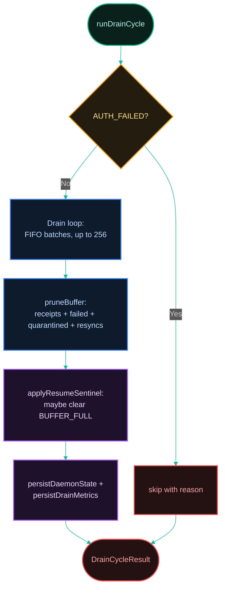
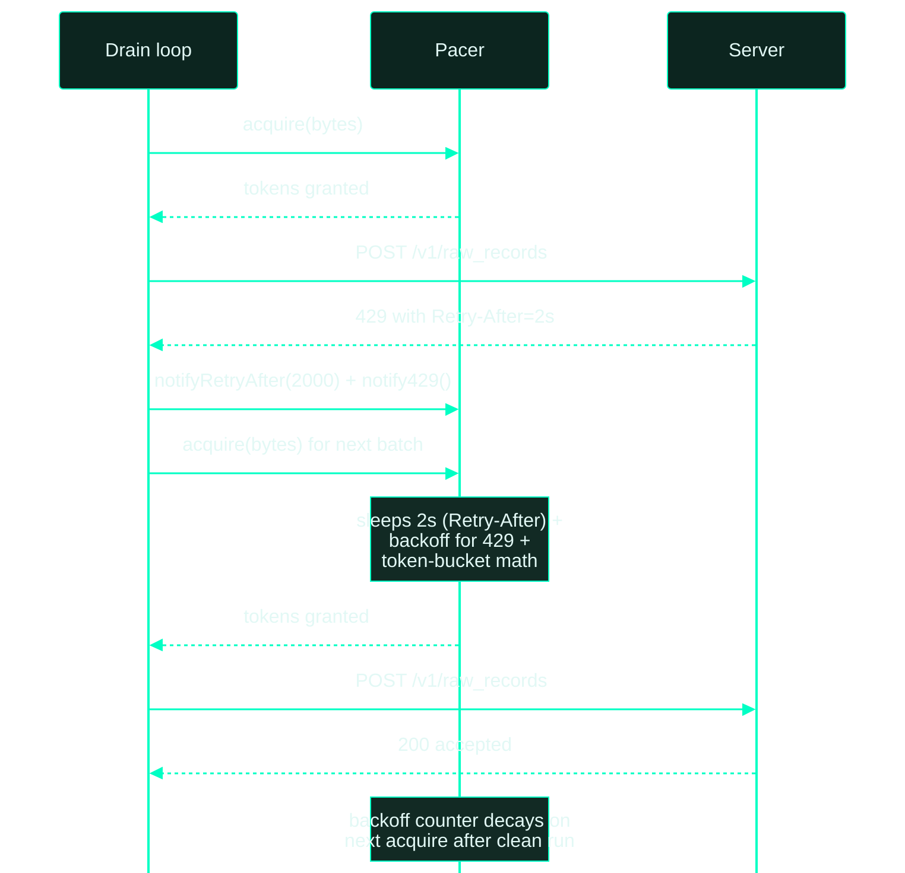

[← Previous: 4.1 Capture Cycle](./4.1-capture-cycle.md) · [Index](../../README.md) · [Next: 4.3 Heartbeat Cycle →](./4.3-heartbeat-cycle.md)

# 4.2 Drain Cycle

*Last Updated: 2026-06-16*

> The second daemon loop — pulls pending batches, ships them, prunes, releases pressure.

The drain cycle is the loop that ships pending [batches](../02-capture/2.3-batching-and-compression.md) from the [buffer](../03-buffer/3.1-buffer.md) to the [backend](../05-backend/5.1-backend-protocol.md), prunes old artifacts, and clears back-pressure once the queue catches up. It runs every 30 seconds (`DRAIN_INTERVAL_MS = 30_000`) in parallel with the [capture cycle](./4.1-capture-cycle.md) and [heartbeat cycle](./4.3-heartbeat-cycle.md) under the control of a supervisor (`superviseLoop`) in `runDaemonLoops`.

The body is `runDrainCycle` in `services/polling/drain-cycle.ts`; the inner shipping loop lives in `drainBuffer` (`services/uploader/drain-buffer.ts`).



Each cycle has a five-phase shape: gate, drain loop, prune, resume, persist. The gate checks `AUTH_FAILED` only — `BUFFER_FULL` does **not** gate drain because drain is precisely the loop that relieves buffer-full pressure.

The drain loop iterates pending batches in strict FIFO order (`ORDER BY created_at ASC, capture_id ASC`) via `nextPendingBatch` / `nextPendingBatchAfter`, up to `DEFAULT_MAX_BATCHES_PER_DRAIN = 256` per cycle. Each batch passes through the pacer before its upload, so the bytes-per-minute and batches-per-second budgets are honored even on a clean network.

## Database Schema and Table Operations

The Drain Cycle interacts heavily with `buffer.db` to extract compiled activity, log transmission progress, perform garbage collection, and save diagnostics snapshots:

### 1. Database Reads (Querying Queue & Configs)
* **`upload_batches`** (via `nextPendingBatch` / `nextPendingBatchAfter`):
  * Queries the oldest batch where `status = 'pending'`, ordered by `created_at ASC, capture_id ASC`.
* **`daemon_state`** (via `getDaemonState`):
  * Retrieves consecutive failures, previous errors, and state machine snapshots.
* **`buffer_metadata`** (via metadata readers):
  * Pulls diagnostic values and throttle boundaries before shipping payloads.

### 2. Database Writes (Acquitting & Bookkeeping)
* **`upload_batches`** (updates or deletes compiled batch rows):
  * **On delivery success**: The matching batch row is **deleted** under a transaction.
  * **On retriable errors** (e.g. 5xx, timeout): Increments `attempts` and overwrites `last_error`.
  * **On fatal errors** (e.g. ValidationError, 4xx): Flips `status` to `'failed'` and writes `last_error`.
* **`upload_receipts`** (inserts new receipts, primary key `capture_id`):
  * On delivery success, inserts a receipt row including: `source_app`, `source_path_hash`, `watermark_kind`, `watermark_start`, `watermark_end`, `watermark_table`, `delivered_at` (current ISO UTC), `idempotent_on_server` (boolean), `user_prompt` (redacted), `user_prompt_added_at`, `source_path`, `agent_schema_version`, `gateway_version`, `captured_at_utc`, `attempts`, `source_inode`, and `shipped_bytes`. This runs within the same ACID transaction that deletes the corresponding `upload_batches` row.
* **`resync_events`** (inserts an audit row on a `recovered` outcome):
  * On a server `watermark_regression` (HTTP 400), `recordResyncEvent` appends a row (`source_app`, `source_path_hash`, `watermark_kind`, `server_watermark_end`, `skipped_units`, `recovered_at`) alongside the `setCursorFromRegression` cursor rewind. This is the only place `resync_events` is written.
* **`daemon_state`** (updates `id = 1` row):
  * Persists details from the completed upload run: `last_drain_attempted`, `last_drain_accepted`, `last_drain_retriable`, `last_drain_fatal`, `last_drain_recovered`, `last_upload_error`, and `last_consecutive_retriable_break`.
* **`buffer_metadata`** (updates settings and cumulative tallies):
  * Increments long-running shipping counters (`drain_total_batches_shipped`, `drain_total_bytes_shipped`), source-specific tallies (`upload_batches_shipped_by_source.<source_app>`, `upload_bytes_shipped_by_source.<source_app>`), and updates `'last_prune_at'` upon garbage collection (the prune transaction also deletes aged `resync_events`).

## The four outcome kinds

Each upload produces one of four `UploadOutcome` kinds:

| outcome | trigger | buffer effect |
| --- | --- | --- |
| **`accepted`** | 200/201 with `{ idempotent }` payload | `markBatchDelivered` writes the receipt and deletes the batch in one transaction |
| **`recovered`** | 400 with a `watermark_regression` payload | `setCursorFromRegression` overwrites the cursor; `recordResyncEvent` appends a `resync_events` audit row; `deleteBatch` drops the row (the next capture re-reads the correct range) |
| **`fatal`** | `ValidationError`, `GatewayError`, `OversizedDecompressedSliceError`, or auth-confirmed-invalid | the batch is flipped to `status = failed` |
| **`retriable`** | `RateLimitError` (429), `RetriableError` (5xx or transient HTTP), `NetworkError` (DNS/connect/timeout), or `AuthError` with an inconclusive verify-key | the batch stays pending and `attempts` is incremented |

The four-way classification is the contract between the uploader and the buffer; everything else in the cycle keys off it.

## The consecutive-retriable break

Three consecutive retriable outcomes (`DRAIN_MAX_CONSECUTIVE_RETRIABLE = 3`) trip `consecutiveRetriableBreak = true` and stop the inner loop. The signal flows into `daemon_state.last_consecutive_retriable_break` for the next `status` render to surface, and into `DrainResult.lastRetriableRetryAfterMs` so the operator can see how long the server told the gateway to wait. An accepted, fatal, or recovered outcome resets the counter to zero.

## The pacer's three feedback signals

The pacer is two stacked token buckets (`DEFAULT_UPLOAD_MAX_BATCHES_PER_SEC = 5` batches/sec, `DEFAULT_UPLOAD_MAX_BYTES_PER_MINUTE = 50 MiB/min`) plus three independent backoff sources:

- **Explicit `Retry-After`** — the HTTP header on a `429` or `503` response that tells the client how long to wait before retrying. Set once, drained on next `acquire`.
- **Exponential 429 backoff** — `slotMs * (mult^steps - 1)`, capped at 30 s, multiplier defaults to 2.
- **Exponential 503 backoff** — `30 s * 2^(steps-1)`, capped at 5 min.

The three backoffs and the bucket waits stack deterministically: `Retry-After` first, then 429, then 5xx, then buckets. A clean outcome decays the 429 counter to zero on the next `acquire`; the 5xx counter decays similarly. Both counters cap at 16 steps so backoff can't grow unbounded.



## Post-drain bookkeeping

The post-drain phase runs three best-effort steps:

- `pruneBuffer` (`services/buffer/prune.ts`) deletes, in **one transaction**: receipts older than `DEFAULT_RECEIPT_RETENTION_DAYS = 365` days, failed batches older than `DEFAULT_FAILED_RETENTION_DAYS = 365` days, quarantined records sharing the failed cutoff, and `resync_events` older than the receipt cutoff — then updates `buffer_metadata.last_prune_at` (see [pressure and pruning](../03-buffer/3.2-buffer-pressure-and-pruning.md)).
- `applyResumeSentinel` checks `checkPendingPressure` and, if `shouldResume` is true and the `BUFFER_FULL` sentinel exists, clears it via `clearBufferFullSentinel`.
- `persistDaemonState` writes the drain summary row (preserving `lastSourceCaptures` from the capture-side write); `persistDrainMetrics` bumps the cumulative counters and per-source `upload_*_shipped_by_source.<app>` keys.

## Auth handling: the single special branch

When `uploadRawRecord` throws an `AuthError`, `handleAuthError` calls `verifyKey()` to disambiguate "key invalidated server-side" from a transient 401:

- If verify-key confirms invalid, `finalizeAuthFailure` writes the `AUTH_FAILED` sentinel and the batch is marked fatal — all subsequent capture and drain cycles skip via the sentinel gate until `setup new` clears it.
- If verify-key is inconclusive (transient error, network failure), the upload is treated as retriable with `reason: auth_unconfirmed`; the pacer is **not** notified, and the next drain cycle will retry.

`AUTH_FAILED` is the only sentinel the uploader writes.

## How often does it run?

`DRAIN_INTERVAL_MS = 30_000` (30 seconds), defined in `polling.constants.ts`. The interval is independent of capture; both loops run concurrently under `Promise.all` in `runDaemonLoops`. There is no minimum/maximum guard on the constant itself — the production daemon uses the default unless `DaemonLoopOptions.drainIntervalMs` is overridden (tests, the `dev` command).

## What gates does the cycle check?

The drain cycle is gated by the `AUTH_FAILED` sentinel:

1. `isAuthFailed` — checked by `pausedByAuth(ctx.authFailedSentinelPath)` in the outer `drainLoop`. If present, the loop pauses, sleeping for `Math.min(intervalMs, PAUSE_RECHECK_MS)` (5 seconds) and continuing without executing the drain cycle. If a cycle is somehow executed, `runDrainCycle` also performs a second-line check to return early with `reason: auth_failed`.

There is no `BUFFER_FULL` gate on drain — drain is precisely the loop that relieves buffer-full pressure, so it must keep running when the sentinel is set.

A skipped drain never increments `drain_cycles_total` and never touches `daemon_state` — the skip line in the log is the only artifact.

## How many batches can one cycle ship?

`DEFAULT_MAX_BATCHES_PER_DRAIN = 256` (`services/uploader/uploader.constants.ts`). `drainBuffer` pulls one batch at a time via `nextPendingBatch` / `nextPendingBatchAfter` (ordered by `created_at ASC, capture_id ASC`) and loops until either the cap is hit, the pending queue is empty, or the consecutive-retriable break trips.

The cursor is advanced after every attempt regardless of outcome, so a retriable batch is not re-attempted within the same cycle — the next drain (30 seconds later) will reset the cursor to `null` and pick it up again at the head.

## How is the per-batch outcome classified?

`uploadBatch` (`upload-batch.ts`) wraps the HTTP call and turns the result into one of four `UploadOutcome.kind` values via this decision tree:

```mermaid
%%{init:{"flowchart":{"useMaxWidth":false,"htmlLabels":true,"curve":"basis","nodeSpacing":60,"rankSpacing":80,"padding":20},"theme":"base","themeVariables":{"background":"#081612","primaryColor":"#081612","primaryTextColor":"#e2f8f5","primaryBorderColor":"#00ffc4","lineColor":"#00ffc4","secondaryColor":"#122a24","tertiaryColor":"#0d1f1a","fontSize":"14px"}}}%%
flowchart TD
  call([uploadRawRecord call])
  success{success?}
  accepted[markBatchDelivered<br/>kind = accepted]
  classify{error type?}

  call --> success
  success -->|2xx| accepted
  success -->|error| classify

  subgraph RecoveredBranch ["Recovered Path"]
    recovered[setCursorFromRegression<br/>recordResyncEvent<br/>deleteBatch<br/>kind = recovered]
  end

  subgraph RetriableBranch ["Retriable Paths"]
    rl[recordRetriableFailure<br/>kind = retriable<br/>reason = rate_limit]
    auth{verifyKey result?}
    retry[recordRetriableFailure<br/>kind = retriable<br/>reason = auth_unconfirmed]
    ret5[recordRetriableFailure<br/>kind = retriable<br/>reason = service_unavailable]
    net[recordRetriableFailure<br/>kind = retriable<br/>reason = network]
  end

  subgraph FatalBranch ["Fatal Paths"]
    af[markBatchFailed<br/>writeAuthFailedSentinel<br/>kind = fatal]
    fatal[markBatchFailed<br/>kind = fatal]
    unk[markBatchFailed<br/>kind = fatal]
  end

  classify -->|WatermarkRegression| recovered
  classify -->|RateLimitError| rl
  classify -->|AuthError| auth
  classify -->|RetriableError 5xx| ret5
  classify -->|NetworkError| net
  classify -->|Validation/Gateway/Oversized| fatal
  classify -->|anything else| unk

  auth -->|definitive invalid| af
  auth -->|success or threw| retry

  classDef startNode fill:#0a201b,stroke:#10b981,stroke-width:2px,color:#b3f5e6;
  classDef stopNode fill:#241212,stroke:#ef4444,stroke-width:2px,color:#fca5a5;
  classDef decNode fill:#241c0e,stroke:#f59e0b,stroke-width:2px,color:#fde68a;
  classDef processNode fill:#0d1b2d,stroke:#3b82f6,stroke-width:2px,color:#bfdbfe;
  classDef actionNode fill:#1e112c,stroke:#a855f7,stroke-width:2px,color:#e9d5ff;
  classDef default fill:#0a201b,stroke:#14b8a6,stroke-width:2px,color:#ccfbf1;

  class call startNode;
  class success decNode;
  class classify decNode;
  class auth decNode;
  class accepted actionNode;
  class recovered actionNode;
  class rl processNode;
  class retry processNode;
  class ret5 processNode;
  class net processNode;
  class af stopNode;
  class fatal stopNode;
  class unk stopNode;
```

Plain-English summary by outcome:

- **accepted** — 200/201 with `{ idempotent }` payload. `markBatchDelivered` writes the receipt and deletes the batch in one transaction. The pacer is not notified.
- **fatal** — `ValidationError` (400 not watermark-regression, 408, 413), `GatewayError`, `OversizedDecompressedSliceError`, or auth-confirmed-invalid. `markBatchFailed` flips the row to `status = failed` and records the message in `last_error`.
- **recovered** — server returned 400 with a `watermark_regression` payload. `setCursorFromRegression` overwrites the cursor with the server's current watermark end, `recordResyncEvent` (`services/buffer/resync.ts`) appends an audit row to the `resync_events` table (`source_app`, `source_path_hash`, `watermark_kind`, `server_watermark_end`, `skipped_units = server_end - batch.watermark_end`, `recovered_at`), and `deleteBatch` drops the now-irrelevant row. The next capture cycle will re-read the right range from disk.
- **retriable** — `RateLimitError`, `RetriableError`, `NetworkError`, or `AuthError` with inconclusive verify-key. `recordRetriableFailure` increments `attempts` and writes `last_error` without changing status. The pacer is notified with `notifyRetryAfter`, `notify429`, or `notifyServiceUnavailable` depending on `outcome.reason`.

## How does the auth-failure branch work in detail?

When `uploadRawRecord` throws an `AuthError`, `handleAuthError` calls `ctx.http.verifyKey()` to disambiguate "key invalidated server-side" from "transient 401 because the server hiccuped":

- `verifyKey()` returns `{ success: true }` → treat the upload as `retriable` with `reason: auth_unconfirmed`. The pacer is **not** notified (no 429/5xx counter touched, no retry-after set). The drain cycle moves on; the next cycle will retry the same batch.
- `verifyKey()` returns `{ success: false }` → `finalizeAuthFailure` writes the `AUTH_FAILED` sentinel with the reason text and marks the batch as `fatal`. All subsequent capture and drain cycles skip via the sentinel gate until the operator runs `setup` again.
- `verifyKey()` throws another `AuthError` → also `finalizeAuthFailure` (treated identically to a definitive `success: false`).
- `verifyKey()` throws a non-auth error (e.g. a network error) → treat as `retriable` with `reason: auth_unconfirmed`. The original auth error is logged as `upload.auth_unconfirmed` and the verify-key error's HTTP context is attached if it was a `GatewayError`.

`AUTH_FAILED` is the only sentinel the uploader writes. It's written best-effort: a failed sentinel write logs `event: auth.sentinel_write_failed` but doesn't prevent the batch from being marked fatal.

## How is pacing enforced?

`createPacer` (`services/uploader/pacer.ts`) builds two token buckets:

- A rate bucket at `uploadMaxBatchesPerSec` tokens/second (default `DEFAULT_UPLOAD_MAX_BATCHES_PER_SEC = 5` batches/sec), window = 1 s.
- A bytes bucket at `uploadMaxBytesPerMinute` tokens/minute (default `DEFAULT_UPLOAD_MAX_BYTES_PER_MINUTE = 50 * 1024 * 1024` = 50 MiB/min), window = 60 s.

Before every upload the cycle calls `pacer.acquire(batch.body.byteLength)`, which sleeps until both buckets allow the request. The bytes bucket caps `needBytes` at the bucket capacity (so a single 1.8 MiB batch can't permanently stall the bucket; it's debited up to the bucket's total capacity).

On top of bucket pacing there are three backoff sources, all stackable:

- `notifyRetryAfter(ms)` — explicit `Retry-After` header. Sets `retryAfterUntil = now + ms`; next `acquire` sleeps until then.
- `notify429()` — exponential backoff on rate-limit. `backoffSteps` is bumped (max 16), and the next `acquire` sleeps `slotMs * (backoffMultiplier^backoffSteps - 1)` capped at `MAX_BACKOFF_MS = 30_000` (30 s). `backoffMultiplier` defaults to `DEFAULT_UPLOAD_BACKOFF_ON_429_MULTIPLIER = 2`. `slotMs = 1000 / rateBucket.capacity`.
- `notifyServiceUnavailable(retryAfterMs?)` — generic 5xx backoff. `serviceUnavailableSteps` is bumped (max 16); the next `acquire` sleeps `min(SERVICE_UNAVAILABLE_INITIAL_DELAY_MS * 2^(steps-1), SERVICE_UNAVAILABLE_MAX_DELAY_MS)` where the constants are 30 s and 300 s (5 min), with the optional `retryAfterMs` acting as a floor (the actual sleep is `max(computed, retryAfterMs)`).

A clean accepted/fatal/recovered outcome resets the 429 counter (next acquire sees `pendingNotify429 = false` so `backoffSteps = 0`) but does **not** reset the service-unavailable counter unless the next acquire happens without a pending 5xx — i.e. `serviceUnavailableSteps` decays on the first clean acquire after the burst.

## How does the pacer's acquire path work step-by-step?

```
acquire(payloadBytes):
  // Decay or bump 429 counter:
  if pendingNotify429:    backoffSteps = min(backoffSteps+1, 16); pendingNotify429 = false
  else:                   backoffSteps = 0

  // Decay or bump 5xx counter:
  if pendingServiceUnavailable:
      serviceUnavailableSteps = min(serviceUnavailableSteps+1, 16)
      floor = pendingServiceUnavailableFloorMs
      pendingServiceUnavailable = false
      pendingServiceUnavailableFloorMs = 0
  else:
      serviceUnavailableSteps = 0
      pendingServiceUnavailableFloorMs = 0

  // (1) Honor explicit Retry-After:
  if retryAfterUntil > now:  await sleep(retryAfterUntil - now)
  retryAfterUntil = 0

  // (2) 429 exponential backoff:
  if backoffSteps > 0:
      slotMs = 1000 / rateBucket.capacity
      wait = min(MAX_BACKOFF_MS, ceil(slotMs * (multiplier^backoffSteps - 1)))
      if wait > 0: await sleep(wait)

  // (3) 5xx exponential backoff:
  if serviceUnavailableSteps > 0:
      computed = SERVICE_UNAVAILABLE_INITIAL_DELAY_MS * 2^(steps-1)
      wait = max(min(SERVICE_UNAVAILABLE_MAX_DELAY_MS, computed), floor)
      if wait > 0: await sleep(wait)

  // (4) Token-bucket loop, debit when both buckets allow:
  loop:
      now ← now()
      needBytes = min(payloadBytes, bytesBucket.capacity)
      waitRate  = timeUntil(rateBucket, 1, now)
      waitBytes = needBytes > 0 ? timeUntil(bytesBucket, needBytes, now) : 0
      wait = max(waitRate, waitBytes)
      if wait <= 0:
          debit(rateBucket, 1, now)
          if needBytes > 0: debit(bytesBucket, needBytes, now)
          return
      await sleep(wait)
```

## How are 429 and 5xx backoffs different?

| Aspect | 429 (`notify429`) | 5xx (`notifyServiceUnavailable`) |
|---|---|---|
| Base delay | `slotMs * (mult^steps - 1)` | `30_000 * 2^(steps-1)` |
| Cap | `MAX_BACKOFF_MS = 30_000` (30 s) | `SERVICE_UNAVAILABLE_MAX_DELAY_MS = 300_000` (5 min) |
| Retry-After role | Independent (set via `notifyRetryAfter`) | Acts as a floor on the same wait |
| Reset condition | First acquire with no pending 429 | First acquire with no pending 5xx |
| Counter shared with 429? | No | No |
| Step cap | 16 | 16 |

Both back-offs and the explicit `Retry-After` sleep can stack in a single `acquire` call: if a 429 is followed by a 5xx, the next call sleeps the explicit `Retry-After` (if set), then the 429 wait, then the 5xx wait, then the bucket wait. The order is deterministic — `Retry-After` first, then 429, then 5xx, then buckets.

The drain result's `lastRetriableRetryAfterMs` is set to whatever the last retriable outcome carried (the `Retry-After` header value if present), and `lastUploadError` records the most recent error message.

## How is the DTO shape built?

`buildRawRecordDTO(batch, hostId)` constructs the JSON body:

```
{
  capture_id: …,
  host_id: …,
  source_app: 'claude-code' | 'cursor' | 'codex' | 'claude-desktop',
  source_kind: 'jsonl_append' | 'sqlite_kv_snapshot' | 'sqlite_table_snapshot',
  source_path: …,
  source_path_hash: …,
  source_inode: number | null,
  watermark: byte_range | rowid_range,
  agent_schema_version: …,
  gateway_version: …,
  captured_at_utc: …,
  body_format: 'jsonl' | 'kv_pairs_json' | 'sqlite_rows_json',
  body_compression: 'zstd',
  body: base64-encoded zstd-compressed body
}
```

The compressed body is base64-encoded (binary-to-text encoding that turns the zstd-compressed body into a JSON-safe string at a 4-to-3 size inflation) into the JSON payload because the ingestion endpoint expects `application/json`, not a multipart upload. That adds 33% overhead on the wire compared to a binary upload; the trade is JSON's simpler error-handling story.

## What runs after the upload loop?

Three post-loop steps, all best-effort:

1. **Prune** (`pruneBuffer`) — receipts and failed batches past their retention windows (`365` days each by default), quarantined records past the failed cutoff, and `resync_events` past the receipt cutoff, all in one transaction; the transaction also stamps `last_prune_at`. Logged as `event: buffer.prune` with per-table deletion counts (`receipts_deleted`, `failed_batches_deleted`, `quarantined_deleted`, `resync_events_deleted`). Failure logs `event: buffer.prune_failed` and continues.
2. **Resume sentinel** (`applyResumeSentinel`) — `checkPendingPressure`; if `shouldResume` and the `BUFFER_FULL` sentinel exists, `clearBufferFullSentinel` removes it and logs `event: buffer.soft_resume`.
3. **Persist metrics + daemon state** — `setDaemonState` writes the drain summary row (preserving `lastSourceCaptures` from the existing row), `persistDrainMetrics` updates the cumulative counters (`drain_cycles_total`, `drain_total_batches_shipped`, `drain_total_bytes_shipped`, the legacy `upload_*` counters, and per-source `upload_batches_shipped_by_source.<app>` / `upload_bytes_shipped_by_source.<app>`).

The final `DrainCycleResult` returns the started/completed timestamps, duration, the full `DrainResult` from `drainBuffer`, the prune outcome, and the pressure result.

## What does `DrainResult` contain?

```
{
  attempted: number,                          // total batches the loop processed
  accepted: number,                           // successful uploads
  acceptedBytes: number,                      // SUM(body.byteLength) of accepted
  acceptedBySource: { [app]: { batches, bytes }},
  retriable: number,
  fatal: number,
  recovered: number,
  lastRetriableRetryAfterMs: number | null,
  consecutiveRetriableBreak: boolean,
  lastUploadError: string | null
}
```

The presence of `acceptedBySource` per-source breakdown means the drain metrics writer can update `upload_batches_shipped_by_source.claude-code` etc. without re-reading the buffer. `lastRetriableRetryAfterMs` is what `status` shows as "next retry after Xs" when the cycle ended retriably.

## What happens if a drain throws?

`runDrainCycle` does not wrap `drainBuffer` in try/catch; an uncaught throw bubbles to `drainLoop` in `daemon-loops.ts`, which catches and logs `event: drain.cycle.error` then sleeps and retries on the next interval. Pre-existing pending batches stay pending; the next drain re-reads them from the head of the queue. The cycle's post-loop bookkeeping (prune, resume, metrics, daemon state) is **skipped** when the loop throws.

A throw inside `pruneBuffer` is caught by `runDrainCycle`'s own try/catch around the prune block (logs `event: buffer.prune_failed`) and the cycle continues with the resume check and metrics persistence.

### Cycle Timeouts

Each iteration of the drain loop is wrapped in `runWithTimeout` in `drainLoop` with a **25-second timeout** (`25_000` ms). If the cycle takes longer than 25 seconds, it is aborted, logs a `drain.cycle.timeout` error, and returns `null`. Just like with a thrown exception, any timed-out cycle skips the post-loop bookkeeping (prune, resume sentinel, and metrics/daemon state updates) for that iteration, and will retry on the next interval.

### Supervised Loop and Fault Tolerance

The entire `drainLoop` is supervised by `superviseLoop` in `runDaemonLoops`. If the loop itself crashes (e.g. due to an unhandled internal exception outside the try-catch block):
- The supervisor catches the error, logs a `drain.loop.crashed` error, and restarts the loop after 1 second.
- If it crashes 3 times consecutively within a 10-second window, it escalates to a fatal error and shuts down the entire gateway process (`process.exit(1)`).
- If it runs successfully for more than 10 seconds, the consecutive crash counter is reset.

[← Previous: 4.1 Capture Cycle](./4.1-capture-cycle.md) · [Index](../../README.md) · [Next: 4.3 Heartbeat Cycle →](./4.3-heartbeat-cycle.md)
