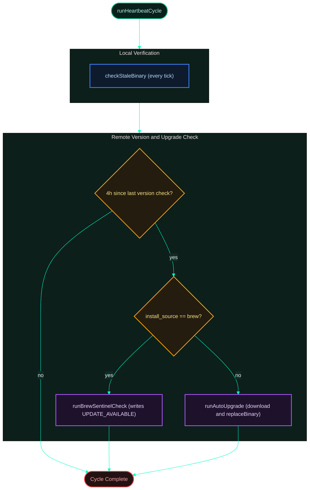
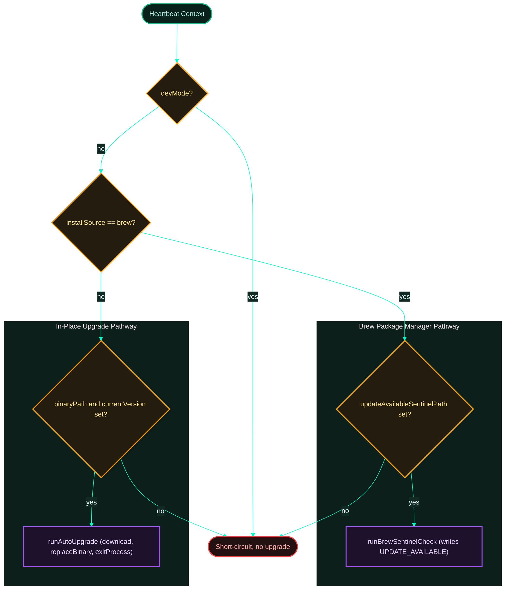
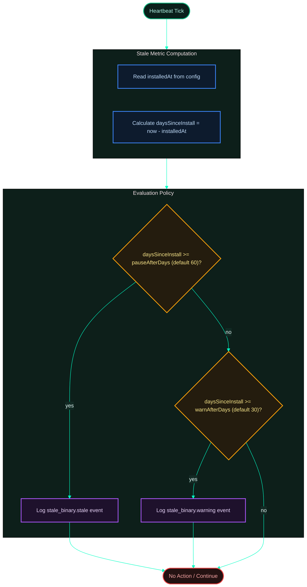

[← Previous: 4.2 Drain Cycle](./4.2-drain-cycle.md) · [Index](../../README.md) · [Next: 4.4 Sentinels →](./4.4-sentinels.md)

# 4.3 Heartbeat Cycle

*Last Updated: 2026-05-27*

> The third daemon loop — checks for newer releases, runs the stale-binary policy, updates known-version metadata.

The heartbeat cycle is the lowest-frequency loop in the daemon and the only one that touches the network outside the [drain cycle](./4.2-drain-cycle.md). It runs every hour (`HEARTBEAT_INTERVAL_MS = 60 * 60_000`) in parallel with [capture](./4.1-capture-cycle.md) and drain under `Promise.all` in `runDaemonLoops`.

Its job is twofold: keep the local notion of "is this binary stale?" up to date, and surface (or in-place install) new releases so the daemon doesn't drift months behind without operator visibility.

## No sentinel gate

The cycle has no sentinel gate. `AUTH_FAILED` does **not** gate heartbeat because version checks and stale-binary detection must keep running even when shipping is halted; the daemon needs to be able to detect a new release that fixes whatever caused the auth failure. `BUFFER_FULL` does not gate it either, because heartbeat does not write to the buffer in a way that grows pending bytes.

## Two independent checks

**Stale-binary detection** is a local-only timestamp subtraction against `installedAt` from the account config, with two thresholds: `DEFAULT_STALE_WARN_DAYS = 30` and `DEFAULT_STALE_PAUSE_DAYS = 60`. At 30 days the cycle logs `event: stale_binary.warning`; at 60 days it logs `event: stale_binary.stale`. Neither threshold writes a sentinel or halts the daemon — the same heartbeat tick's auto-upgrade path is the recovery mechanism. Both thresholds are zero-disableable in `[stale_binary]` of `config.toml`. The stale check is **not** gated by the 4-hour version-check interval — it runs every heartbeat tick because the operator might have already done the upgrade between two hourly checks, and firing more often surfaces the cleared state faster.

**Version check + auto-upgrade** is gated independently. The cycle only hits the GitHub releases API when `now - last_version_check_at >= 4h`, so the loop fires hourly but most ticks are no-ops with respect to network traffic. When the gate opens, `checkLatestVersion` does a 5-second-timeout HTTPS call to `api.github.com`, parses `tag_name` (stripping any leading `v`), and looks for an asset named `proxai-gateway-<platform>-<arch>[.exe]`. The result is `kind: 'ok'` with `hasUpdate`, `kind: 'no_release'` (404), or `kind: 'error'` (any other failure). All three outcomes are logged distinctly; only the first one triggers any further action.

## Auto-upgrade branches by install source

Whether the cycle attempts an auto-upgrade depends on the install source. On `brew`, the gateway writes the `UPDATE_AVAILABLE` sentinel and lets the operator run `brew upgrade` manually — the gateway never overwrites a brew-managed binary because brew owns the install path. On everything else (`bun`, `pnpm`, `yarn`, `npm`, `github_release`), `runAutoUpgrade` downloads the matched asset, calls `replaceBinary` (in-place on POSIX, `.new` sibling on Windows), and on success calls `exitProcess` so the service manager re-launches the daemon under the new binary. `devMode === true` short-circuits both branches.

## Watermark sync is not heartbeat's job

The cycle is **not** responsible for server watermark sync. `syncServerWatermarks` runs at daemon startup when `countCursors(buffer) === 0` (fresh buffer first-run, e.g. after `uninstall --reset`) — never inside the heartbeat.

That asymmetry is intentional: the heartbeat is meant to be cheap and frequent; watermark sync is rare and tied to specific lifecycle events. The full sentinel mechanism that gates this and the other two cycles is documented in [sentinels](./4.4-sentinels.md).

## How often does it run?

`HEARTBEAT_INTERVAL_MS = 60 * 60_000` (1 hour), defined in `polling.constants.ts`. Heartbeat runs concurrently with capture and drain via `Promise.all`. The constant has no enforced min/max guard.

The actual GitHub release call is gated independently: the cycle only hits the API when `now - lastVersionCheckAt >= DEFAULT_VERSION_CHECK_INTERVAL_MS = 4 * 60 * 60 * 1000` (4 h). So the loop fires every hour but most ticks are no-ops with respect to network traffic. The 4-hour gate is enforced inside `maybeRunAutoUpgrade` by comparing `Date.now()` against the parsed `last_version_check_at` metadata key.

The stale-binary check is **not** gated by that 4-hour interval — it runs every heartbeat tick. That's intentional: stale-binary detection is local-only (a timestamp subtraction) and the operator might have already done the upgrade between two hourly checks; firing more often surfaces the cleared state faster.

## What does the GitHub release check do?

`checkLatestVersion` (`services/polling/version-check.ts`) fetches `https://api.github.com/repos/proxai/proxai_gateway/releases/latest` with a 5-second timeout (via an `AbortController` — the Web platform's standard cancellation primitive; the gateway uses one per loop iteration to interrupt sleeps and HTTP requests on shutdown — plus `setTimeout`). Headers include `Accept: application/vnd.github+json` and `User-Agent: proxai-gateway-version-check`. It returns one of three outcomes:

- `kind: 'ok'` with `{ latestVersion, hasUpdate, checkedAt, assetUrl? }`. `assetUrl` is set only if the release has an asset named `proxai-gateway-${platform}-${arch}[.exe]`. `latestVersion` strips a leading `v` from `tag_name`.
- `kind: 'no_release'` when the API returns 404 (no published releases for the repo). The heartbeat logs `event: version_check.no_release` and continues; no sentinel is written.
- `kind: 'error'` for any other failure (network, non-2xx, malformed JSON, missing `tag_name` or `assets`). Logs `event: version_check.unavailable` and retries on the next eligible tick.

Version comparison is component-wise: each version is split on `.`, optional pre-release suffix (`-foo`) stripped, components parsed as integers, then compared left-to-right. CalVer — Calendar Versioning: the version IS the date (e.g., `2026.5.8`), not a semver triple — sorts correctly because the year/month/day components are integers.

## How does the cycle decide whether to auto-upgrade?

`shouldRunAutoUpgrade(ctx)` returns true under two paths:

- `installSource === 'brew'` → use the sentinel path if `updateAvailableSentinelPath` is set. Brew installs are managed by the package manager, so the daemon writes the `UPDATE_AVAILABLE` sentinel and lets the operator run `brew upgrade` manually. Sentinel content: `{ latest_version, current_version, detected_at, asset_url? }`. If no update is available, `clearUpdateAvailableSentinel` removes any stale sentinel.
- Any other install source where `binaryPath` and `currentVersion` are both defined → use the in-place replace path. `runAutoUpgrade` downloads the matched asset, calls `replaceBinary`, and (on success) calls `exitProcess()` so the service manager restarts the daemon under the new binary.

`devMode === true` and `installSource === 'brew'` short-circuit `runAutoUpgrade` early — dev runs never auto-upgrade themselves, and brew installs handle the sentinel branch above.

## When does the cycle update `latest_known_version`?

- **Brew sentinel branch** — `runBrewSentinelCheck` writes `METADATA_KEYS.latestKnownVersion` directly via `setMetadata` whenever the GitHub call returns `kind: 'ok'`, regardless of `hasUpdate`.
- **In-place upgrade branch** — `runAutoUpgrade` is passed `onLatestVersionKnown: (v) => setMetadata(buffer, latestKnownVersion, v)` and invokes it after a successful GitHub call.

Both paths update `latest_version_check_at` via `setMetadata(buffer, METADATA_KEYS.lastVersionCheckAt, nowIsoUtc())` only when the 4-hour gate let the version check run. A heartbeat tick that hits the gate and returns early without calling GitHub leaves both keys untouched.

## What is the stale-binary policy?

Before the version check, `checkStaleBinary` runs against `installedAt` from the account config:

- `DEFAULT_STALE_WARN_DAYS = 30` (`config.constants.ts`) — when `daysSinceInstall >= 30`, log `event: stale_binary.warning`.
- `DEFAULT_STALE_PAUSE_DAYS = 60` — when `daysSinceInstall >= 60`, log `event: stale_binary.stale`. The daemon keeps running; the same heartbeat tick's auto-upgrade path downloads the new binary and respawns the daemon on it.

Both defaults are overridable in `config.toml` under `[stale_binary]`. A zero value disables that threshold (`pauseAfterDays = 0` means never log stale; `warnAfterDays = 0` means never warn).

If `installedAt` is unparseable (invalid ISO-8601 string, or missing), `checkStaleBinary` logs `event: stale_binary.installed_at_invalid` and returns `status: 'fresh'` — i.e. the policy fails open rather than risking a spurious pause.

Both the `setup`-written config values and the `status` fallback path (when no config is loaded) resolve `warnAfterDays` / `pauseAfterDays` from the same `DEFAULT_STALE_WARN_DAYS` and `DEFAULT_STALE_PAUSE_DAYS` constants, so the README sample of `warn >= 30 d, pause >= 60 d` matches the rendered output everywhere.

## Does heartbeat sync server watermarks?

No. Server watermark sync is **not** a heartbeat subtask. It runs once at daemon start in `cli/commands/run/index.ts`, and only when `countCursors(buffer) === 0` — i.e. fresh-buffer first-run. The heartbeat cycle never reaches `syncServerWatermarks`.

The startup sync seeds cursor rows keyed `(sourceApp, sourcePathHash, inode=0, watermarkTable)` from `GET /v1/watermarks`. Once any real local poll runs, `getCursorWithFallback` finds those inode=0 rows for new local files and the sync's value is preserved. A failed startup sync logs `event: watermark_sync.failed` and lets capture proceed from zero.

## What happens when auto-upgrade replaces the binary mid-run?

The non-brew path is in-place: `replaceBinary(deps.binaryPath, bytes, platform)` writes the new binary atomically over the current executable, then `runAutoUpgrade` calls `deps.exitProcess?.()`. On macOS and Linux that exits the daemon with code 0; launchd / systemd see the exit and respawn the service, which re-loads the new binary. On Windows `replaceBinary` writes the new file alongside (it cannot overwrite a running `.exe`) and the operator must `restart` for it to take effect.

Capture state is preserved across the restart because everything lives in `buffer.db` — pending batches, cursors, receipts, daemon_state are all on disk. The freshly-started daemon's startup sync of server watermarks does not re-run because `countCursors(buffer)` is non-zero.

## What if the GitHub release check fails repeatedly?

`maybeRunAutoUpgrade` catches any throw from `checkLatestVersion` and downstream and logs `event: version_check.failed` with the error; the next heartbeat tick will retry on its normal interval (gated by the 4-hour `lastVersionCheckAt` rate-limit). `version_check.unavailable` is the recurring log line to grep for. The stale-binary policy is independent and keeps running, so a binary will still warn and eventually pause even if GitHub is unreachable.

Three failure subclasses logged separately:

- Timeout / DNS / connection refused → `reason: 'request failed: <message>'` at WARN level (`version_check.unavailable`).
- HTTP 404 → `kind: 'no_release'`, logged at DEBUG only (`version_check.no_release`). This is the "repo has no public releases yet" path; the daemon does not consider it an error.
- HTTP non-2xx (including 429 from GitHub's rate limiter) → `reason: 'github returned <status>'` at WARN level (`version_check.unavailable`).

## What does the cycle cost?

A heartbeat tick that hits the 4-hour gate does about three things: a paused-sentinel `stat`, a stale-binary date arithmetic, a metadata read for `last_version_check_at`. Total wall time is sub-millisecond. A heartbeat that passes the gate makes a single 5-second-timeout HTTPS call to api.github.com; on `kind: 'ok'` it also does the `setMetadata` writes and (in non-brew mode) potentially a full upgrade download.

The auto-upgrade download itself can be tens of megabytes. The cycle is not capped on time — a slow download holds the heartbeat loop until completion. That's acceptable because heartbeat does not block capture or drain (they run on separate awaits inside `Promise.all`).

## What happens at startup vs steady state?

- **Fresh buffer, first start.** `countCursors == 0` triggers a startup `syncServerWatermarks` call. The first heartbeat tick (1 h after start) is also the first version check. `last_version_check_at` is not set, so the 4-hour gate is open. GitHub is queried; metadata is written.
- **Restarted daemon after auto-upgrade.** `last_version_check_at` was written before the previous exit. The first heartbeat tick sees `now - lastCheck < 4h` and returns early without querying GitHub. The next version check is 4 hours after the previous one, not 4 hours after the new daemon start.
- **Long-uptime daemon.** Heartbeat fires hourly; every 4th tick or later actually queries GitHub. The stale-binary clock runs on `installedAt` (set at install time, not at restart) so a daemon restarted at install-day-29 still hits the 30-day warn threshold the next day.

[← Previous: 4.2 Drain Cycle](./4.2-drain-cycle.md) · [Index](../../README.md) · [Next: 4.4 Sentinels →](./4.4-sentinels.md)
