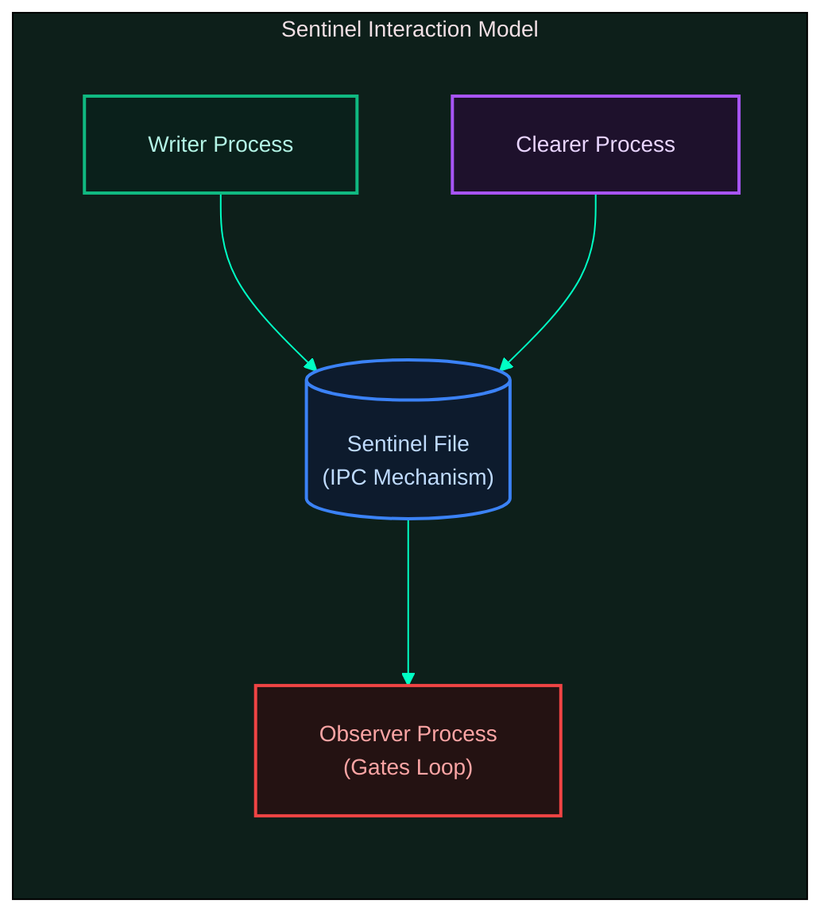
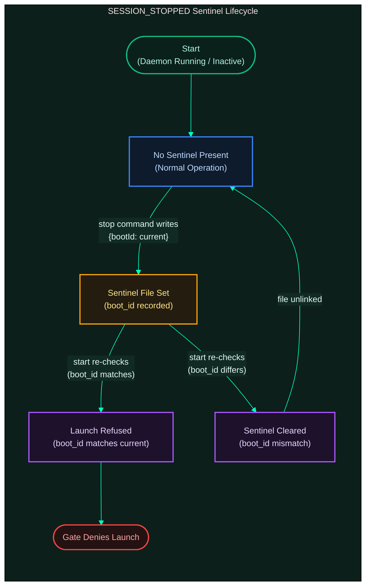

[← Previous: 4.3 Heartbeat Cycle](./4.3-heartbeat-cycle.md) · [Index](../../README.md) · [Next: 5.1 Backend Protocol →](../05-backend/5.1-backend-protocol.md)

# 4.4 Sentinels

*Last Updated: 2026-05-27*

> Filesystem flags that gate cycles and surface state to humans, without any shared in-memory coordination.

Sentinels are the gateway's IPC mechanism. They are tiny files under `configDir()` (`~/.proxai/proxai-gateway/` on POSIX, `%LOCALAPPDATA%\proxai\proxai-gateway\` on Windows) whose mere presence gates a daemon loop and whose body carries a small JSON payload for surfacing context to humans.

The daemon and the CLI commands (`setup`, `stop`, `start`, `uninstall`) run in different processes, so they cannot share in-memory flags. Sentinel files are the lowest-overhead way to coordinate between them without a database round-trip and without a watch-based notification mechanism.

## The five sentinels

Five sentinels exist. The first two are the operationally important ones; the others are observability and lifecycle markers.

| sentinel | role |
| --- | --- |
| **`AUTH_FAILED`** | uploader detected a verified key rejection; halts capture and drain |
| **`BUFFER_FULL`** | [capture cycle](./4.1-capture-cycle.md) detected pending bytes over the soft-pause threshold; halts capture only |
| **`SESSION_STOPPED`** | `stop` command recorded the current `boot_id`; gates the next `start` in the same boot |
| **`CONSENT_ACCEPTED`** | first-time `setup` completed successfully; informational, never gates |
| **`UPDATE_AVAILABLE`** | brew-installed daemons surface a newer release for the operator to apply; informational |

## How the implementation works

The mechanism is implemented by `sentinelHandle(path)` in `core/io/fs/sentinel.ts`. Each sentinel exposes four operations:

- `exists()` — `stat`-equivalent presence check.
- `read()` — returns body or `''`.
- `write(body)` — writes atomically via `writeAtomic` and chmods to `0o600`.
- `remove()` — `unlink`, ignores ENOENT.

`writeAtomic` writes to a temp file in the same directory and renames into place, so a `kill -9` mid-write leaves either the previous body or the new body, never a torn one. Every cycle calls the matching `is*` helper at the top of its run before any work — a handful of existence checks per tick, single-digit microseconds on a healthy host.

## Writer / observer / clearer convention



There is a **writer / observer / clearer** convention that holds for every sentinel: one component writes it, one (or more) check it as a gate, one clears it.

- `AUTH_FAILED` is written by the [drain cycle](./4.2-drain-cycle.md)'s `handleAuthError`, observed by the capture and drain gate, cleared by `setup --force`.
- `BUFFER_FULL` is written by the capture cycle's post-pressure check, observed by the capture gate, cleared by the drain cycle's post-drain pressure check.
- `SESSION_STOPPED` is written by the `stop` command, observed only by the next `start`, and self-clears when the boot id changes (i.e. on the next reboot). Any explicit start path — `start`, `restart`, `setup`, an auto-upgrade respawn — also clears it.

The asymmetry "capture writes BUFFER_FULL, drain clears it" is the same self-healing pattern as "uploader writes AUTH_FAILED, only setup clears it": the actor that can fix the situation is the one with permission to remove the sentinel.

## Body payloads

Bodies carry a small JSON payload that drives status rendering:

- `BUFFER_FULL` carries `{ pending_bytes, threshold, set_at }`.
- `AUTH_FAILED` carries `{ reason, detected_at }`.
- `SESSION_STOPPED` carries `{ boot_id, set_at }`.
- `UPDATE_AVAILABLE` carries `{ latest_version, current_version, detected_at, asset_url? }`.
- `CONSENT_ACCEPTED` carries an ISO-8601 timestamp.

Malformed bodies degrade gracefully — readers return null or default and the gate fires on existence alone, so a corrupted JSON body never prevents the cycle from being gated correctly.

## Why SESSION_STOPPED is different

The `SESSION_STOPPED` sentinel deserves a closer look because it is the only sentinel whose read is self-clearing. It is written by the `stop` command with the **current** boot id, and the next-start gate compares the stored boot id against the live boot id via `isCurrentSessionStopped(path, currentBootId)`. If they match, the gate fires and `start` refuses to launch. If they differ — the host has rebooted since the daemon was stopped — the sentinel is silently cleared and `start` proceeds.



The boot id source is `/proc/sys/kernel/random/boot_id` on Linux, `sysctl kern.boottime` (sha256'd) on macOS, and `LastBootUpTime` (sha256'd) on Windows. The goal is that the application is always running: rebooting, running `start`, re-running `setup`, or an auto-upgrade respawn all clear `SESSION_STOPPED`. `stop` is primarily a developer escape hatch for debugging.

## Sentinel lifecycle reference

| sentinel | writer | observer (gate) | clearer |
| --- | --- | --- | --- |
| `AUTH_FAILED` | uploader's `handleAuthError` | `runCaptureCycle` (1st check); `runDrainCycle` (only check); heartbeat not gated | `setup --force` after verify-key succeeds |
| `BUFFER_FULL` | `runCaptureCycle` post-pressure | `runCaptureCycle` (2nd check); drain & heartbeat not gated | `runDrainCycle` if shouldResume && sentinel present |
| `SESSION_STOPPED` | `stop` command | `run/index.ts` pre-start via `isCurrentSessionStopped(bootId)`; status surfacing | a fresh boot (boot_id mismatch self-clears), or `start` / `setup` / auto-upgrade respawn |
| `CONSENT_ACCEPTED` | `runSetup` first-time | never gates a cycle (informational only) | `uninstall --reset` (wipes configDir) |
| `UPDATE_AVAILABLE` | heartbeat `runBrewSentinelCheck` | never gates a cycle (status surfacing only) | heartbeat on next tick when `hasUpdate=false` |

## What are the sentinels in detail?

Five files, all under `~/.proxai/proxai-gateway/` (or the Windows equivalent):

| sentinel | trigger | cleared by | what it blocks |
| --- | --- | --- | --- |
| `AUTH_FAILED` | uploader gets a verified auth rejection from `verify-key` | `proxai-gateway setup --force` (overwrites and verifies a new key) | capture, drain |
| `BUFFER_FULL` | capture cycle's pressure check exceeds soft-pause bytes | drain cycle's pressure check drops below soft-resume bytes | capture |
| `SESSION_STOPPED` | `proxai-gateway stop` writes it with the current `bootId` | a fresh boot (boot_id mismatch self-clears), or any start-triggering action (`start`, `restart`, `setup`, auto-upgrade respawn) | gates the next `start` until cleared (`run/index.ts` reads it via `isCurrentSessionStopped` before launching loops); surfaced in `status` |
| `CONSENT_ACCEPTED` | first-time `setup` (interactive or `--api-key`) after `verify-key` succeeds | `uninstall --reset` (which wipes the whole configDir); not auto-cleared otherwise | nothing — informational only |
| `UPDATE_AVAILABLE` | heartbeat detects newer release on brew installs | heartbeat detects current=latest on brew installs | nothing — surfaced in `status` |

`auth-failed-sentinel.ts`, `buffer-full-sentinel.ts`, `session-stopped-sentinel.ts`, and `update-available-sentinel.ts` each export the `is*` / `write*` / `read*` / `clear*` helpers for the corresponding file.

## How does `sentinelHandle` work under the hood?

The wrapper in `core/io/fs/sentinel.ts` is intentionally tiny:

```
sentinelHandle(path) = {
  exists():  Bun.file(path).exists()
  read():    if !exists return ''
             else        return Bun.file(path).text()
  write(s):  writeAtomic(path, s)
             setMode(path, 0o600)
  remove():  unlink(path) ; ignore ENOENT
}
```

The `writeAtomic` step writes to a temp file in the same directory then `rename(tmp, path)` so a `kill -9` mid-write cannot leave a torn sentinel. The `setMode 0o600` runs unconditionally after a successful write; on Windows the helper is a silent no-op.

`exists()` and `read()` are cheap and never throw on a missing file. `remove()` swallows ENOENT but propagates any other error (EACCES, EBUSY) so the caller's catch block can log it.

## How does the daemon use them?

Each cycle calls the matching `is*` helper at the top of its run, before any work:

- `runCaptureCycle` checks AUTH_FAILED, then BUFFER_FULL.
- `runDrainCycle` checks AUTH_FAILED. (No BUFFER_FULL — drain is what clears it.)
- `runHeartbeatCycle` has no sentinel gate.

A gated cycle returns immediately with `authFailed` / `bufferFull` flags set and `reason` recorded in the log line. Pressure-side writes (`writeBufferFullSentinel`) and pressure-side clears (`clearBufferFullSentinel`) happen at the *end* of capture and drain respectively, so the sentinel state for the next tick is determined by the cycle that just finished.

## What does a gate check cost?

Every `is*` helper resolves to `Bun.file(path).exists()`, which is a single `stat`-equivalent syscall. Three sentinels checked at the top of the two gated cycles per tick is a handful of `stat`s spread across the loop; on a healthy host with all sentinels missing, that costs single-digit microseconds per cycle. No filesystem watch is in play — the gateway intentionally polls. The cost is small enough that even at one-second cycle intervals the sentinel checks would be sub-1% CPU.

## What's the SESSION_STOPPED boot-id contract?

`isCurrentSessionStopped(path, currentBootId)`:

1. Read the sentinel; if absent, return `false`.
2. JSON-parse; if invalid or `boot_id.length === 0`, return `null` from `readSessionStoppedSentinel`, which the caller treats as `false`.
3. If `parsed.bootId === currentBootId`, return `true` (the daemon was stopped during *this* boot — refuse to start until the operator explicitly resumes).
4. Otherwise the sentinel is from a previous boot: `clearSessionStoppedSentinel` removes it and the function returns `false`.

This is the only sentinel whose read is "destructive" — a stale sentinel is silently cleaned up. The current `bootId` source on macOS/Linux is `/proc/sys/kernel/random/boot_id` or a derived value; on Windows it's the boot time stamp. The implementation lives outside this doc's scope.

## How are they surfaced in `status` and logs?

`renderSentinelLines` (in `cli/commands/status/render-human.ts`) reads each sentinel's content and emits a colored line under the top "Status: …" header when any are active. AUTH_FAILED renders red with the reason and a "re-run setup" hint; BUFFER_FULL renders red with `(pending Nmb)`; SESSION_STOPPED renders red with the set time and a "restart" hint. UPDATE_AVAILABLE renders cyan at the bottom of the status output with "run `proxai-gateway upgrade`". If none are active, the Health section's `Sentinels` row prints `none active`.

In structured logs, the events are namespaced: `capture.cycle.skipped`, `drain.cycle.skipped`, `buffer.soft_pause`, `buffer.soft_resume`, `auth.invalid`, `stale_binary.stale`, etc. Filter `tail` by `--level info` for routine sentinel transitions; `--level warn` catches the back-pressure flips.

## When does CONSENT_ACCEPTED actually get written?

`runSetup` (`src/cli/commands/setup/index.ts`) calls `maybeWriteConsentSentinel(deps)` at the end of a first-time setup — after `verify-key` succeeds, the config is written, and the auth-failed sentinel is cleared, but before `autoStartDaemon`. The helper:

1. Returns immediately if `deps.consentSentinelPath` is undefined (only tests omit it).
2. Returns immediately if the sentinel file already exists — never overwritten.
3. Otherwise writes the current ISO-8601 UTC timestamp as the body, via the standard `sentinelHandle(path).write(...)` (atomic write, `0o600`).

The write is wrapped in a try/catch and any failure is swallowed: setup completion is considered non-fatal here, so a sentinel-write error never blocks the auto-start step. `setup --force` skips this branch entirely (the guard is `if (!isReplace)`), so re-running setup against an existing install does not touch the sentinel. The non-interactive `--api-key` path runs the same flow — the sentinel write does not depend on whether the user was prompted for the key. There is no explicit consent prompt in the CLI; the sentinel records the timestamp at which the first `verify-key` succeeded on this host, which the privacy doc treats as "the user accepted the install" by virtue of running `setup` to completion. `uninstall --reset` deletes the entire config directory and so removes this sentinel as a side-effect; plain `uninstall` does not.

## How does the stale-binary ramp work?

`checkStaleBinary` runs from the heartbeat cycle. It does not write any sentinel. Two thresholds (defaults `30` warn, `60` pause):

1. `daysSinceInstall >= warnAfterDays` → log `event: stale_binary.warning`. The daemon keeps running.
2. `daysSinceInstall >= pauseAfterDays` → log `event: stale_binary.stale`. The daemon keeps running too — the same heartbeat tick then enters `maybeRunAutoUpgrade`, which downloads the newest binary, calls `replaceBinary`, and exits with `EXIT_CODE.upgradeRespawn` (75). The service manager respawns the daemon on the new binary, which resets the staleness clock the next time `setup --force` is run (or via `uninstall --reset` + fresh `setup`).

The thresholds can be zeroed in `config.toml` to disable. The same `DEFAULT_STALE_WARN_DAYS` / `DEFAULT_STALE_PAUSE_DAYS` constants drive both the `setup`-written values and the `status` fallback path when no config is loaded, so the README sample and the rendered output agree.

## What if two sentinels are set at once?

The gate order matters: `runCaptureCycle` checks AUTH_FAILED → BUFFER_FULL and returns on the first hit. So a buffer-full + auth-failed daemon logs `reason: auth_failed` on the skip line until auth is fixed, then `reason: buffer_full` until drain catches up. `renderSentinelLines` displays **all** active sentinels — operators see the full overlapping state, even though the gate only fires on one.

## What happens on a write race?

Two simultaneous writes to the same sentinel path are rare but possible: e.g. an operator runs `setup --force` while the uploader is mid-`writeAuthFailedSentinel`. Both calls go through `writeAtomic`, which writes to a fresh temp file and `rename`s it; the second rename overwrites the first. The body of the loser is lost; the winner's body wins. The gate observers see one sentinel either way.

## Are sentinels safe across crashes?

Yes. `writeAtomic` guarantees the on-disk artifact is either the previous body or the new body, never a partial one. `kill -9` mid-write leaves the previous body. A power loss during `rename` leaves whichever the kernel committed first; the daemon's next read will pick up the surviving body and gate accordingly. There is no journaling beyond what the underlying filesystem provides.

`remove()` is also race-tolerant: an ENOENT from `unlink` is silently ignored, so two concurrent `clear` calls will both succeed without one throwing.

[← Previous: 4.3 Heartbeat Cycle](./4.3-heartbeat-cycle.md) · [Index](../../README.md) · [Next: 5.1 Backend Protocol →](../05-backend/5.1-backend-protocol.md)
