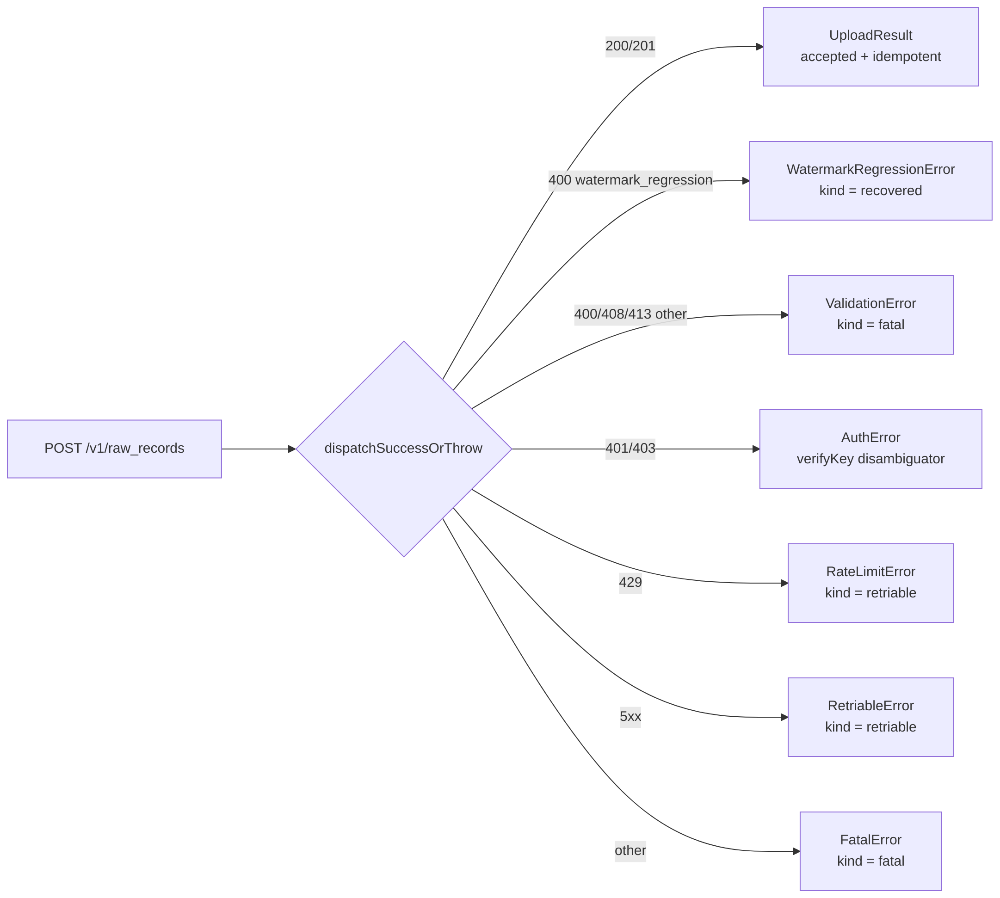

[← Previous: 4.4 Sentinels](../04-daemon-loops/4.4-sentinels.md) · [Index](../README.md) · [Next: 5.2 Identity, Auth & Privacy →](./5.2-identity-auth-and-privacy.md)

# 5.1 Backend Protocol

> The HTTP surface the gateway speaks against the ProxAI ingest backend.

The backend protocol is a minimal HTTP/JSON contract between the gateway daemon and the ProxAI ingest service. The gateway hits the backend directly — no proxy, no SDK, just `fetch` with `JSON.stringify`.

The base URL defaults to `https://proxainest-production.up.railway.app` in production, switches to `http://localhost:3001` when `NODE_ENV=development`, and can be overridden by `PROXAI_GATEWAY_NEST_ENDPOINT` or by editing `[backend]` in `config.toml`.

## The four endpoints

| method | path | called from |
| --- | --- | --- |
| `GET` | `/ingestion/verify-key` | `setup` (one-shot during config), `uploadBatch` (to disambiguate transient vs. terminal auth errors) |
| `POST` | `/v1/host-ids/register` | `setup` immediately after verify-key |
| `POST` | `/v1/raw_records` | every batch the [drain cycle](../04-daemon-loops/4.2-drain-cycle.md) ships |
| `GET` | `/v1/watermarks?host_id=…` | daemon startup when `countCursors == 0` |

## The shared HttpClient chokepoint

All requests share the same `HttpClient` (`services/http/`) chokepoint. The client sets `User-Agent` on every request, `X-API-Key` on every gateway request (`withApiKey: true` is the default for the four endpoints above), and `Content-Type: application/json` on every POST. The body, if present, is `JSON.stringify`-ed. The signal is `AbortSignal.timeout(timeoutMs)` — the Web platform's standard cancellation primitive (the gateway uses one per loop iteration to interrupt sleeps and HTTP requests on shutdown), with `DEFAULT_TIMEOUT_MS = 30_000` for verify-key / register / watermarks, `UPLOAD_TIMEOUT_MS = 60_000` for raw_records uploads.

Network failures (timeout, DNS, connect, TLS) are caught and rewrapped as `RetriableError` (timeout) or `NetworkError` (anything else) so they map cleanly to the drain cycle's outcome classifier.

## The DTO shape

The `POST /v1/raw_records` request is the steady-state path. Its body is one `RawRecordDTO` per request — one [batch](../02-capture/2.3-batching-and-compression.md) per HTTP call. The DTO carries:

- The capture identity (`capture_id` UUIDv7 — a time-sortable UUID variant whose leading bits encode a millisecond timestamp, so natural ordering is also chronological).
- Host context (`host_id`, `gateway_version`, `captured_at_utc`).
- Source identity (`source_app`, `source_kind`, `source_path`, `source_path_hash`, optional `source_inode`).
- The [watermark](../02-capture/2.2-parsing-and-watermarks.md) tagged union (`byte_range` or `rowid_range`).
- The redacted-then-compressed body base64-encoded into the JSON payload (binary-to-text encoding that turns the zstd-compressed body into a JSON-safe string at a 4-to-3 size inflation).

`validateRawRecordDTO` runs before every send to enforce that `(sourceApp, sourceKind, bodyFormat, watermarkKind, watermarkTableRequired)` is one of the five `SOURCE_VARIANTS` — a misconfigured source can never produce an invalid DTO that reaches the wire.

## The four response outcomes



Response classification is centralized in `dispatchSuccessOrThrow` (`services/http/error-mapping.ts`). The mapping is exhaustive — every HTTP response has exactly one outcome class.

## Idempotency model

Idempotency rides on `capture_id` — an idempotent request returns the same effect whether sent once or many times; the backend dedupes by `capture_id`. UUIDv7 is generated at insert time inside the gateway and is the primary key of `upload_batches`, so the gateway itself cannot produce a duplicate. The server keys dedup on the same field, so a re-shipped batch (after a network blip that lost the response) returns `idempotent: true` and the receipt is written without re-ingesting.

The `idempotent_on_server` bit is preserved on `upload_receipts` so an operator reconciling later can tell which receipts came from a duplicate flight.

## Why base64 over multipart

The wire body is base64 of the zstd-compressed bytes — a 1.8 MiB compressed buffer body lands as ~2.4 MiB of base64 in the JSON envelope, well under the server's 413 threshold for a 4 MiB request limit. The choice of JSON-with-base64 over multipart/binary trades 33% wire overhead for a simpler error-handling story (the server returns JSON for both success and failure, the gateway has one parser per direction). The client never streams; every request is fully buffered before send.

## Defensive response parsing

A small inventory of contract-shaped responses backs `verify-key` (`{ success, message?, data: { userId?, keyName? } }`), `host-ids/register` (`{ host_id?, user_id?, registered? }`), and `watermarks` (`{ host_id?, user_id?, watermarks?: Array<unknown> }`).

Each response parser defends against missing or wrong-typed fields with safe defaults — a `null` `data`, an empty string for missing strings, `false` for missing booleans. Invalid items inside `watermarks` are silently dropped via `parseServerWatermark`, so a server pushing a malformed entry doesn't break the sync.

## How does `HttpClient` dispatch a request?

`HttpClient.request<T>` is the single chokepoint:

```
request(options):
  headers = { User-Agent: this.userAgent }
  if options.withApiKey:
    headers['X-API-Key'] = this.apiKey
  if options.body !== undefined:
    headers['Content-Type'] = 'application/json'
    body = JSON.stringify(options.body)

  timeoutMs = options.timeoutMs ?? this.timeoutMs    # 30_000 default; 60_000 for upload
  init = { method, headers, signal: AbortSignal.timeout(timeoutMs), body? }

  try response ← fetchFn(url, init)
  catch err:
    if err.name === 'TimeoutError' || 'AbortError':
      throw RetriableError("request timed out after Nms") + ctx{status:null}
    else:
      throw NetworkError("network failure: <msg>") + ctx{status:null}

  return dispatchSuccessOrThrow<T>(response, url, method)
```

`AbortSignal.timeout(ms)` is Node-style: it produces an `AbortSignal` that fires after `ms` and surfaces as a `TimeoutError` from fetch. Network failures (DNS, connection refused, TLS) surface as named errors whose `err.name` is **not** `TimeoutError` — they become `NetworkError`.

Every thrown error from `request` is wrapped with `withCtx(err, makeHttpContext(url, method, status, bodyExcerpt))`, where `bodyExcerpt` is the response body truncated to `RESPONSE_BODY_EXCERPT_LIMIT = 512` chars with an ellipsis. That context lets `upload-batch.ts` include `http_url`, `http_method`, `http_status`, `http_body` fields in error log lines.

## What is the request shape for `/v1/raw_records`?

The body is one `RawRecordDTO` (declared in `contract.types.ts`), one batch per request. Field meanings:

| field | type | source |
| --- | --- | --- |
| `capture_id` | string (UUIDv7) | assigned at `insertBatch` time |
| `host_id` | string | from `config.account.hostId` |
| `source_app` | `'claude-code' \| 'cursor' \| 'codex' \| 'gemini-cli'` | from the source variant |
| `source_kind` | `'jsonl_append' \| 'sqlite_kv_snapshot' \| 'sqlite_table_snapshot'` | from the source variant |
| `source_path` | string | absolute path on this host |
| `source_path_hash` | string | sha256 of `source_path` |
| `source_inode` | number nullable | from `statFile` at discovery, null for sqlite snapshots |
| `watermark` | discriminated union | `{ kind: 'byte_range', start, end, table: null }` or `{ kind: 'rowid_range', start, end, table }` |
| `agent_schema_version` | string | agent-reported, or `unknown` / `gemini-cli/unknown` |
| `gateway_version` | string | `PACKAGE_VERSION` at insert time |
| `captured_at_utc` | string | ISO-8601 UTC |
| `body_format` | `'jsonl' \| 'kv_pairs_json' \| 'sqlite_rows_json'` | matches `source_kind` 1:1 |
| `body_compression` | `'zstd'` | always |
| `body` | string | base64-encoded zstd output (the buffer stores raw bytes; `buildRawRecordDTO` calls `Buffer.from(batch.body).toString('base64')`) |

`validateRawRecordDTO` runs before every send to enforce required fields and that `(sourceApp, sourceKind, bodyFormat, watermarkKind, watermarkTableRequired)` is one of the five `SOURCE_VARIANTS`. A DTO that fails validation throws synchronously inside `uploadRawRecord`; the upload classifier treats that as a fatal error.

## What does the server response mean?

`uploadRawRecord` parses `{ capture_id, accepted, idempotent }` from a 200/201 body and returns an `UploadResult`:

- `accepted: true` — the server stored the batch.
- `idempotent: true` — the server already had this `capture_id`; the row was the duplicate and the prior copy was preserved. This is also a success — `markBatchDelivered` records the receipt with `idempotent_on_server = 1`.

Any non-2xx status throws from `dispatchSuccessOrThrow` and gets classified by `upload-batch.ts` into accepted/fatal/recovered/retriable as described in [drain cycle](../04-daemon-loops/4.2-drain-cycle.md).

An empty 2xx body throws `FatalError("server returned 200 with empty body")` with the HTTP context. A 2xx with malformed JSON throws `FatalError("failed to parse response JSON: …")`. Both fall through the upload classifier as `fatal` because `FatalError` extends `GatewayError`, which is handled by the `ValidationError | GatewayError` branch.

## How is idempotency enforced?

The server keys dedup on `capture_id`. UUIDv7 makes each batch unique per insert, and `capture_id` is the primary key on `upload_batches`, so a single batch can only be re-shipped after a retriable failure — never twice from a clean run. Server-side dedup catches the rare case where the gateway shipped a batch, lost the response, and retried after restart: the server returns `idempotent: true` and the receipt is written without re-ingesting.

The `idempotent_on_server` bit propagates into `upload_receipts.idempotent_on_server` for forensic reasons — if you later see a non-zero count of idempotent receipts, that's a signal that the network round-trip was unreliable around that time, not that the gateway double-shipped on its own.

## How are status codes handled?

`dispatchSuccessOrThrow` in `services/http/error-mapping.ts` is the central mapper:

| status | maps to | next step |
| --- | --- | --- |
| 200 / 201 | `UploadResult` / `VerifyKeyResult` / etc. | success path |
| 200 / 201 with empty body | `FatalError('server returned 200/201 with empty body')` | `fatal` |
| 200 / 201 with malformed JSON | `FatalError('failed to parse response JSON: …')` | `fatal` |
| 400 (with `watermark_regression` body) | `WatermarkRegressionError(currentServerWatermarkEnd, sourcePathHash)` | `recovered`: cursor reset to server watermark, batch deleted |
| 400 (other) | `ValidationError('server returned 400 <statusText>')` | `fatal`: batch marked failed |
| 401 | `AuthError('server returned 401: ingestion key missing or invalid')` | verify-key disambiguation |
| 403 | `AuthError('server returned 403: ingestion key invalid or revoked')` | same |
| 408 | `ValidationError('server returned 408 (decompress timeout — gateway bug)')` | `fatal` |
| 413 | `ValidationError('server returned 413 (payload too large)')` | `fatal` |
| 429 | `RateLimitError` with parsed `Retry-After` | `retriable`, pacer.notify429 + notifyRetryAfter |
| 500..=599 | `RetriableError("server returned <status>")` with parsed `Retry-After` | `retriable`, pacer.notifyServiceUnavailable |
| other (3xx, unknown) | `FatalError('unexpected status: <status>')` | `fatal` |

400 with no `watermark_regression` payload is treated as fatal because the gateway should not ship malformed DTOs in steady state. The mapper does not special-case redirects — a 3xx hits the "other" branch and the batch is failed.

## What does the watermark_regression body look like?

```json
{
  "error": "watermark_regression",
  "current_server_watermark_end": 12345,
  "source_path_hash": "ab12…"
}
```

`parseWatermarkRegression` is strict:

- Body must be valid JSON parseable into an object.
- `error` must equal `"watermark_regression"`.
- `current_server_watermark_end` must be a finite number.
- `source_path_hash` must be a non-empty string.

Anything else → `null` → caller treats as a plain `ValidationError`. So a server returning 400 with the wrong `error` field gets handled as fatal, not as a regression. That's the right call: regression is recovery; everything else is a real validation problem.

## How is `Retry-After` interpreted?

`parseRetryAfter` in `core/utils/backoff.ts` accepts either:

- A delta-seconds value (`Retry-After: 60`) — returns `Math.max(0, Math.floor(seconds * 1000))`.
- An HTTP-date (`Retry-After: Wed, 21 Oct 2026 07:28:00 GMT`) — parses via `Date.parse` and returns `Math.max(0, epochMs - now)`.
- Anything else (empty, unparseable) → returns `null`.

The result feeds three places:

1. `RateLimitError.retryAfterMs` and `RetriableError.retryAfterMs` — visible to the upload classifier.
2. `pacer.notifyRetryAfter(ms)` — schedules the next `acquire` to sleep at least that long.
3. `pacer.notifyServiceUnavailable(ms)` — used as a floor for the 503 exponential backoff.

Missing or unparseable `Retry-After` results in `retryAfterMs = null`, which lets the pacer fall back to its own backoff math.

## What are the timeout settings?

`http.constants.ts`:

- `DEFAULT_TIMEOUT_MS = 30_000` — the per-`HttpClient` default applied to verify-key, register-host-id, and fetch-watermarks via `AbortSignal.timeout(timeoutMs)`.
- `UPLOAD_TIMEOUT_MS = 60_000` — passed as a per-call override on `POST /v1/raw_records`. `HttpClient.uploadRawRecord` calls the internal `request<T>({ ..., timeoutMs: UPLOAD_TIMEOUT_MS })`, and the `request` method honors the option (`const timeoutMs = options.timeoutMs ?? this.timeoutMs;`). Uploads therefore always run with a 60-second abort window regardless of the constructor's default.

A timeout throws `RetriableError("request timed out after Nms")` so the drain cycle treats it like any other transient failure.

## How big is the JSON wire payload compared to the buffered batch?

`body` on the wire is base64 of the zstd-compressed bytes (`Buffer.from(batch.body).toString('base64')` in `buildRawRecordDTO`). Base64 inflates by ~4/3, so a 1.8 MiB compressed buffer body lands on the wire as roughly 2.4 MiB of base64 plus the small metadata envelope. The server's 413 cap therefore applies against the JSON request body size, not the compressed body size — the gateway's `BODY_MAX_COMPRESSED_BYTES = 2 MiB` keeps the post-base64 payload comfortably under a 4 MiB request limit.

## How are the other three endpoints shaped?

### `GET /ingestion/verify-key`

Request: `X-API-Key` header only, no body. Response 200/201 JSON:

```
{ success: boolean, message?: string, data?: { userId?: string, keyName?: string } | null }
```

`verifyKey()` defends against missing/typo fields: `success` is treated as `false` unless strictly `true`; `userId` and `keyName` are extracted only if they're strings. Non-2xx throws the standard error map (a 401/403 here means the key is bad and the caller — either `setup` or the auth-error disambiguator — finalizes accordingly).

### `POST /v1/host-ids/register`

Request body: `{ host_id: this.hostId }`. Response 200/201 JSON:

```
{ host_id?: string, user_id?: string, registered?: boolean }
```

`registerHostId()` returns `{ hostId, userId, registered }` with safe defaults (empty string / false) for missing or non-string fields. Setup uses this immediately after verify-key succeeds, so the server can associate the host with the user.

### `GET /v1/watermarks?host_id=<urlencoded>`

Request: no body. Response 200/201 JSON:

```
{ host_id?: string, user_id?: string, watermarks?: Array<unknown> }
```

Each `watermarks[i]` is parsed through `parseServerWatermark`, which requires `source_app`, `source_path_hash`, `watermark_kind` (`'byte_range'` or `'rowid_range'`), and a finite `watermark_end`. `watermark_table` is optional and may be null. Invalid items are silently dropped. The returned list is what `syncServerWatermarks` walks to seed `source_cursors`.

## What does `accepted: false` look like in the wire response?

`UploadResult.accepted` is whatever boolean the server returns. The current upload flow does not branch on `accepted: false` from a 2xx response — `markBatchDelivered` writes the receipt for any 2xx with a parseable body, and the `idempotent` flag determines `idempotent_on_server`. If the server ever needs to reject a 2xx batch out-of-band, it should return non-2xx; a `accepted: false` payload would still be treated as a delivery for purposes of the buffer.

## What gets logged on the upload path?

Every upload writes at least two events, child-logger bound to `{capture_id, source_app}`:

- `event: upload.start` at DEBUG with `attempts`.
- One outcome event at INFO or ERROR:
  - `upload.accepted` (INFO) with `idempotent`.
  - `upload.watermark_recovered` (INFO) with `new_watermark_end`, `source_path_hash`.
  - `upload.rate_limited` (ERROR) with `retry_after_ms`, `error`, plus HTTP context.
  - `upload.retriable` (ERROR) with `kind` (constructor name: `RetriableError` / `NetworkError`), `retry_after_ms`, `error`, HTTP context.
  - `upload.fatal` (ERROR) with `kind`, `error`, `source_path_hash`, `compressed_bytes`, `watermark_start`, `watermark_end`, HTTP context, plus (for `OversizedDecompressedSliceError`) `raw_bytes`, `cap`, `slice_index`.
  - `upload.auth_unconfirmed` (ERROR) when verify-key was inconclusive.
  - `upload.auth_transient` (ERROR) when verify-key said success but the original upload failed.
  - `auth.invalid` (FATAL) when verify-key definitively rejected the key.
  - `upload.unknown_error` (ERROR) for anything else.

The "HTTP context" fields are `http_url`, `http_method`, `http_status` (number or omitted), `http_body` (truncated to 512 chars). They are attached to the error log lines automatically when the underlying `GatewayError` carries a context.

[← Previous: 4.4 Sentinels](../04-daemon-loops/4.4-sentinels.md) · [Index](../README.md) · [Next: 5.2 Identity, Auth & Privacy →](./5.2-identity-auth-and-privacy.md)
