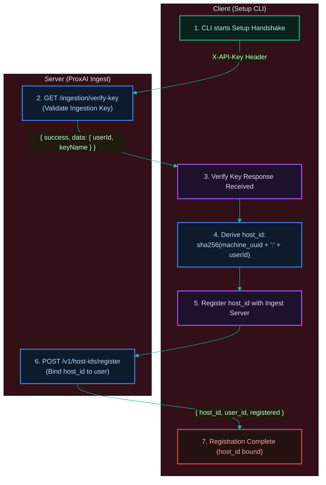

[← Previous: 5.1 Backend Protocol](./5.1-backend-protocol.md) · [Index](../../README.md) · [Next: 6.1 Configuration →](../06-operations/6.1-configuration.md)

# 5.2 Identity, Auth & Privacy

*Last Updated: 2026-05-27*

> What identifies a gateway install, how the key is stored, and what's actually transmitted off-device.

A gateway install is identified by three locally-derived values:

- **`host_id`** — the persistent device tag, sent on every upload. Computed as `sha256(machine_uuid + ":" + user_id)` — deterministic across daemon restarts, stable for the same `(machine, user)` pair forever, distinct when either component changes. The raw machine UUID never leaves the device; only the hash does.
- **`user_id`** — the account binding, returned by `GET /ingestion/verify-key` during `setup`.
- **`install_source`** — one of `bun`, `pnpm`, `yarn`, `npm`, `brew`, `github_release`.

The choice to authenticate with an ingestion key instead of OAuth is deliberate — a single-machine identity backed by a long-lived key needs no interactive token refresh, no browser dance at install time, and scopes naturally to one account per machine.

## Per-platform machine UUID sources

The machine UUID source is platform-specific:

- **macOS** — spawns `ioreg -rd1 -c IOPlatformExpertDevice` and parses the `IOPlatformUUID` line.
- **Linux** — reads `/etc/machine-id` first and falls back to `/var/lib/dbus/machine-id`.
- **Windows** — spawns `reg query HKLM\SOFTWARE\Microsoft\Cryptography /v MachineGuid` and parses the `REG_SZ` value.

Any failure throws a fatal `GatewayError` — the gateway refuses to run on a host whose UUID cannot be read.

A separate `boot_id` value, read per process, is used only for the `SESSION_STOPPED` sentinel's self-clearing logic ([sentinels](../04-daemon-loops/4.4-sentinels.md)). The Linux source is the kernel's `/proc/sys/kernel/random/boot_id`; macOS and Windows derive it by sha256'ing platform-specific boot timestamps. `boot_id` never crosses the wire.

## The setup handshake

The auth handshake during `setup` is two HTTP calls:



`GET /ingestion/verify-key` exchanges the operator-provided ingestion key for a `user_id` and confirms the key is valid. `POST /v1/host-ids/register` then binds the locally-derived `host_id` to that user on the backend; if the key is already bound to a different machine, the server returns 401/403 and setup aborts with a clear error message.

Both calls are documented in the [backend protocol](./5.1-backend-protocol.md). The same `verify-key` call is also the auth disambiguator the [drain cycle](../04-daemon-loops/4.2-drain-cycle.md) uses to decide whether a 401 from an upload is a real key revocation or a transient hiccup.

The handshake targets whichever Nest the active **profile** points at. A `prod` install verifies and registers against `https://proxainest-production.up.railway.app`; a `dev` install (configured via `proxai-gateway dev setup <KEY>`) verifies against `http://localhost:3001` and registers a separate `host_id` there. The two profiles keep separate `config.toml`, `buffer.db`, and ingestion keys, so a dev key never touches production. See the [backend protocol](./5.1-backend-protocol.md) for the full profile-to-base-URL mapping.

## How the API key is stored

The API key is stored exactly once: in the `[account]` table of `config.toml`, located in the platform-specific configuration directory (`~/.proxai/proxai-gateway/config.toml` on macOS/Linux or `%LOCALAPPDATA%\proxai\proxai-gateway\config.toml` on Windows). It is written via `writeAtomic` and chmod'd to `0o600` (owner read/write only) on POSIX platforms. It is transmitted exactly once per request, as the `X-API-Key` HTTP header. It is never logged, never serialized into a sentinel body, never embedded in an error message — `tail` and `status` never print it, and the only code path that handles it is the `HttpClient` constructor.

## The privacy posture

The privacy posture has two halves. **On the wire**, what crosses is exactly what the drain cycle ships, nothing more. **On disk**, the gateway now retains a redacted copy of each captured user prompt locally for observability — but that retention does not add anything to what is transmitted.

| Channel | What is sent |
| --- | --- |
| `POST /v1/raw_records` | The redacted compressed body, the watermark metadata, the source identity (including the absolute `source_path` — note that this is not redacted by the on-device rule set), and the host context (`host_id`, `gateway_version`, `agent_schema_version`, `captured_at_utc`) |
| `GET /v1/watermarks` | Only `host_id` as a query string |
| `setup` | The ingestion key in the header and the `host_id` in the register body |

The exact wire DTO is enumerated in the [backend protocol](./5.1-backend-protocol.md). The local `upload_receipts` columns added for retention (`user_prompt`, `source_path`, and friends) are **never** read by `buildRawRecordDTO`, so they cross no channel.

Everything else — raw un-redacted source bytes, machine UUID, boot id, sentinel bodies, the contents of `config.toml`, cursors, receipts, daemon state, metadata counters — stays local and is not transmitted by the gateway.

## What is retained locally, and why?

After a batch uploads successfully, `uploadBatch` (`src/services/uploader/upload-batch.ts`) calls `extractUserPrompt` (`src/services/prompt-extract/`) on the batch body and `markBatchDelivered` persists the result onto the new `upload_receipts` columns:

- `user_prompt` — the user's prompt text, extracted from the batch body. The body is **already redacted** before it ever enters the buffer (every source's `collect.ts` runs `applyRedaction` at capture time), so the stored prompt is redacted text — secrets and PII have already been masked by the on-device rule set. Agent **responses** are not stored; only the user-authored prompt is extracted.
- `user_prompt_added_at` — when the prompt was authored, parsed from the same body.
- `source_path`, `agent_schema_version`, `gateway_version`, `captured_at_utc`, `attempts`, `source_inode`, `shipped_bytes` — copied off the delivered batch for later inspection.

This local retention exists to power on-device observability: the `logs` command surfaces recent activity and the `doctor` command diagnoses delivery health without re-reading the source files. Extraction is best-effort — any failure to decode or parse the body falls back to a `null` prompt and the receipt is still written.

**Privacy implication**: a redacted copy of each user prompt now persists locally inside `buffer.db` for the receipt-retention window (`DEFAULT_RECEIPT_RETENTION_DAYS = 365`; `src/services/config/config.constants.ts`). It lives only on this device, alongside the rest of `buffer.db` (mode `0o600` on POSIX), and is pruned with the receipt once it ages out. Nothing about this retention sends anything extra to the server — the same redacted bytes were already inside the uploaded `body`.

## How is `host_id` derived?

`deriveHostId(machineUuid, userId)` in `core/system/host-id.ts`:

```
sha256_hex(machineUuid.trim() + ":" + userId.trim())
```

Deterministic. The same machine, same user, same call gets the same `host_id` forever. Re-running `setup` for the same user on the same machine yields a stable host id; re-running for a different user (different ingestion key -> different userId from verify-key) yields a different host id.

## What is `boot_id` and where is it used?

A per-boot identifier read by `readBootId()` in `core/system/boot-id.ts`:

- **macOS** — `sysctl -n kern.boottime` then sha256 of `"darwin:<seconds>"`.
- **Linux** — `/proc/sys/kernel/random/boot_id` (returned raw — kernel already provides a UUID).
- **Windows** — `(Get-CimInstance Win32_OperatingSystem).LastBootUpTime.ToFileTimeUtc()`, then sha256 of `"win32:<filetime>"`.

`boot_id` is embedded in the `SESSION_STOPPED` sentinel body so that, after a reboot, the daemon can tell a stop from the previous boot apart from a stop set during this boot. `isCurrentSessionStopped(path, currentBootId)` reads the sentinel, compares boot ids, and self-clears the sentinel if they differ. It is not transmitted to the backend.

## How does the `userId` get bound to this install?

Two-step handshake during `setup` (`cli/commands/setup/verify-and-register.ts`):

1. `GET /ingestion/verify-key` with `X-API-Key` → the server returns `{ success, message, data: { userId, keyName } }`. The `userId` is stored locally and used in the `host_id` derivation.
2. `POST /v1/host-ids/register` with `{ host_id }` → the server registers (or confirms) the binding. If the ingestion key is already bound to a different machine (different `host_id`), the server returns 401 / 403 and the gateway aborts setup with the message *"this ingestion key is already bound to another machine; create a new ingestion key on https://proxai.co for this machine"*.

`isReplace === true` (config already exists) plus a same-user verify-key result logs `"host_id stable (same machine, same user)"`; a different user reports `"host_id rederived for new user"`. A non-replace setup logs `"host_id bound on backend (host_id: <id>)"` after register returns `registered: true`.

## How is `install_source` inferred when setup runs implicitly?

`account.install_source` is written into `config.toml` so the backend knows whether this host was installed via brew, a package manager, or the curl-bash release tarball. Explicit `setup --install-source <name>` always wins — each installer (brew formula, npm/pnpm/yarn/bun postinstall, install.sh/install.ps1) passes its own flag. When `start` (or `restart`) discovers no config file on disk, however, it auto-runs setup interactively via `invokeSetupInteractive`, and that wrapper has no flag to pass — it instead calls `inferInstallSource(process.execPath, process.platform)` (`src/services/config/install-source-infer.ts`) and uses the result.

The heuristic lowercases `execPath`, normalizes Windows separators to `/`, and matches the first hit from:

| substring in execPath | install_source |
| --- | --- |
| `/.proxai/bin/` | `github_release` |
| `/cellar/` or `/linuxbrew/` | `brew` |
| `/.bun/install/global/` | `bun` |
| `/pnpm/` or `/.pnpm/` | `pnpm` |
| `/.yarn/` or `/yarn/global/` | `yarn` |
| `node_modules/@proxai/` | `npm` |

If none match, the fallback is `github_release`. The valid set is `VALID_INSTALL_SOURCES` (`services/config/config.constants.ts`): `bun`, `pnpm`, `yarn`, `npm`, `brew`, `github_release`. No other value can be written. The heuristic exists only for the implicit auto-setup path — anything that drives `setup` directly should pass `--install-source` so the recorded value matches the actual distribution channel.

## What does the ProxAI ingest see, and what doesn't it?

**Sees**: every batch the drain cycle ships, keyed by `host_id` and `capture_id`, with the watermarked, redacted body and the metadata in the DTO. Idempotent on `capture_id`, so re-shipping after a network blip is safe.

**Does not see**: anything redacted before insert; anything from sources not in the supported set; anything outside the watched directories; anything outside the initial-scan window; the raw machine UUID; the boot id; pending/failed batches that are still local; receipts of older deliveries — including the locally-retained redacted `user_prompt` and the other receipt columns, which are local observability state and never re-sent.

The `source_path` is sent as-is — it is the absolute path on the host, useful for the server to display "which jsonl file did this come from?". Operators who consider the absolute path sensitive should be aware of this; the path is not redacted by the on-device rule set.

[← Previous: 5.1 Backend Protocol](./5.1-backend-protocol.md) · [Index](../../README.md) · [Next: 6.1 Configuration →](../06-operations/6.1-configuration.md)
