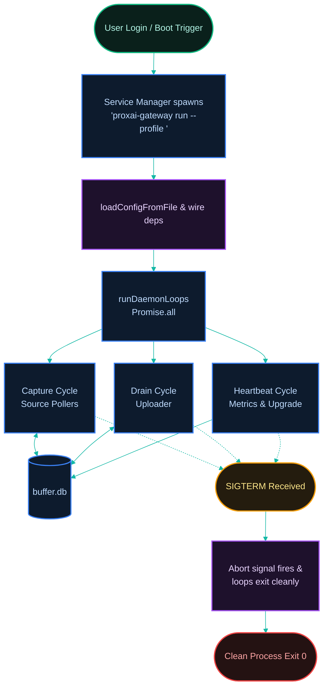

[← Previous: 6.1 Configuration](./6.1-configuration.md) · [Index](../../README.md) · [Next: 6.3 CLI & Observability →](./6.3-cli-and-observability.md)

# 6.2 Daemon & Service Unit

*Last Updated: 2026-05-27*

> Each platform's service descriptor, where it lives, and how `start`/`stop`/`restart` map onto the underlying service manager.

The gateway daemon is a long-running process invoked as `proxai-gateway run --profile <prod|dev>` — a hidden CLI subcommand that the platform's service manager spawns at user login. The `run` command builds the targeted profile context via `buildProfileContext`, loads that profile's `config.toml`, wires the HTTP and buffer dependencies, installs SIGINT/SIGTERM handlers, and calls `runDaemonLoops`, which fans out into the [capture](../04-daemon-loops/4.1-capture-cycle.md), [drain](../04-daemon-loops/4.2-drain-cycle.md), and [heartbeat](../04-daemon-loops/4.3-heartbeat-cycle.md) loops under `Promise.all`.

Because the gateway is dual-profile, it manages **two independent service descriptors per platform** — one pinned to `--profile prod`, one to `--profile dev`. Both daemons can run simultaneously; each operates on its own `buffer.db`, log directory, sentinel set, and `control.sock` (a per-profile Windows named pipe), all rooted at that profile's directory. The dev service unit existing is independent of the boot-scoped dev-mode CLI toggle (the root `DEV_MODE` file): daemons auto-start when configured, but dev mode never auto-activates. See [6.5 Dev Mode & Profiles](./6.5-dev-mode-and-profiles.md).

The process exits cleanly when the abort signal fires; the service manager respawns it on next login or, where supported, on unexpected exit.



## Per-platform service descriptors

Each platform has a different service-management mechanism. Because the gateway runs as dual-profile daemons, it manages **two** independent service descriptors per platform (one for `prod`, one for `dev`):

| Platform | Profile | Descriptor Path / Name | Mechanism & Settings |
| --- | --- | --- | --- |
| **macOS** | `prod` | `~/Library/LaunchAgents/co.proxai.gateway.plist`<br/>Label: `co.proxai.gateway` | launchd LaunchAgent triggering `proxai-gateway run --profile prod` at logon. `RunAtLoad = true`, `KeepAlive = true` |
| | `dev` | `~/Library/LaunchAgents/co.proxai.gateway.dev.plist`<br/>Label: `co.proxai.gateway.dev` | launchd LaunchAgent triggering `proxai-gateway run --profile dev` at logon. `RunAtLoad = true`, `KeepAlive = true` |
| **Linux** | `prod` | `~/.config/systemd/user/proxai-gateway.service`<br/>Service: `proxai-gateway.service` | systemd user service triggering `ExecStart=<programPath> run --profile prod`. `Type=simple`, `Restart=always`, `RestartSec=5s`, `StartLimitIntervalSec=0`, `OOMScoreAdjust=-100` |
| | `dev` | `~/.config/systemd/user/proxai-gateway-dev.service`<br/>Service: `proxai-gateway-dev.service` | systemd user service triggering `ExecStart=<programPath> run --profile dev`. `Type=simple`, `Restart=always`, `RestartSec=5s`, `StartLimitIntervalSec=0`, `OOMScoreAdjust=-100` |
| **Windows**| `prod` | `<prod configDir>\scheduled-task.xml`<br/>Task Name: `ProxAI Gateway` | Task Scheduler XML running `proxai-gateway.exe run --profile prod` at user logon. `RestartOnFailure = { Interval: PT1M, Count: 10 }` |
| | `dev` | `<dev configDir>\scheduled-task.xml`<br/>Task Name: `ProxAI Gateway (dev)` | Task Scheduler XML running `proxai-gateway.exe run --profile dev` at user logon. `RestartOnFailure = { Interval: PT1M, Count: 10 }` |

## How lifecycle commands map

The same three lifecycle commands — `start`, `stop`, `restart` — map onto each platform's manager through a thin adapter:

- **`start`** does three things in order: re-create the unit file if missing, ensure the registration exists with the service manager, then kickstart/start/run the registered job.
- **`stop`** calls the manager's stop verb (`launchctl bootout`, `systemctl stop`, `schtasks /End`); the service stays registered, so the next login still triggers an auto-start — `uninstall` is what fully unregisters.
- **`restart`** is the manager's native restart (`launchctl kickstart -k`, `systemctl restart`, `schtasks /End` + `/Run` on Windows).

Before `start` or `restart`, both commands invoke `autoUpgradeFromConfig` if the install source supports in-place replace, so a `start` after a release will fetch the new binary first.

## Status surfacing

Per-platform service-management details flow through to `status`. On macOS, `parseLaunchctlPrint` extracts `pid =` and `spawn ts =` / `start time =` from `launchctl print`. On Linux, `systemctl --user show -p MainPID -p ActiveEnterTimestamp` returns both fields directly. On Windows, schtasks output does not include the PID, so the manager follows up with `tasklist /FI "IMAGENAME eq proxai-gateway.exe" /FO CSV /NH` to find it. All three platforms therefore surface PID and uptime in the rendered status output.

## Platform-specific quirks

- **Linux lingering.** A user systemd unit normally exits when the user logs out. To keep the gateway running across logout/login boundaries, the operator must enable lingering (the systemd term for "let this user's services run even when they're not logged in") with `loginctl enable-linger $(whoami)` — the gateway does not enable it automatically because doing so would require `systemd-logind` privileges and a sudo prompt at install time.
- **Windows binary replacement.** `replaceBinary` cannot overwrite a running `.exe`, so auto-upgrade on Windows stages the new bytes at `<binaryPath>.new` and the operator must manually swap and restart.

Both quirks are covered in [install, upgrade and uninstall](../07-platform-and-deployment/7.2-install-upgrade-uninstall.md).

## What survives a reboot

What survives a reboot, per active profile: the unit file, the service-manager registration, the profile's `config.toml`, its `buffer.db`, and every sentinel under its directory.

What does not survive a reboot: the running daemon process (re-spawned at next login), the per-profile control socket / named pipe (recreated on each start), and the `SESSION_STOPPED` sentinel's effect (the boot-id mismatch self-clears the sentinel on first read after reboot — see [sentinels](../04-daemon-loops/4.4-sentinels.md)).

## What runs as the actual daemon process?

`proxai-gateway run --profile <name>`, a hidden CLI subcommand declared in `main.ts`. The service unit on every platform invokes the binary with these arguments to spin up a profile-specific daemon instance. `runDaemon` (in `cli/commands/run/`) builds the targeted profile context, loads the profile's `config.toml`, wires HTTP and buffer dependencies, installs SIGINT/SIGTERM handlers, and calls `runDaemonLoops` which fans out into the profile's capture, drain, and heartbeat loops under `Promise.all`. The process exits cleanly when the abort signal fires.

## What is the macOS service unit?

A launchd LaunchAgent plist at `~/Library/LaunchAgents/co.proxai.gateway.plist` (production) or `~/Library/LaunchAgents/co.proxai.gateway.dev.plist` (development). The dev label is the prod label with a `.dev` suffix appended (`devLaunchdLabel` in `cli/service-unit/dev-labels.ts`), and `defaultLaunchdPlistPath(label)` derives the filename as `<label>.plist`. Built by `buildLaunchdPlist` (`cli/service-unit/launchd-plist.ts`) with these behavior keys:

- `Label = co.proxai.gateway` or `co.proxai.gateway.dev`.
- `ProgramArguments = [<programPath>, "run", "--profile", <profileName>]`.
- `RunAtLoad = true` (launches on agent load at user login).
- `KeepAlive = true` (relaunch always, regardless of exit status).

`writeServiceUnit` writes the file at `0o644`. The launchctl manager (`cli/service-manager/launchctl.ts`) operates against `gui/<uid>/co.proxai.gateway` or `gui/<uid>/co.proxai.gateway.dev` and uses:

- `launchctl bootstrap gui/<uid> <plistPath>` — register (bootstrap loads the service descriptor into the GUI session).
- `launchctl kickstart gui/<uid>/<label>` — start the registered job.
- `launchctl kickstart -k …` — restart (kill then re-fork).
- `launchctl bootout gui/<uid>/<label>` — unregister.
- `launchctl print …` — used for `isRegistered` / `isRunning` / `runtimeInfo`. `parseLaunchctlPrint` (`src/cli/service-manager/launchctl.ts`) extracts `pid = N` and a start timestamp: it prefers `spawn ts = <epoch_seconds>` and falls back to `start time = <epoch_seconds>`. Both are parsed as epoch seconds (multiplied by 1000 to a `Date`); negative or non-finite values map to `null`. macOS `status` therefore surfaces both PID and `startedAt` (rendered as uptime in the human view).

## What is the Linux service unit?

A systemd user unit at `~/.config/systemd/user/proxai-gateway.service` (production) or `~/.config/systemd/user/proxai-gateway-dev.service` (development). The dev unit name is the prod name with `.service` rewritten to `-dev.service` (`devSystemdUnitName` in `cli/service-unit/dev-labels.ts`). Built by `buildSystemdUnit` (`cli/service-unit/systemd-unit.ts`) with:

```ini
[Unit]
Description=ProxAI Gateway
After=network-online.target
StartLimitIntervalSec=0

[Service]
Type=simple
ExecStart=<programPath> run --profile <profileName>
Restart=always
RestartSec=5s
OOMScoreAdjust=-100

[Install]
WantedBy=default.target
```

The `Description` is the literal `ProxAI Gateway` for both profiles (the writer passes no per-profile description); the two units are distinguished by their filename and the `--profile` argument in `ExecStart`, not by the description. The systemctl manager always operates with `--user` and targets the profile-specific service:

- `systemctl --user daemon-reload` then `enable` — register.
- `systemctl --user start` — start.
- `systemctl --user restart` — restart.
- `systemctl --user stop` — stop.
- `systemctl --user disable` then `daemon-reload` — unregister.
- `systemctl --user show -p MainPID -p ActiveEnterTimestamp` — runtime info.

**Lingering caveat.** A user systemd unit normally exits when the user logs out. To run when no session is active, the operator must enable lingering: `loginctl enable-linger $(whoami)`. The gateway does not enable this automatically because it requires `systemd-logind` privileges and would be a sudo prompt at install time. The README mentions it as a one-line follow-up; this doc just documents the requirement.

## What is the Windows service unit?

A Scheduled Task XML at `<configDir>\scheduled-task.xml` under each profile directory, registered with the system task name `ProxAI Gateway` (production) or `ProxAI Gateway (dev)` (development — the prod name with a parenthesized ` (dev)` suffix, `devWindowsTaskName` in `cli/service-unit/dev-labels.ts`). Built by `buildScheduledTaskXml` with these settings:

- `LogonTrigger` — runs at user logon (no separate "at startup" trigger; the gateway is a per-user agent).
- `Principal.LogonType = InteractiveToken`, `RunLevel = LeastPrivilege` (no admin required).
- `MultipleInstancesPolicy = IgnoreNew` (a running instance prevents a second from starting).
- `DisallowStartIfOnBatteries = false`, `StopIfGoingOnBatteries = false` (runs on battery).
- `ExecutionTimeLimit = PT0S` (no time limit).
- `RestartOnFailure = { Interval: PT1M, Count: 10 }` (restart after 1 minute, up to 10 times).
- `Actions.Exec.Command = <programPath>`, `Arguments = "run --profile <profileName>"`.

The XML is encoded as UTF-16 LE with a BOM (`encodeScheduledTaskXml`) because `schtasks /Create /XML` requires that. The `<Description>` is the literal `ProxAI Gateway daemon` for both profiles; the profiles are distinguished by their task name and the `--profile` argument. The schtasks manager operates on the profile-specific task name:

- `schtasks /Query /TN "ProxAI Gateway"` or `schtasks /Query /TN "ProxAI Gateway (dev)"` — `isRegistered`. For `runtimeInfo`, `schtasks /Query /TN … /FO LIST /V` is parsed by `parseSchtasksQuery` (`src/cli/service-manager/schtasks.ts`): the `Start Date:` and `Start Time:` lines are concatenated and run through `Date.parse` to produce `startedAt`. PID is **not** in the schtasks output, so when the task's `Status: Running` line matches, the manager follows up with `tasklist /FI "IMAGENAME eq proxai-gateway.exe" /FO CSV /NH` and `parseTasklistPid` extracts the second CSV field as the PID. Both fields land in `status` on Windows.
- `schtasks /Create /TN … /XML <path> /F` — register.
- `schtasks /Run /TN …` — start.
- `schtasks /End /TN …` — stop.
- `schtasks /Delete /TN … /F` — unregister.

Note: the task name constants in code resolve to `ProxAI Gateway` (prod) and `ProxAI Gateway (dev)` (dev).

## Watchdog & Rescue Services

To ensure high availability, the gateway writes and registers an independent watchdog service alongside each daemon profile. The watchdog executes a lightweight recovery command (`proxai-gateway rescue --profile <profileName>`) at periodic intervals to check daemon health, clean up stale states, and restart the daemon if it is unexpectedly stopped or unresponsive.

Like the main daemon, the watchdog manages two independent service descriptors (`prod` and `dev` profiles).

### macOS Watchdog (launchd)
- **Label:** `co.proxai.gateway.watchdog` or `co.proxai.gateway.dev.watchdog`
- **Path:** `~/Library/LaunchAgents/co.proxai.gateway.watchdog.plist` or `~/Library/LaunchAgents/co.proxai.gateway.dev.watchdog.plist`
- **Behavior:**
  - `StartInterval = 900` (runs every 15 minutes / 900 seconds).
  - `RunAtLoad = true` (launches at user login).
  - `ProcessType = Background` (optimizes execution priorities).
  - Does not use `KeepAlive` (runs to completion then exits).

### Linux Watchdog (systemd)
Linux separates the watchdog into two unit files to run it on a timer:
1. **Service Unit:** `proxai-gateway-watchdog.service` or `proxai-gateway-dev-watchdog.service`
   - **Path:** `~/.config/systemd/user/<unit>`
   - **Type:** `oneshot`
   - **ExecStart:** `<programPath> rescue --profile <profileName>`
   - **TimeoutStartSec:** `120` (2 minutes).
2. **Timer Unit:** `proxai-gateway-watchdog.timer` or `proxai-gateway-dev-watchdog.timer`
   - **Path:** `~/.config/systemd/user/<unit>`
   - **OnBootSec:** `2min` (runs 2 minutes after boot).
   - **OnUnitActiveSec:** `15min` (runs 15 minutes after last execution).
   - **AccuracySec:** `2min`
   - **Persistent:** `true`
   - **WantedBy:** `timers.target`

### Windows Watchdog (Task Scheduler)
- **Task Name:** `ProxAI Gateway Watchdog` or `ProxAI Gateway (dev) Watchdog`
- **Descriptor Path:** `<configDir>\scheduled-task-watchdog.xml`
- **Behavior:**
  - **TimeTrigger:** Runs every 15 minutes (`PT15M` repetition interval, with a static `StartBoundary` of `2026-01-01T00:00:00`).
  - **LogonType:** `S4U` (Services for User, which executes the task under the interactive user's context without requiring or caching credentials/passwords).
  - **ExecutionTimeLimit:** `PT2M` (terminated if it runs longer than 2 minutes).
  - **RunLevel:** `LeastPrivilege` (least privileges, no admin needed).


## How do `start` / `stop` / `restart` relate to the service manager?

The `start` command (`cli/commands/start.ts`) does three things in order:

1. `ensureServiceUnitExists(...)` — recreates the unit file if missing.
2. `serviceManager.ensureRegistered()` — registers with launchctl/systemctl/schtasks if not already.
3. `serviceManager.start()` — kickstart / start / run.

`stop` calls `serviceManager.stop()` (bootout, `systemctl stop`, `schtasks /End`). The service stays *registered* — it will auto-start again at next login / boot. To fully unregister, use `uninstall`.

`restart` is `serviceManager.restart()` directly. On launchctl that is `kickstart -k` (kill then start); on systemctl it is `daemon-reload` then `restart`; on Windows it is `End` then `Run`.

Before any of those, both `start` and `restart` invoke `autoUpgradeFromConfig` if the install source supports in-place replace — so a `start` after a release will fetch the new binary first and `exitProcess` runs the just-installed one.

## What survives a reboot vs. only this session?

Survives reboot:

- The unit file (`*.plist`, `*.service`, or task XML) for each registered profile.
- The service-manager registration (one per profile).
- Each profile's `config.toml`, `buffer.db`, and sentinel files.

Does not survive reboot:

- The running daemon process. The service manager re-launches the daemon at next login.
- The `SESSION_STOPPED` sentinel's effect: the `boot_id` mismatch self-clears the sentinel on the first read post-reboot.

The control socket / named pipe is per-profile: `<profile configDir>/control.sock` on POSIX, `\\.\pipe\proxai-gateway-control-<profile>` on Windows (`buildControlSocketPath` in `core/io/fs/profile.ts`). It is created by the running daemon and recreated on each start; it is not persistent state.

[← Previous: 6.1 Configuration](./6.1-configuration.md) · [Index](../../README.md) · [Next: 6.3 CLI & Observability →](./6.3-cli-and-observability.md)
