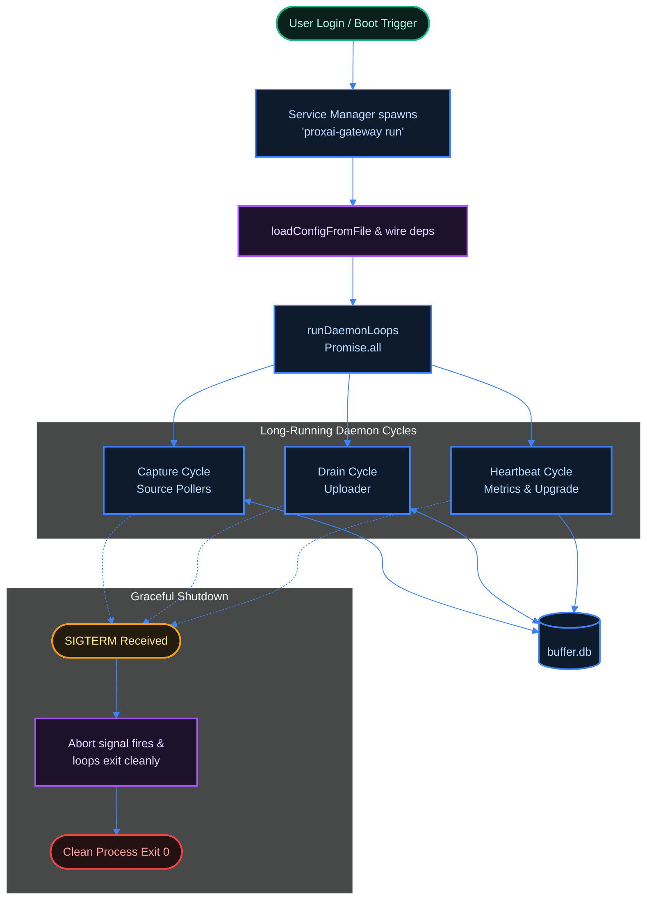

[← Previous: 6.1 Configuration](./6.1-configuration.md) · [Index](../../README.md) · [Next: 6.3 CLI & Observability →](./6.3-cli-and-observability.md)

# 6.2 Daemon & Service Unit

*Last Updated: 2026-05-27*

> Each platform's service descriptor, where it lives, and how `start`/`stop`/`restart` map onto the underlying service manager.

The gateway daemon is a long-running process invoked as `proxai-gateway run` — a hidden CLI subcommand that the platform's service manager spawns at user login. The `run` command loads `config.toml`, wires the HTTP and buffer dependencies, installs SIGINT/SIGTERM handlers, and calls `runDaemonLoops`, which fans out into the [capture](../04-daemon-loops/4.1-capture-cycle.md), [drain](../04-daemon-loops/4.2-drain-cycle.md), and [heartbeat](../04-daemon-loops/4.3-heartbeat-cycle.md) loops under `Promise.all`.

The process exits cleanly when the abort signal fires; the service manager respawns it on next login or, where supported, on unexpected exit.



## Per-platform service descriptors

Each platform has a different service-management mechanism, and the gateway carries a generator and a manager for each:

| platform | descriptor path | mechanism |
| --- | --- | --- |
| macOS | `~/Library/LaunchAgents/co.proxai.gateway.plist` | launchd LaunchAgent (macOS's per-user service manager) with `RunAtLoad = true` and `KeepAlive = { SuccessfulExit = false }` |
| Linux | `~/.config/systemd/user/proxai-gateway.service` | systemd user service (Linux's per-user service manager) with `Type=simple`, `Restart=on-failure`, `RestartSec=10s` |
| Windows | `<configDir>\scheduled-task.xml` registered as `ProxAI Gateway` | Scheduled Task (Windows' Task Scheduler stores per-task config as XML; the gateway generates this XML at install time) triggered by `LogonTrigger`, `RestartOnFailure = { Interval: PT1M, Count: 3 }` |

## How lifecycle commands map

The same three lifecycle commands — `start`, `stop`, `restart` — map onto each platform's manager through a thin adapter:

- **`start`** does three things in order: re-create the unit file if missing, ensure the registration exists with the service manager, then kickstart/start/run the registered job.
- **`stop`** calls the manager's stop verb (`launchctl bootout`, `systemctl stop`, `schtasks /End`); the service stays registered, so the next login still triggers an auto-start — `uninstall` is what fully unregisters.
- **`restart`** is the manager's native restart (`launchctl kickstart -k`, `systemctl restart`, `schtasks /End` + `/Run` on Windows).

Before `start` or `restart`, both commands invoke `autoUpgradeFromConfig` if the install source supports in-place replace, so a `start` after a release will fetch the new binary first.

## Status surfacing

Per-platform service-management details flow through to `status`. On macOS, `parseLaunchctlPrint` extracts `pid =` and `spawn ts =` / `start time =` from `launchctl print`. On Linux, `systemctl --user show -p MainPID -p ActiveEnterTimestamp` returns both fields directly. On Windows, schtasks output does not include the PID, so the manager follows up with `tasklist /FI "IMAGENAME eq proxai-gateway.exe" /FO CSV /NH` to find it. All three platforms therefore surface PID and uptime in the rendered status output.

## Platform-specific quirks

- **Linux lingering.** A user systemd unit normally exits when the user logs out. To keep the gateway running across logout/login boundaries, the operator must enable lingering (the systemd term for "let this user's services run even when they're not logged in") with `loginctl enable-linger $(whoami)` — the gateway does not enable it automatically because doing so would require `systemd-logind` privileges and a sudo prompt at install time.
- **Windows binary replacement.** `replaceBinary` cannot overwrite a running `.exe`, so auto-upgrade on Windows stages the new bytes at `<binaryPath>.new` and the operator must manually swap and restart.

Both quirks are covered in [install, upgrade and uninstall](../07-platform-and-deployment/7.2-install-upgrade-uninstall.md).

## What survives a reboot

What survives a reboot: the unit file, the service-manager registration, `config.toml`, `buffer.db`, every sentinel.

What does not survive a reboot: the running daemon process (re-spawned at next login), the control socket / named pipe (recreated on each start), and the `SESSION_STOPPED` sentinel's effect (the boot-id mismatch self-clears the sentinel on first read after reboot — see [sentinels](../04-daemon-loops/4.4-sentinels.md)).

## What runs as the actual daemon process?

`proxai-gateway run`, a hidden CLI subcommand declared in `main.ts`. The service unit on every platform invokes the binary with this single argument. `runDaemon` (in `cli/commands/run/`) loads `config.toml`, wires HTTP and buffer dependencies, installs SIGINT/SIGTERM handlers, and calls `runDaemonLoops` which fans out into capture, drain, and heartbeat under `Promise.all`. The process exits cleanly when the abort signal fires.

## What is the macOS service unit?

A launchd LaunchAgent plist at `~/Library/LaunchAgents/co.proxai.gateway.plist`. Built by `buildLaunchdPlist` (`cli/service-unit/launchd-plist.ts`) with three behavior keys:

- `Label = co.proxai.gateway` (from `LAUNCHD_LABEL`).
- `ProgramArguments = [<programPath>, "run"]`.
- `RunAtLoad = true` (launches on agent load, which happens at login).
- `KeepAlive = { SuccessfulExit = false }` (relaunch only when the process exits with a non-zero status).

`writeServiceUnit` writes the file at `0o644`. The launchctl manager (`cli/service-manager/launchctl.ts`) operates against `gui/<uid>/co.proxai.gateway` and uses:

- `launchctl bootstrap gui/<uid> <plistPath>` — register (bootstrap is launchd's verb for "load this service descriptor into the GUI session").
- `launchctl kickstart gui/<uid>/co.proxai.gateway` — start the registered job.
- `launchctl kickstart -k …` — restart (kill then re-fork).
- `launchctl bootout gui/<uid>/co.proxai.gateway` — unregister.
- `launchctl print …` — used for `isRegistered` / `isRunning` / `runtimeInfo`. `parseLaunchctlPrint` (`src/cli/service-manager/launchctl.ts`) extracts `pid = N` and a start timestamp: it prefers `spawn ts = <epoch_seconds>` and falls back to `start time = <epoch_seconds>`. Both are parsed as epoch seconds (multiplied by 1000 to a `Date`); negative or non-finite values map to `null`. macOS `status` therefore surfaces both PID and `startedAt` (rendered as uptime in the human view).

## What is the Linux service unit?

A systemd user unit at `~/.config/systemd/user/proxai-gateway.service`. Built by `buildSystemdUnit` (`cli/service-unit/systemd-unit.ts`) with:

```
[Unit]
Description=ProxAI Gateway
After=network-online.target

[Service]
Type=simple
ExecStart=<programPath> run
Restart=on-failure
RestartSec=10s

[Install]
WantedBy=default.target
```

The systemctl manager always operates with `--user`:

- `systemctl --user daemon-reload` then `enable` — register.
- `systemctl --user start` — start.
- `systemctl --user restart` — restart.
- `systemctl --user stop` — stop.
- `systemctl --user disable` then `daemon-reload` — unregister.
- `systemctl --user show -p MainPID -p ActiveEnterTimestamp` — runtime info.

**Lingering caveat.** A user systemd unit normally exits when the user logs out. To run when no session is active, the operator must enable lingering: `loginctl enable-linger $(whoami)`. The gateway does not enable this automatically because it requires `systemd-logind` privileges and would be a sudo prompt at install time. The README mentions it as a one-line follow-up; this doc just documents the requirement.

## What is the Windows service unit?

A Scheduled Task XML at `<configDir>\scheduled-task.xml`, registered with the system task name `ProxAI Gateway` (from `WINDOWS_TASK_NAME`). Built by `buildScheduledTaskXml` with these settings:

- `LogonTrigger` — runs at user logon (no separate "at startup" trigger; the gateway is a per-user agent).
- `Principal.LogonType = InteractiveToken`, `RunLevel = LeastPrivilege` (no admin required).
- `MultipleInstancesPolicy = IgnoreNew` (a running instance prevents a second from starting).
- `DisallowStartIfOnBatteries = false`, `StopIfGoingOnBatteries = false` (runs on battery).
- `ExecutionTimeLimit = PT0S` (no time limit).
- `RestartOnFailure = { Interval: PT1M, Count: 3 }` (restart after 1 minute, up to 3 times).
- `Actions.Exec.Command = <programPath>`, `Arguments = "run"`.

The XML is encoded as UTF-16 LE with a BOM (`encodeScheduledTaskXml`) because `schtasks /Create /XML` requires that. The schtasks manager operates on the task name:

- `schtasks /Query /TN "ProxAI Gateway"` — `isRegistered`. For `runtimeInfo`, `schtasks /Query /TN … /FO LIST /V` is parsed by `parseSchtasksQuery` (`src/cli/service-manager/schtasks.ts`): the `Start Date:` and `Start Time:` lines are concatenated and run through `Date.parse` to produce `startedAt`. PID is **not** in the schtasks output, so when the task's `Status: Running` line matches, the manager follows up with `tasklist /FI "IMAGENAME eq proxai-gateway.exe" /FO CSV /NH` and `parseTasklistPid` extracts the second CSV field as the PID. Both fields land in `status` on Windows.
- `schtasks /Create /TN … /XML <path> /F` — register.
- `schtasks /Run /TN …` — start.
- `schtasks /End /TN …` — stop.
- `schtasks /Delete /TN … /F` — unregister.

Note: the README's "Where things live" table calls the task `ProxAIGateway` (no space). The constant in code is `ProxAI Gateway` (with a space). The code wins.

## How do `start` / `stop` / `restart` relate to the service manager?

The `start` command (`cli/commands/start.ts`) does three things in order:

1. `ensureServiceUnitExists(...)` — recreates the unit file if missing.
2. `serviceManager.ensureRegistered()` — registers with launchctl/systemctl/schtasks if not already.
3. `serviceManager.start()` — kickstart / start / run.

`stop` calls `serviceManager.stop()` (bootout, `systemctl stop`, `schtasks /End`). The service stays *registered* — it will auto-start again at next login / boot. To fully unregister, use `uninstall`.

`restart` is `serviceManager.restart()` directly. On launchctl that is `kickstart -k` (kill then start); on systemctl it is `daemon-reload` then `restart`; on Windows it is `End` then `Run`.

Before any of those, both `start` and `restart` invoke `autoUpgradeFromConfig` if the install source supports in-place replace — so a `start` after a release will fetch the new binary first and `exitProcess` runs the just-installed one.

## What survives a reboot vs. only this session?

Survives reboot:

- The unit file (`*.plist`, `*.service`, or task XML).
- The service-manager registration.
- `config.toml`, `buffer.db`, and every sentinel file.

Does not survive reboot:

- The running daemon process. The service manager re-launches the daemon at next login.
- The `SESSION_STOPPED` sentinel's effect: the `boot_id` mismatch self-clears the sentinel on the first read post-reboot.

The control socket / named pipe (`control.sock` on POSIX, `\\.\pipe\proxai-gateway-control` on Windows) is created by the running daemon and is recreated on each start; it is not persistent state.

[← Previous: 6.1 Configuration](./6.1-configuration.md) · [Index](../../README.md) · [Next: 6.3 CLI & Observability →](./6.3-cli-and-observability.md)
