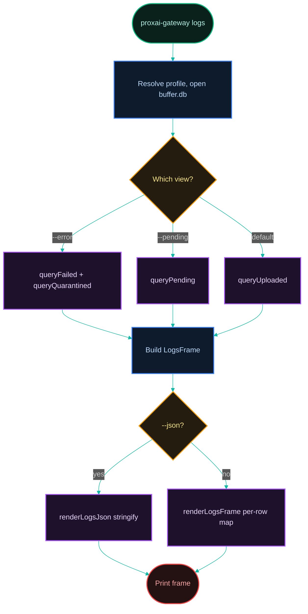
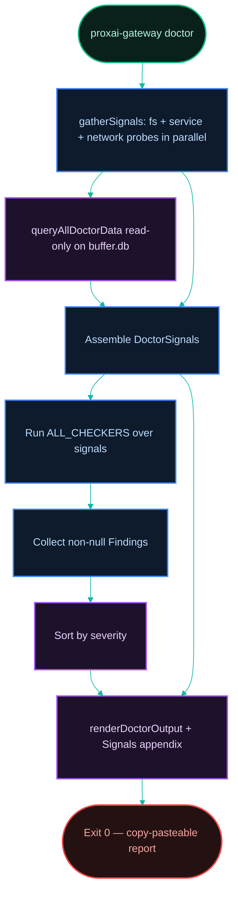
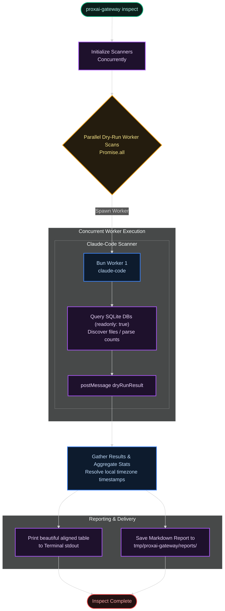

[← Previous: 6.2 Daemon & Service Unit](./6.2-daemon-and-service-unit.md) · [Index](../README.md) · [Next: 6.4 Maintainer Debug Flags →](./6.4-maintainer-debug-flags.md)

# 6.3 CLI & Observability

*Last Updated: 2026-05-27*

> Every command the binary exposes, how the record ledger and structured logs are stored, and what to read when something goes wrong.

The gateway exposes three operator-facing surfaces over its data: `status` (a live snapshot of daemon health), `logs` (a simple record ledger from the buffer DB), and `tail` (a raw structured log stream). It also ships a `doctor` command that gathers every signal at once into a copy-pasteable report. The full command catalog is declared in `main.ts`; each subcommand has its own `cli/commands/<name>/` module wired up via `cli/wiring/*-deps.ts`.

## What commands does the binary expose, and which are hidden?

Every command is declared in `main.ts`. Aliases are mirrored in `command-aliases.ts`. Visibility follows a **god-mode** model: `main.ts` reads the boot-scoped root `DEV_MODE` sentinel once at startup (`readDevModeSentinel(join(profileRootDir(), 'DEV_MODE'))` → `godMode`) and gates developer commands with `{ hidden: !godMode }`. When `DEV_MODE` is active those commands appear in `--help`; otherwise they are hidden but still runnable if typed explicitly.

| command | alias | visibility | purpose |
| --- | --- | --- | --- |
| `setup` | `init` | always | verify key, write `config.toml`, install service unit, start daemon |
| `start` | `s` | always | register the managed service and start the daemon |
| `stop` | `x` | always | halt the daemon for this session (service stays registered) |
| `restart` | `r` | always | `stop` then `start` |
| `status` | `i` | always | live snapshot UI (`--json` for machine output, `--all` for both profiles) |
| `uninstall` | `rm` | always | unregister the service unit (`--reset` wipes config/buffer/logs) |
| `upgrade` | `update` | always | fetch the latest release and replace the binary |
| `logs` | — | **always (all users)** | uploaded-record ledger + error/pending views from the buffer DB |
| `doctor` | — | **always (all users)** | gather every diagnostic signal into a copy-pasteable report |
| `run` | — | **always hidden** | foreground daemon entrypoint invoked by the service unit |
| `rescue` | — | **always hidden** | rescue/restart the daemon if it is wedged or crashed |
| `dev` | `d` | god-mode only (`{ hidden: !godMode }`) | toggle / configure development mode |
| `tail` | `t` | god-mode only | stream the structured ndjson log file |
| `inspect` | `ins` | god-mode only | dry-run telemetry scanner (no buffer writes) |
| `redaction list` / `redaction test <file>` | — | god-mode only (parent `redaction` group is hidden) | introspect the on-device redaction rules |
| `replay <logPath>` | — | god-mode only | replay a JSONL state-machine transition log |
| `xstate` | — | god-mode only | foreground daemon with the Stately visualizer enabled |

`run` and `rescue` are the only commands that are hidden regardless of god-mode — `run` is the service-unit foreground entrypoint, never invoked by a human, and `rescue` is used to recover a wedged or crashed daemon. `command-aliases.ts` defines exactly: `setup→init`, `start→s`, `stop→x`, `restart→r`, `status→i`, `tail→t`, `uninstall→rm`, `dev→d`, `inspect→ins`. (The `upgrade→update`, `setup→init`, and `redaction` sub-aliases are declared inline in `main.ts`.)

### How does `--profile` work, and what is the default profile?

Every command accepts `--profile <prod|dev>`. `parseProfileName` rejects anything other than `prod` or `dev` with `EXIT_CODE.error`. The default differs by surface:

- `setup`, `logs`, `doctor`: default to **dev when god-mode is active, otherwise prod** (`const defaultProfile = godMode ? 'dev' : 'prod'`).
- All other commands hard-default to `prod` (`.option('--profile <name>', ..., 'prod')`).

The chosen profile is resolved into a `ProfileContext` via `buildProfileContext(name)` (`core/io/fs/profile.ts`), which produces the per-profile `configDir`, `bufferDbPath`, `logDir`, sentinel paths, control-socket path, and default nest base URL. `prod` and `dev` are fully isolated: `configDir = profileRootDir()/<profile>` and `logDir = profileLogDirRoot()/<profile>`.

## What does `logs` show? (the record ledger)

`proxai-gateway logs` is a **simple record ledger** read directly from the buffer DB (`upload_receipts`, `upload_batches`, `quarantined_records`). It is live by default (re-renders into the alternate screen buffer every 2 s; quit with `q`/`Esc`); `--static` prints one frame and exits, and `--json` implies static. Flags (`main.ts` `logs` command):

- `--lines <n>` — number of records to display (default `50`).
- `--failed` — show failed and quarantined records instead of uploaded (the error/failed view).
- `--pending` — show only **pending** (queued, not-yet-uploaded) records.
- `--source <app>` — filter by coding agent (`claude-code | cursor | codex | claude-desktop | gemini`).
- `--since <dur>` — only records newer than `now - dur` (`\d+[smhd]`, e.g. `24h`, `7d`). Invalid durations exit `validationError`.
- `--static` / `--json` — one-shot output; `--json` emits the raw `LogsFrame` via `JSON.stringify`.
- `-v` / `--verbose` — expand every record to its full prompt, response, and metadata.
- `--id <capture-id>` — query and show full detail for a single record by capture id (prefix accepted).

The three views are mutually exclusive in `gatherLogsFrame` (`cli/commands/logs/gather-records.ts`): `--failed` → `{failed, quarantined}`; `--pending` → `{pending}`; default → `{uploaded}`.

### What are the logs record DTOs?

`gather-records.ts` builds a `LogsQueryOptions` and calls the four queries in `services/buffer/logs-queries.ts`. The query options:

```ts
interface LogsQueryOptions {
  limit: number;        // from --lines, default 50
  sourceApp?: string;   // from --source
  sinceIso?: string;    // ISO string derived from --since
}
```

The four returned record shapes (`cli/commands/logs/logs.types.ts`), camelCased from snake_case rows in `logs-queries.ts`:

| DTO | source table | fields |
| --- | --- | --- |
| `UploadedRecord` | `upload_receipts` | `captureId`, `sourceApp`, `deliveredAt`, `watermarkKind`, `sourcePathHash`, `idempotentOnServer: boolean` |
| `FailedRecord` | `upload_batches` (`status='failed'`) | `captureId`, `sourceApp`, `capturedAtUtc`, `sourcePath`, `attempts`, `lastError: string \| null` |
| `QuarantinedRecord` | `quarantined_records` | `id`, `sourceApp`, `sourcePath`, `redactedSizeBytes`, `reason`, `quarantinedAtUtc` |
| `PendingRecord` | `upload_batches` (`status='pending'`) | `captureId`, `sourceApp`, `capturedAtUtc`, `sourcePath`, `attempts` |

`queryUploaded` selects from `upload_receipts` ordered by `delivered_at DESC`; `queryFailed`/`queryPending` select from `upload_batches` filtered by status, ordered by `created_at DESC`; `queryQuarantined` orders by `quarantined_at_utc DESC`. Each applies the optional `sourceApp` / `sinceIso` predicates and the `LIMIT`. The `LogsFrame` returned to the renderer is `{ uploaded, failed, quarantined, pending }` (empty arrays for views not requested).

> Note: the `logs` `UploadedRecord` carries the redacted user prompt (via the `user_prompt` column in `upload_receipts`), showing a short preview in the compact list and the full text in verbose detail. Unlike failed or pending records, the assistant response is not retained for uploaded records.

### How are records mapped to displayed lines?

`render-logs.ts` maps each DTO to a single line:

- **Uploaded** (`renderUploadedRow`): `<local time> (<relative>)  <cyan source>  <prompt preview>  uploaded/re-sent`
- **Failed** (`renderFailedRow`): `<local time> (<relative>)  <yellow source>  <prompt preview>  failed (attempts)  <error truncated to 60>`
- **Quarantined** (`renderQuarantinedRow`): `<local time> (<relative>)  <magenta source>  <size>  quarantined  <reason truncated to 50>`
- **Pending** (`renderPendingRow`): `<local time> (<relative>)  <blue source>  <prompt preview>  pending (attempts)`

Sections are printed under bold headers (`Uploaded` / yellow `Failed` / red `Quarantined` / blue `Pending`). When every view is empty the renderer prints a mode-specific dim message (`No uploaded records yet.` / `No failed or quarantined records.` / `No pending records.`).

### Logs command flow



### How does `logs` differ from `tail`?

| | `logs` | `tail` |
| --- | --- | --- |
| source | `buffer.db` rows (receipts/batches/quarantine) | the structured ndjson log file on disk |
| unit | one line per **record** (capture/upload/quarantine) | one line per **log event** |
| visibility | all users | god-mode only |
| use case | "what got captured/uploaded/failed?" | "what did the daemon do, second-by-second?" |

`logs` is the durable record ledger; `tail` is the volatile event stream. They answer different questions.

## What does `doctor` do?

`proxai-gateway doctor` gathers every diagnostic signal once, runs a catalog of pure checkers over the gathered `DoctorSignals`, and prints a sorted, copy-pasteable report ending with a full `--- Signals ---` appendix. It always exits `0` — it is a report, not a gate. Users can paste the whole output to support.

### What signals does it gather?

`gatherSignals` (`cli/commands/doctor/gather-signals.ts`) probes the filesystem, service manager, network, and buffer DB in parallel and assembles a `DoctorSignals` record (`doctor.types.ts`):

- `configExists` / `configParses` / `apiKeyPresent` — from `Bun.file(configFilePath)` (api-key presence is a text-substring heuristic, not a parse).
- `serviceUnitRegistered` / `daemonRunning` — from `serviceManager.isRegistered()` / `isRunning()`.
- `sentinels` — `authFailed` (with retry count/exhausted sub-fields), `bufferFull`, `sessionStopped`, `updateAvailable` (existence checks via `sentinelHandle(path).exists()`).
- `buffer` — `pendingCount`, `pendingBytes`, `failedCount`, `quarantinedCount`, `receiptCount`, `lastPruneAt`, `lastSuccessAt`.
- `daemonState` — `captureLastCycleAt`, `drainLastCycleAt`, `lastConsecutiveRetriableBreak`, `lastUploadError`.
- `binary` — `version`, `mtime`, `installSource`.
- `recentEvents` — counts derived from the last 10 failed-batch `last_error` strings: `authUnconfirmedCount`, `rateLimitedCount`, `retriableCount`, `fatalValidationErrorCount`, `autoUpgradeEvents`.
- `filesystem` — `configDirWritable`, `logDirWritable`, `diskFreeBytes` (resolved via `df -k` on POSIX or PowerShell on Windows).
- `network` — `nestReachable` (a 5 s `GET` to the verify-key URL; `false` on any throw, `null` when not probed).
- `sourcePaths` — existence of `~/.claude`, the Cursor config dir, `~/.codex`, and the Gemini CLI/IDE directories.
- `resyncEvents` — `totalCount` and per-source `regressionLoops` (resync events in the last hour grouped by `source_path_hash` with count > 3).
- `platform`, `systemdLingerEnabled` (Linux `loginctl`), `macOsQuarantineXattr` (macOS `xattr`), `clockSkewMs` (estimated using HTTP response `date` header RTT offset).
- `extended signals` — `bufferDbReadable`, `receiptsTableReadable`, and detailed diagnostic blocks for `clock`, `process` (control socket activity, zombie processes), `security` (file mode permission, obsolete config keys), `network` (TLS inspection, proxy mismatch), `filesystem` (symlink loops, log inode drifts, sudo drift), `sqlite` (journal mode, locks, starvation), `performance` (event loop lag, GC thrashing), `upgrade` (upgrade lock status), and OS-specific checks (quoted paths, systemd rate limits).

Buffer-side signals come from `queryAllDoctorData(bufferDbPath)` (`services/buffer/doctor-queries.ts`), which opens the DB **read-only** and degrades to empty stats on any error (so doctor never throws on a corrupt/absent buffer). `resync_events` is the 7th buffer table; its queries are wrapped in try/catch so older buffers without it return zero.

### What is the checker catalog?

`runDoctor` runs `ALL_CHECKERS` (pure `(signals) => Finding | null` functions) and collects the non-null `Finding`s. Each `Finding` carries `{ code, severity, confidence, cause, action }` where severity ∈ `critical|warning|info|healthy` and confidence ∈ `CONFIRMED|LIKELY`. The catalog groups by prefix:

| group | checker file | covers |
| --- | --- | --- |
| **A — lifecycle** | `checkers/lifecycle.ts` | A1 not set up · A2 unit not registered · A3 stopped by user (SESSION_STOPPED) · A4 crashed (no sentinel) · A5 wedged (capture stale > 2× interval) · A16 rescue circuit breaker tripped |
| **A — process / daemon** | `checkers/stray-daemon.ts` | A6 abrupt daemon termination · A7 zombie daemon · A8 graceful termination lockup · A9 helper process healthy · A10 thread watcher exhaustion |
| **A — platform specific** | `checkers/windows.ts`<br>`checkers/systemd.ts` | A11 unquoted service path · A12 Task Scheduler XML corrupt · A13 runtime dir missing · A14 rate limit hit · A15 home encrypted tearing |
| **B — auth** | `checkers/auth.ts` | B1 invalid key (AUTH_FAILED present) · B2 auth-unconfirmed loop (network, NOT a key problem) · B3 ingestion key auth error |
| **B — security** | `checkers/security.ts` | B4 insecure API key transmission · B5 permissive config permissions · B6 overly broad directory watches |
| **C — upload** | `checkers/upload.ts` | C1 rate-limited · C2 network failure · C3 drain wedged · C4 buffer recovery in progress · C5 buffer oscillating · C6 parser validation errors · C7 quarantined rows |
| **C — network** | `checkers/network.ts` | C8 outbound TLS inspection · C9 global proxy mismatch · C10 DNS hijack/captive portal · C11 throttler reset skew · C12 thundering herd jitter · C13 outbox timeout |
| **D — capture** | `checkers/capture.ts` | D1 no agent activity (info if dirs exist, warning if none) · D2 one source erroring · D3 source capture errors |
| **E — binary / upgrade** | `checkers/binary.ts`<br>`checkers/upgrade-lock.ts`<br>`checkers/path-drift.ts` | E1 stale binary + upgrade failing · E2 brew update pending · E3 auto-upgrade write_failed (disk/perms) · E4 upgrade success but old binary still running · E5 upgrade lock stale · E6 corrupted upgrade binary · E7 homebrew relocation drift |
| **F — filesystem** | `checkers/filesystem.ts` | F1 configDir not writable · F2 disk low · F3 logDir not writable · F4 clock skew · F5 Linux no-linger · F6 Windows user unresolvable · F7 macOS quarantine xattr |
| **F — advanced fs** | `checkers/advanced-fs.ts` | F8 macOS TCC Full Disk Access (FDA) · F9 macOS Gatekeeper translocation · F10 sandboxed terminal locks · F11 symlink traversal loop · F12 POSIX extended ACL blocked · F13 broken Windows junction · F14 log rotation inode drift · F15 physical write exhaustion · F16 sudo hijack ownership drift |
| **F — performance** | `checkers/performance.ts` | F17 V8 event loop lag · F18 heap exhaustion · G10 compression CPU spikes |
| **G — data integrity** | `checkers/data-integrity.ts`<br>`checkers/data-extended.ts` | G1 receipts table readable · G2 buffer-db corrupt · G3 watermark regression loop · G9 inconsistent session UUIDs |
| **G — concurrency** | `checkers/concurrency.ts` | G4 SQLite journal mode · G5 busy timeout · G6 transaction lockup · G7 WAL checkpoint starvation · G8 uncommitted journal stale lock |

### How does doctor disambiguate an auth problem from a network problem?

This is the load-bearing distinction in the auth checkers:

- **B1 (key problem)** fires only when the **`AUTH_FAILED` sentinel is present**. That sentinel is written exclusively by `handleAuthError` after `verifyKey()` returns a definitive `{ success: false }` — i.e. the server rejected the key. Action: `setup new` with a valid key.
- **B2 (network problem)** fires when `AUTH_FAILED` is **absent** but `authUnconfirmedCount > 0` — repeated `auth_unconfirmed` upload outcomes mean `verifyKey` could not reach the server to confirm the key. Cause text says explicitly "NOT a key problem"; action is "check connectivity; the key itself is fine".

So: AUTH_FAILED sentinel ⇒ key; auth-unconfirmed-without-sentinel ⇒ network. C2 (`Nest endpoint unreachable`) corroborates the network case when the verify-key probe fails outright.

### What does the output look like?

`renderDoctorOutput` (`render-doctor.ts`) sorts findings by severity (`critical < warning < info < healthy`) and renders:

```
=== proxai-gateway doctor ===

CRITICAL (n)
[CONFIRMED] B1 AUTH_FAILED sentinel present — API key rejected by server
  → Run: proxai-gateway setup new with a valid key; verify at proxai.co

WARNING (n)
...

Passing checks:
  [OK] A1 Config present
  ...

--- Signals ---
platform:                  darwin
config.exists:             true
...
```

Each finding renders as `[<confidence>] <code> <cause>` followed by an indented `→ <action>`. When there are zero findings the report prints `No issues found.` and lists the `HEALTHY_CHECKS`. The `--- Signals ---` appendix dumps every gathered signal as aligned `key: value` lines (including the resync `regression_loops`, and conditionally `systemd_linger` / `macos_quarantine` / `clock_skew_ms`) — this is the block users copy to support.

### Doctor checker pipeline



## Where are the structured logs stored, and what is the log-line DTO?

`tail` reads the **structured ndjson log files** written by the running daemon. This section covers how those files are stored, the per-line DTO, and how `tail` maps each line to its display.

### How are logs stored on disk?

`createLogger` (`core/log/logger.ts`) builds a **pino** logger backed by **pino-roll** for rotation:

- File: `join(logDir, 'structured')` with `frequency: 'daily'`, `dateFormat: 'yyyy-MM-dd'`, `extension: '.log'` → basename pattern `structured.<YYYY-MM-DD>.<index>.log` (e.g. `structured.2026-05-28.1.log`).
- `sync: true` — each line is flushed before the next is queued (crash forensics over throughput).
- `limit: { count: LOG_RETENTION_DAYS }` — pino-roll keeps that many rolled files.
- `0o600` mode on POSIX — applied by `secureLogStream` on the stream's `ready` event and re-applied on each open; skipped on Windows (`process.platform === 'win32'` early return).

The `logDir` is **per-profile**: `profileLogDirRoot()/<profile>` (`core/io/fs/profile.ts`). The root differs by platform:

| platform | per-profile `logDir` |
| --- | --- |
| macOS | `~/Library/Logs/proxai/proxai-gateway/<profile>/` |
| Linux | `~/.local/state/proxai/proxai-gateway/log/<profile>/` |
| Windows | `%LOCALAPPDATA%\proxai\proxai-gateway\Logs\<profile>\` |

(`ORG_NAME = 'proxai'`, `APP_NAME = 'proxai-gateway'`, `<profile>` ∈ `prod | dev`.) `tail` resolves its directory from the profile context, then prefers `config.logging.logDir` if the config loads.

### What are the retention constants?

From `core/log/log.constants.ts` (verified current values):

- `LOG_RETENTION_DAYS = 90` — pino-roll's `limit.count`, and the time cap the dedicated pruner enforces.
- `LOG_TOTAL_SIZE_CAP_BYTES = 5 * 1024 ** 3` (5 GiB) — the byte cap pino-roll itself does **not** enforce; the dedicated `pruneLogDirectory` step (`core/log/prune.ts`) deletes oldest-first until total size is under the cap, always keeping at least one file.

### What is the log-line DTO?

Each line is one ndjson object. The pino envelope plus the bindings set in `createLogger` plus per-event keys:

| field | origin | notes |
| --- | --- | --- |
| `level` | pino envelope | numeric: 10 trace · 20 debug · 30 info · 40 warn · 50 error · 60 fatal |
| `time` | pino envelope | epoch ms |
| `pid` | pino envelope | daemon process id |
| `hostname` | pino envelope | machine host name |
| `msg` | pino envelope | human-readable message |
| `service` | logger binding | always `'proxai-gateway'` |
| `version` | logger binding | active gateway version |
| `host_id` | logger binding | anonymized host hash (`config.account.hostId`) |
| `source_app` | per-event / child binding | set on capture per-source polls (`child({source_app})`) and upload-path events |
| `event` | per-event key | dot-notated id, e.g. `capture.cycle.start` |
| *extras* | per-event keys | any other root keys (`duration_ms`, `bytes`, `capture_id`, …) |

The daemon binds exactly `{ service: 'proxai-gateway', version, host_id }` at the top-level logger (`cli/commands/run/index.ts`); per-source children add `source_app`. The "reserved" keys the formatter recognizes are exactly `level, time, msg, source_app, event, pid, hostname, service, version, host_id`; everything else is rendered as an extra.

### How does `tail` read, filter, and display each line?

`runTail` (`cli/commands/tail/index.ts`) drives the stream:

1. **Resolve the path** via `todaysLogPath(logDir)` (`log-path.ts`): builds `structured.<local-date>.<index>.log`, scanning the directory for the highest existing `<index>` (default `1`). Note the date is **local** (`new Date().getFullYear()/getMonth()/getDate()`), not UTC.
2. **Initial read** via `readMatchingTail(path, lineLimit, filters)` (`read.ts`): reads the whole file, keeps lines passing `lineMatches`, and returns the trailing `--lines` of those (default 50).
3. **Emit**: raw line when `--raw`, otherwise `formatLine(line)`.
4. **Follow** (default; `--static` stops after the initial read): poll every 200 ms, read only the slice from the last byte position via `readMatchingFrom`, and emit new matching lines.
5. **Midnight rollover**: each poll re-resolves the path; when it changes (a new day's file), `position` resets to `0` and streaming continues against the new file — no restart needed. A "Waiting for daemon…" / "Log file appeared; streaming…" hint covers the not-yet-existing-file case.

Flags (`tail` command): `--lines <n>` (default 50), `--static` (one-shot), `--source <name>`, `--level <level>`, `--since <duration>`, `--raw`, `--config <path>`, `--profile <name>`.

**Filtering** — `resolveFilters` + `lineMatches` (`filter.ts`) compose with AND semantics. Each ndjson line is `JSON.parse`d (unparseable lines are dropped during filtering); then:

```
level = parsed.level ?? 30
if level < filters.minLevel: drop                       # --level: everything >= passes
if filters.source !== null and parsed.source_app !== filters.source: drop
if filters.sinceMs !== null:
    time = parsed.time ?? 0
    if time < filters.sinceMs: drop                     # --since: now - duration
return true
```

`minLevel` defaults to `trace` (10) when `--level` is absent. `--source` matches `source_app` exactly, so globally-scoped events (e.g. `daemon.start`, which has no `source_app`) are dropped by `--source`. `--since` parses `\d+[smhd]` (s/m/h/d); an invalid value exits `validationError`.

**Display mapping** — `formatLine` (`format.ts`), used when `--raw` is off:

1. `time` → local `HH:MM:SS` (gray).
2. `level` → padded 5-char label colored by `colorLevel`: trace/debug blue (gray for <20), info green, warn yellow, error red, fatal white-on-red background.
3. `source_app` → cyan `[source_app] ` when present.
4. `event` → dim, padded to 24 chars, when present.
5. `msg` appended.
6. **Extras**: every non-reserved root key with a non-null value rendered as dim `key=value` (objects JSON-stringified), space-joined and appended.

Unparseable lines are returned verbatim (so plain startup output still shows).

## What does `status` show in each section?

`status` was redesigned away from the old four-section model and away from cumulative counters. It now renders a unified summary + detail sections, and totals are **derived from rows** (COUNT/SUM over `upload_receipts` and `upload_batches`) rather than read from incrementing metadata counters.

`runStatus` is a live watch UI by default (`--json` for a one-shot machine payload; quit with `q`/`Esc`). The frame is assembled by `gatherStatusSnapshot` and rendered by `renderFullStatus` (`render/render-full.ts`).

### Prod (simple) vs. god-mode / dev (detailed)

The same renderer drives both, but two things differentiate the views:

- **Profile breadth**: a normal prod user sees a single profile. When `--all` is passed **or** god-mode is active, `main.ts` builds a second (`dev`) status context and the renderer prints **both profiles side-by-side** (`renderDualStatus`, each block tagged `[prod]` / `[dev]`).
- **Dev affordances**: when `isDevMode` or the binary is a local build, a `DEV MODE` / `LOCAL BUILD` banner is prepended (with the backend ingest URL and binary path), and the summary hints switch to dev-oriented guidance (e.g. "Restart your dev daemon" instead of "run `proxai-gateway start`").

The top of every frame is the **unified summary** (`deriveUnifiedSummary`): a colored health dot + headline + hint covering the dominant state (not set up / auth failed / session stopped / buffer almost full / running / not running), so a prod user gets the one-line answer without reading the detail sections.

### The detail sections

`renderFullStatus` emits these sections (when a snapshot exists), in order:

- **Capture** — per-source `captured / files scanned / errors` from `daemonState.lastSourceCaptures`, fixed order `claude-code, cursor, codex, claude-desktop, gemini`.
- **Buffer** — `Pending` / `Failed` (with byte totals and per-source sub-rows when non-zero), `Receipts`, optional `Quarantined`, `Pressure` against the soft-pause threshold, `Last prune`, and a `Cycles` line (completed count · last · with-errors).
- **Upload** — `All-time` batches/bytes shipped (with per-source sub-rows) **derived from `upload_receipts`** (`derivedUploadStats`: `COUNT(*)`, `SUM(shipped_bytes)`, `MAX(delivered_at)`, grouped by source), `Avg / drain`, `Last drain` (attempted/accepted/retriable/fatal from `daemon_state`), `Last success`, and an optional `Last error` / retriable-backoff warning.
- **Last Uploads** — a summary line (`<captured> captured (N uploaded, N pending)` + re-sent count) and the last rows from `queryLastUploads` (`status-queries.ts`). Each `LastUploadRow` carries `userPromptAddedAt`, `sourceApp`, `userPrompt`, `shippedBytes`, `deliveredAt`, `idempotentOnServer`; the row renders relative time + source + bytes + the **retained redacted `userPrompt` snippet** (truncated to 80 chars). This is where the retained prompt surfaces in the CLI.
- **Re-sync note** — `Re-synced with server: N times, last …` when `resyncCount > 0` (from `resync_events`).
- **History (All-Time)** — captured/sent bytes + record counts and per-source conversation/workspace/thread counts.
- **Health** — `Daemon` (running/uptime, or inferred-alive / not-registered for local builds), `Sentinels`, `Auto-upgrade` (last check · current · latest · up-to-date/update-pending), `Binary age` vs. warn/pause thresholds, and `PID` when known.

`--json` swaps the rendered layout for a machine-readable payload built by `build-json.ts` (an empty payload with `isDevMode` is emitted, exit `notInstalled`, when no config exists).

> **Why derive-from-rows?** Cumulative metadata counters drift when the buffer is pruned or restored. Counting and summing the actual `upload_receipts` / `upload_batches` rows makes totals self-correcting and consistent with what `logs` shows. See [3.1 Buffer](../03-buffer/3.1-buffer.md) for the schema (`resync_events` is the 7th table).

## What does `--version` print?

`buildVersionString` reads `config.toml`'s `install_source` synchronously at startup and emits two lines:

```
proxai-gateway <PACKAGE_VERSION>
installed via <install_source>
```

When `config.toml` does not yet exist (pre-setup) or its `install_source` is missing, the second line reads `installed via unknown`. `PACKAGE_VERSION` is the embedded CalVer tag (e.g. `2026.5.9`).

## What does `inspect` do?

`inspect` (god-mode only) is the operational dry-run reporting tool that scans all telemetry sources in parallel without committing anything to the buffer. It uses Bun Workers to discover files, count lines, and query sqlite databases read-only (`readonly: true`). Aggregated metrics are printed as an aligned terminal table and saved as a Markdown report under `tmp/proxai-gateway/reports/inspect_${timestamp}.md`.

### Inspect command pipeline



In dry-run mode SQLite is opened `readonly: true`, parsed JSONL files are counted in-memory, `source_cursors` offsets are read but never updated, and no batches are written to `buffer.db`. Reports are saved to the OS temp dir (`/tmp/proxai-gateway/reports/...` on POSIX). Oldest-record timestamps are resolved in the user's local timezone with a relative suffix ("3 days ago") when recent.

## What event names are worth grepping for in `tail`?

Event names follow `<subsystem>.<action>`. The full inventory, verified against the source:

**Daemon lifecycle**

- `daemon.start`, `daemon.stop`, `daemon.session_stopped`, `daemon.session_stopped_check_failed`.

**Capture cycle**

- `capture.cycle.start`, `capture.cycle.complete`, `capture.cycle.skipped`, `capture.cycle.error`.
- `source.poll.start`, `source.poll.complete`, `source.poll.error`.
- `capture.split_for_size`, `capture.chunked` (slicer events).
- `oversized_row.quarantined`, `quarantine.write_failed`.
- `vacuum.detected`.

**Drain cycle**

- `drain.cycle.start`, `drain.cycle.complete`, `drain.cycle.skipped`, `drain.cycle.error`.
- `drain.complete` (the inner `drainBuffer` outcome).
- `upload.start`, `upload.accepted`, `upload.fatal`, `upload.retriable`, `upload.rate_limited`, `upload.watermark_recovered`, `upload.auth_unconfirmed`, `upload.auth_transient`, `upload.unknown_error`.
- `auth.invalid`, `auth.sentinel_write_failed`.

**Buffer**

- `buffer.prune`, `buffer.prune_failed`.
- `buffer.soft_pause`, `buffer.soft_resume`, `buffer.pressure_failed`.

**Heartbeat**

- `heartbeat.cycle.start`, `heartbeat.cycle.complete`. (There is no `heartbeat.cycle.skipped`.)
- `version_check.no_release`, `version_check.unavailable`, `version_check.failed`.
- `auto_upgrade.success`, `auto_upgrade.check_failed`, `auto_upgrade.no_asset`, `auto_upgrade.download_failed`, `auto_upgrade.write_failed`.
- `update_available`.
- `stale_binary.warning`, `stale_binary.stale`, `stale_binary.installed_at_invalid`.

**Watermark sync** (startup only)

- `watermark_sync.start`, `watermark_sync.complete`, `watermark_sync.skip`, `watermark_sync.failed`.

**State-machine & daemon-actor diagnostics**

- `state_machine.transition` (per-transition trace).
- `daemon_actors.inspect_init_failed`, `daemon_actors.snapshot_flush_failed`.
- `sentinel_watcher.dispatch_failed`, `sentinel_watcher.fatal`.

**Metrics persistence (warn-only)**

- `metrics.persist_failed`, `daemon_state.persist_failed`.

## What is in each event payload?

A non-exhaustive inventory of the most useful per-event fields:

| event | level | key fields |
|---|---|---|
| `capture.cycle.start` | INFO | `started_at` |
| `capture.cycle.complete` | INFO | `duration_ms`, `completed_at` |
| `capture.cycle.skipped` | INFO | `reason` (`auth_failed` \| `buffer_full`) |
| `source.poll.complete` | INFO | `source_app`, `files_processed`, `captured_batches`, `captured_bytes`, `errors_count` |
| `source.poll.error` | ERROR | `source_app`, `source_path`, `reason` |
| `drain.complete` | INFO | `attempted`, `accepted`, `retriable`, `fatal`, `recovered`, `retry_after_ms` |
| `upload.accepted` | INFO | `capture_id`, `source_app`, `idempotent` |
| `upload.rate_limited` | ERROR | `capture_id`, `source_app`, `retry_after_ms`, `error`, `http_url`, `http_method`, `http_status`, `http_body` |
| `upload.fatal` | ERROR | `capture_id`, `kind`, `error`, `source_path_hash`, `compressed_bytes`, `watermark_start`, `watermark_end`, HTTP context |
| `upload.watermark_recovered` | INFO | `capture_id`, `new_watermark_end`, `source_path_hash` |
| `buffer.prune` | INFO | `receipts_deleted`, `receipt_bytes_freed`, `failed_batches_deleted`, `failed_bytes_freed`, `quarantined_deleted`, `receipt_cutoff`, `failed_cutoff` |
| `buffer.soft_pause` | WARN | `pending_bytes`, `threshold` |
| `buffer.soft_resume` | INFO | `pending_bytes`, `threshold` |
| `stale_binary.stale` | WARN | `days_since_install`, `pause_after_days` |
| `auth.invalid` | FATAL | `reason`, `capture_id` |
| `update_available` | INFO | `latest`, `current` |
| `vacuum.detected` | (varies) | `source_path`, `reason` (`size_decreased` / `page_count_decreased` / `rowid_regressed`) |

`capture_id` and `source_app` are present on every upload-path event because `uploadBatch` binds a child logger with both fields. `host_id`, `version`, and `service` are present on every event from the top-level logger's bindings.

## What exit codes does the CLI use?

`EXIT_CODE` from `cli/cli.constants.ts` (verified):

| code | name | meaning |
| --- | --- | --- |
| 0 | `ok` | normal success |
| 1 | `error` | generic failure (also the value for an invalid `--profile`) |
| 2 | `validationError` | bad flag value or config (e.g. invalid `--since`/`--level`) |
| 3 | `authError` | ingestion key rejected (verify-key or register) |
| 4 | `notInstalled` | command needed a configured gateway and didn't find one |
| 5 | `alreadyInstalled` | `setup` ran against an existing config without `--force`, or `uninstall` was aborted |
| 7 | `fileUnreadable` | `redaction test` could not read its input file |
| 75 | `upgradeRespawn` | auto-upgrade replaced the binary; exit non-zero so the service manager respawns under the new binary |
| 130 | (not in the enum) | `UserAbortedError` — interactive prompt canceled with Ctrl-C |

Exit code 6 is intentionally skipped; `fileUnreadable = 7` is the only single-digit gap.

## How do I figure out why a batch keeps retrying?

Recommended sequence — `logs --error` for the record-level summary, then `tail` for the event detail:

```
# Record-level: which batches are failing and why
proxai-gateway logs --error

# Event-level: all retriable failures in the last hour
proxai-gateway tail --since 1h --level warn

# Narrow to a specific source
proxai-gateway tail --since 1h --level warn --source claude-code

# Pull a capture_id from logs --error, then grep the raw file
grep '"capture_id":"01H…"' structured.YYYY-MM-DD.1.log | jq .
```

The `http_status`, `http_body`, and `retry_after_ms` fields on `upload.rate_limited` / `upload.retriable` tell you whether it's the server (429/5xx with a server `Retry-After`) or the network (`http_status: null`, `kind: NetworkError`). Repeated `upload.auth_unconfirmed` events mean `verify-key` is failing on the same network leg as the upload — more likely transient connectivity than a real auth problem (this is exactly the B2 doctor finding). For redaction false positives in uploaded text see [2.4 Redaction](../02-capture/2.4-redaction.md).

## How is structured.log secured?

Three layers:

- File mode `0o600` on POSIX, enforced by `secureLogStream` on the pino-roll stream's `ready` event and by `pruneLogDirectory`'s setMode pass.
- File owner is the user who ran `setup`; no privilege escalation.
- The log directory is under the user's per-profile path (`~/Library/Logs/...` etc.), not a shared system path.

Windows does not enforce file mode; it relies on the per-user `%LOCALAPPDATA%` permission inheritance.

[← Previous: 6.2 Daemon & Service Unit](./6.2-daemon-and-service-unit.md) · [Index](../README.md) · [Next: 6.4 Maintainer Debug Flags →](./6.4-maintainer-debug-flags.md)
