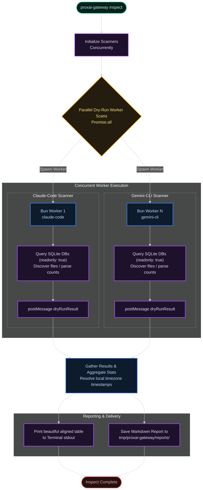

[← Previous: 6.2 Daemon & Service Unit](./6.2-daemon-and-service-unit.md) · [Index](../README.md) · [Next: 6.4 Maintainer Debug Flags →](./6.4-maintainer-debug-flags.md)

# 6.3 CLI & Observability

*Last Updated: 2026-05-27*

> Every command the binary exposes, where the logs live, and what to grep for when something goes wrong.

The gateway exposes two observability surfaces and one operator-facing CLI. The CLI is the front door: every command the binary supports — `setup`, `start`, `stop`, `restart`, `status`, `tail`, `uninstall`, `redaction list`, `redaction test`, `inspect`, `upgrade`, plus the hidden `run` and `dev` foreground-daemon entrypoints — is declared in `main.ts`. Aliases (`init`, `s`, `x`, `r`, `i`, `t`, `rm`, `ins`, `d`) are defined in `command-aliases.ts`. Each subcommand has its own `cli/commands/<name>/index.ts` with a corresponding subsystem doc elsewhere in this series; this doc focuses on the surface area itself.

## Status: snapshot view

The first observability surface is `proxai-gateway status` — a snapshot of the daemon's most recent state, rendered as four sections:

| section | what it shows |
| --- | --- |
| **Capture** | per-source files/batches/bytes/errors from `daemon_state.last_source_captures` |
| **Buffer** | pending/failed/receipts counts, pressure against the soft-pause threshold, last prune timestamp, cumulative cycle counters |
| **Upload** | all-time cumulative totals, derived averages, last cycle's attempted/accepted/retriable/fatal breakdown |
| **Health** | running PID and uptime, active sentinels, auto-upgrade last check, binary age vs. warn/pause thresholds |

The same payload is available via `--json` for scripting. PID and `startedAt` are read from the platform service manager (`launchctl print`, `systemctl show`, `schtasks /Query` + `tasklist`).

## Tail: streaming log view

The second surface is `proxai-gateway tail` — a streaming view over the ndjson log file written by the running daemon. Logs live at `<logDir>/structured.<YYYY-MM-DD>.1.log` (basename `structured`, daily rollover via pino-roll), with retention bounded by both `LOG_RETENTION_DAYS = 90` and a `LOG_TOTAL_SIZE_CAP_BYTES = 5 GiB` total-size cap.

pino is a structured-JSON logger; pino-roll layers daily and size-based file rotation on top. The cap is enforced by a dedicated `pruneLogDirectory` step at daemon startup; pino-roll itself only counts files. File mode is `0o600` on POSIX and `sync: true` is passed to pino-roll so every line is durably written before the next is queued — critical for crash forensics at the cost of slightly slower throughput.

`tail`'s filter set composes with AND semantics: `--lines <n>` (trailing prefix, default 50), `-f/--follow` (poll for new lines), `--source <name>` (claude-code/cursor/codex/gemini-cli), `--level <level>` (pino level minimum: trace/debug/info/warn/error/fatal), `--since <duration>` (`\d+[smhd]`), and `--raw` (suppress pretty-formatting). Mid-`--follow`, when the log path changes at midnight rollover, `runTail` resets position to 0 against the new file — no manual restart needed. Lines are JSON-parsed; unparseable lines are silently dropped.

## Event name families

Event names follow `<subsystem>.<action>` naming and group into seven families:

- **Daemon lifecycle** — `daemon.start`, `daemon.stop`, session-stopped variants.
- **Capture cycle** — `capture.cycle.{start,complete,skipped,error}`, `source.poll.{start,complete,error}`, `capture.split_for_size`, `vacuum.detected`, `oversized_row.quarantined`.
- **Drain cycle** — `drain.cycle.{start,complete,skipped,error}`, `drain.complete`, all the `upload.*` variants, `auth.invalid`.
- **Buffer** — `buffer.prune`, `buffer.soft_pause`, `buffer.soft_resume`.
- **Heartbeat** — `heartbeat.cycle.{start,complete,skipped}`, `version_check.{no_release,unavailable,failed}`, `auto_upgrade.*`, `update_available`, `stale_binary.*`.
- **Watermark sync** — `watermark_sync.{start,complete,skip,failed}`.
- **Metrics persistence** — `metrics.persist_failed`, `daemon_state.persist_failed`.

The full inventory plus key fields per event is in the FAQs below.

## Peripheral surfaces

Three peripheral surfaces round out the observability story:

- `--version` reads `config.toml`'s `install_source` synchronously and emits two lines: `proxai-gateway <PACKAGE_VERSION>` and `installed via <install_source>`.
- `redaction list` and `redaction test` provide on-demand introspection of the [redaction](../02-capture/2.4-redaction.md) rule set without touching the daemon.
- The CLI's exit codes are explicit and stable: 0 ok, 1 generic error, 2 validation, 3 auth, 4 not-installed, 5 already-installed, 7 file-unreadable, 75 upgrade-respawn (when auto-upgrade replaces the binary), 130 user-aborted (Ctrl-C through an interactive prompt). Exit code 6 is intentionally skipped.

`inspect` is the operational dry-run reporting tool that allows scanning all available telemetry sources in parallel without committing anything to the local buffer. It uses high-performance Bun Workers to discover files, check line counts, and query sqlite databases in read-only mode (`readonly: true`). The aggregated metrics are printed to the terminal in a beautiful aligned table and stored in a Markdown report under `tmp/proxai-gateway/reports/inspect_${timestamp}.md`.

## Log timeline: one capture + drain pair end-to-end

**Capture loop** — runs every 2 minutes:

| # | Event | Level |
|---|---|---|
| 1 | `capture.cycle.start` | INFO |
| 2 | `source.poll.start` (claude-code) | DEBUG |
| 3 | `source.poll.complete` (claude-code) | INFO |
| 4 | `source.poll.start` (cursor) | DEBUG |
| 5 | `source.poll.complete` (cursor) | INFO |
| 6 | `source.poll.start` (codex) | DEBUG |
| 7 | `source.poll.complete` (codex) | INFO |
| 8 | `source.poll.start` (gemini-cli) | DEBUG |
| 9 | `source.poll.complete` (gemini-cli) | INFO |
| 10 | `capture.cycle.complete` | INFO |

**Drain loop** — runs every 30 seconds:

| # | Event | Level |
|---|---|---|
| 1 | `drain.cycle.start` | INFO |
| 2 | `upload.start` | DEBUG |
| 3 | `upload.accepted` | INFO |
| 4 | `drain.complete` | INFO |
| 5 | `buffer.prune` | INFO |
| 6 | `drain.cycle.complete` | INFO |

**Heartbeat loop** — runs every hour:

| # | Event | Level |
|---|---|---|
| 1 | `heartbeat.cycle.start` | INFO |
| 2 | `heartbeat.cycle.complete` | INFO |

Pressure-trip variant inserts WARN `buffer.soft_pause` before `capture.cycle.complete`. Pressure-clear variant inserts INFO `buffer.soft_resume` before `drain.cycle.complete`. Failed upload variants insert ERROR `upload.{retriable,rate_limited,fatal}` between `upload.start` and the next attempt's `upload.start`. The heartbeat loop also emits WARN `stale_binary.{warning,paused}` when thresholds trip, DEBUG `version_check.no_release` or WARN `version_check.unavailable` on each 4h+ network check, and INFO `update_available` on brew installs when `hasUpdate`.

## What commands are available?

`main.ts` declares the full catalog. Visible commands and their aliases (from `command-aliases.ts`): `setup` (`init`), `start` (`s`), `stop` (`x`), `restart` (`r`), `status` (`i`), `inspect` (`ins`), `tail` (`t`), `uninstall` (`rm`). Visible without aliases: `redaction list`, `redaction test <file>`, `upgrade`. Hidden via `{ hidden: true }`: `run` (foreground daemon invoked by the service unit) and `dev` / `d` (foreground daemon with development defaults). The README's command table is the user-facing description; for internal purposes it suffices to know what each command's `index.ts` does — they are documented elsewhere in this series under their respective subsystem docs.

## What does `--version` print?

`buildVersionString` reads `config.toml`'s `install_source` synchronously at startup and emits two lines:

```
proxai-gateway <PACKAGE_VERSION>
installed via <install_source>
```

When `config.toml` does not yet exist (pre-setup) or its `install_source` field is missing, the second line reads `installed via unknown`. The version on the first line comes from the embedded `PACKAGE_VERSION` constant (which is the published CalVer tag like `2026.5.9`).

## What does `status` show in each section?

Four sections from `renderHumanStatus`:

- **Capture** — per-source `captured / files scanned / errors` rendered from `daemonState.lastSourceCaptures`, always in order `claude-code, cursor, codex, gemini-cli`. The capture cycle's `persistSourceCaptures` writes the latest results to this map (read-modify-write against `daemon_state`), and the drain cycle preserves it (`existing?.lastSourceCaptures ?? {}`), so it reflects the most recent capture's per-source counts. Live per-cycle counts also stream as `source.poll.complete` events in `tail`.
- **Buffer** — `Pending`/`Failed`/`Receipts` counts (with byte totals on the first two), `Pressure` against soft-pause threshold, `Last prune`, and a `Cycles` line. A `Quarantined N records` row is appended after `Receipts` only when `quarantinedCount > 0` (oversized rows the gateway skipped on capture; see [parsing](../02-capture/2.2-parsing-and-watermarks.md) and [buffer](../03-buffer/3.1-buffer.md) for the `quarantined_records` table). The `--json` payload exposes the same number under `buffer.quarantinedCount`, always present (defaults to `0`).
- **Upload** — `All-time` cumulative totals, `Avg / cycle` derived, `Last cycle` (attempted/accepted/retriable/fatal) from `daemon_state`, `Last success` from metadata.
- **Health** — Daemon (running/pid/uptime), Sentinels, Auto-upgrade (last check, current, latest known), Binary age vs. warn/pause thresholds. PID and `startedAt` are populated on every platform: launchctl parses `pid =` and `spawn ts =` / `start time =` from `launchctl print`; systemctl reads `MainPID` and `ActiveEnterTimestamp` from `systemctl show`; schtasks parses `Start Date:` / `Start Time:` from `schtasks /Query … /V` and follows up with `tasklist /FI "IMAGENAME eq proxai-gateway.exe"` for the PID.

`--json` swaps the rendered layout for a machine-readable payload of the same snapshot.

## What filters does `tail` accept?

`runTail` (`cli/commands/tail/index.ts`):

- `--lines <n>` — trailing lines before applying filters (default 50).
- `-f` / `--follow` — keep reading newly-appended lines.
- `--source <name>` — only entries whose `source_app` matches (one of `claude-code`, `cursor`, `codex`, `gemini-cli`).
- `--level <level>` — minimum pino level (`trace` 10, `debug` 20, `info` 30, `warn` 40, `error` 50, `fatal` 60); everything `>=` passes.
- `--since <duration>` — entries newer than `now - duration`. Format `\d+[smhd]` (e.g. `30m`, `2h`, `7d`, `60s`).
- `--raw` — emit the ndjson lines as written (default is pretty-formatted).

`--source` and `--level` and `--since` compose with AND semantics; `--lines` is the prefix size before filtering kicks in. The poll interval for `--follow` is 200 ms by default; if the log file does not exist at start the command prints a "Waiting for daemon to start writing logs…" hint and retries indefinitely.

When the log path changes mid-`--follow` (e.g. midnight rollover spawns a new `structured.YYYY-MM-DD.1.log`), `runTail` resets position to 0 against the new file and continues — no manual restart needed.

## How does `lineMatches` work?

Each ndjson line is JSON-parsed; an unparseable line is silently dropped. After parse:

```
level = parsed.level ?? 30
if level < filters.minLevel: drop
if filters.source !== null AND parsed.source_app !== filters.source: drop
if filters.sinceMs !== null:
    time = parsed.time ?? 0
    if time < filters.sinceMs: drop
return true
```

`parsed.time` is the pino millisecond epoch the writer emits; `parsed.source_app` is the bound logger child key. `--source` filtering therefore matches only lines a `child({source_app: …})` logger emitted (capture cycle's per-source polls). A globally-scoped `daemon.start` event has no `source_app` field and is dropped by `--source`.

## Where do the logs live and how are they formatted?

`createLogger` builds a pino logger with `pino-roll` rotation:

- File path: `<logDir>/structured.<YYYY-MM-DD>.1.log` (basename `structured`, extension `.log`, daily frequency).
- `LOG_RETENTION_DAYS = 90` — pino-roll keeps 90 days of files; older ones are deleted.
- `LOG_TOTAL_SIZE_CAP_BYTES = 5 * 1024 ** 3` (5 GiB) — the upper bound the dedicated `core/log/prune.ts` step enforces by deleting the oldest rolled files until total size drops below the cap. The pino-roll stream itself does not size-bound (`limit: { count: 90 }`); the size cap is layered on top by `pruneLogDirectory`.
- File mode `0o600` on POSIX (chmod'd on the `ready` event and on each open).
- `sync: true` is passed to `pinoRoll` so each log line is written before the next is queued; this is critical for crash forensics (no lost lines in the journal at the cost of slightly slower write throughput).

Per-platform `logDir`:

| platform | path |
| --- | --- |
| macOS | `~/Library/Logs/proxai/proxai-gateway/` |
| Linux | `~/.local/state/proxai/proxai-gateway/log/` |
| Windows | `%LOCALAPPDATA%\proxai\proxai-gateway\Logs\` |

Each log line is ndjson with pino's standard envelope (`level`, `time`, `pid`, `hostname`, `msg`) plus the bindings from `createLogger` (`service: 'proxai-gateway'`, `version`, `host_id`, optional `cmd`) and the per-event keys.

## How does log pruning work?

`pruneLogDirectory(dir, options)`:

1. Read `dir`, match filenames against `^structured\.(\d{4}-\d{2}-\d{2})\.\d+\.log$`, capture the date suffix.
2. Sort ascending by date.
3. While `files.length > retentionDays` (default 90), unlink the oldest.
4. Sum remaining sizes. While `totalSize > sizeCap` (default 5 GiB) AND `files.length > 1`, unlink the next oldest. Always keep at least one file.
5. `chmod 0o600` every surviving file (best-effort; silent on Windows).
6. Return `{ deletedFiles, retainedBytes, retainedCount }`.

This runs as part of daemon startup (in `run/index.ts`) and from CLI subcommands that touch the log directory. The pino-roll stream's own `limit: { count: 90 }` is a backup; the dedicated pruner enforces the byte cap that pino-roll lacks.

## What event names are worth grepping for?

Event names follow `<subsystem>.<action>` naming. Full inventory grouped by source:

**Daemon lifecycle**

- `daemon.start`, `daemon.stop`, `daemon.session_stopped`, `daemon.session_stopped_check_failed`.

**Capture cycle**

- `capture.cycle.start`, `capture.cycle.complete`, `capture.cycle.skipped`, `capture.cycle.error`.
- `source.poll.start`, `source.poll.complete`, `source.poll.error`.
- `capture.split_for_size`, `capture.chunked` (slicer events).
- `oversized_row.quarantined`, `quarantine.write_failed`.
- `vacuum.detected`.

**Drain cycle**

- `drain.cycle.start`, `drain.cycle.complete`, `drain.cycle.skipped`, `drain.cycle.error`.
- `drain.complete` (the inner `drainBuffer` outcome).
- `upload.start`, `upload.accepted`, `upload.fatal`, `upload.retriable`, `upload.rate_limited`, `upload.watermark_recovered`, `upload.auth_unconfirmed`, `upload.auth_transient`, `upload.unknown_error`.
- `auth.invalid`, `auth.sentinel_write_failed`.

**Buffer**

- `buffer.prune`, `buffer.prune_failed`.
- `buffer.soft_pause`, `buffer.soft_resume`, `buffer.pressure_failed`.

**Heartbeat**

- `heartbeat.cycle.start`, `heartbeat.cycle.complete`, `heartbeat.cycle.skipped`.
- `version_check.no_release`, `version_check.unavailable`, `version_check.failed`.
- `auto_upgrade.success`, `auto_upgrade.check_failed`, `auto_upgrade.no_asset`, `auto_upgrade.download_failed`, `auto_upgrade.write_failed`.
- `update_available`.
- `stale_binary.warning`, `stale_binary.paused`, `stale_binary.installed_at_invalid`.

**Watermark sync** (startup only)

- `watermark_sync.start`, `watermark_sync.complete`, `watermark_sync.skip`, `watermark_sync.failed`.

**Metrics persistence (warn-only)**

- `metrics.persist_failed`, `daemon_state.persist_failed`.

## What is in each event payload?

A non-exhaustive inventory of the most useful per-event fields:

| event | level | key fields |
|---|---|---|
| `capture.cycle.start` | INFO | `started_at` |
| `capture.cycle.complete` | INFO | `duration_ms`, `completed_at` |
| `capture.cycle.skipped` | INFO | `reason` (`auth_failed` \| `buffer_full`) |
| `source.poll.complete` | INFO | `source_app`, `files_processed`, `captured_batches`, `captured_bytes`, `errors_count` |
| `source.poll.error` | ERROR | `source_app`, `source_path`, `reason` |
| `drain.complete` | INFO | `attempted`, `accepted`, `retriable`, `fatal`, `recovered`, `retry_after_ms` |
| `upload.accepted` | INFO | `capture_id`, `source_app`, `idempotent` |
| `upload.rate_limited` | ERROR | `capture_id`, `source_app`, `retry_after_ms`, `error`, `http_url`, `http_method`, `http_status`, `http_body` |
| `upload.fatal` | ERROR | `capture_id`, `kind`, `error`, `source_path_hash`, `compressed_bytes`, `watermark_start`, `watermark_end`, HTTP context, plus `raw_bytes` / `cap` / `slice_index` for `OversizedDecompressedSliceError` |
| `upload.watermark_recovered` | INFO | `capture_id`, `new_watermark_end`, `source_path_hash` |
| `buffer.prune` | INFO | `receipts_deleted`, `receipt_bytes_freed`, `failed_batches_deleted`, `failed_bytes_freed`, `quarantined_deleted`, `receipt_cutoff`, `failed_cutoff` |
| `buffer.soft_pause` | WARN | `pending_bytes`, `threshold` |
| `buffer.soft_resume` | INFO | `pending_bytes`, `threshold` |
| `stale_binary.paused` | WARN | `days_since_install`, `pause_after_days` |
| `auth.invalid` | FATAL | `reason`, `capture_id` |
| `update_available` | INFO | `latest`, `current` |
| `vacuum.detected` | (varies) | `source_path`, `reason` (`size_decreased` / `page_count_decreased` / `rowid_regressed`) |

`capture_id` and `source_app` are present on every upload-path event because `uploadBatch` binds a child logger with both fields. `host_id`, `version`, and `service` are present on every event from the top-level logger's bindings.

## What exit codes does the CLI use?

`EXIT_CODE` from `cli/cli.constants.ts`:

| code | name | meaning |
| --- | --- | --- |
| 0 | `ok` | normal success |
| 1 | `error` | generic failure |
| 2 | `validationError` | bad flag value or config |
| 3 | `authError` | ingestion key rejected (verify-key or register) |
| 4 | `notInstalled` | command needed a configured gateway and didn't find one |
| 5 | `alreadyInstalled` | `setup` ran against an existing config without `--force`, or `uninstall` was aborted |
| 7 | `fileUnreadable` | `redaction test` could not read its input file |
| 75 | `upgradeRespawn` | auto-upgrade replaced the binary; exit non-zero so service manager respawns daemon under the new binary |
| 130 | (not in the enum) | `UserAbortedError` — interactive prompt was canceled with Ctrl-C |

Exit code 6 is intentionally skipped; `fileUnreadable = 7` is the only single-digit gap.

`inspect` is the operational dry-run reporting tool that allows scanning all available telemetry sources in parallel without committing anything to the local buffer. It uses high-performance Bun Workers to discover files, check line counts, and query sqlite databases in read-only mode (`readonly: true`). The aggregated metrics are printed to the terminal in a beautiful aligned table and stored in a Markdown report under `tmp/proxai-gateway/reports/inspect_${timestamp}.md`.

### Inspect Command Pipeline Flow



### Inspect Command & Dry-Run FAQs

#### How does the `inspect` command discover telemetries without altering cursors or buffers?
`inspect` uses the same core Bun Worker scanners but starts them in **dry-run** mode. In this mode:
- SQLite databases are opened with `readonly: true`.
- Parsed JSONL files are counted and measured in-memory.
- The cursor offsets in `source_cursors` are read but never updated.
- No batches are written to `buffer.db`.

#### Where are inspect reports saved?
The Markdown reports are saved to the OS-dependent temporary directory under:
`tmp/proxai-gateway/reports/inspect_${timestamptz}.md`
On POSIX systems (macOS, Linux), this resolves to `/tmp/proxai-gateway/reports/...`.

#### How are relative dates and local times formatted in the report?
Oldest record dates and times are resolved including hours, minutes, and seconds, and are automatically displayed in the user's **local timezone** (using standard `toLocaleString` formats). If the oldest record is recent (within 7 days), a human-readable relative time like `"3 days ago"` or `"20 minutes ago"` is appended dynamically to the absolute timestamp.

## How do I figure out why a batch keeps retrying?

Recommended grep sequence:

```
# All retriable failures in the last hour
tail -f --since 1h --level warn

# Narrow to a specific source
tail -f --since 1h --level warn --source claude-code

# Narrow to a specific capture_id once you have one
grep '"capture_id":"01H…"' structured.YYYY-MM-DD.1.log | jq .

# Pacer state on the most recent retriable
grep 'upload.rate_limited\|upload.retriable' structured.YYYY-MM-DD.1.log | tail -10 | jq .
```

The `http_status`, `http_body`, and `retry_after_ms` fields on `upload.rate_limited` / `upload.retriable` events tell you whether it's the server (429/5xx with a server-provided `Retry-After`) or the network (`http_status: null`, `kind: NetworkError`). Repeated `upload.auth_unconfirmed` events mean `verify-key` is failing on the same network leg as the upload, which is more likely a transient connectivity issue than a real auth problem.

## How is structured.log secured?

Three layers:

- File mode `0o600` on POSIX, enforced by `secureLogStream` on the pino-roll stream's `ready` event and by `pruneLogDirectory`'s setMode pass.
- File owner is the user who ran `setup` (typically the desktop user); no privilege escalation.
- Log directory is under the user's profile (`~/Library/Logs/...` etc.), not a shared system path.

Windows does not enforce file mode; rely on the per-user `%LOCALAPPDATA%` permission inheritance.

## What's the log volume in steady state?

Empirical observation from a healthy single-host install with normal claude-code/cursor activity:

- Capture cycle: 5–10 INFO/DEBUG lines per cycle. ~600 per day at 2 min cadence.
- Drain cycle: 4 INFO lines per cycle on quiet hours, 4 + 2 per uploaded batch otherwise. ~2,800 per day at 30 s cadence with one batch every few cycles.
- Heartbeat cycle: 2–4 lines per cycle. ~70 per day at 1 h cadence.
- Total: a few thousand lines per day, well under 10 MB of ndjson uncompressed.

The 90-day retention plus 5 GiB total cap is plenty of headroom: a typical install retains the full 90 days because the size cap never trips.

[← Previous: 6.2 Daemon & Service Unit](./6.2-daemon-and-service-unit.md) · [Index](../README.md) · [Next: 6.4 Maintainer Debug Flags →](./6.4-maintainer-debug-flags.md)
