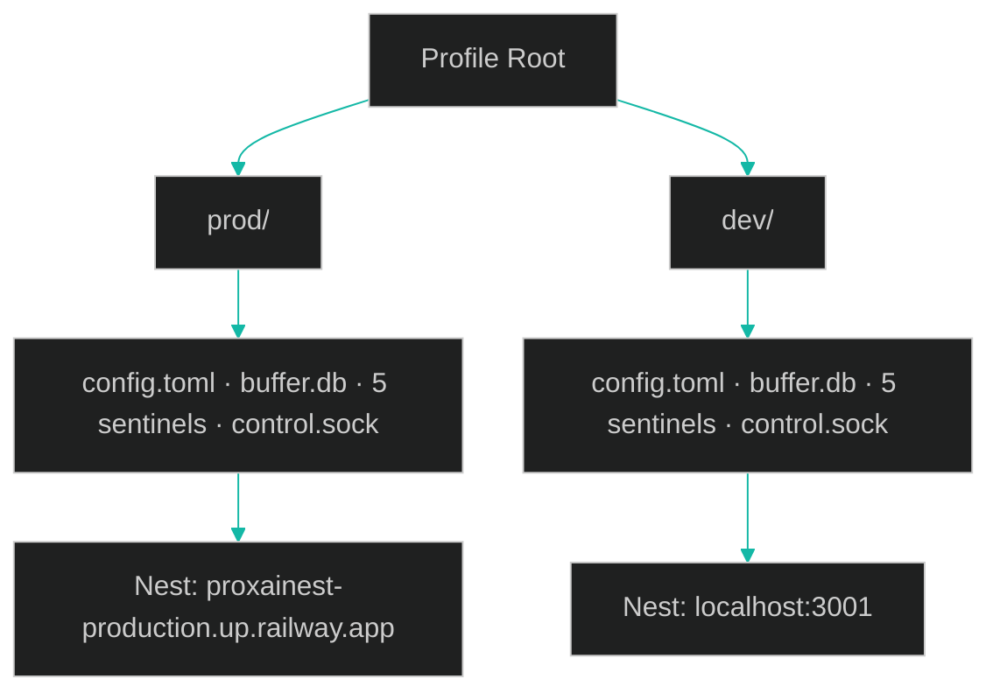
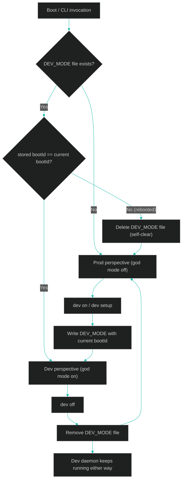
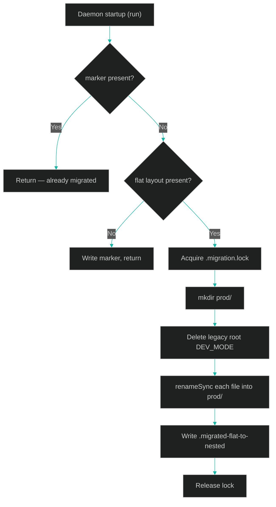
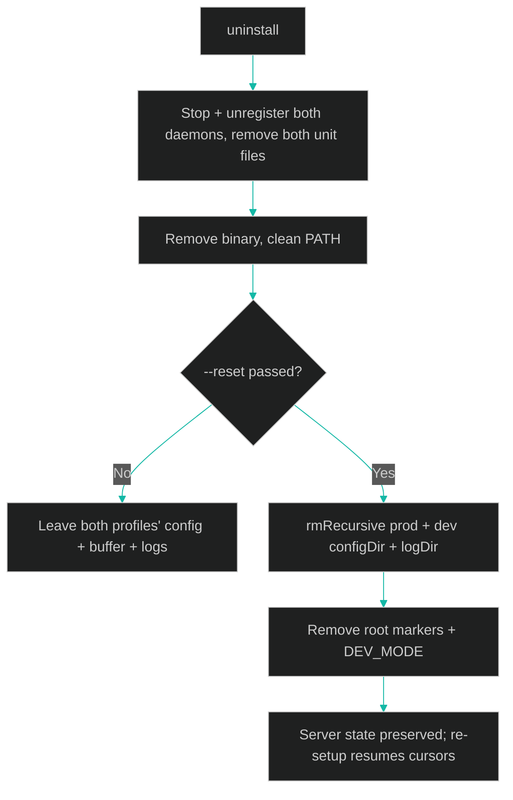

[← Previous: 6.4 Maintainer Debug Flags](./6.4-maintainer-debug-flags.md) · [Index](../README.md) · [Next: 7.1 Cross-Platform Differences →](../07-platform-and-deployment/7.1-cross-platform-differences.md)

# 6.5 Dev Mode and Profiles

*Last Updated: 2026-05-27*

> The gateway runs two fully isolated profiles — `prod` and `dev` — each with its own config, buffer, sentinels, logs, control socket, service unit, and Nest backend. A boot-scoped `DEV_MODE` flag selects which profile the CLI targets, how detailed `status` is, and whether the god-mode commands appear in `--help`. The flag never controls daemon lifecycle: daemons auto-start when their profile is configured, and they only ever stop on an explicit command.

This is the canonical explainer for dev-mode isolation. It covers the profile model, the boot-scoped flag and its locked semantics, the `dev` command surface, the dual service units, the one-time flat-to-nested relocation, and what `uninstall` does to each profile.

## What is a profile?

A profile is a complete, self-contained gateway installation. The gateway recognizes exactly two: `prod` (the default, operator-facing) and `dev` (a maintainer's local sandbox pointed at a local Nest). The two share nothing on disk except their common parent directory and a few root-level markers.

`ProfileName` is the literal union `'prod' | 'dev'` (`src/core/io/fs/profile.types.ts`), and `VALID_PROFILES` is `['prod', 'dev']`. Every command that touches profile state accepts `--profile <name>` and rejects anything outside that set with an explicit error.

`buildProfileContext(profile)` (`src/core/io/fs/profile.ts`) is the single factory that derives every per-profile path. The returned `ProfileContext` has these fields:

| Field | Value |
| --- | --- |
| `name` | `'prod'` or `'dev'` |
| `isDev` | `true` for the dev profile, `false` for prod |
| `configDir` | `<root>/<profile>/` |
| `configFilePath` | `<configDir>/config.toml` |
| `bufferDbPath` | `<configDir>/buffer.db` |
| `logDir` | per-profile log directory (separate root from `configDir`) |
| `sentinels` | the six sentinel paths under `configDir` (`AUTH_FAILED`, `BUFFER_FULL`, `SESSION_STOPPED`, `CONSENT_ACCEPTED`, `UPDATE_AVAILABLE`, `RESCUE_LEDGER`) |
| `controlSocketPath` | `<configDir>/control.sock` on POSIX; `\\.\pipe\proxai-gateway-control-<profile>` on Windows |
| `defaultNestBaseUrl` | prod → `https://proxainest-production.up.railway.app`; dev → `http://localhost:3001` |

The config root (`profileRootDir()`) is platform-shaped:

- macOS: `~/Library/Application Support/proxai/proxai-gateway/`
- Linux: `~/.config/proxai/proxai-gateway/`
- Windows: `%LOCALAPPDATA%\proxai\proxai-gateway\`

Each profile nests directly under that root, so prod state lives at `<root>/prod/` and dev state at `<root>/dev/`. The log directory has a *separate* per-platform root (`profileLogDirRoot()`) and the same `<root>/<profile>/` nesting — on macOS, for example, dev logs land in `~/Library/Logs/proxai/proxai-gateway/dev/`. The control socket is per-profile too, so the two daemons never collide on the same IPC endpoint.

The net effect: two daemons can run side-by-side, each capturing from the same local coding-agent sources, redacting through the same rules, and uploading to *different* Nest backends, without sharing a single byte of buffer or a single sentinel.

## What is the boot-scoped `DEV_MODE` flag?

`DEV_MODE` is a single file at the *root* of the config tree (`<profileRootDir()>/DEV_MODE`) — not inside either profile directory, because it is a global CLI-perspective switch, not per-profile state. Its body is JSON: `{ "bootId": "<current boot id>" }`.

`readDevModeSentinel(sentinelPath)` (`src/core/io/fs/dev-mode-sentinel.ts`) decides whether dev mode is active:

1. If the file does not exist → `false`.
2. Read and `JSON.parse` the body. If it is malformed, or `bootId` is not a string → return `false` (does not delete).
3. Compare the stored `bootId` against `readBootId()` (`src/core/system/boot-id.ts`). If they differ → return `false` (does not delete).
4. Only if they match → `true`.

The boot id is derived per-platform: macOS hashes `kern.boottime` from `sysctl`; Linux reads `/proc/sys/kernel/random/boot_id`; Windows hashes the OS `LastBootUpTime`. It changes on every reboot. That is what makes `DEV_MODE` **boot-scoped**: the flag is implicitly valid only for the current uptime session, and a reboot silently invalidates it.

This reuses the same boot-id self-clearing pattern as the `SESSION_STOPPED` sentinel.

### The locked semantics

These behaviors are deliberate design decisions, verified against the code:

- **Daemons auto-start whenever their profile is configured.** A configured profile's daemon comes up on boot (via the service unit), after a soft reinstall, and on `dev on`. Configuration — a written `config.toml` plus a registered service unit — is what drives the daemon, not the flag.
- **Dev mode never auto-activates.** `DEV_MODE` is only ever written by `dev on` / `dev setup`. Nothing auto-writes it, so you are never silently dropped into god mode.
- **`dev off` clears the flag but never stops the dev daemon.** Stops are always manual (`stop --profile dev`, or `uninstall`). Turning the perspective off leaves the dev daemon capturing and uploading in the background.
- **The perspective effectively self-clears on reboot.** Because the stored boot id stops matching after a reboot, the sentinel check returns `false` and you are back in the prod perspective by default — even though the physical sentinel file remains on disk and even if the dev daemon's service unit brought the dev daemon back up. The daemon's lifecycle and the CLI's perspective are fully decoupled.

When the flag *is* active, it controls exactly three things — none of which is daemon lifecycle:

1. **Which profile commands target by default.** With god mode on, `setup`, `logs`, and `doctor` default to `--profile dev` instead of `prod` (`main.ts` computes `defaultProfile = godMode ? 'dev' : 'prod'`).
2. **Status detail level.** `status` shows both profiles when god mode is on (it builds a dev `StatusContext` alongside prod), the same way `status --all` does explicitly.
3. **God-mode command visibility.** The developer commands are registered `{ hidden: !godMode }`, so they only appear in `--help` while dev mode is active. See [6.4 Maintainer Debug Flags](./6.4-maintainer-debug-flags.md) for the full list.

## How do I drive dev mode — the `dev` command?

The `dev` command (`src/cli/commands/dev.ts`, wired by `src/cli/wiring/dev-deps.ts`) is the single entrypoint for both the flag and the dev daemon. It is itself a god-mode command (hidden from `--help` unless dev mode is on), but you can always invoke it by name — it is how you *enter* god mode.

| Invocation | Behavior |
| --- | --- |
| `dev setup <KEY>` | The full bootstrap: verify the key against the **dev** Nest (`http://localhost:3001/ingestion/verify-key`), write `dev/config.toml`, register the dev service unit, start the dev daemon, then write the `DEV_MODE` flag. Refuses with a usage error if no key is given, and exits with an auth error if the key is rejected. |
| `dev on` | Write `DEV_MODE` with the current boot id. If the dev profile is already configured and its daemon is not running, start it. If not yet configured, prints a hint to run `dev setup <KEY>`. |
| `dev off` | Remove the `DEV_MODE` file. Prints `Dev daemon continues running in the background` — it never stops the daemon. |
| `dev` (no action) | Toggle: read the current flag state and flip it (an active flag → `dev off`, otherwise → `dev on`). |

Key verification for dev goes to the dev Nest base URL from the dev `ProfileContext`, never the prod backend. The dev config is built with `userId = 'dev'` and `installSource = 'github_release'`, and is written to the dev profile's `config.toml` path.

## Two profiles, two service units

Each profile gets its own platform service unit so the two daemons are independently managed by launchd / systemd / Scheduled Tasks. The unit identifiers come from `src/cli/service-unit/dev-labels.ts`:

| Platform | Prod identifier | Dev identifier |
| --- | --- | --- |
| macOS (launchd label) | `LAUNCHD_LABEL` | `${LAUNCHD_LABEL}.dev` |
| Linux (systemd unit) | `SYSTEMD_UNIT_NAME` (e.g. `proxai-gateway.service`) | same name with `-dev.service` (e.g. `proxai-gateway-dev.service`) |
| Windows (Scheduled Task) | `WINDOWS_TASK_NAME` | `${WINDOWS_TASK_NAME} (dev)` |

`profileLaunchdLabel`, `profileSystemdUnitName`, and `profileWindowsTaskName` resolve the right identifier for a given profile. The dev service unit runs the daemon with `--profile dev`, which loads `dev/config.toml` and uploads to the local Nest. Note the dev daemon also skips the post-respawn upgrade-restore step that prod runs (`run` only calls `runUpgradePostRespawnRestore` when `!profileCtx.isDev`). For the mechanics of how units are written and registered, see [6.2 Daemon and Service Unit](./6.2-daemon-and-service-unit.md).

## The flat→nested relocation

Older installs stored prod state *flat* at the config root — `config.toml`, `buffer.db`, and the sentinels directly under the profile root directory with no `prod/` subdirectory. The dev-mode-isolation work nests everything under `<profile>/`, so legacy state has to move once.

`relocateFlatToNested(root)` (`src/core/io/fs/migrate-flat-to-nested.ts`) performs that one-time move. It runs at daemon startup via `runDaemonStartupRelocation` (invoked at the top of the `run` command). The migration is:

- **One-time.** A `.migrated-flat-to-nested` marker is written at the root when done; the function returns immediately on a subsequent run if the marker exists.
- **Idempotent.** If no flat layout is present, it just writes the marker and returns. Each file is moved only if the source exists and the destination does not, so a partial move re-run does not clobber already-relocated files.
- **Atomic per file.** Files are moved with `renameSync` into the new `prod/` directory — `config.toml`, the buffer trio (`buffer.db`, `buffer.db-wal`, `buffer.db-shm`), and the five sentinels.
- **Lock-guarded.** A `.migration.lock` file (created with the exclusive `wx` flag, holding the PID) prevents two processes from migrating concurrently; a stale lock older than 60 s is reclaimed.
- **Drops the old flag.** Any legacy root-level `DEV_MODE` is deleted rather than moved — the old URL-flip semantics are dead, and the file is re-created fresh by `dev on` under the new boot-scoped contract.

After relocation, all prod reads and writes go through the nested `prod/` directory like any fresh install.

## What does uninstall do to each profile?

`uninstall` is profile-aware in one specific way: it always tears down *both* daemons and service units, but only `--reset` deletes profile *state*, and when it does, it deletes state for *both* profiles.

`runUninstall` (`src/cli/commands/uninstall/index.ts`) always:

- Stops and unregisters the **dev** service manager and removes the dev unit file (best-effort, swallowed if absent).
- Stops and unregisters the **prod** service manager and removes the prod unit file.
- Removes the binary and cleans the PATH entry from the shell rc / Windows User PATH.

Without `--reset`, that is the whole story: **both profiles' configs, buffers, and logs are left in place.** Re-running `setup` (or `dev setup`) picks the existing state back up.

With `--reset`, it additionally `rmRecursive`s four directories — prod `configDir`, prod `logDir`, dev `configDir`, dev `logDir` — and removes the root-level markers and locks: `.migrated-flat-to-nested`, `.upgrade-restore-state`, `.upgrade.lock`, `.migration.lock`, and `DEV_MODE`. So `--reset` wipes local state for **both profiles** at once. Server-side state is untouched; a later re-setup resumes cursors from the server's watermarks, and only pending un-uploaded batches are lost (their bytes get re-captured).

[← Previous: 6.4 Maintainer Debug Flags](./6.4-maintainer-debug-flags.md) · [Index](../README.md) · [Next: 7.1 Cross-Platform Differences →](../07-platform-and-deployment/7.1-cross-platform-differences.md)
