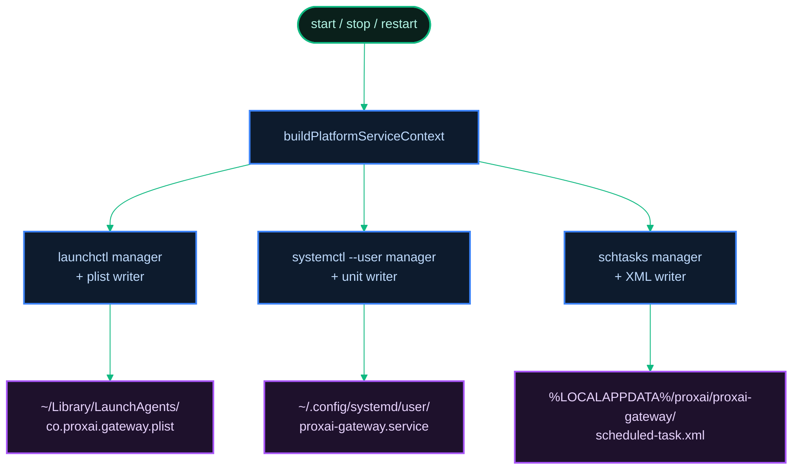

[← Previous: 6.4 Maintainer Debug Flags](../06-operations/6.4-maintainer-debug-flags.md) · [Index](../../README.md) · [Next: 7.2 Install, Upgrade & Uninstall →](./7.2-install-upgrade-uninstall.md)

# 7.1 Cross-Platform Differences

*Last Updated: 2026-05-27*

> Every place the gateway behaves differently on macOS, Linux, and Windows, gathered in one doc so any subsystem-specific doc can link out instead of duplicating.

The gateway runs on three operating-system families: macOS (darwin), Linux, and Windows (win32). Many subsystems behave identically across all three; some have load-bearing per-platform differences. This doc collects those differences along one axis at a time — service unit, paths, service manager, subprocess spawn, test traps, and install flow — so a developer working on a single subsystem can find every platform-specific consideration in one place.

The differences fall into roughly six categories: the service-management mechanism, on-disk path conventions, subprocess wrappers (launchctl vs. systemctl vs. schtasks), shell and spawn semantics, filesystem locking quirks (mostly Windows), and install-vector defaults. Each is enumerated below.

The gateway is a single source tree producing six native binaries. The test suite runs against all three OS families plus both major architectures (`x64` and `arm64`) on Windows. The CI matrix is **Linux + macOS arm64 + Windows x64 + Windows ARM64**. Tests that pass on one host but fail on another have historically traced back to a small set of recurring patterns — those are catalogued in this doc's "Test runner pitfalls" section below.

## Service unit per platform

Each platform has its own service-management mechanism and the gateway carries one unit-file writer plus one service-manager runner per platform.

| Platform | Unit file | Mechanism | Constant |
| --- | --- | --- | --- |
| macOS (darwin) | `~/Library/LaunchAgents/co.proxai.gateway.plist` | launchd LaunchAgent (macOS's per-user service manager) | `LAUNCHD_LABEL = 'co.proxai.gateway'` |
| Linux | `~/.config/systemd/user/proxai-gateway.service` | systemd user service (Linux's per-user service manager) | `SYSTEMD_UNIT_NAME = 'proxai-gateway.service'` |
| Windows | `<configDir>\scheduled-task.xml` registered as `ProxAI Gateway` | Task Scheduler (Windows' job-scheduling subsystem; tasks are described by XML files registered via `schtasks /Create /XML`) | `WINDOWS_TASK_NAME = 'ProxAI Gateway'` |

All three constants live in `src/cli/cli.constants.ts`. The writers live in `src/cli/service-unit/` (`launchd-plist.ts`, `systemd-unit.ts`, `scheduled-task-xml.ts`). The managers live in `src/cli/service-manager/` (`launchctl.ts`, `systemctl.ts`, `schtasks.ts`).



### macOS: launchd LaunchAgent

A plist at `~/Library/LaunchAgents/co.proxai.gateway.plist`. Key plist fields: `Label = co.proxai.gateway`, `ProgramArguments = [<programPath>, "run"]`, `RunAtLoad = true`, `KeepAlive = { SuccessfulExit = false }`. The plist is written at mode `0o644`.

The manager operates against the service name `gui/<uid>/co.proxai.gateway`. Lifecycle verbs:

| Action | Command |
| --- | --- |
| Register | `launchctl bootstrap gui/<uid> <plistPath>` |
| Start | `launchctl kickstart gui/<uid>/co.proxai.gateway` |
| Restart | `launchctl kickstart -k gui/<uid>/co.proxai.gateway` |
| Stop | `launchctl bootout gui/<uid>/co.proxai.gateway` |
| Status | `launchctl print gui/<uid>/co.proxai.gateway` |

(`bootstrap` is launchd's verb for "load this service descriptor into the GUI session"; `bootout` is the inverse.)

`parseLaunchctlPrint` extracts `pid = N` and either `spawn ts = <epoch>` or `start time = <epoch>` from `print` output so the daemon can surface PID and uptime in `status`.

### Linux: systemd user service

A unit file at `~/.config/systemd/user/proxai-gateway.service` with `Type=simple`, `Restart=on-failure`, `RestartSec=10s`, `ExecStart=<programPath> run`. The manager always runs `systemctl` with `--user` so no root or sudo is involved.

| Action | Command |
| --- | --- |
| Register | `systemctl --user daemon-reload` then `systemctl --user enable` |
| Start | `systemctl --user start` |
| Restart | `systemctl --user restart` |
| Stop | `systemctl --user stop` |
| Status | `systemctl --user show -p MainPID -p ActiveEnterTimestamp` |

**Lingering caveat.** A user systemd unit normally exits when the user logs out. To keep the gateway running across logout/login boundaries, the operator must enable lingering (the systemd term for "let this user's services run even when they're not logged in"): `loginctl enable-linger $(whoami)`. The gateway does not enable lingering automatically because `systemd-logind` requires elevated privileges. The README documents the follow-up; the install scripts do not run it.

### Windows: Task Scheduler task

A Scheduled Task XML at `<configDir>\scheduled-task.xml`, registered with the system task name `ProxAI Gateway`. The XML must be UTF-16 LE with a BOM (that is `schtasks /Create /XML`'s requirement) — `encodeScheduledTaskXml` produces that encoding.

Key XML fields: `LogonTrigger` (runs at user logon — no separate "at startup" entry, because the gateway is a per-user agent), `Principal.LogonType = InteractiveToken`, `Principal.RunLevel = LeastPrivilege` (no admin required), `MultipleInstancesPolicy = IgnoreNew`, `DisallowStartIfOnBatteries = false`, `ExecutionTimeLimit = PT0S` (no time limit), `RestartOnFailure = { Interval: PT1M, Count: 3 }`.

| Action | Command |
| --- | --- |
| Register | `schtasks /Create /TN "ProxAI Gateway" /XML <path> /F` |
| Start | `schtasks /Run /TN "ProxAI Gateway"` |
| Restart | `schtasks /End` then `/Run` |
| Stop | `schtasks /End /TN "ProxAI Gateway"` |
| Status | `schtasks /Query /TN "ProxAI Gateway" /FO LIST /V` |
| PID lookup | `tasklist /FI "IMAGENAME eq proxai-gateway.exe" /FO CSV /NH` |

schtasks does not include the PID in its output, so the runtime-info path runs an extra `tasklist` query (`tasklist` is Windows' list-processes utility) and parses the second CSV field to surface the PID in `status`.

[See operations: daemon & service unit](../06-operations/6.2-daemon-and-service-unit.md) for the full per-platform unit-file generators and lifecycle command flow.

## Config, buffer, log paths per platform

The on-disk locations differ per platform because each OS has its own convention for per-user state. The path resolution lives in `src/core/io/fs/paths.ts` and is the single source of truth.

| Purpose | macOS | Linux | Windows |
| --- | --- | --- | --- |
| Config + buffer + sentinels | `~/.proxai/proxai-gateway/` | `~/.proxai/proxai-gateway/` | `%LOCALAPPDATA%\proxai\proxai-gateway\` |
| Logs | `~/Library/Logs/proxai/proxai-gateway/` | `~/.local/state/proxai/proxai-gateway/log/` | `%LOCALAPPDATA%\proxai\proxai-gateway\Logs\` |
| Service unit | `~/Library/LaunchAgents/co.proxai.gateway.plist` | `~/.config/systemd/user/proxai-gateway.service` | `%LOCALAPPDATA%\proxai\proxai-gateway\scheduled-task.xml` (registered task: `ProxAI Gateway`) |
| Control IPC | `~/.proxai/proxai-gateway/control.sock` (Unix socket) | `~/.proxai/proxai-gateway/control.sock` (Unix socket) | `\\.\pipe\proxai-gateway-control` (named pipe) |
| Binary install (curl/PS1) | `~/.proxai/bin/proxai-gateway` | `~/.proxai/bin/proxai-gateway` | `%USERPROFILE%\.proxai\bin\proxai-gateway.exe` |

`configDir()` returns `<HOME>/.proxai/proxai-gateway/` on darwin/linux and `<LOCALAPPDATA>/proxai/proxai-gateway/` on Windows. `logDir()` returns `<HOME>/Library/Logs/proxai/proxai-gateway/` on darwin, `<HOME>/.local/state/proxai/proxai-gateway/log/` on linux, and `<LOCALAPPDATA>/proxai/proxai-gateway/Logs/` on Windows.

The `configDir()` location holds `config.toml`, `buffer.db`, every sentinel file, and (on Windows) the `scheduled-task.xml`. The `logDir()` location holds daily-rotated pino logs (`gateway-YYYY-MM-DD.log`).

The control socket (`control.sock`) is a Unix-domain socket on POSIX; on Windows it is a named pipe at `\\.\pipe\proxai-gateway-control`. The daemon recreates it on every start; it is not persistent state.

## Spawn / subprocess quirks

Every external-process invocation in the gateway uses `Bun.spawn` with a fully resolved path. The pattern is:

```ts
const resolved = Bun.which(name);
if (resolved === null) return { stdout: '', ok: false };
const proc = Bun.spawn([resolved, ...args], { stdout: 'pipe', stderr: 'pipe' });
```

The canonical reference is `src/services/uninstall/sweep.ts`. The reason for `Bun.which` first is Windows-specific: on Windows, `npm`, `pnpm`, `yarn`, `brew`, and similar tools are `.cmd` or `.bat` shims rather than `.exe`. Passing the bare name to `Bun.spawn` relies on the runtime's PATHEXT lookup, which has been inconsistent across Bun versions. Resolving the full path first sidesteps the problem; `Bun.spawn` handles the `.cmd`/`.bat` wrapping automatically when given the full path.

Other spawn-side notes:

- `/bin/sh` does not exist on Windows. Production code that needs to invoke a shell branches on `process.platform`. Tests prefer `bun -e '<script>'` for portability (bun is always present — it is the test runner).
- `chmod` is a no-op on Windows. `setModeSilent` in `core/io/fs/mode.ts` swallows errors; every `chmod` call in production is gated by `process.platform !== 'win32'`.
- Signal handling: SIGTERM/SIGINT work the same on all platforms, but launchd and systemd send SIGTERM to stop the daemon, while `schtasks /End` terminates the task more abruptly. The daemon installs handlers for both and exits cleanly on either.

The PowerShell-only invocations (Windows user PATH cleanup, certain registry queries during uninstall) go through `powershell.exe -NoProfile -Command <expr>`. The canonical reference is `src/services/uninstall/path-cleanup.ts`.

## Filesystem locking quirks (mostly Windows)

POSIX semantics let you unlink a file that has an outstanding handle; the kernel keeps the inode alive until the last handle closes. Windows refuses. Two subsystems have to handle the difference:

1. **SQLite cleanup after tests.** `bun:sqlite`'s `Database.close()` releases the SQLite handle synchronously, but the underlying OS file handle is owned by a JS object that GC frees later. On Windows, deleting a file with an outstanding kernel handle errors with `EBUSY`/`ENOTEMPTY`/`EPERM`. The canonical fix is `rmRecursive` in `src/core/io/fs/rm-recursive.ts` — a retry+gc wrapper that calls `Bun.gc(true)` and retries up to 10 times at 250 ms base backoff. Every test that opens a `bun:sqlite` database uses `rmRecursive` in its teardown and extends the `afterEach` timeout to 30 s.

2. **In-place binary replace.** The auto-upgrade flow's `replaceBinary` writes the new binary bytes over the running binary's path. POSIX lets a running process keep its mapped file even after `unlink` and overwrite. Windows refuses. The Windows branch of `replaceBinary` stages the bytes at `<binaryPath>.new` instead and prints "downloaded to `<binaryPath>.new`; restart the service to apply." The uninstall flow's Windows binary remover knows about `.new` siblings and cleans both files via a scheduled `cmd.exe del /F /Q` after a 3-second delay so the parent process has time to exit cleanly.

The `chmod` story is the third lock-adjacent quirk: Windows has no POSIX file modes, so `chmodSync(path, 0o600)` (used after writing `config.toml` and after creating `buffer.db`) is gated behind `process.platform !== 'win32'`.

## Test runner pitfalls

The gateway's CI matrix is Linux + macOS arm64 + Windows x64 + Windows arm64. Windows ARM64 emulates x64 binaries for things like `schtasks.exe` and is roughly 3x slower than the other runners. The test suite has accumulated a catalogue of patterns that recur across CI failures; the canonical reference is the team's `cross-platform-unit-tests` memory and the failure patterns there. The ones every contributor should know about:

| Pattern | What to do |
| --- | --- |
| Path assertions hardcode `/` | Use `node:path.sep` or `node:path.join`; never compare with literal `'/'` in `toContain` / `toBe`. |
| sqlite teardown on Windows | Use `rmRecursive` from `core/io/fs` (not `node:fs.rm`); extend `afterEach` timeout to 30 s. |
| `?immutable=1` URI on Linux/Windows | Pass `constants.SQLITE_OPEN_READONLY | constants.SQLITE_OPEN_URI` flags explicitly; the URI form is only implicit on macOS. |
| `/bin/sh` in test | Use `bun -e 'script'`; bun is always present. Branch on `process.platform` only when shell selection is under test. |
| ANSI escapes in captured CLI output | Strip with `stripAnsi(s)` before any regex/substring assertion. Chalk emits codes whenever the runtime detects color support, which is non-deterministic in CI. |
| 5000 ms default test timeout too short | Pass `30_000` as the third arg to `test(name, fn, timeout)` for any test that spawns a real platform binary or runs concurrent intervals. |
| OS-allocated inode in rotation test | Use synthetic `1001`/`1002`; ext4 reuses inodes and NTFS surfaces `FileId` inconsistently. |
| `mock.module()` leaks across files | Pair every `mock.module` with an `afterEach` that re-mocks back to `import * as ...Real from '<path>'`. `mock.restore()` does not undo module mocks. |
| `chmod` on Windows | Gate every `chmodSync`/`chmod` call behind `process.platform !== 'win32'`. Wrap in try/catch so transient permission errors never throw. |
| Inline TOML missing required field | Validation silently rejects → code falls through to `$HOME`-based default → `SQLITE_CANTOPEN` on CI runners that don't have a real buffer.db. Build test configs through the validator. |
| Optional binary not on CI PATH | Export `defaultSpawn`/`defaultWhich` and drive them with a guaranteed-present command (`bun -e` or `cmd /c echo`). |
| `/dev/null/<x>` to force write failure | Use a real tempdir + a regular file as the parent of the write path; produces `ENOTDIR` portably. |
| "Extreme path" tests on Windows | Use NUL byte (`\0`) embedded in the path string; `node:fs.stat` rejects it on every OS. |
| Poll/follow loops with default budgets | Inject `pollIntervalMs: 1` and size surrounding sleeps to cover ~5 poll cycles. |
| `Bun.spawn([bareName, ...])` in production | Always resolve via `Bun.which()` first; treat `null` as "not present" rather than letting spawn fail. |
| `--parallel` with `bun test --coverage` | Coverage runs are single-process (`bun test --coverage`), not `--parallel`. Per-worker coverage files do not merge cleanly in Bun 1.3.x. |
| CRLF/LF on Windows checkouts | `.gitattributes` enforces `* text=auto eol=lf` with explicit `crlf` for `.bat`/`.cmd`/`.ps1` and `binary` for archives. |
| `USERDOMAIN`/`USERNAME` resolution | Centralised in `cli/wiring/platform.ts:resolveWindowsUserId(env)`; tests pass an explicit env. |

Canonical reference files for cross-platform-correct patterns:

- `src/sources/gemini-cli/version.ts` — exported `defaultWhich` + `defaultSpawn` (Pattern 11).
- `src/services/uninstall/sweep.ts` — `Bun.which` + `Bun.spawn(resolved, ...)` (Pattern 15).
- `src/services/uninstall/path-cleanup.ts` — `powershell.exe -NoProfile -Command` pattern.
- `src/core/io/fs/rm-recursive.ts` — Windows-aware retry+gc wrapper.
- `src/cli/wiring/platform.ts` — `resolveWindowsUserId` for service-unit code paths (Pattern 18).
- `src/core/io/sqlite/open.ts` — `chmodSync` gate (Pattern 9), `SQLITE_OPEN_URI` flag (Pattern 3).

## Install flow variations per platform

The user-facing install path differs by OS:

- **macOS** — `curl -fsSL https://github.com/proxai/proxai_gateway/raw/main/install.sh | bash`. Apple-Silicon only; Intel Macs hit an explicit error and are pointed at building from source. The script writes to `~/.proxai/bin/proxai-gateway` and updates `~/.zshrc` (or `~/.bashrc` / `~/.bash_profile` depending on `$SHELL`).
- **Linux** — same curl-bash. Writes to `~/.proxai/bin/proxai-gateway`. After install, the user runs `proxai-gateway setup` and then `proxai-gateway start`. To keep the daemon running across logout/login, `loginctl enable-linger $(whoami)` is the one-line follow-up.
- **Windows** — `irm https://github.com/proxai/proxai_gateway/raw/main/install.ps1 | iex`. Writes to `%USERPROFILE%\.proxai\bin\proxai-gateway.exe` and updates the user-level `PATH` environment variable.
- **npm-family (all platforms)** — `npm install -g @proxai/gateway`. The `postinstall` hook (a script npm runs automatically after install) runs in Node, detects the OS/arch via `process.platform`/`process.arch`, downloads the matching binary from the tagged GitHub release, and places it in `<global-prefix>/@proxai/gateway/bin/`. The `proxai-gateway` shim in the package `bin` is a Node script that `spawnSync`s the downloaded native binary.

Once installed, the upgrade and uninstall flows also differ per platform — auto-upgrade replaces the binary in place on POSIX, stages at `<path>.new` on Windows; uninstall sweeps package managers and removes the binary, with the Windows path using a delayed `cmd.exe del` so a running parent process can exit cleanly first. The full lifecycle is in [install, upgrade and uninstall](./7.2-install-upgrade-uninstall.md).

[← Previous: 6.4 Maintainer Debug Flags](../06-operations/6.4-maintainer-debug-flags.md) · [Index](../../README.md) · [Next: 7.2 Install, Upgrade & Uninstall →](./7.2-install-upgrade-uninstall.md)
