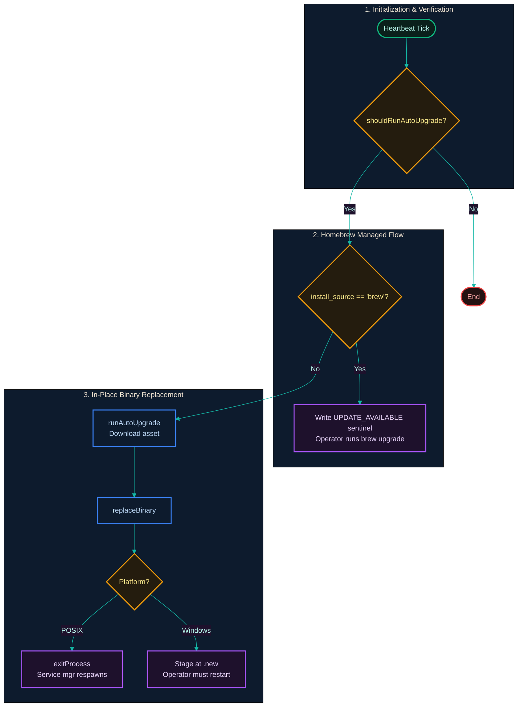
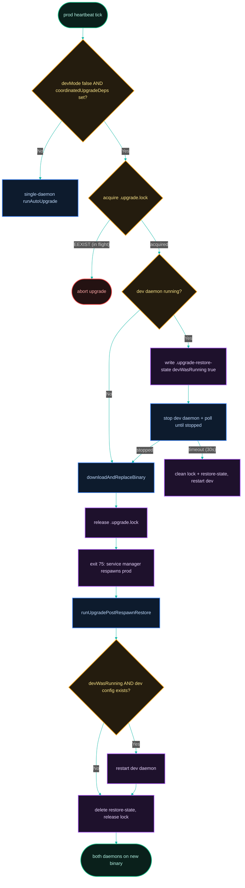

[← Previous: 7.1 Cross-Platform Differences](./7.1-cross-platform-differences.md) · [Index](../../README.md) · [Next: 7.3 Build & Release →](./7.3-build-and-release.md)

# 7.2 Install, Upgrade & Uninstall

*Last Updated: 2026-06-16*

> The lifecycle commands that put the gateway on a host, swap in a new release, or fully decommission it.

The gateway is distributed through six install sources, recorded as `account.install_source` in `config.toml`: `bun`, `pnpm`, `yarn`, `npm`, `brew`, and `github_release`.

Detection is by self-declaration — each install path invokes `proxai-gateway setup --install-source <name>` so the correct string ends up in the [config file](../06-operations/6.1-configuration.md). The npm/pnpm/yarn/bun postinstall hooks (a postinstall hook is a script the package manager runs automatically after install), the brew formula, and the shell installers (`install.sh` / `install.ps1`) each pass their respective source. The two shell installers target `~/.proxai/bin/proxai-gateway[.exe]` and update PATH in the user's shell rc files (zsh / bash on POSIX) or the user-level PATH env var (PowerShell).

`setup` writes and registers the **prod** profile's service unit only. The **dev** profile's service unit is created lazily — `proxai-gateway dev setup <KEY>` writes the dev config, then `registerDevServiceUnit` writes the dev unit (`run --profile dev`) and registers/starts the dev daemon. Both daemons then run simultaneously. The boot-scoped `DEV_MODE` flag at the shared profile root (toggled by `proxai-gateway dev on`/`off`) is a separate concern from whether the dev daemon exists — it gates dev-only behavior within a boot session and self-clears on `boot_id` mismatch.

## Inference when setup is implicit

When `start` or `restart` discovers no config file on disk, it auto-runs `setup` interactively. Because that wrapper has no `--install-source` flag, it calls `inferInstallSource(process.execPath, process.platform)` which lowercases the executable path, normalizes Windows separators, and matches against a small substring table — falling back to `github_release` if no match.

The heuristic exists only for the implicit auto-setup path; explicit installer scripts always pass `--install-source` directly. The valid output set is fixed at `VALID_INSTALL_SOURCES`, and anything else is coerced back to `github_release` before `runSetup` sees it.

## Auto-upgrade branches



Auto-upgrade is driven by the [heartbeat cycle](../04-daemon-loops/4.3-heartbeat-cycle.md)'s `shouldRunAutoUpgrade(ctx)` check. The branching is install-source-aware: on `brew`, the gateway writes the `UPDATE_AVAILABLE` sentinel and lets the operator run `brew upgrade` manually (because brew owns the install path under `/usr/local/Cellar/` or `/opt/homebrew/Cellar/` and the daemon never overwrites a brew-managed binary). On everything else, the gateway downloads the matched `proxai-gateway-<platform>-<arch>[.exe]` asset, replaces the binary, and on success calls `exitProcess()` so the service manager re-launches the daemon under the new binary.

Since the dev-mode isolation refactor the non-brew branch is **coordinated and dual-daemon-aware** — see the next section. The single-daemon `runAutoUpgrade` path still runs when no dev profile is configured.

A 4-hour rate limit on the GitHub call (`DEFAULT_VERSION_CHECK_INTERVAL_MS`) prevents the heartbeat from hammering the API.

## Coordinated dual-daemon upgrade

When both the prod and dev daemons are running, only **one** process may replace the shared binary, and the other must be quiesced first so it isn't holding the file (Windows) or racing the swap. The **prod daemon owns the upgrade**; the dev daemon is gated from ever triggering one.

The gating is structural. In the heartbeat cycle, the coordinated path runs only when `ctx.devMode !== true && ctx.coordinatedUpgradeDeps !== undefined` (`services/polling/heartbeat-cycle.ts`). The wiring `buildRunCoordinatedUpgradeDeps` returns `undefined` for the dev daemon (`isDev === true`) and also when no dev config exists — so a prod daemon with no dev sibling falls back to the plain single-daemon `runAutoUpgrade`, and the dev daemon never coordinates.

`coordinatedUpgrade` (`services/upgrade/coordinated-upgrade.ts`) uses two files at the **shared profile root**: `.upgrade.lock` (an exclusive `wx`-flagged lock holding the PID) and `.upgrade-restore-state` (JSON `{ devWasRunning: boolean }`, via `upgrade-restore-state.ts`). The sequence:

1. Acquire `.upgrade.lock` (`EEXIST` → another upgrade is in flight; abort).
2. Check whether the dev daemon is running. If it is, write `.upgrade-restore-state { devWasRunning: true }`, stop the dev daemon, and poll until it reports stopped (default 30 s budget, 500 ms interval). A dev daemon that won't stop in time aborts the upgrade (lock + restore-state cleaned up).
3. Download the asset and replace the binary (`downloadAndReplaceBinary`).
4. Release `.upgrade.lock`. On any error in steps 2–3, the dev daemon is best-effort restarted and the lock is released before the error propagates.
5. The prod daemon exits with `EXIT_CODE.upgradeRespawn` (75) so its service manager respawns it on the new bytes.

After the prod daemon respawns, its `run` path calls `runUpgradePostRespawnRestore` (`main.ts`, guarded by `!profileCtx.isDev`): it reads `.upgrade-restore-state`, and if `devWasRunning` was true **and** the dev config still exists, restarts the dev daemon — then deletes the restore-state and releases any lingering lock. This is what brings the dev daemon back online under the new binary.



## Manual upgrade flow

The manual `upgrade` command (`cli/commands/upgrade.ts`) is **not** coordinated — it is a one-shot download-and-replace that adds an interactive prompt, a comparison against the local version, and explicit error reporting. It does **not** stop the dev daemon and does **not** restart any daemon: the operator is expected to run `proxai-gateway restart` themselves so the running process re-execs from the new bytes. (Coordination is the daemon-driven heartbeat path described above; the manual command is for a hands-on operator who manages the restart sequence.)

Windows is the special case: `replaceBinary` cannot overwrite a running `.exe`, so the bytes are staged at `<binaryPath>.new` and the upgrade command prints "downloaded to <binaryPath>.new; restart the service to apply" with explicit swap instructions. The uninstall flow's Windows binary remover knows about `.new` siblings and cleans both files via a scheduled `cmd.exe` `del /F /Q` after a 3-second delay.

## Stale-binary recovery

The stale-binary policy (covered in [heartbeat](../04-daemon-loops/4.3-heartbeat-cycle.md) and [sentinels](../04-daemon-loops/4.4-sentinels.md)) ramps in two stages: at 30 days since install, `tail --level warn` surfaces `stale_binary.warning` events; at 60 days, `checkStaleBinary` logs `stale_binary.stale`. Neither stage halts the daemon — the same heartbeat tick's auto-upgrade is the recovery mechanism, downloading the new binary, calling `replaceBinary`, and exiting with `EXIT_CODE.upgradeRespawn` (75) so the service manager respawns the daemon on the new bytes.

`setup new` deliberately preserves the prior `installedAt` so a key rotation does not silently reset the clock. To push the clock forward, run `uninstall --reset` followed by a fresh `setup`.

## Uninstall semantics

The uninstall flow is dual-daemon-aware and has two semantics:

- **`uninstall`** (alias `rm`) stops and unregisters **both** the dev and prod service managers, deletes **both** unit files, sweeps the package managers (`npm ls -g`, `pnpm ls -g`, `yarn global list`, `bun pm ls -g`, `brew list`) for `@proxai/gateway` / `proxai-gateway`, removes the binary, and cleans PATH. It preserves **both profiles'** `config.toml`, `buffer.db`, sentinels, and log directories — a future `setup` on this host inherits the previous install's `installedAt`.
- **`uninstall --reset`** additionally `rmRecursive`s **all four** profile directories (prod `configDir`, prod `logDir`, dev `configDir`, dev `logDir`) and removes the shared root markers, wiping every trace of per-host state. A fresh `setup` after `--reset` gets a new `installedAt = now()`.

## What install paths exist and how is each detected?

Six install sources, declared in `VALID_INSTALL_SOURCES`: `bun`, `pnpm`, `yarn`, `npm`, `brew`, `github_release`.

Detection is by self-declaration, not by introspection: the install script of each path invokes `proxai-gateway setup --install-source <name>` so the matching string ends up in `config.toml`'s `account.install_source` field. The CLI `main.ts` declares the default for `setup --install-source` as `github_release`, so anything that does not explicitly set the flag is treated as a curl-bash / install.ps1 install. The npm/pnpm/yarn/bun postinstall hooks, the brew formula, and the shell installers each pass the correct source.

The two shell installers (`install.sh` / `install.ps1`) target `~/.proxai/bin/proxai-gateway[.exe]` and update PATH in the user's shell rc files (zsh / bash on POSIX) or user-level `PATH` env var (PowerShell).

## How is `install_source` recorded?

Explicit `setup --install-source <name>` wins in every case where the user (or an installer script) runs setup directly. The implicit path is the auto-setup triggered by `start` (or `restart`) when no config exists: that wiring goes through `invokeSetupInteractive`, which has no flag to pass, so it calls `inferInstallSource(process.execPath, process.platform)` (`src/services/config/install-source-infer.ts`). The function lowercases `execPath`, normalizes Windows separators to `/`, and returns the first match from:

| substring in execPath | install_source |
| --- | --- |
| `/.proxai/bin/` | `github_release` |
| `/cellar/` or `/linuxbrew/` | `brew` |
| `/.bun/install/global/` | `bun` |
| `/pnpm/` or `/.pnpm/` | `pnpm` |
| `/.yarn/` or `/yarn/global/` | `yarn` |
| `node_modules/@proxai/` | `npm` |

The fallback is `github_release`. The heuristic is a best-effort guess for the "user ran `start` on a fresh machine and we silently invoked setup" path; it never overrides an explicit `--install-source` passed to `setup`. The valid output set is fixed at `VALID_INSTALL_SOURCES` — `buildSetupOptions` coerces any unknown string back to `github_release` before `runSetup` sees it.

## How does the auto-upgrade flow decide what to do?

`shouldRunAutoUpgrade(ctx)` in the heartbeat cycle has two branches:

- **`installSource === 'brew'`** → sentinel-only. The heartbeat runs `checkLatestVersion`; if a newer release exists, it writes `UPDATE_AVAILABLE` with `{ latest_version, current_version, detected_at, asset_url? }`. The operator runs `brew upgrade` themselves; the gateway never overwrites a brew-managed binary because brew owns the path under `/usr/local/Cellar/` or `/opt/homebrew/Cellar/`.
- **everything else** → binary replace. Two sub-paths:
  - **Coordinated** (`devMode !== true && coordinatedUpgradeDeps !== undefined`, i.e. the prod daemon with a configured dev sibling): runs `coordinatedUpgrade` — stop dev, replace binary, exit 75, restart dev after respawn (see the coordinated dual-daemon upgrade section above).
  - **Single-daemon** (no dev sibling): `runAutoUpgrade` fetches the matching `proxai-gateway-<platform>-<arch>[.exe]` asset, calls `replaceBinary(binaryPath, bytes, platform)`, and on success calls `exitProcess()` so the service manager restarts the daemon under the new binary.

The dev daemon never triggers an upgrade: `runAutoUpgrade` short-circuits on `devMode === true`, and the coordinated wiring returns `undefined` for the dev profile. A 4-hour rate limit on the GitHub call (`DEFAULT_VERSION_CHECK_INTERVAL_MS`) prevents the heartbeat from hammering the API.

## What does the manual `upgrade` command do?

`proxai-gateway upgrade [--yes] [--force]` (`cli/commands/upgrade.ts`):

1. `fetchLatestRelease(...)` → reads the GitHub latest-release JSON with a 5 s timeout.
2. `compareVersions(latestVersion, currentVersion)`. If `<= 0` and not `--force`, prints "already at latest version" and exits 0.
3. Prompts `upgrade to <latestVersion>?` unless `--yes` or stdout is not a TTY.
4. `findAssetForPlatform(...)` → picks `proxai-gateway-<platform>-<arch>[.exe]`. Missing asset is a fatal error.
5. `downloadAsset(...)` with a 120 s timeout.
6. `replaceBinary(...)` — On POSIX, this writes the binary to `<binaryPath>.new`, sets permissions to `0o755`, and atomically renames it over the target binary. On Windows, it writes to `<binaryPath>.new` (see next section).

The command does *not* restart the daemon — operators are expected to run `proxai-gateway restart` themselves so the running process re-execs from the new bytes.

## Binary replacement mechanics (POSIX vs. Windows)

Operating systems handle modifications to active executables differently:
- **POSIX (macOS & Linux)**: POSIX allows modifying directory entries of running programs. The `replaceBinary` utility writes the new binary bytes to `<binaryPath>.new`, applies execution permissions (`0o755`) via `chmod`, and then atomically renames the staged file over the active `<binaryPath>` using the `rename` system call. The running daemon process continues running its existing loaded program image in memory, but any subsequent launch or exec will run the new binary bytes.
- **Windows**: Windows locks active executable files, preventing them from being overwritten or deleted. On `win32`, `replaceBinary` stages the new bytes at `<binaryPath>.new` and returns it as a staged sibling.

For Windows, the manual `upgrade` command outputs a message instructing the operator to stop the daemon, swap `<binaryPath>.new` into `<binaryPath>`, and restart. For the automatic upgrade and uninstall flows, the cleanup of `<binaryPath>.new` is handled by the system. During uninstall, the Windows binary remover schedules a detached `cmd.exe` command that waits for 3 seconds (via a local ping delay) to allow the uninstall process to terminate, deletes the main executable, deletes the `<binaryPath>.new` sibling, and removes the install directory.

## What is the stale-binary policy in practice?

Two thresholds enforced by `checkStaleBinary` (defaults `30` and `60`, both in days):

- `daysSinceInstall >= warnAfterDays` → log `event: stale_binary.warning`. No sentinel; just a structured log line that `tail --level warn` can surface.
- `daysSinceInstall >= pauseAfterDays` → log `event: stale_binary.stale`. The daemon keeps running; the same heartbeat tick's auto-upgrade replaces the binary and the service manager respawns the daemon on it (exit code 75).

A zero threshold disables that level. `installedAt` is the ISO-8601 timestamp recorded on first `setup`; it is preserved across `setup new` re-runs so a key rotation does not silently reset the staleness clock.

## What does plain `uninstall` do vs. `uninstall --reset`?

`proxai-gateway uninstall` (alias `rm`):

1. Confirms with a phrase prompt unless `--yes` (the phrase is `uninstall` or, with `--reset`, `uninstall --reset`).
2. **Watchdog timer unregistration**: Before shutting down the main daemons, the uninstall process first stops and unregisters any configured watchdog managers for both the dev and prod profiles:
   - If `devWatchdogManager` is configured, it invokes `.uninstall()`, then deletes all unit files specified in `devWatchdogUnitPaths` (such as `.plist`, `.xml`, `.timer`, and `.service` files).
   - If `watchdogManager` is configured, it invokes `.uninstall()`, then deletes all unit files specified in `watchdogUnitPaths`.
   
   Under the hood, the `WatchdogManager` performs platform-specific unregistration:
   - **macOS (`darwin`)**: Checks if the watchdog is registered via `launchctl print gui/<uid>/<label>` and, if present, stops/unregisters it via `launchctl bootout gui/<uid>/<label>`.
   - **Linux (`systemd`)**: Stops and disables the timer using `systemctl --user disable --now <timerName>` and reloads the configuration with `systemctl --user daemon-reload`.
   - **Windows (`schtasks`)**: Verifies the task existence with `schtasks /Query /TN <taskName>` and deletes it with `schtasks /Delete /TN <taskName> /F`.
3. **Dev daemon teardown** (if a dev service manager is wired): `devServiceManager.stop()` and `.unregister()` (best effort), then delete the dev unit file.
4. **Prod daemon teardown**: `serviceManager.stop()` then `.unregister()` (best effort), then delete the prod unit file.
5. If `--reset`: `rmRecursive` on prod `configDir`, prod `logDir`, dev `configDir`, dev `logDir`, then remove the shared root markers `.migrated-flat-to-nested`, `.upgrade-restore-state`, `.upgrade.lock`, `.migration.lock`, `DEV_MODE`.
6. **Package manager sweep**: Sweeps global package installations using `npm`, `pnpm`, `yarn`, `bun`, and `brew`:
   - `npm`: Checks via `npm ls -g --depth=0 --json @proxai/gateway` and uninstalls via `npm uninstall -g @proxai/gateway`.
   - `pnpm`: Checks via `pnpm ls -g --depth=0 --json @proxai/gateway` and uninstalls via `pnpm uninstall -g @proxai/gateway`.
   - `yarn`: Checks via `yarn global list --json` (looks for `"@proxai/gateway@` in lines) and uninstalls via `yarn global remove @proxai/gateway`.
   - `bun`: Checks via `bun pm ls -g` (looks for `@proxai/gateway`) and uninstalls via `bun remove -g @proxai/gateway`.
   - `brew`: Checks via `brew list --formula --versions proxai-gateway` and uninstalls via `brew uninstall proxai-gateway`.
   
   For any detected global installation, the tool prompts or uninstalls the global package.
7. **Binary removal**: Removes the binary itself. On POSIX, `createPosixBinaryRemover` unlinks the executable and removes the installation directory if empty. On Windows, `createWindowsBinaryRemover` spawns a detached `cmd.exe` script that delays for 3 seconds (`ping -n 3 127.0.0.1 >nul`), deletes the executable, deletes the `.new` sibling, and removes the installation directory.
8. **PATH cleanup**: Removes the install directory entries. On POSIX, it cleans the installer marker blocks out of `~/.zshrc`, `~/.bashrc`, and `~/.bash_profile`. On Windows, it spawns `powershell.exe` with a PATH cleaner script to safely clean the User registry path:
   ```powershell
   $d = $env:PROXAI_INSTALL_DIR; if (-not $d) { exit 0 } ; $cur = [Environment]::GetEnvironmentVariable('PATH', 'User'); if (-not $cur) { exit 0 } ; $entries = $cur -split ';' | Where-Object { $_ -and $_.TrimEnd('\\') -ne $d.TrimEnd('\\') } ; [Environment]::SetEnvironmentVariable('PATH', ($entries -join ';'), 'User')
   ```

`--reset` is the only thing that touches per-host state (step 4 above); plain `uninstall` skips it entirely.

**What's preserved with plain `uninstall`**: both profiles' `config.toml`, `buffer.db`, sentinels, and log files, plus the shared root markers. The next `setup` on this host inherits the previous install's `installedAt` (the file is still there); a fresh setup after `--reset` gets a new `installedAt`. Server-side state is preserved either way — re-setup resumes cursors from the server; only pending unuploaded batches are lost and re-captured.

[← Previous: 7.1 Cross-Platform Differences](./7.1-cross-platform-differences.md) · [Index](../../README.md) · [Next: 7.3 Build & Release →](./7.3-build-and-release.md)
