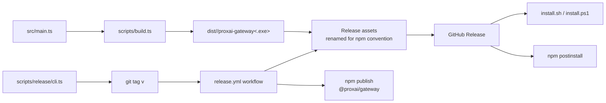

[← Previous: 7.2 Install, Upgrade & Uninstall](./7.2-install-upgrade-uninstall.md) · [Index](../README.md) · [Next: 7.4 CI/CD Pipeline →](./7.4-ci-cd-pipeline.md)

# 7.3 Build & Release

> How the six per-platform binaries are produced, the release CLI that tags and pushes a version, and the install vectors a release feeds.



A release happens in three phases:

1. **Local prep.** A developer runs `bun scripts/release/cli.ts` (`bun run release`). It runs `bun run validate`, computes the next CalVer tag — CalVer is Calendar Versioning: the version IS the date (e.g., `2026.5.8`), not a semver triple — and pushes the tag to GitHub.
2. **CI build + publish.** GitHub Actions sees the tag, builds all six binaries in parallel, renames them for npm conventions, creates the GitHub Release with checksums, and publishes the npm package.
3. **User install.** The user's install vector (curl-bash, npm, brew-future, scoop-future) pulls the matching binary from the GitHub Release.

CalVer is the right model here because the gateway isn't a library; downstream consumers don't care about API breakage, they care about freshness. The date IS the version.

## The two scripts that own the artifact

| Script | Owns |
| --- | --- |
| `scripts/build.ts` | Runs `bun build --compile` for one or all of the six targets. Produces `dist/<target>/proxai-gateway[.exe]`. |
| `scripts/publish-npm.ts` | Stages the `npm-build/` directory with a fresh `package.json`, `shim.js`, `postinstall.js`, `README.md`, and `LICENSE`. The CI release workflow runs this and then `npm publish` from inside `npm-build/`. |
| `scripts/release/cli.ts` | The local release CLI. Wraps the `runPublish` core in `scripts/release/publish.ts` with real git operations and an `@inquirer/prompts` confirm. |
| `scripts/release/publish.ts` | The pure orchestration logic: clean-tree check, branch check, sync check, validate run, version compute, tag create, tag push. Wholly DI-driven so tests can inject mock git ops. |
| `scripts/release/versioning.ts` | The CalVer math: parse, format, compare, "today UTC", "next version". |

The build script and the publish-npm script are independent — the release workflow runs the build script across the matrix on six runners, collects the artifacts, and runs the publish script on a single runner.

## Build script

`scripts/build.ts` is the single entry-point for producing a binary. It enumerates six targets:

```ts
const TARGETS: readonly Target[] = [
  { platform: 'darwin', arch: 'arm64' },
  { platform: 'darwin', arch: 'x64' },
  { platform: 'linux', arch: 'arm64' },
  { platform: 'linux', arch: 'x64' },
  { platform: 'windows', arch: 'x64' },
  { platform: 'windows', arch: 'arm64' },
];
```

`bun scripts/build.ts <target>` builds one. `bun scripts/build.ts` with no argument builds all six in series. Unknown target names exit with code 2 and the list of valid targets.

Each invocation spawns `bun build --compile --target=bun-<platform>-<arch> --outfile=dist/<platform>-<arch>/proxai-gateway[.exe] src/main.ts`. The `Bun.spawn` is wired with `stdout: 'inherit'` and `stderr: 'inherit'` so the bun build output streams through unchanged.

`package.json` exposes per-target aliases:

```json
"build:darwin-arm64": "bun scripts/build.ts darwin-arm64",
"build:darwin-x64":   "bun scripts/build.ts darwin-x64",
"build:linux-arm64":  "bun scripts/build.ts linux-arm64",
"build:linux-x64":    "bun scripts/build.ts linux-x64",
"build:windows-x64":  "bun scripts/build.ts windows-x64",
"build:windows-arm64":"bun scripts/build.ts windows-arm64"
```

The `validate` script ends with `bun run build:darwin-arm64`, which is the closest a developer on Apple Silicon gets to "would this release build?" without running the full CI matrix.

See [cross-platform binaries](../01-foundations/1.3-cross-platform-binaries.md) for the per-target output paths and how each install vector picks the matching binary.

## Per-platform binaries on GitHub releases

The release workflow uploads five assets to each tagged GitHub release plus a checksum file:

```
proxai-gateway-darwin-arm64
proxai-gateway-linux-arm64
proxai-gateway-linux-x64
proxai-gateway-win32-arm64.exe
proxai-gateway-win32-x64.exe
checksums.txt
```

The naming convention is `proxai-gateway-<platform>-<arch>[.exe]`. The `<platform>` segment uses the npm/Node convention (`win32` instead of `windows`) so the npm postinstall picks up the right file directly via `process.platform`. The mapping from the build-output directory name (`windows-x64`) to the release asset name (`win32-x64`) is the `REMAP` block in `.github/workflows/release.yml`:

```sh
declare -A REMAP=(
  [darwin-arm64]=darwin-arm64
  [linux-arm64]=linux-arm64
  [linux-x64]=linux-x64
  [windows-x64]=win32-x64
  [windows-arm64]=win32-arm64
)
```

`darwin-x64` is intentionally not in the release — the curl-bash installer hard-rejects Intel Macs and points at building from source. The build target is kept available for developers who need it; the matrix in the release workflow simply omits it.

`checksums.txt` is generated by `sha256sum` over the renamed files in `release/`. The action used to attach the assets is `softprops/action-gh-release@v2` with `make_latest: 'true'` and `fail_on_unmatched_files: true`.

## Release CLI (`scripts/release/cli.ts`)

`bun run release` is the developer entry-point. It wraps `runPublish` (from `scripts/release/publish.ts`) with default implementations of the git operations and the user prompt:

```ts
const result = await runPublish(
  {
    git: defaultGitOps(),
    runValidate: defaultRunValidate,
    prompt: defaultPrompt,
    log: (line) => console.log(line),
  },
  options,
);
```

`runPublish` performs these steps in order, aborting with a `PublishAbortError` at the first failure:

1. **Ensure the working tree is clean.** `git status --porcelain` must be empty.
2. **Ensure the current branch is `main`.** Anything else aborts.
3. **Ensure local `main` is synced with `origin/main`.** `git fetch origin main`, then `git rev-parse HEAD` must equal `git rev-parse origin/main`.
4. **Run `bun run validate`.** Skippable with `--skip-validate`. The full validate runs lint-fix, format, typecheck, the test suite, and `build:darwin-arm64`.
5. **Compute the next version.** Lists `git tag --list "v*"`, picks the highest CalVer, compares to today UTC, returns either today's date with no suffix (if today is greater than the latest tag's date) or the latest date with `suffix + 1` (if a same-day retry is needed).
6. **Print summary.** Latest tag, today's date, computed next version, tag to push.
7. **Prompt for confirmation** unless `--yes` was passed.
8. **Create and push the tag.** `git tag -a <name> -m <name>`, then `git push origin <name>`.

CLI flags:

- `--dry-run` — print everything up to and including the summary, then exit without tagging.
- `--yes` / `-y` — skip the confirm prompt.
- `--skip-validate` — skip the `bun run validate` step. Use only when validate has just run successfully.

The release CLI never publishes anything itself — pushing the tag is what triggers the CI release workflow, which does the actual artifact build and release publication. This decoupling is deliberate: a developer can dry-run safely, and a hot retry is `git tag -d <name> && git push --delete origin <name> && bun run release`.

## CalVer versioning (`scripts/release/versioning.ts`)

The gateway uses pure CalVer — `YYYY.M.D`, with `M` and `D` not zero-padded. Today's release version is literally today's date in UTC. There is no major/minor/patch concept.

```ts
export function todayUtc(now: Date = new Date()): Version {
  return {
    year: now.getUTCFullYear(),
    month: now.getUTCMonth() + 1,
    day: now.getUTCDate(),
    suffix: null,
  };
}
```

`computeNextVersion(latest, today)` is the next-version policy in 7 lines:

```ts
if (latest === null)              return today;                       // first ever release
if (latest.date < today.date)     return today;                       // first release today
                                   return { ...latest, suffix: (latest.suffix ?? 0) + 1 };  // same-day retry
```

Same-day retries get a `-N` hyphen suffix (`2026.5.8`, `2026.5.8-1`, `2026.5.8-2`, ...). The hyphen is npm-compatible SemVer pre-release syntax — a dot like `2026.5.8.2` would be a 4-component version that breaks `npm publish`. The team rule is firm: never bump the date for a failed retry, always suffix the same date.

`parseVersion` and `formatVersion` round-trip the `Version` struct through the tag string. The CI release workflow strips the leading `v` and feeds the rest as `--no-git-tag-version` to `npm version` so the published package's version matches the tag.

## npm package preparation (`scripts/publish-npm.ts`)

The npm package is **not** the source repo. It is a thin downloader staged into `npm-build/` from a five-line `package.json` template plus four file copies:

```ts
const pkg = {
  name: '@proxai/gateway',
  version: root.version,
  description: root.description,
  ...
  bin: { 'proxai-gateway': 'shim.js' },
  scripts: { postinstall: 'node postinstall.js' },
  engines: { node: '>=18' },
  files: ['shim.js', 'postinstall.js', 'README.md', 'LICENSE'],
};
```

`scripts/publish-npm.ts` runs in five steps:

1. `rm -rf npm-build/`.
2. Read the root `package.json` for name/version/description/homepage/repository/bugs/keywords/author/license.
3. Write `npm-build/package.json` with the trimmed schema above.
4. Copy `npm/shim.js`, `npm/postinstall.js`, root `README.md`, and root `LICENSE` into `npm-build/`.
5. Print the publish instructions: `cd npm-build && npm publish --access public`.

The CI release workflow runs this script, then `npm publish --access public --tag latest` from inside `npm-build/`. The `NPM_TOKEN` secret gates the publish step; if it is missing, the workflow emits a warning and skips the publish (the GitHub Release itself is unaffected).

The npm package is intentionally a downloader: the `postinstall` hook detects `process.platform` + `process.arch`, downloads the matching native binary from the just-tagged GitHub Release, and places it in the package's `bin/` directory. The `shim.js` is a Node script that `spawnSync`s the downloaded native binary on every invocation. See [cross-platform binaries](../01-foundations/1.3-cross-platform-binaries.md) for the URL construction.

## Install vectors

A release feeds five install vectors (three live, two future):

| Vector | Source | Lands at |
| --- | --- | --- |
| curl-bash (macOS / Linux) | `install.sh` from `main` branch | `~/.proxai/bin/proxai-gateway` |
| PowerShell (Windows) | `install.ps1` from `main` branch | `%USERPROFILE%\.proxai\bin\proxai-gateway.exe` |
| npm-family (all platforms) | `npm install -g @proxai/gateway` (or pnpm/yarn/bun) | `<global-prefix>/@proxai/gateway/bin/proxai-gateway[.exe]` |
| brew (future, macOS) | `brew install proxai/tap/proxai-gateway` | `/usr/local/Cellar/...` or `/opt/homebrew/Cellar/...` |
| scoop (future, Windows) | `scoop install proxai-gateway` | `%USERPROFILE%\scoop\apps\proxai-gateway\current\` |

Each vector arrives at the same binary. The user-self-declared `install_source` field in `config.toml` is what tells the gateway which vector it came from — that string drives the upgrade branching (`brew` writes the `UPDATE_AVAILABLE` sentinel; everything else replaces the binary in place). See [install, upgrade and uninstall](./7.2-install-upgrade-uninstall.md) for the lifecycle details.

## CalVer rules in practice

The rules the team applies:

- **Today's date is the version.** `2026-05-11` → `v2026.5.11`. No zero-padding.
- **Same-day retry uses `-N`.** Failed publish on `2026.5.8` → `2026.5.8-1`, `2026.5.8-2`, ... Same date, hyphen suffix.
- **Never bump the date for a failed retry.** A `2026.5.8` failure must not be republished as `2026.5.9`. That skips a slot in npm history, pushes the version ahead of the calendar (making tomorrow's release have to be `2026.5.10`), and breaks the "version equals today's date" invariant.
- **Tag is `v<version>`.** The release workflow consumes `github.ref_name`, strips the leading `v`, and uses the rest as the npm-stamped version.

For day-to-day work, `bun run release` does all of this automatically. The developer just runs it.

## Release artifacts on a GitHub Release

After a successful CI run on a `v*` tag push, the resulting GitHub Release page carries:

- Six (currently five — see above) binaries named `proxai-gateway-<platform>-<arch>[.exe]`.
- `checksums.txt` with SHA-256 hashes for each binary.
- Auto-generated release notes (the `generate_release_notes: true` option on `softprops/action-gh-release@v2` pulls commits since the previous tag).

The release itself is marked `make_latest: 'true'`, which is what makes `https://github.com/proxai/proxai_gateway/releases/latest/download/proxai-gateway-<platform>-<arch>[.exe]` resolve to the freshest binary. The install scripts use that path by default, so a user's curl-bash install picks up the newest release without naming a version.

`PROXAI_GATEWAY_VERSION` is the override: setting it (e.g. `PROXAI_GATEWAY_VERSION=v2026.5.7 curl ... | bash`) switches the install path to `download/${version}` and pins to a specific release. The npm version override is `npm install -g @proxai/gateway@<version>` — same effect.

[← Previous: 7.2 Install, Upgrade & Uninstall](./7.2-install-upgrade-uninstall.md) · [Index](../README.md) · [Next: 7.4 CI/CD Pipeline →](./7.4-ci-cd-pipeline.md)
