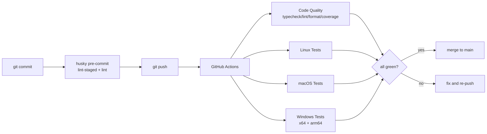
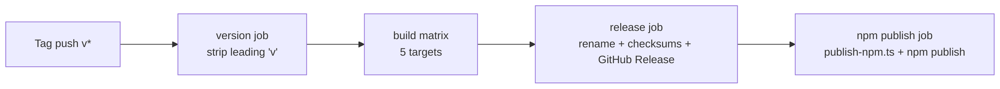

[← Previous: 7.3 Build & Release](./7.3-build-and-release.md) · [Index](../README.md)

# 7.4 CI/CD Pipeline

> The GitHub Actions workflows under `.github/workflows/`, the local pre-commit hook, and what gates a change before it reaches `main` or a release.

| Workflow | File | Trigger | What it does |
| --- | --- | --- | --- |
| Code Quality | `code-quality.yml` | push to `main`, PR to `main` | typecheck + lint + format-check + tests with coverage |
| Linux | `test-linux.yml` | push to `main`, PR to `main` | unit tests on Ubuntu 24.04 ARM64 |
| macOS | `test-macos.yml` | push to `main`, PR to `main` | unit tests on macOS arm64 |
| Windows | `test-windows.yml` | push to `main`, PR to `main` | unit tests on Windows x64 and Windows-11 ARM64 |
| Release | `release.yml` | push of a `v*` git tag | build six binaries, create GitHub Release, npm publish |

Every PR runs the first four. The Release workflow runs only on tag pushes (which only happen via the `bun run release` flow described in [build and release](./7.3-build-and-release.md)).

## Three gates before merge



The local husky hook catches lint-stagable formatting issues and lint errors before they hit the network. CI enforces the same checks plus typecheck and the test matrix across four OS/arch combinations.

## Per-workflow detail

### `code-quality.yml` — typecheck, lint, format, coverage

Runs on `ubuntu-latest` with Bun pinned to `1.3.13`. Steps in order:

1. `actions/checkout@v4`.
2. `oven-sh/setup-bun@v2` with `bun-version: 1.3.13`.
3. Cache `~/.bun/install/cache` keyed by `runner.os`, `runner.arch`, and `hashFiles('bun.lock')`.
4. `bun install --frozen-lockfile`.
5. `bun run typecheck` (`tsc --noEmit`).
6. `bun run lint` (`oxlint` — a fast Rust-based ESLint-compatible linter).
7. `bun run format:check` (`prettier --check .`).
8. `bun run test:coverage` (`bun test --coverage`).

The coverage step is the strictest gate. `bunfig.toml` sets `coverageThreshold = { line = 1.0, function = 1.0 }` — 100% line and function coverage are required. Anything below those thresholds fails the workflow.

Concurrency: `group: code-quality-${{ github.ref }}` with `cancel-in-progress: true` so a rapid PR force-push cancels the in-flight run.

### `test-linux.yml` — Linux ARM64 unit tests

Runs on `ubuntu-24.04-arm`. Identical setup steps to `code-quality.yml`, then `bun test --parallel`. No coverage check here — coverage lives only in `code-quality.yml`.

### `test-macos.yml` — macOS arm64 unit tests

Runs on `macos-latest` (arm64). Matrix is currently a single entry (`runner: macos-latest`, `arch: arm64`) — the file is matrix-shaped so additional Mac targets can be added cleanly.

### `test-windows.yml` — Windows x64 + ARM64 unit tests

Runs on a two-entry matrix:

```yaml
matrix:
  include:
    - runner: windows-latest
      arch: x64
    - runner: windows-11-arm
      arch: arm64
```

Windows ARM64 emulates x64 binaries for tools like `schtasks.exe`, which is roughly 3x slower than the other runners. The test suite carries explicit per-test timeouts sized for this runner — the default 5 s timeout is too tight for daemon-loop tests, real-spawn-factory tests, and sqlite-heavy snapshot tests on this hardware (see [cross-platform differences](./7.1-cross-platform-differences.md) for the failure patterns).

`fail-fast: false` on the matrix is what keeps a Windows x64 success visible when the ARM64 leg fails (or vice versa).

### `release.yml` — build, release, npm publish

Triggered by `push.tags: ['v*']`. Four sequential jobs:



1. **`version`** — strips the leading `v` from `github.ref_name` and writes `version` + `tag` outputs. Single step.
2. **`build`** — matrix over `darwin-arm64`, `linux-arm64`, `linux-x64`, `windows-x64`, `windows-arm64` (Intel-Mac omitted). Runs on `ubuntu-latest` for every target (cross-compilation is a first-class feature of `bun build --compile`). Each leg:
   - Checks out, sets up Bun 1.3.13 and Node 24, caches bun installs.
   - `bun install --frozen-lockfile`.
   - `npm version <version> --no-git-tag-version --allow-same-version` to stamp the tag's version into `package.json`.
   - `bun run build:<target>`.
   - Uploads the binary as artifact `proxai-gateway-<target>`.
3. **`release`** — single runner. Downloads all artifacts, applies the `REMAP` table (`windows-*` → `win32-*`), runs `sha256sum` to produce `checksums.txt`, and creates the GitHub Release with `softprops/action-gh-release@v2` (`make_latest: 'true'`, `fail_on_unmatched_files: true`).
4. **`npm-publish`** — single runner. Stamps the same version into `package.json`, runs `bun scripts/publish-npm.ts` to stage `npm-build/`, and runs `npm publish --access public --tag latest` from inside `npm-build/`. The publish step is gated on `NPM_TOKEN` being present — if the secret is missing the workflow emits a warning and skips publishing, but the GitHub Release is already done.

`permissions: contents: read` at workflow level; the release job elevates to `contents: write` to create the release.

## PR gates summary

A PR cannot merge unless all four PR workflows pass:

| Workflow | What must pass |
| --- | --- |
| Code Quality | typecheck, lint, format-check, coverage tests (100% line, 100% function) |
| Linux | `bun test --parallel` on Ubuntu 24.04 ARM64 |
| macOS | `bun test --parallel` on macOS arm64 |
| Windows | `bun test --parallel` on Windows x64 + Windows-11 ARM64 |

There is no separate "build" PR gate — the validate script's `build:darwin-arm64` step inside the `code-quality` job is the closest thing, and the full six-target build only runs on tag pushes. Build regressions on `linux-x64` or `windows-arm64` would only be caught at release time.

## Husky pre-commit hook

`.husky/pre-commit` is two lines:

```sh
bunx lint-staged
bun run lint
```

husky installs git hooks; lint-staged runs configured commands against staged files only. `bunx lint-staged` consults the `lint-staged` block in `package.json`:

```json
"lint-staged": {
  "*.{ts,mts,cts,js,mjs,cjs}": ["prettier --write"],
  "*.{json,md,yml,yaml}": ["prettier --write"]
}
```

So staged source files get formatted in-place. The follow-up `bun run lint` runs `oxlint` over the full source tree, not just the staged files. The combination means the local commit fails fast on any lint error or format change — the same gates run in CI but the cycle is shorter when the hook catches it.

The hook is installed by the `prepare: "husky || true"` script in `package.json`, which runs automatically after `bun install`. The `|| true` is there so CI runs (`bun install --frozen-lockfile` with `prepare` running) don't fail when husky isn't applicable.

## Branch protection assumptions

The CI workflows assume `main` is protected and PRs must pass the four PR workflows before merge. The repo's branch-protection rules are not stored in the source tree; they are managed at the GitHub settings level. As of writing, the publish step in `release.yml` also assumes that a tag push (which the protection rule cannot block, since tags are not branch-scoped) is only possible from someone with write access — the `bun run release` flow explicitly enforces "must be on `main`, must be synced with `origin/main`" as a local-side gate.

## Release-publishing automation

The release workflow (`release.yml`) handles everything between tag push and live release: build, rename, checksum, release page, npm publish. The trigger is `push.tags: ['v*']` so the only way to start a release is to push a tag — which the local `bun run release` flow does after the validate gate.

What is **not** automated:

- **Brew formula update.** The brew tap is not yet shipped. When it is, a separate workflow would presumably bump the formula's SHA-256 and version pin after a successful release. There is no current automation for this.
- **Scoop manifest update.** Same story as brew.
- **Release notes editing.** The `generate_release_notes: true` flag on `softprops/action-gh-release@v2` produces auto-generated notes from the commit log. A human can edit them after the fact in the GitHub Release UI.

## What the test matrix does not cover

The CI matrix covers Linux x64 indirectly (via the `code-quality` job) and Linux ARM64 directly. macOS arm64 is the only macOS target tested directly. macOS x64 (Intel Mac) is not tested in CI; the curl-bash installer rejects that platform, so there is no integration to test. Windows x64 and ARM64 are both tested directly.

The release workflow builds Linux x64 and ARM64, Windows x64 and ARM64, and macOS arm64 — but the binaries themselves are not exercised end-to-end in CI. The first smoke test of a release binary happens when a user installs it. The trade-off is faster CI; the team accepts it because the build step is purely deterministic from the source tree.

## Useful CI debugging commands

For reproducing CI failures locally:

| Symptom | Reproduction |
| --- | --- |
| ANSI assertions broken on CI but pass locally | `FORCE_COLOR=1 bun run test` |
| Windows-style path failure on macOS dev box | Set up a Windows VM or push to a draft PR; many path issues are not reproducible without `path.sep === '\\'`. |
| Coverage gap missing on a CI runner only | `bun run test:coverage` then inspect the `--coverage` output for the offending file; coverage thresholds are 100/100. |
| Specific CI failure log | `gh run view <run-id> --log-failed | grep -E "fail|error"` |

The `FORCE_JAVASCRIPT_ACTIONS_TO_NODE24` env var is set on every workflow as a forward-compatibility flag for GitHub Actions; it does not affect Bun and is unrelated to runtime selection.

[← Previous: 7.3 Build & Release](./7.3-build-and-release.md) · [Index](../README.md)
