[← Back to Index](./README.md) · [Next: 2. Loops & Sentinels →](./2-loops-and-sentinels.md)

# 1. Daemon Lifecycle & Service Operations

*Last Updated: 2026-05-27*

This document serves as an advanced architectural cheatsheet explaining the setup handshake, service installation, runtime loop boots, signal handling, and uninstallation sweep procedures of the `proxai_gateway` service.

## Core Lifecycle Flow

The flowchart below maps the complete journey of the gateway service, from its first interactive setup to its execution as a background service and ultimate clean deletion.

```mermaid
%%{init: {"theme": "base", "flowchart": {"nodeSpacing": 35, "rankSpacing": 40}, "themeCSS": "svg { background-color: #081612; border: 1px solid #142c26; border-radius: 8px; padding: 12px; } .flowchart-link, .marker { stroke: #10b981 !important; filter: drop-shadow(0px 0px 4px rgba(16, 185, 129, 0.8)) !important; } .edgePath .path { stroke: #10b981 !important; stroke-width: 2px !important; } .node rect, .node circle, .node polygon, .node path { stroke-width: 2px !important; } .node.startNode rect, .node.startNode circle, .node.startNode polygon, .node.startNode path { fill: #0a201b !important; stroke: #10b981 !important; filter: drop-shadow(0px 0px 6px rgba(16, 185, 129, 0.7)) !important; } .node.startNode .label { color: #b3f5e6 !important; } .node.stopNode rect, .node.stopNode circle, .node.stopNode polygon, .node.stopNode path { fill: #241212 !important; stroke: #ef4444 !important; filter: drop-shadow(0px 0px 6px rgba(239, 68, 68, 0.7)) !important; } .node.stopNode .label { color: #fca5a5 !important; } .node.decNode rect, .node.decNode circle, .node.decNode polygon, .node.decNode path { fill: #241c0e !important; stroke: #f59e0b !important; filter: drop-shadow(0px 0px 6px rgba(245, 158, 11, 0.7)) !important; } .node.decNode .label { color: #fde68a !important; } .node.processNode rect, .node.processNode circle, .node.processNode polygon, .node.processNode path { fill: #0d1b2d !important; stroke: #3b82f6 !important; filter: drop-shadow(0px 0px 6px rgba(59, 130, 246, 0.7)) !important; } .node.processNode .label { color: #bfdbfe !important; } .node.actionNode rect, .node.actionNode circle, .node.actionNode polygon, .node.actionNode path { fill: #1e112c !important; stroke: #a855f7 !important; filter: drop-shadow(0px 0px 6px rgba(168, 85, 247, 0.7)) !important; } .node.actionNode .label { color: #e9d5ff !important; } .node.default rect, .node.default circle, .node.default polygon, .node.default path { fill: #0a201b !important; stroke: #14b8a6 !important; filter: drop-shadow(0px 0px 6px rgba(20, 184, 166, 0.7)) !important; } .node.default .label { color: #ccfbf1 !important; }", "themeVariables": { "primaryColor": "#081612", "primaryTextColor": "#f1f5f9", "primaryBorderColor": "#142c26", "lineColor": "#10b981", "secondaryColor": "#081612", "tertiaryColor": "#081612", "fontFamily": "Inter, sans-serif" }}}%%
flowchart TD
  classDef startNode fill:#0a201b,stroke:#10b981,stroke-width:2px,color:#b3f5e6,padding:10px 25px;
  classDef stopNode fill:#241212,stroke:#ef4444,stroke-width:2px,color:#fca5a5,padding:10px 25px;
  classDef decNode fill:#241c0e,stroke:#f59e0b,stroke-width:2px,color:#fde68a,padding:10px 20px;
  classDef processNode fill:#0d1b2d,stroke:#3b82f6,stroke-width:2px,color:#bfdbfe,padding:10px 20px;
  classDef actionNode fill:#1e112c,stroke:#a855f7,stroke-width:2px,color:#e9d5ff,padding:10px 20px;
  classDef default fill:#0a201b,stroke:#14b8a6,stroke-width:2px,color:#ccfbf1,padding:10px 20px;

  first(["Run command: start/setup"]) --> checkConfig{"config.toml exists?"}
  checkConfig -->|No| consent{"Prompt Consent"}
  checkConfig -->|Yes / --force| checkKey{"verify-key API"}
  checkConfig -->|Yes / Reset Trigger| unCmd(["Run command: uninstall"])
  consent -->|Declined| cancelled(["Setup Cancelled"])
  consent -->|Accepted| checkKey
  checkKey -->|Success| writeConfig["Write config.toml\n+ CONSENT_ACCEPTED"]
  checkKey -->|Failure| promptRetry["Re-prompt Key"]
  promptRetry --> checkKey

  writeConfig --> getOS{"Detect Platform"}
  getOS -->|macOS| plist["Write LaunchAgent plist\ngui/uid/co.proxai.gateway"]
  getOS -->|Linux| unit["Write systemd user unit\nproxai-gateway.service"]
  getOS -->|Windows| xml["Write Task Scheduler XML\nProxAI Gateway"]

  plist --> boot(["Daemon Boot"])
  unit --> boot
  xml --> boot

  boot --> openDB["Open buffer.db WAL\n+ execute migrations"]
  openDB --> loopBoot["runDaemonLoops\nPromise.all"]
  loopBoot --> captureLoop["Capture Cycle\nevery 2 min"]
  loopBoot --> drainLoop["Drain Cycle\nevery 30 s"]
  loopBoot --> heartbeatLoop["Heartbeat Cycle\nevery 1 h"]

  captureLoop --> sigterm{"Trap SIGTERM / SIGINT"}
  drainLoop --> sigterm
  heartbeatLoop --> sigterm
  sigterm --> closeDB["Close buffer.db WAL\n+ release Win file locks"]
  closeDB --> exit0(["Exit Code 0"])

  unCmd --> cleanService["Stop & Delete\nplist / unit / Task"]
  cleanService --> resetCheck{"--reset flag passed?"}
  resetCheck -->|No| keepData(["Keep config/logs/db"])
  resetCheck -->|Yes| sweepData["Delete ~/.proxai/\n+ clean package managers"]
  sweepData --> doneUninstall(["Full Sweep Done"])

  class first startNode;
  class boot startNode;
  class unCmd startNode;
  class cancelled stopNode;
  class exit0 stopNode;
  class keepData stopNode;
  class doneUninstall stopNode;
  class checkConfig decNode;
  class consent decNode;
  class checkKey decNode;
  class getOS decNode;
  class sigterm decNode;
  class resetCheck decNode;
  class promptRetry processNode;
  class openDB processNode;
  class loopBoot processNode;
  class cleanService processNode;
  class closeDB processNode;
  class writeConfig actionNode;
  class plist actionNode;
  class unit actionNode;
  class xml actionNode;
  class captureLoop actionNode;
  class drainLoop actionNode;
  class heartbeatLoop actionNode;
  class sweepData actionNode;
```

[← Back to Index](./README.md) · [Next: 2. Loops & Sentinels →](./2-loops-and-sentinels.md)
