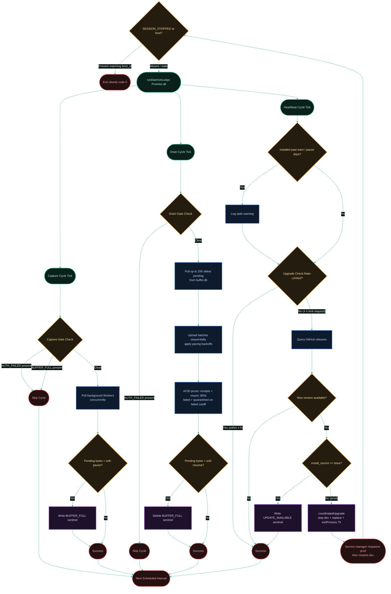

[← Previous: 1. Daemon Lifecycle](./1-daemon-lifecycle-and-service.md) · [Index](./README.md) · [Next: 3. Ingestion Pipeline →](./3-ingestion-pipeline.md)

# 2. Loops & Sentinels

*Last Updated: 2026-05-27*

This document serves as an advanced architectural cheatsheet describing the execution path of the three concurrent daemon cycles (Capture, Drain, Heartbeat) and how they coordinate state using filesystem sentinel flags instead of in-memory IPC.

## Sentinel Inventory

Each profile owns its own sentinel set under `<root>/<profile>/`. There are **5 per-profile sentinels**:

- `AUTH_FAILED` — written by the drain upload path on a confirmed invalid key; cleared only by `setup new`. Gates capture and drain.
- `BUFFER_FULL` — written by capture when pending bytes exceed the soft-pause threshold; cleared by drain once pressure drops below soft-resume. Gates capture only (never drain).
- `SESSION_STOPPED` — boot-id self-clearing; read once at daemon boot to exit cleanly. Not gated inside the per-cycle loops.
- `CONSENT_ACCEPTED` — informational only; never gates any cycle.
- `UPDATE_AVAILABLE` — written by the brew heartbeat branch when a newer release exists; surfaced to the user, does not gate.

Separately, a single **root-level boot-scoped `DEV_MODE` flag** lives at `<root>/DEV_MODE` (not per-profile). It is boot-id self-clearing and unlocks the hidden `dev` profile, the `dev`/`xstate` commands, and the dev-default profile for `setup`/`logs`/`doctor`.

## Loop Coordination & Sentinel Gates

The flowchart below map how the three concurrent cycles run in parallel, and how their execution is gated by the presence of small filesystem sentinels.

[← Previous: 1. Daemon Lifecycle](./1-daemon-lifecycle-and-service.md) · [Index](./README.md) · [Next: 3. Ingestion Pipeline →](./3-ingestion-pipeline.md)
