[← Previous: 2. Loops & Sentinels](./2-loops-and-sentinels.md) · [Index](./README.md) · [Next: 4. SQLite Buffer Schema →](./4-sqlite-buffer-schema.md)

# 3. Ingestion Pipeline

*Last Updated: 2026-05-27*

This document serves as an advanced architectural cheatsheet illustrating the complete end-to-end data ingestion pipeline of `proxai_gateway`. It details how files are discovered, snapshotted, parsed, redacted, compressed, and uploaded with adaptive backoffs and pacing controls.

## Data Path & Ingestion Mechanics

The flowchart below maps the progressive stages a record undergoes, from active agent session file on disk to a securely compiled and compressed block stored at ProxAI.

```mermaid
%%{init: {"theme": "base", "flowchart": {"nodeSpacing": 35, "rankSpacing": 40}, "themeCSS": "svg { background-color: #081612; border: 1px solid #142c26; border-radius: 8px; padding: 12px; } .flowchart-link, .marker { stroke: #10b981 !important; filter: drop-shadow(0px 0px 4px rgba(16, 185, 129, 0.8)) !important; } .edgePath .path { stroke: #10b981 !important; stroke-width: 2px !important; } .node rect, .node circle, .node polygon, .node path { stroke-width: 2px !important; } .node.startNode rect, .node.startNode circle, .node.startNode polygon, .node.startNode path { fill: #0a201b !important; stroke: #10b981 !important; filter: drop-shadow(0px 0px 6px rgba(16, 185, 129, 0.7)) !important; } .node.startNode .label { color: #b3f5e6 !important; } .node.stopNode rect, .node.stopNode circle, .node.stopNode polygon, .node.stopNode path { fill: #241212 !important; stroke: #ef4444 !important; filter: drop-shadow(0px 0px 6px rgba(239, 68, 68, 0.7)) !important; } .node.stopNode .label { color: #fca5a5 !important; } .node.decNode rect, .node.decNode circle, .node.decNode polygon, .node.decNode path { fill: #241c0e !important; stroke: #f59e0b !important; filter: drop-shadow(0px 0px 6px rgba(245, 158, 11, 0.7)) !important; } .node.decNode .label { color: #fde68a !important; } .node.processNode rect, .node.processNode circle, .node.processNode polygon, .node.processNode path { fill: #0d1b2d !important; stroke: #3b82f6 !important; filter: drop-shadow(0px 0px 6px rgba(59, 130, 246, 0.7)) !important; } .node.processNode .label { color: #bfdbfe !important; } .node.actionNode rect, .node.actionNode circle, .node.actionNode polygon, .node.actionNode path { fill: #1e112c !important; stroke: #a855f7 !important; filter: drop-shadow(0px 0px 6px rgba(168, 85, 247, 0.7)) !important; } .node.actionNode .label { color: #e9d5ff !important; } .node.default rect, .node.default circle, .node.default polygon, .node.default path { fill: #0a201b !important; stroke: #14b8a6 !important; filter: drop-shadow(0px 0px 6px rgba(20, 184, 166, 0.7)) !important; } .node.default .label { color: #ccfbf1 !important; }", "themeVariables": { "primaryColor": "#081612", "primaryTextColor": "#f1f5f9", "primaryBorderColor": "#142c26", "lineColor": "#10b981", "secondaryColor": "#081612", "tertiaryColor": "#081612", "fontFamily": "Inter, sans-serif" }}}%%
flowchart TD
  classDef startNode fill:#0a201b,stroke:#10b981,stroke-width:2px,color:#b3f5e6,padding:10px 25px;
  classDef stopNode fill:#241212,stroke:#ef4444,stroke-width:2px,color:#fca5a5,padding:10px 25px;
  classDef decNode fill:#241c0e,stroke:#f59e0b,stroke-width:2px,color:#fde68a,padding:10px 20px;
  classDef processNode fill:#0d1b2d,stroke:#3b82f6,stroke-width:2px,color:#bfdbfe,padding:10px 20px;
  classDef actionNode fill:#1e112c,stroke:#a855f7,stroke-width:2px,color:#e9d5ff,padding:10px 20px;
  classDef default fill:#0a201b,stroke:#14b8a6,stroke-width:2px,color:#ccfbf1,padding:10px 20px;

  agentDir([Agent Directory]) --> globScan[scanGlob: Discover files]
  globScan --> statCheck{mtime < 30 days?}
  
  statCheck -->|No| skipOld([Ignore File])
  statCheck -->|Yes| getInode[Match source_cursors by Inode]
  
  getInode --> isSqlite{File format SQLite?}
  
  isSqlite -->|Yes| snapshot["snapshotSqlite: VACUUM INTO temp DB<br/>+ lock rescue immutable=1"]
  isSqlite -->|No| readSlice[Read byte range watermark_end to EOF]
  
  snapshot --> readRows[Read rowid ranges]
  
  readRows --> filterTrim["Per-source Dialogue Filter and Capping Trims"]
  readSlice --> filterTrim
  
  filterTrim --> runRedact[13 Redaction Rule Categories]
  runRedact --> strip{Stripped Secret?}
  
  strip -->|Yes| replaceToken[Replace with Redacted Marker]
  strip -->|No| passData[Keep raw text]
  
  replaceToken --> compress[Bun.zstdCompressSync level 3]
  passData --> compress
  
  compress --> verifyCaps{Batch Size Check}
  
  verifyCaps -->|Pass| insertDB[ACID transaction insert into buffer.db]
  verifyCaps -->|Over Limit| split[Split into smaller sequential batches]
  
  split --> insertDB
  
  insertDB --> pullQueue[FIFO select oldest pending batches]
  pullQueue --> ship["POST /v1/raw_records"]
  ship --> parseResp{HTTP Response Status?}
  
  parseResp -->|400 Watermark| pullRemote[GET watermarks + adjust cursor]
  parseResp -->|200 OK| success[Write receipt + delete batch]
  parseResp -->|401 / 403| authFail[Write AUTH_FAILED sentinel]
  parseResp -->|429 RateLimit| backoff429["429 Pacer: slotMs * mult^steps, max 30s"]
  parseResp -->|5xx Error| backoff5xx["5xx Pacer: 30s * 2^steps, max 5min"]
  
  pullRemote --> pullQueue
  backoff429 --> retry[Retry next Drain cycle]
  backoff5xx --> retry
  retry --> pullQueue

  class agentDir startNode;
  class skipOld stopNode;
  class authFail stopNode;
  class backoff429 stopNode;
  class backoff5xx stopNode;
  class success stopNode;
  class statCheck decNode;
  class isSqlite decNode;
  class strip decNode;
  class verifyCaps decNode;
  class parseResp decNode;
  class globScan processNode;
  class getInode processNode;
  class filterTrim processNode;
  class runRedact processNode;
  class passData processNode;
  class compress processNode;
  class split processNode;
  class pullQueue processNode;
  class pullRemote processNode;
  class retry processNode;
  class snapshot actionNode;
  class readSlice actionNode;
  class readRows actionNode;
  class replaceToken actionNode;
  class insertDB actionNode;
  class ship actionNode;
```

[← Previous: 2. Loops & Sentinels](./2-loops-and-sentinels.md) · [Index](./README.md) · [Next: 4. SQLite Buffer Schema →](./4-sqlite-buffer-schema.md)

