[← Previous: 3. Ingestion Pipeline](./3-ingestion-pipeline.md) · [Index](./README.md) · [Next: Back to Main Index →](../../README.md)

# 4. SQLite Buffer Schema

*Last Updated: 2026-05-27*

This document serves as an advanced architectural cheatsheet describing the database schemas, table structures, relationships, and transactional boundaries inside the local `buffer.db` SQLite store.

## Relational Map & Database Layout

The flowchart below map the structural schema of the 6 tables of `buffer.db`, highlighting composite keys, column types, and the ACID transactional boundary that executes daily pruning routines.

```mermaid
%%{init: {"theme": "base", "themeCSS": "svg { background-color: #081612; border: 1px solid #142c26; border-radius: 8px; padding: 12px; } .flowchart-link, .marker { stroke: #10b981 !important; filter: drop-shadow(0px 0px 4px rgba(16, 185, 129, 0.8)) !important; } .edgePath .path { stroke: #10b981 !important; stroke-width: 2px !important; } .node rect, .node circle, .node polygon, .node path { stroke-width: 2px !important; } .node.startNode rect, .node.startNode circle, .node.startNode polygon, .node.startNode path { fill: #0a201b !important; stroke: #10b981 !important; filter: drop-shadow(0px 0px 6px rgba(16, 185, 129, 0.7)) !important; } .node.startNode .label { color: #b3f5e6 !important; } .node.stopNode rect, .node.stopNode circle, .node.stopNode polygon, .node.stopNode path { fill: #241212 !important; stroke: #ef4444 !important; filter: drop-shadow(0px 0px 6px rgba(239, 68, 68, 0.7)) !important; } .node.stopNode .label { color: #fca5a5 !important; } .node.decNode rect, .node.decNode circle, .node.decNode polygon, .node.decNode path { fill: #241c0e !important; stroke: #f59e0b !important; filter: drop-shadow(0px 0px 6px rgba(245, 158, 11, 0.7)) !important; } .node.decNode .label { color: #fde68a !important; } .node.processNode rect, .node.processNode circle, .node.processNode polygon, .node.processNode path { fill: #0d1b2d !important; stroke: #3b82f6 !important; filter: drop-shadow(0px 0px 6px rgba(59, 130, 246, 0.7)) !important; } .node.processNode .label { color: #bfdbfe !important; } .node.actionNode rect, .node.actionNode circle, .node.actionNode polygon, .node.actionNode path { fill: #1e112c !important; stroke: #a855f7 !important; filter: drop-shadow(0px 0px 6px rgba(168, 85, 247, 0.7)) !important; } .node.actionNode .label { color: #e9d5ff !important; } .node.default rect, .node.default circle, .node.default polygon, .node.default path { fill: #0a201b !important; stroke: #14b8a6 !important; filter: drop-shadow(0px 0px 6px rgba(20, 184, 166, 0.7)) !important; } .node.default .label { color: #ccfbf1 !important; }", "themeVariables": { "primaryColor": "#081612", "primaryTextColor": "#f1f5f9", "primaryBorderColor": "#142c26", "lineColor": "#10b981", "secondaryColor": "#081612", "tertiaryColor": "#081612", "fontFamily": "Inter, sans-serif" }, "flowchart": {"nodeSpacing": 35, "rankSpacing": 40}}}%%
flowchart TD
  classDef startNode fill:#0a201b,stroke:#10b981,stroke-width:2px,color:#b3f5e6,padding:10px 25px;
  classDef stopNode fill:#241212,stroke:#ef4444,stroke-width:2px,color:#fca5a5,padding:10px 25px;
  classDef decNode fill:#241c0e,stroke:#f59e0b,stroke-width:2px,color:#fde68a,padding:10px 20px;
  classDef processNode fill:#0d1b2d,stroke:#3b82f6,stroke-width:2px,color:#bfdbfe,padding:10px 20px;
  classDef actionNode fill:#1e112c,stroke:#a855f7,stroke-width:2px,color:#e9d5ff,padding:10px 20px;
  classDef default fill:#0a201b,stroke:#14b8a6,stroke-width:2px,color:#ccfbf1,padding:10px 20px;

  %% Database Tables & Core Schema Definitions
  cursors["Table: source_cursors<br/>-----------------------------<br/>• COMPOSITE PRIMARY KEY:<br/>  (source_app, source_path_hash, source_inode, watermark_table)<br/>• watermark_end: INTEGER<br/>• last_seen_size_bytes: INTEGER<br/>• last_seen_page_count: INTEGER<br/>• consecutive_errors: INTEGER DEFAULT 0<br/>• updated_at: INTEGER"]

  batches["Table: upload_batches<br/>-----------------------------<br/>• id: TEXT PRIMARY KEY (UUIDv7)<br/>• source_app: TEXT<br/>• source_path_hash: TEXT<br/>• watermark_start: INTEGER<br/>• watermark_end: INTEGER<br/>• body: BLOB (Zstd compressed base64)<br/>• compressed_size: INTEGER<br/>• status: TEXT (pending / failed / shipped)<br/>• retry_count: INTEGER DEFAULT 0<br/>• last_attempt_at: INTEGER<br/>• created_at: INTEGER"]

  receipts["Table: upload_receipts<br/>-----------------------------<br/>• id: TEXT PRIMARY KEY (UUIDv7)<br/>• batch_id: TEXT (Index / FK to upload_batches)<br/>• created_at: INTEGER"]

  quarantine["Table: quarantined_records<br/>-----------------------------<br/>• id: TEXT PRIMARY KEY (UUIDv7)<br/>• source_app: TEXT<br/>• source_path_hash: TEXT<br/>• watermark_start: INTEGER<br/>• watermark_end: INTEGER<br/>• record_index: INTEGER<br/>• reason: TEXT (redaction_clash / unparsable)<br/>• created_at: INTEGER"]

  state["Table: daemon_state<br/>-----------------------------<br/>• host_id: TEXT PRIMARY KEY<br/>• user_id: TEXT<br/>• installed_at: INTEGER<br/>• latest_known_version: TEXT<br/>• last_version_check_at: INTEGER<br/>• machine_snapshots: TEXT (XState JSON snapshots)<br/>• updated_at: INTEGER"]

  metadata["Table: buffer_metadata<br/>-----------------------------<br/>• key: TEXT PRIMARY KEY<br/>• value: TEXT<br/>• updated_at: INTEGER"]

  %% Core Relationships & Flow Paths
  cursors -->|Watermarks tracked to produce| batches
  batches -->|One-to-One index / FK relationship| receipts
  batches -->|Failed/redacted records split to| quarantine
  state -->|Maintains active snapshots & syncs metrics with| metadata
  metadata -->|Consulted by prune scheduler to trigger| pruneTick

  %% Daily Pruning ACID Transaction Flow
  pruneTick([Daily Prune Trigger]) --> pruneTx[db.transaction wrapper]

  pruneTx --> deleteReceipts["DELETE FROM upload_receipts<br/>WHERE created_at < 30 days"]
  pruneTx --> deleteBatches["DELETE FROM upload_batches<br/>WHERE status == shipped<br/>AND created_at < 30 days"]
  pruneTx --> deleteQuarantine["DELETE FROM quarantined_records<br/>WHERE created_at < 30 days"]

  pruneTx -->|Reads / updates last_prune_at in| metadata
  pruneTx -.->|Rollback on Error| pruneFail([Rollback transaction])

  deleteReceipts --> pruneEnd([Pruning Tx Success])
  deleteBatches --> pruneEnd
  deleteQuarantine --> pruneEnd

  %% Direct Pruning Operations to Target Tables
  deleteReceipts -.->|Cleans up| receipts
  deleteBatches -.->|Cleans up| batches
  deleteQuarantine -.->|Cleans up| quarantine

  %% Explicit Class Mapping for All Nodes
  class pruneTick startNode;
  class pruneEnd startNode;
  class pruneFail stopNode;
  class batches processNode;
  class cursors processNode;
  class receipts processNode;
  class quarantine processNode;
  class state processNode;
  class metadata processNode;
  class pruneTx processNode;
  class deleteReceipts actionNode;
  class deleteBatches actionNode;
  class deleteQuarantine actionNode;
```

[← Previous: 3. Ingestion Pipeline](./3-ingestion-pipeline.md) · [Index](./README.md) · [Next: Back to Main Index →](../../README.md)
