[← Previous: 4. SQLite Buffer Schema](./4-sqlite-buffer-schema.md) · [Index](./README.md) · [Next: Back to Main Index →](../../README.md)

# 5. Complete Gateway Architecture

*Last Updated: 2026-05-27*

This document serves as the master architectural cheatsheet of `proxai_gateway`. It compiles the entire gateway ecosystem—including profile-aware installation setup, the dual prod/dev daemons and service units, signal controls, parallel execution loops, ingestion pipelines, database buffering, secrets redaction, backoff pacers, the coordinated cross-profile upgrade, the read-only `logs` / `doctor` commands, and the buffer pruning transaction—into a single, fully connected, flat vertical flowchart.

---

## Complete Ingest & Lifecycle Flowchart

```mermaid
%%{init: {"theme": "base", "themeCSS": "svg { background-color: #081612; border: 1px solid #142c26; border-radius: 8px; padding: 12px; } .flowchart-link, .marker { stroke: #10b981 !important; filter: drop-shadow(0px 0px 4px rgba(16, 185, 129, 0.8)) !important; } .edgePath .path { stroke: #10b981 !important; stroke-width: 2px !important; } .node rect, .node circle, .node polygon, .node path { stroke-width: 2px !important; } .node.startNode rect, .node.startNode circle, .node.startNode polygon, .node.startNode path { fill: #0a201b !important; stroke: #10b981 !important; filter: drop-shadow(0px 0px 6px rgba(16, 185, 129, 0.7)) !important; } .node.startNode .label { color: #b3f5e6 !important; } .node.stopNode rect, .node.stopNode circle, .node.stopNode polygon, .node.stopNode path { fill: #241212 !important; stroke: #ef4444 !important; filter: drop-shadow(0px 0px 6px rgba(239, 68, 68, 0.7)) !important; } .node.stopNode .label { color: #fca5a5 !important; } .node.decNode rect, .node.decNode circle, .node.decNode polygon, .node.decNode path { fill: #241c0e !important; stroke: #f59e0b !important; filter: drop-shadow(0px 0px 6px rgba(245, 158, 11, 0.7)) !important; } .node.decNode .label { color: #fde68a !important; } .node.processNode rect, .node.processNode circle, .node.processNode polygon, .node.processNode path { fill: #0d1b2d !important; stroke: #3b82f6 !important; filter: drop-shadow(0px 0px 6px rgba(59, 130, 246, 0.7)) !important; } .node.processNode .label { color: #bfdbfe !important; } .node.actionNode rect, .node.actionNode circle, .node.actionNode polygon, .node.actionNode path { fill: #1e112c !important; stroke: #a855f7 !important; filter: drop-shadow(0px 0px 6px rgba(168, 85, 247, 0.7)) !important; } .node.actionNode .label { color: #e9d5ff !important; } .node.default rect, .node.default circle, .node.default polygon, .node.default path { fill: #0a201b !important; stroke: #14b8a6 !important; filter: drop-shadow(0px 0px 6px rgba(20, 184, 166, 0.7)) !important; } .node.default .label { color: #ccfbf1 !important; }", "themeVariables": { "primaryColor": "#081612", "primaryTextColor": "#f1f5f9", "primaryBorderColor": "#142c26", "lineColor": "#10b981", "secondaryColor": "#081612", "tertiaryColor": "#081612", "fontFamily": "Inter, sans-serif" }, "flowchart": {"nodeSpacing": 35, "rankSpacing": 40}}}%%
flowchart TD
  classDef startNode fill:#0a201b,stroke:#10b981,stroke-width:2px,color:#b3f5e6,padding:10px 25px;
  classDef stopNode fill:#241212,stroke:#ef4444,stroke-width:2px,color:#fca5a5,padding:10px 25px;
  classDef decNode fill:#241c0e,stroke:#f59e0b,stroke-width:2px,color:#fde68a,padding:10px 20px;
  classDef processNode fill:#0d1b2d,stroke:#3b82f6,stroke-width:2px,color:#bfdbfe,padding:10px 20px;
  classDef actionNode fill:#1e112c,stroke:#a855f7,stroke-width:2px,color:#e9d5ff,padding:10px 20px;
  classDef default fill:#0a201b,stroke:#14b8a6,stroke-width:2px,color:#ccfbf1,padding:10px 20px;

  %% 1. Interactive Setup Handshake
  first(["Run command: setup/start"]) --> pickProfile{--profile prod or dev?<br/>dev default when DEV_MODE set}
  pickProfile --> checkConfig{profile config.toml exists?}
  checkConfig -->|No| consent{Prompt Consent}
  checkConfig -->|Yes / --force| checkKey{verify-key API}
  checkConfig -->|Yes / Reset Trigger| unCmd(["Run command: uninstall"])
  consent -->|Declined| cancelled(["Setup Cancelled"])
  consent -->|Accepted| checkKey
  checkKey -->|Success| writeConfig[Write profile config.toml<br/>+ per-profile CONSENT_ACCEPTED]
  checkKey -->|Failure| promptRetry[Re-prompt Key]
  promptRetry --> checkKey

  %% 1b. Read-only Operator Commands
  logsCmd(["Run command: logs"]) --> readReceipts[Query receipts + failed + quarantined + resync<br/>from profile buffer.db read-only]
  doctorCmd(["Run command: doctor"]) --> diagnose[Run failure-scenario checks<br/>service + sentinels + buffer + last_prune_at]
  readReceipts --> opDone(["Print to operator"])
  diagnose --> opDone

  %% 2. Service Installation Writer
  writeConfig --> getOS{Detect Platform}
  getOS -->|macOS| plist[Write LaunchAgent plist<br/>prod co.proxai.gateway<br/>dev co.proxai.gateway.dev]
  getOS -->|Linux| unit[Write systemd user unit<br/>prod proxai-gateway.service<br/>dev proxai-gateway-dev.service]
  getOS -->|Windows| xml[Write Task Scheduler XML<br/>prod ProxAI Gateway<br/>dev ProxAI Gateway dev]

  %% 3. Uninstallation Sweep
  unCmd --> cleanService[Stop & Delete this profile<br/>plist / unit / Task]
  cleanService --> resetCheck{--reset flag passed?}
  resetCheck -->|No| keepData(["Keep profile config/logs/db"])
  resetCheck -->|Yes| sweepData[Delete profile dir<br/>+ clean package managers]
  sweepData --> doneUninstall(["Full Sweep Done"])

  %% 4. Daemon Boot
  plist --> boot(["Daemon Boot run --profile"])
  unit --> boot
  xml --> boot
  boot --> openDB[Open profile buffer.db WAL<br/>+ additive migrations]
  openDB --> loopBoot(["runDaemonLoops"])

  %% 5. Parallel Cycle Bootstrap
  loopBoot --> capTick([Capture Cycle Tick])
  loopBoot --> drainTick([Drain Cycle Tick])
  loopBoot --> hbTick([Heartbeat Cycle Tick])

  %% 6. Capture Loop & Ingestion Path
  capTick --> capGates{Capture Gate Check}
  capGates -->|AUTH_FAILED or BUFFER_FULL present| capHalt([Skip Capture Cycle])
  capGates -->|Clear| globScan[scanGlob: Discover files]
  globScan --> statCheck{mtime < 30 days?}
  statCheck -->|No| skipOld([Ignore File])
  statCheck -->|Yes| getInode[Match source_cursors by Inode]
  getInode --> isSqlite{File format SQLite?}
  isSqlite -->|Yes| snapshot[snapshotSqlite: VACUUM INTO temp DB]
  isSqlite -->|No| readSlice[Read byte range watermark_end to EOF]
  snapshot --> readRows[Read rowid ranges]
  readRows --> filterTrim[Per-source Dialogue Filter and Capping Trims]
  readSlice --> filterTrim
  filterTrim --> runRedact[13 Redaction Rule Categories]
  runRedact --> strip{Stripped Secret?}
  strip -->|Yes| replaceToken[Replace with Redacted Marker]
  strip -->|No| passData[Keep raw text]
  replaceToken --> compress[Bun.zstdCompressSync level 3]
  passData --> compress
  compress --> verifyCaps{Batch Size Check}
  verifyCaps -->|Over Limit| split[Split into smaller sequential batches]
  verifyCaps -->|Pass| insertDB[ACID transaction insert]
  split --> insertDB
  insertDB --> writeCursors[Write source_cursors Table]
  writeCursors --> capEnd([Capture Success])

  %% 7. Drain Loop & Adaptive Pacer Ingestion
  drainTick --> drainGates{Drain Gate Check}
  drainGates -->|AUTH_FAILED present| drainHalt([Skip Drain Cycle])
  drainGates -->|Clear| pullQueue[FIFO select up to 256 oldest pending]
  pullQueue --> ship[POST /v1/raw_records]
  ship --> parseResp{HTTP Response Status?}
  parseResp -->|400 Watermark Regression| regress[setCursorFromRegression + append resync_events]
  parseResp -->|200 OK| success[Insert receipt + delete batch in one tx]
  parseResp -->|401 / 403| authFail[Write AUTH_FAILED sentinel]
  parseResp -->|429 RateLimit| backoff429[429 Pacer: slotMs * mult^steps, max 30s]
  parseResp -->|5xx Error| backoff5xx[5xx Pacer: 30s * 2^steps, max 5min]
  
  regress --> drainEnd([Drain Success])
  success --> writeReceipt[Write upload_receipts with redacted user_prompt]
  writeReceipt --> drainEnd
  backoff429 --> retry[Retry next Drain cycle]
  backoff5xx --> retry
  retry --> pullQueue

  %% 7b. Prune step inside the drain cycle
  drainEnd --> pruneTx[db.transaction wrapper]

  %% 8. Heartbeat Loop & Coordinated Upgrade
  hbTick --> checkStale{Installed past warn / pause days?}
  checkStale -->|Yes| warnStale[Log stale warning]
  checkStale -->|No| checkUpgrade{Upgrade Check Rate-Limited?}
  warnStale --> checkUpgrade
  checkUpgrade -->|"Yes (within 4 h)"| hbEnd([Heartbeat Skip])
  checkUpgrade -->|"No (4 h limit elapsed)"| queryRelease[Query GitHub releases]
  queryRelease --> hasNew{New version available?}
  hasNew -->|No| hbEnd
  hasNew -->|Yes| brewCheck{install_source == brew?}
  brewCheck -->|Yes| writeUpdate[Write UPDATE_AVAILABLE sentinel]
  brewCheck -->|"No (prod)"| coordUp[coordinatedUpgrade: lock + stop dev<br/>replace binary + exitProcess 75]
  coordUp --> serviceRestart([Service manager respawns prod<br/>then restores/restarts dev])
  writeUpdate --> hbEnd

  %% 9. Pruning ACID transaction inside drain
  pruneTx --> deleteReceipts[DELETE upload_receipts<br/>WHERE delivered_at < receipt cutoff 365d]
  pruneTx --> deleteFailed[DELETE upload_batches<br/>WHERE status = failed<br/>AND created_at < failed cutoff 365d]
  pruneTx --> deleteQuarantine[DELETE quarantined_records<br/>WHERE quarantined_at_utc < failed cutoff]
  pruneTx --> deleteResync[DELETE resync_events<br/>WHERE recovered_at < receipt cutoff]
  pruneTx --> setPruneAt[UPDATE buffer_metadata last_prune_at]
  deleteReceipts --> pruneEnd([Pruning Tx Success])
  deleteFailed --> pruneEnd
  deleteQuarantine --> pruneEnd
  deleteResync --> pruneEnd
  setPruneAt --> pruneEnd
  pruneTx -.->|Rollback on Error| pruneFail([Rollback transaction])

  %% 10. Database Schema Mapping
  insertDB -.->|Writes records to| batchesTable[(Table: upload_batches)]
  writeCursors -.->|Writes cursors to| cursorsTable[(Table: source_cursors)]
  split -.->|Writes quarantined to| quarantineTable[(Table: quarantined_records)]
  pullQueue -.->|Reads records from| batchesTable
  writeReceipt -.->|Writes receipts to| receiptsTable[(Table: upload_receipts)]
  regress -.->|Appends resync to| resyncTable[(Table: resync_events)]
  deleteReceipts -.->|Purges| receiptsTable
  deleteFailed -.->|Purges failed only| batchesTable
  deleteQuarantine -.->|Purges| quarantineTable
  deleteResync -.->|Purges| resyncTable
  setPruneAt -.->|Writes| metadataTable[(Table: buffer_metadata)]
  openDB -.->|Loads snapshot state from| stateTable[(Table: daemon_state)]

  %% 11. Loop Schedules Converge
  capHalt --> cycleWait([Next Scheduled Interval])
  capEnd --> cycleWait
  skipOld --> cycleWait
  drainHalt --> cycleWait
  authFail --> cycleWait
  hbEnd --> cycleWait
  pruneEnd --> cycleWait
  pruneFail --> cycleWait
  opDone --> cycleWait
  serviceRestart --> loopBoot

  %% Explicit Class Mapping for Premium Aesthetics
  class first startNode;
  class boot startNode;
  class unCmd startNode;
  class logsCmd startNode;
  class doctorCmd startNode;
  class capTick startNode;
  class drainTick startNode;
  class hbTick startNode;

  class cancelled stopNode;
  class capEnd stopNode;
  class capHalt stopNode;
  class doneUninstall stopNode;
  class drainEnd stopNode;
  class drainHalt stopNode;
  class authFail stopNode;
  class backoff429 stopNode;
  class backoff5xx stopNode;
  class hbEnd stopNode;
  class keepData stopNode;
  class pruneEnd stopNode;
  class pruneFail stopNode;
  class serviceRestart stopNode;
  class skipOld stopNode;
  class cycleWait stopNode;
  class opDone stopNode;

  class pickProfile decNode;
  class checkConfig decNode;
  class consent decNode;
  class checkKey decNode;
  class getOS decNode;
  class resetCheck decNode;
  class capGates decNode;
  class statCheck decNode;
  class isSqlite decNode;
  class strip decNode;
  class verifyCaps decNode;
  class drainGates decNode;
  class parseResp decNode;
  class checkStale decNode;
  class checkUpgrade decNode;
  class hasNew decNode;
  class brewCheck decNode;

  class promptRetry processNode;
  class cleanService processNode;
  class openDB processNode;
  class globScan processNode;
  class getInode processNode;
  class readRows processNode;
  class filterTrim processNode;
  class runRedact processNode;
  class passData processNode;
  class compress processNode;
  class split processNode;
  class pullQueue processNode;
  class retry processNode;
  class warnStale processNode;
  class queryRelease processNode;
  class pruneTx processNode;
  class loopBoot processNode;
  class readReceipts processNode;
  class diagnose processNode;

  class writeConfig actionNode;
  class plist actionNode;
  class unit actionNode;
  class xml actionNode;
  class sweepData actionNode;
  class snapshot actionNode;
  class readSlice actionNode;
  class replaceToken actionNode;
  class insertDB actionNode;
  class writeCursors actionNode;
  class ship actionNode;
  class writeReceipt actionNode;
  class regress actionNode;
  class coordUp actionNode;
  class writeUpdate actionNode;
  class deleteReceipts actionNode;
  class deleteFailed actionNode;
  class deleteQuarantine actionNode;
  class deleteResync actionNode;
  class setPruneAt actionNode;
  class success actionNode;

  class batchesTable default;
  class cursorsTable default;
  class quarantineTable default;
  class receiptsTable default;
  class resyncTable default;
  class metadataTable default;
  class stateTable default;
```

---
[← Previous: 4. SQLite Buffer Schema](./4-sqlite-buffer-schema.md) · [Index](./README.md) · [Next: Back to Main Index →](../../README.md)
