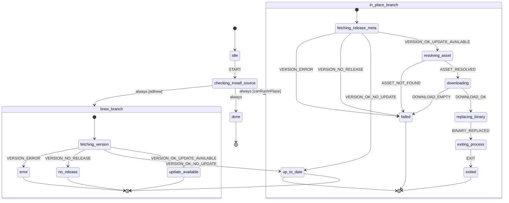

# auto-upgrade

```mermaid
%% auto-upgrade
stateDiagram-v2
  [*] --> idle
  idle --> checking_install_source: START
  checking_install_source --> brew_branch: always [isBrew]
  checking_install_source --> in_place_branch: always [canRunInPlace]
  checking_install_source --> done: always
  state brew_branch {
    [*] --> fetching_version
    fetching_version --> update_available: VERSION_OK_UPDATE_AVAILABLE
    fetching_version --> up_to_date: VERSION_OK_NO_UPDATE
    fetching_version --> no_release: VERSION_NO_RELEASE
    fetching_version --> error: VERSION_ERROR
    update_available --> [*]
    up_to_date --> [*]
    no_release --> [*]
    error --> [*]
  }
  state in_place_branch {
    [*] --> fetching_release_meta
    fetching_release_meta --> resolving_asset: VERSION_OK_UPDATE_AVAILABLE
    fetching_release_meta --> up_to_date: VERSION_OK_NO_UPDATE
    fetching_release_meta --> failed: VERSION_NO_RELEASE
    fetching_release_meta --> failed: VERSION_ERROR
    resolving_asset --> downloading: ASSET_RESOLVED
    resolving_asset --> failed: ASSET_NOT_FOUND
    downloading --> replacing_binary: DOWNLOAD_OK
    downloading --> failed: DOWNLOAD_EMPTY
    replacing_binary --> exiting_process: BINARY_REPLACED
    exiting_process --> exited: EXIT
    exited --> [*]
    up_to_date --> [*]
    failed --> [*]
  }
  done --> [*]
```
