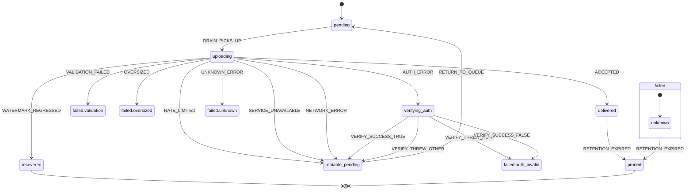

# batch-lifecycle

```mermaid
%% batch-lifecycle
stateDiagram-v2
  [*] --> pending
  pending --> uploading: DRAIN_PICKS_UP
  uploading --> delivered: ACCEPTED
  uploading --> recovered: WATERMARK_REGRESSED
  uploading --> failed.validation: VALIDATION_FAILED
  uploading --> failed.oversized: OVERSIZED
  uploading --> verifying_auth: AUTH_ERROR
  uploading --> retriable_pending: RATE_LIMITED
  uploading --> retriable_pending: SERVICE_UNAVAILABLE
  uploading --> retriable_pending: NETWORK_ERROR
  uploading --> failed.unknown: UNKNOWN_ERROR
  verifying_auth --> failed.auth_invalid: VERIFY_THREW_AUTH
  verifying_auth --> failed.auth_invalid: VERIFY_SUCCESS_FALSE
  verifying_auth --> retriable_pending: VERIFY_SUCCESS_TRUE
  verifying_auth --> retriable_pending: VERIFY_THREW_OTHER
  retriable_pending --> pending: RETURN_TO_QUEUE
  delivered --> pruned: RETENTION_EXPIRED
  recovered --> [*]
  failed --> pruned: RETENTION_EXPIRED
  state failed {
    [*] --> unknown
  }
  pruned --> [*]
```
