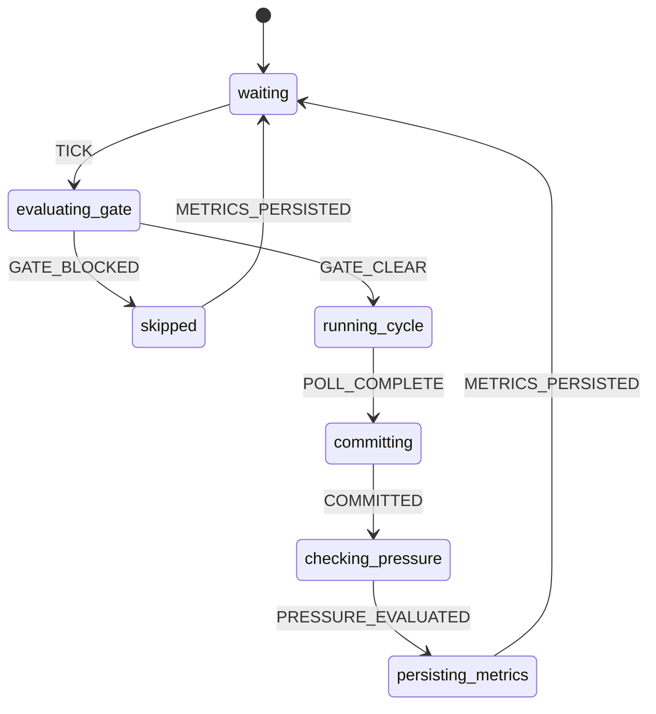

# capture-loop

```mermaid
%% capture-loop
stateDiagram-v2
  [*] --> waiting
  waiting --> evaluating_gate: TICK
  evaluating_gate --> skipped: GATE_BLOCKED
  evaluating_gate --> running_cycle: GATE_CLEAR
  running_cycle --> committing: POLL_COMPLETE
  committing --> checking_pressure: COMMITTED
  checking_pressure --> persisting_metrics: PRESSURE_EVALUATED
  persisting_metrics --> waiting: METRICS_PERSISTED
  skipped --> waiting: METRICS_PERSISTED
```
