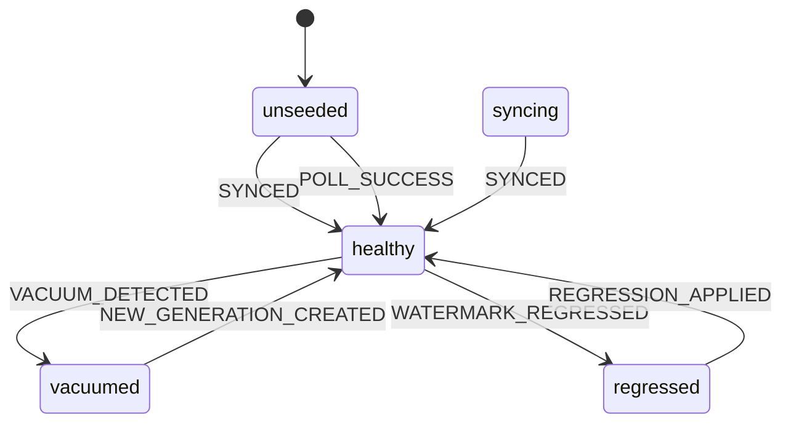

# cursor-lifecycle

```mermaid
%% cursor-lifecycle
stateDiagram-v2
  [*] --> unseeded
  unseeded --> healthy: SYNCED
  unseeded --> healthy: POLL_SUCCESS
  syncing --> healthy: SYNCED
  healthy --> vacuumed: VACUUM_DETECTED
  healthy --> regressed: WATERMARK_REGRESSED
  vacuumed --> healthy: NEW_GENERATION_CREATED
  regressed --> healthy: REGRESSION_APPLIED
```
