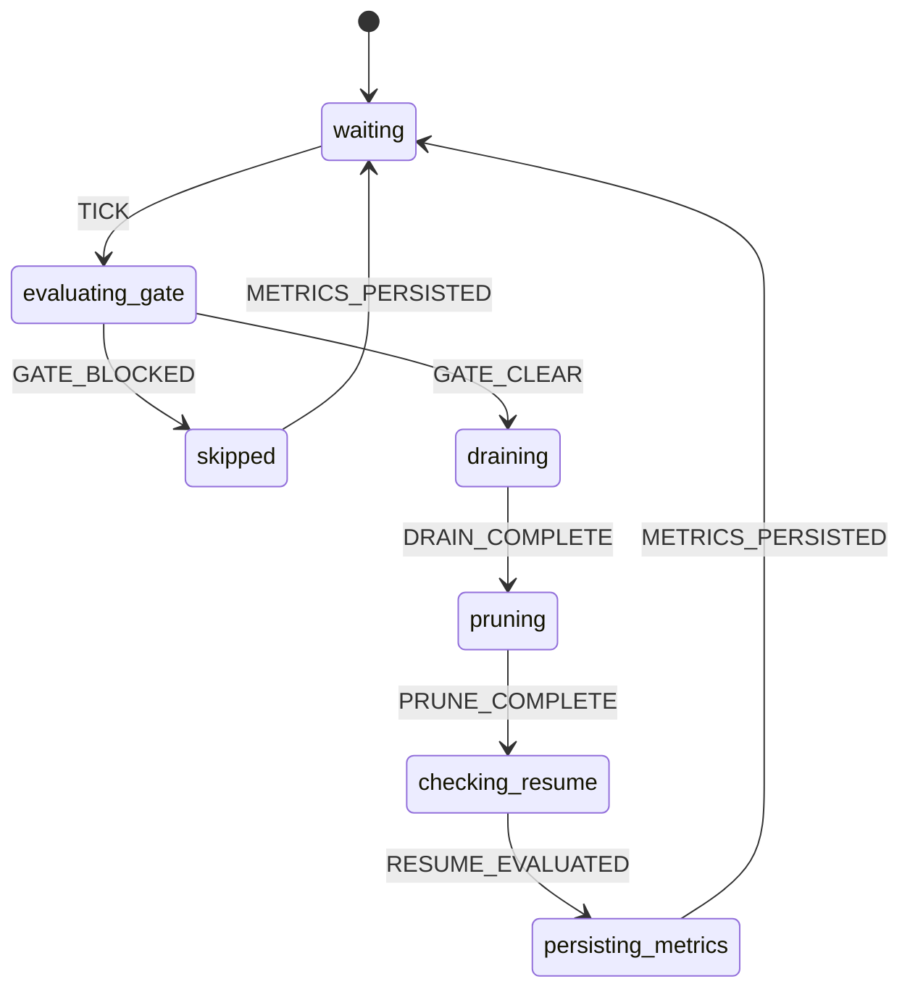

# drain-loop

```mermaid
%% drain-loop
stateDiagram-v2
  [*] --> waiting
  waiting --> evaluating_gate: TICK
  evaluating_gate --> skipped: GATE_BLOCKED
  evaluating_gate --> draining: GATE_CLEAR
  draining --> pruning: DRAIN_COMPLETE
  pruning --> checking_resume: PRUNE_COMPLETE
  checking_resume --> persisting_metrics: RESUME_EVALUATED
  persisting_metrics --> waiting: METRICS_PERSISTED
  skipped --> waiting: METRICS_PERSISTED
```
