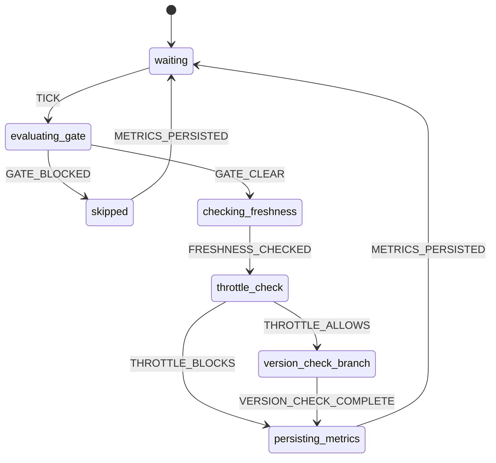

# heartbeat-loop

```mermaid
%% heartbeat-loop
stateDiagram-v2
  [*] --> waiting
  waiting --> evaluating_gate: TICK
  evaluating_gate --> skipped: GATE_BLOCKED
  evaluating_gate --> checking_freshness: GATE_CLEAR
  checking_freshness --> throttle_check: FRESHNESS_CHECKED
  throttle_check --> version_check_branch: THROTTLE_ALLOWS
  throttle_check --> persisting_metrics: THROTTLE_BLOCKS
  version_check_branch --> persisting_metrics: VERSION_CHECK_COMPLETE
  persisting_metrics --> waiting: METRICS_PERSISTED
  skipped --> waiting: METRICS_PERSISTED
```
