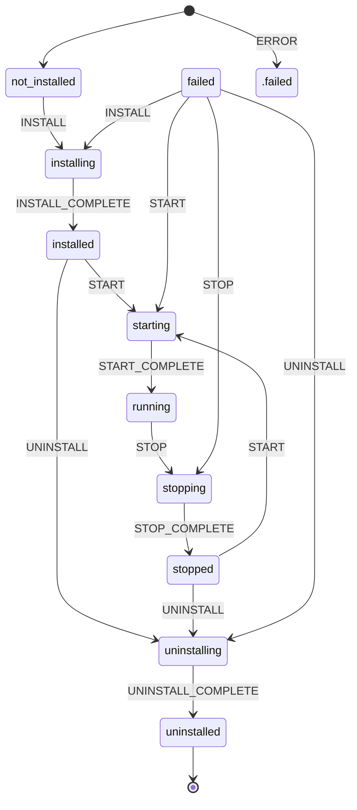

# service-manager

```mermaid
%% service-manager
stateDiagram-v2
  [*] --> not_installed
  not_installed --> installing: INSTALL
  installing --> installed: INSTALL_COMPLETE
  installed --> starting: START
  installed --> uninstalling: UNINSTALL
  starting --> running: START_COMPLETE
  running --> stopping: STOP
  stopping --> stopped: STOP_COMPLETE
  stopped --> starting: START
  stopped --> uninstalling: UNINSTALL
  uninstalling --> uninstalled: UNINSTALL_COMPLETE
  uninstalled --> [*]
  failed --> installing: INSTALL
  failed --> starting: START
  failed --> stopping: STOP
  failed --> uninstalling: UNINSTALL
  [*] --> .failed: ERROR
```
