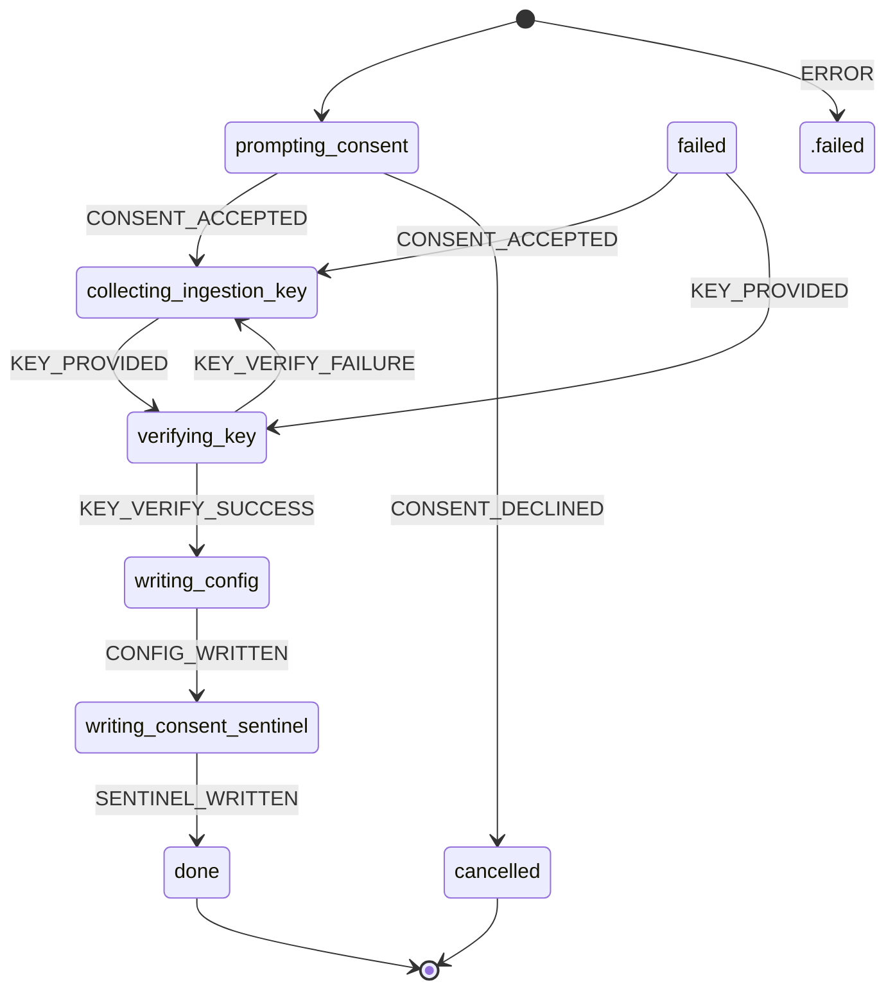

# setup

```mermaid
%% setup
stateDiagram-v2
  [*] --> prompting_consent
  prompting_consent --> collecting_ingestion_key: CONSENT_ACCEPTED
  prompting_consent --> cancelled: CONSENT_DECLINED
  collecting_ingestion_key --> verifying_key: KEY_PROVIDED
  verifying_key --> writing_config: KEY_VERIFY_SUCCESS
  verifying_key --> collecting_ingestion_key: KEY_VERIFY_FAILURE
  writing_config --> writing_consent_sentinel: CONFIG_WRITTEN
  writing_consent_sentinel --> done: SENTINEL_WRITTEN
  done --> [*]
  cancelled --> [*]
  failed --> collecting_ingestion_key: CONSENT_ACCEPTED
  failed --> verifying_key: KEY_PROVIDED
  [*] --> .failed: ERROR
```
