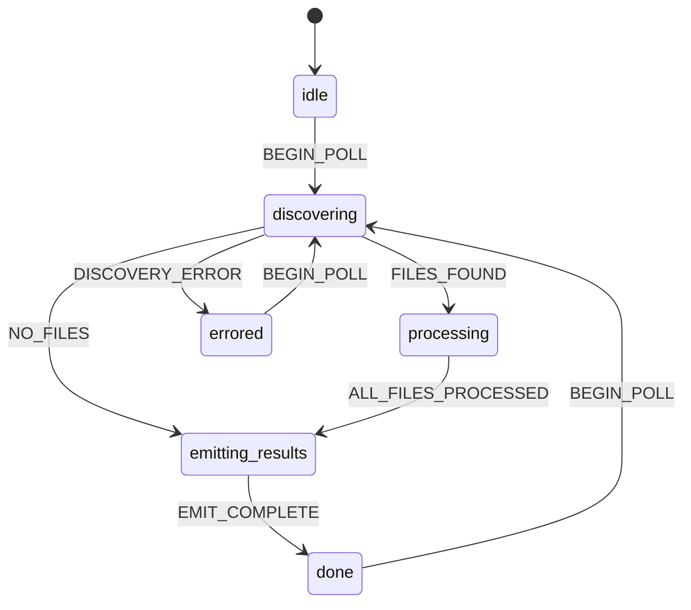

# source-poll

```mermaid
%% source-poll
stateDiagram-v2
  [*] --> idle
  idle --> discovering: BEGIN_POLL
  discovering --> processing: FILES_FOUND
  discovering --> emitting_results: NO_FILES
  discovering --> errored: DISCOVERY_ERROR
  processing --> emitting_results: ALL_FILES_PROCESSED
  emitting_results --> done: EMIT_COMPLETE
  done --> discovering: BEGIN_POLL
  errored --> discovering: BEGIN_POLL
```
