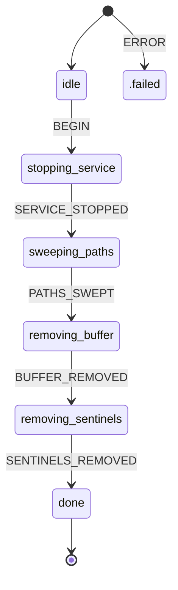

# uninstall

```mermaid
%% uninstall
stateDiagram-v2
  [*] --> idle
  idle --> stopping_service: BEGIN
  stopping_service --> sweeping_paths: SERVICE_STOPPED
  sweeping_paths --> removing_buffer: PATHS_SWEPT
  removing_buffer --> removing_sentinels: BUFFER_REMOVED
  removing_sentinels --> done: SENTINELS_REMOVED
  done --> [*]
  [*] --> .failed: ERROR
```
