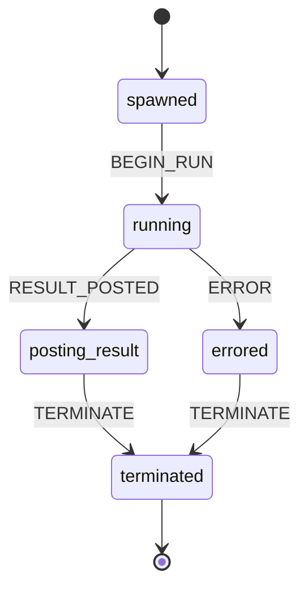

# worker

```mermaid
%% worker
stateDiagram-v2
  [*] --> spawned
  spawned --> running: BEGIN_RUN
  running --> posting_result: RESULT_POSTED
  running --> errored: ERROR
  posting_result --> terminated: TERMINATE
  errored --> terminated: TERMINATE
  terminated --> [*]
```
