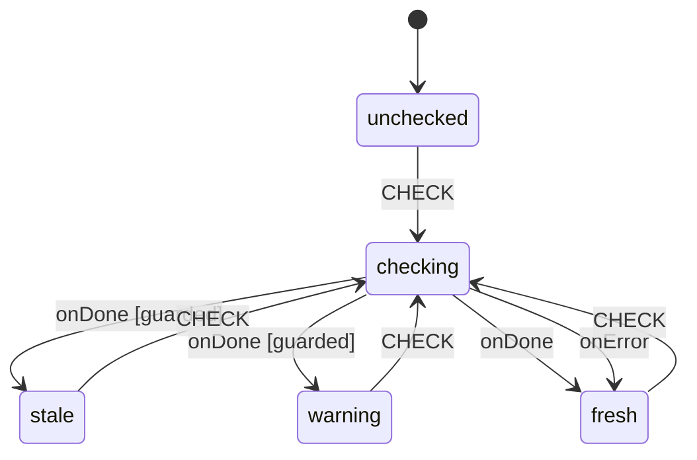

# binary-freshness

```mermaid
%% binary-freshness
stateDiagram-v2
  [*] --> unchecked
  unchecked --> checking: CHECK
  checking --> stale: onDone [guarded]
  checking --> warning: onDone [guarded]
  checking --> fresh: onDone
  checking --> fresh: onError
  fresh --> checking: CHECK
  warning --> checking: CHECK
  stale --> checking: CHECK
```
