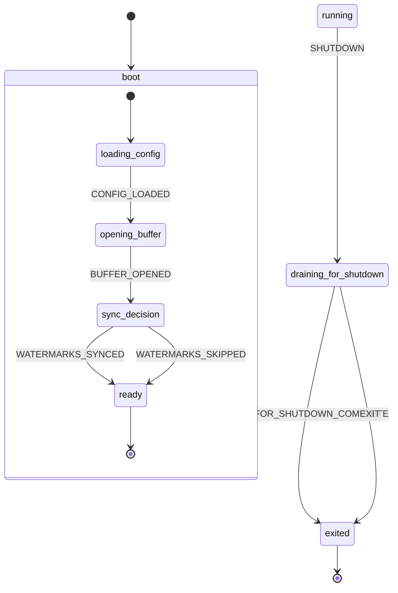

# daemon-root

```mermaid
%% daemon-root
stateDiagram-v2
  [*] --> boot
  state boot {
    [*] --> loading_config
    loading_config --> opening_buffer: CONFIG_LOADED
    opening_buffer --> sync_decision: BUFFER_OPENED
    sync_decision --> ready: WATERMARKS_SYNCED
    sync_decision --> ready: WATERMARKS_SKIPPED
    ready --> [*]
  }
  running --> draining_for_shutdown: SHUTDOWN
  draining_for_shutdown --> exited: DRAIN_FOR_SHUTDOWN_COMPLETE
  draining_for_shutdown --> exited: EXIT
  exited --> [*]
```
