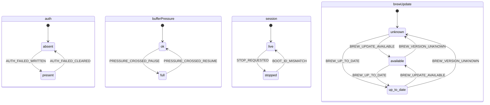

# sentinel-registry

```mermaid
%% sentinel-registry
stateDiagram-v2
  state auth {
    [*] --> absent
    absent --> present: AUTH_FAILED_WRITTEN
    present --> absent: AUTH_FAILED_CLEARED
  }
  state bufferPressure {
    [*] --> ok
    ok --> full: PRESSURE_CROSSED_PAUSE
    full --> ok: PRESSURE_CROSSED_RESUME
  }
  state session {
    [*] --> live
    live --> stopped: STOP_REQUESTED
    stopped --> live: BOOT_ID_MISMATCH
  }
  state brewUpdate {
    [*] --> unknown
    unknown --> available: BREW_UPDATE_AVAILABLE
    unknown --> up_to_date: BREW_UP_TO_DATE
    up_to_date --> available: BREW_UPDATE_AVAILABLE
    up_to_date --> unknown: BREW_VERSION_UNKNOWN
    available --> up_to_date: BREW_UP_TO_DATE
    available --> unknown: BREW_VERSION_UNKNOWN
  }
```
