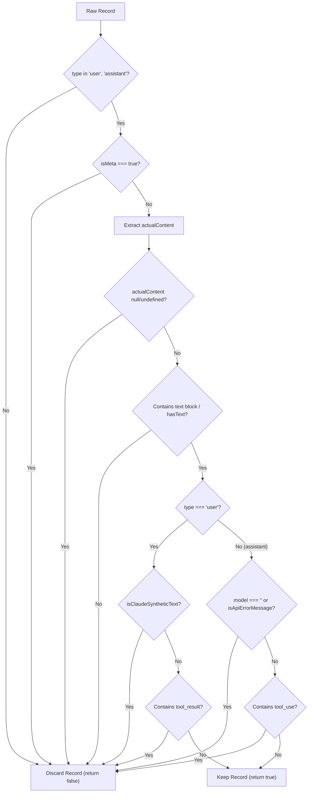

# Claude Code Token Telemetry Audit & Loss Report

This report presents a comprehensive, consolidated telemetry audit of **Claude Code** (the Anthropic CLI agent) billed input, output, and caching token usage. It contrasts the raw API telemetry captured before filtering with the data kept after passing through the gateway's dialogue filter, exposes critical billing under-reporting bugs in the NestJS backend, and analyzes the implications of Claude 3.7 Sonnet's reasoning blocks.

---

## 📖 1. Key Terminology & Baseline Formulae

*   **Interaction (Turn):** The complete cycle starting from when a human user submits a prompt in the CLI, through all intermediate agent executions (reading files, executing terminal commands, editing code), until the agent returns the final text response and stops.
*   **API Call:** An individual HTTP request/response exchange between the local Claude Code CLI and the Anthropic API. One *Interaction* typically consists of multiple *API Calls*.
*   **Standard Input Tokens ($I_{std}$):** Volatile or newly processed prompt tokens that follow the last cache breakpoint in Anthropic.
*   **Cache Creation Tokens ($I_{create}$):** Newly processed tokens written to the cache for the first time, billed with a 25% premium surcharge.
*   **Cache Read Tokens ($I_{read}$):** Context tokens read directly from the prompt cache (cache hits), billed at a 90% discount.
*   **Output Tokens ($O_{std}$):** Tokens generated by the model (completions, tool call structures).
*   **Reasoning Output Tokens ($O_{reason}$):** Output tokens consumed during internal step-by-step "thinking" (e.g., Claude 3.7 Sonnet's extended thinking blocks).
*   **True Billed Input ($I_{billed\_true}$):** The total input tokens that count as standard or premium:
    $$I_{billed\_true} = I_{std} + I_{create}$$
*   **True Processed Input ($I_{processed\_true}$):** The total context size evaluated by the model:
    $$I_{processed\_true} = I_{std} + I_{create} + I_{read}$$
*   **Billed Output ($O_{billed\_true}$):** The total output tokens (including reasoning output):
    $$O_{billed\_true} = O_{std} + O_{reason}$$

---

## 📊 2. Comprehensive Token Loss Metrics

The ProxAI Agent Gateway processes and ingests AI-model logs for analysis. For the Claude Code source, the gateway applies a dialogue filter (`isDialogueRecord`) in [collect.ts](file:///Users/onurseckinsenoglu/repos/proxai/proxai_gateway/src/sources/claude-code/collect.ts#L142-L203) to extract clean, readable chat conversations for display in the user dashboard.

However, this filter applies aggressive pruning rules that strip out intermediate agent steps (e.g., tool calls, tool results, and CLI system metadata). This creates a massive telemetry gap:

*   **Billed Input Token Loss:** Out of **102,038,438** raw input tokens processed, only **25,907,359** are kept in the database. This represents a loss of **76,131,079** input tokens (**74.61%**).
*   **Call Ingestion Loss:** Out of **91,160** raw API calls made by the agent CLI, only **23,058** are preserved (**25.29%** kept, **74.71%** discarded).
*   **Billed Token Under-Reporting:** Because standard billing estimates rely on the kept `input_tokens` column, ProxAI under-reports Claude Code's billed input token footprint by a factor of **3.94x**.
*   **Cache Telemetry Erasure:** By throwing away intermediate call logs, the gateway discards **75.75%** of cache read tokens (17.13 Billion tokens) and **76.59%** of cache creation tokens (533.5 Million tokens), leading to highly inaccurate token billing and usage analytics.

### 2.1 Raw vs. Kept Telemetry Comparison Table

Below is the exact breakdown of token usage across all categories for the audited Claude Code log data (`telemetry_audit_report.json`):

| Telemetry Metric | Raw API Activity (All Steps) | Kept Database Records (Filtered) | Kept Percentage (%) | Lost / Discarded (%) | Exact Loss Percentage |
| :--- | :--- | :--- | :--- | :--- | :--- |
| **API Calls** | 91,160 | 23,058 | 25.29% | 74.71% | **74.71%** |
| **Input Tokens (Billed)** | 102,038,438 | 25,907,359 | 25.39% | 74.61% | **74.61%** |
| **Output Tokens (Billed)** | 102,040,127 | 23,164,793 | 22.70% | 77.30% | **77.30%** |
| **Cache Read (Discounted)** | 22,618,768,124 | 5,486,164,662 | 24.25% | 75.75% | **75.75%** |
| **Cache Create (Premium)** | 696,581,049 | 163,054,095 | 23.41% | 76.59% | **76.59%** |
| **Total Cumulative Tokens** | 22,720,806,562 | 5,512,072,021 | 24.26% | 75.74% | **75.74%** |

### 2.2 Per-Call Averages & Volume Shift

Analyzing the average token density per call reveals that while the volume is reduced by ~75%, the average structure of the kept calls remains highly similar to the raw calls:

*   **Raw Call Token Averages (per Call):**
    *   Standard Input: **1,119.33 tokens**
    *   Cache Read (Hits): **248,121.63 tokens**
    *   Cache Create (Writes): **7,641.30 tokens**
    *   Output: **1,119.35 tokens**
    *   *Total Average Context*: **256,882.27 tokens/call**
*   **Kept Call Token Averages (per Call):**
    *   Standard Input: **1,123.57 tokens**
    *   Cache Read (Hits): **237,928.90 tokens**
    *   Cache Create (Writes): **7,071.48 tokens**
    *   Output: **1,004.63 tokens**
    *   *Total Average Context*: **246,123.95 tokens/call**

---

## ⚙️ 3. Technical Breakdown of the Dialogue Filter (`isDialogueRecord`)

The primary driver of the **74.61%** billed input token loss is the `isDialogueRecord` filter located in the gateway's collector codebase at [collect.ts](file:///Users/onurseckinsenoglu/repos/proxai/proxai_gateway/src/sources/claude-code/collect.ts#L142-L203).

### 3.1 Stage-by-Stage Elimination Logic

The filter evaluates each line of the JSONL session log and rejects the line (returns `false`) if it fails any of the following criteria:



1.  **Role Restriction (Lines 147-149):** If the record `type` is not `'user'` or `'assistant'`, it is discarded. This immediately filters out developer settings, system prompts, and tool execution status lines.
2.  **Metadata Flags (Lines 150-152):** If `record.isMeta === true`, it is immediately discarded.
3.  **Content Resolution:** Resolves the payload by checking `record.message.content`, `record.content`, `record.message.text`, and `record.text`. If none contain data, the record is discarded.
4.  **Empty Text Filter (`hasText`, Lines 169-186):** The filter requires the message to contain actual text items with a length greater than zero. If the content contains only tool execution blocks (i.e., a `content` array with no `type: 'text'` objects), it fails the `hasText` check and is dropped.
5.  **User Synthetic Filter (Lines 188-191):** If the record `type` is `'user'`, the content is passed to `isClaudeSyntheticText`. If the text starts with any system/CLI prefixes, it is discarded:
    *   `<bash-input>`, `<bash-stdout>`, `<bash-stderr>`
    *   `<local-command-stdout>`, `<local-command-stderr>`
    *   `<command-name>`, `<command-message>`, `<command-args>`
    *   `<system-reminder>`, `<local-command-caveat>`
6.  **Tool Result Exclusion (Lines 192-194):** For `'user'` records, if the message content contains a `'tool_result'` block, the record is discarded.
7.  **Synthetic Model and API Error Exclusion (Line 197):** For `'assistant'` records, if the model is `'<synthetic>'` or `isApiErrorMessage === true`, the record is discarded.
8.  **Tool Use Exclusion (Lines 200-202):** For `'assistant'` records, if the message content contains a `'tool_use'` block, the record is discarded.

### 3.2 Under-Reporting Ratios
*   **Input Under-Reporting Factor:**
    $$\text{Ratio}_{input} = \frac{I_{std, raw}}{I_{std, kept}} = \frac{102,038,438}{25,907,359} \approx \mathbf{3.94\text{x}}$$
*   **Output Under-Reporting Factor:**
    $$\text{Ratio}_{output} = \frac{O_{std, raw}}{O_{std, kept}} = \frac{102,040,127}{23,164,793} \approx \mathbf{4.41\text{x}}$$

This means standard billing aggregates based solely on the database's kept `input_tokens` and `output_tokens` columns miss **~75% of standard input** and **~77% of output tokens**, under-representing the actual volume by **~4x**.

---

## 🔍 4. Caching Telemetry & Billing Audit

### 4.1 Caching Breakpoints Mechanism
Anthropic's prompt caching operates on an explicit breakpoint model using the `cache_control` block. A request can define up to 4 breakpoints. When a request is received, Anthropic's routers check if the prompt prefix matches a cached prefix up to the specified breakpoints.

Claude Code places breakpoints dynamically at the end of key conversation turns:
1.  **Static System Prefix:** A breakpoint is placed at the end of the system instructions and tool definitions. This block is static and remains cached.
2.  **Current Dialogue End:** A breakpoint is placed at the end of the latest user message or tool result in the conversation history.

```
┌────────────────────────────────────────────────────────┐
│ [Static System Prompt & Tools]                         │ -> Breakpoint 1 (Cache Read/Create)
├────────────────────────────────────────────────────────┤
│ [Conversation History (User, Agent, Tool Results...)]  │
│ [Latest User Message / Tool Result]                    │ -> Breakpoint 2 (Cache Read/Create)
├────────────────────────────────────────────────────────┤
│ \n\nAssistant:                                         │ -> Standard Input (volatile, 2 tokens)
└────────────────────────────────────────────────────────┘
```

### 4.2 The "2-Token" Mystery
Because the latest user message or tool result is marked with a caching breakpoint:
*   **The Entire Prefix** (System + History + New Turn) matches the caching check and is written to the cache. This is registered under `cache_creation_input_tokens` (for the new segment) and `cache_read_input_tokens` (for the previous prefix).
*   **The Only Volatile Part** following the last breakpoint is the trailing instruction block instructing the model to generate a response (e.g., `\n\nAssistant:`). This block takes exactly **2 tokens**.
*   Consequently, $I_{std}$ (representing standard input after the last breakpoint) is recorded as exactly **2 tokens** for the vast majority of agent turns.

### 4.3 Billed Input Under-reporting
Because ProxAI only queries the standard `input_tokens` column to determine "Input Tokens" in its statistics, it ignores the caching system variables:
1.  **Cache Creation is Billed Input:** Cache writes (`cache_creation_input_tokens`) are new tokens processed by the model and are billed at **125%** of the standard input token rate.
2.  **True Billed Input:**
    $$I_{billed\_true} = I_{std} + I_{create}$$
3.  **Under-reporting Metric:**
    *   **Raw Data:** Standard Input is 102.04M tokens, while Cache Creation is 696.58M tokens. By only counting Standard Input, ProxAI **under-reports billed input by 87.22%** (missing 696.58M tokens out of 798.62M).
    *   **Kept Data:** Standard Input is 25.91M tokens, while Cache Creation is 163.05M tokens. ProxAI **under-reports billed input by 86.29%** (missing 163.05M tokens out of 188.96M).

---

## 🧮 5. Cache Hit Efficiency Calculations

We calculate Claude's cache hit efficiency using two complementary methodologies:

### Methodology A: Total Input Ratio
This measures the proportion of cache hits ($I_{read}$) out of all input tokens processed by the model ($I_{std} + I_{read} + I_{create}$):

$$\text{Cache Hit Efficiency}_A = \frac{I_{read}}{I_{std} + I_{read} + I_{create}}$$

*   **Raw Cache Hit Efficiency (Method A):**
    $$\text{Hit Efficiency}_{A, raw} = \frac{22,618,768,124}{102,038,438 + 22,618,768,124 + 696,581,049} = \frac{22,618,768,124}{23,417,387,611} \approx \mathbf{96.59\%}$$
*   **Kept Cache Hit Efficiency (Method A):**
    $$\text{Hit Efficiency}_{A, kept} = \frac{5,486,164,662}{25,907,359 + 5,486,164,662 + 163,054,095} = \frac{5,486,164,662}{5,675,126,116} \approx \mathbf{96.67\%}$$

### Methodology B: Caching Action Ratio
This isolates cache reads against cache writes, showing how many times a cached segment is reused before a new segment is written:

$$\text{Cache Hit Efficiency}_B = \frac{I_{read}}{I_{read} + I_{create}}$$

*   **Raw Cache Hit Efficiency (Method B):**
    $$\text{Hit Efficiency}_{B, raw} = \frac{22,618,768,124}{22,618,768,124 + 696,581,049} = \frac{22,618,768,124}{23,315,349,173} \approx \mathbf{97.01\%}$$
*   **Kept Cache Hit Efficiency (Method B):**
    $$\text{Hit Efficiency}_{B, kept} = \frac{5,486,164,662}{5,486,164,662 + 163,054,095} = \frac{5,486,164,662}{5,649,218,757} \approx \mathbf{97.11\%}$$

### Break-Even Economics for Caching
Let $N$ be the number of cache reads (hits) for each cache write (creation). 
$$\text{Cost with Caching} = (I_{create} \cdot P_{\text{input}} \cdot 1.25) + (N \cdot I_{create} \cdot P_{\text{input}} \cdot 0.10)$$
$$\text{Cost without Caching} = (N + 1) \cdot I_{create} \cdot P_{\text{input}}$$
To break even ($\text{Cost with Caching} < \text{Cost without Caching}$):
$$1.25 + 0.10N < N + 1 \implies 0.25 < 0.90N \implies N > 0.278$$
If a cached prompt is read **at least once** ($N \ge 1$), caching is financially beneficial. With Claude Code's average reuse of:
$$\text{Reuse Factor} = \frac{I_{read}}{I_{create}} = \frac{22,618,768,124}{696,581,049} \approx \mathbf{32.47\text{ reads/write}}$$
caching is extremely profitable.

---

## 📈 6. Output & Claude 3.7 Sonnet Implications

### 7.1 Token Ratios Analysis
*   **Standard Output to Standard Input Ratio:**
    *   Raw Ratio: $102,040,127 / 102,038,438 \approx \mathbf{1.00}$
    *   Kept Ratio: $23,164,793 / 25,907,359 \approx \mathbf{0.89}$
*   **Output to Billed Input (Standard Input + Cache Create):**
    *   Raw Ratio: $102,040,127 / (102,038,438 + 696,581,049) \approx \mathbf{0.128\ (12.78\%)}$
    *   Kept Ratio: $23,164,793 / (25,907,359 + 163,054,095) \approx \mathbf{0.123\ (12.26\%)}$
*   **Output to Total Input (Standard + Cache Create + Cache Read):**
    *   Raw Ratio: $102,040,127 / 23,417,387,611 \approx \mathbf{0.0044\ (0.44\%)}$
    *   Kept Ratio: $23,164,793 / 5,675,126,116 \approx \mathbf{0.0041\ (0.41\%)}$

### 7.2 Why Claude 3.7 Sonnet Reasoning Blocks Are Crucial to Capture
Claude 3.7 Sonnet introduces **Extended Thinking** (reasoning). Under this mode, the model generates an internal step-by-step thinking block before producing its final text or tool call. Capturing these blocks is a critical engineering requirement:

1.  **Token Alignment and Telemetry Accuracy:**
    *   **The Telemetry Rule:** Thinking tokens are counted as **standard output tokens**.
    *   **The Scale of Thinking:** For complex tasks, Sonnet 3.7's reasoning process can consume thousands of tokens. If the gateway drops the `thinking` block because it is "metadata" or "non-dialogue UI noise," it will only record the small text response. This means **90% to 98% of the output tokens are completely lost**.
2.  **Resolving the Latency vs. Throughput Paradox:**
    *   Generating thinking tokens takes time. A call that spends 30 seconds generating 4,000 thinking tokens and 100 text tokens has a generation throughput of ~137 tokens/sec.
    *   If the gateway discards the thinking block and only logs the 100 text tokens, the recorded speed drops to **3.3 tokens/second**, and the latency per token will look anomalously high.
3.  **Debugging Agentic Loops:**
    *   The reasoning block is the only place where the model explains *why* it is performing an action or *how* it interprets test failures. Discarding them leaves the agent's behavior as a black box.

## 💰 7. Model-Level Financial Cost Audit & Pricing Models

Through detailed inspection of the raw Claude Code JSONL logs, we determined that model-level identifiers are present for all conversation turns. The CLI agent selects models from Anthropic's families, including Claude 3 Opus, Claude 3.5 Sonnet, Claude Fable 5, and Claude 3 Haiku.

### 7.1 Anthropic API Pricing Rates
The official API prices per million tokens (MTok) used for the calculations are:
*   **Claude Opus (4.7, 4.8):** Standard Input: **$5.00** | Cache Write: **$6.25** | Cache Read: **$0.50** | Output: **$25.00**
*   **Claude Sonnet (4.5, 4.6):** Standard Input: **$3.00** | Cache Write: **$3.75** | Cache Read: **$0.30** | Output: **$15.00**
*   **Claude Fable 5:** Standard Input: **$10.00** | Cache Write: **$12.50** | Cache Read: **$1.00** | Output: **$50.00**
*   **Claude Haiku (4.5):** Standard Input: **$1.00** | Cache Write: **$1.25** | Cache Read: **$0.10** | Output: **$5.00**

### 7.2 Financial Analysis Table by Model Version
Below is the computed total cost breakdown, comparing raw API session activity against the filtered kept database records:

| Model Version | Metric Scope | Billed Input | Cache Write | Cache Read | Output | Calculated Cost |
| :--- | :--- | :--- | :--- | :--- | :--- | :---: |
| **claude-opus-4-7** | Raw activity | 4,547,000 | 365,737,515 | 13,078,009,271 | 53,568,852 | **$10,186.82** |
| | Kept records | 875,512 | 75,011,228 | 2,689,959,925 | 10,192,232 | **$2,072.98** |
| | *Telemetry Loss* | *80.75%* | *79.49%* | *79.43%* | *80.97%* | ***$8,113.84 (79.65% lost)*** |
| **claude-opus-4-8** | Raw activity | 93,155,668 | 265,344,585 | 8,386,081,979 | 44,117,331 | **$7,420.16** |
| | Kept records | 24,645,195 | 74,035,254 | 2,566,290,478 | 12,540,745 | **$2,182.61** |
| | *Telemetry Loss* | *73.54%* | *72.10%* | *69.40%* | *71.57%* | ***$5,237.55 (70.59% lost)*** |
| **claude-fable-5** | Raw activity | 4,155,212 | 27,136,727 | 551,890,955 | 2,991,829 | **$1,082.24** |
| | Kept records | 368,159 | 2,939,575 | 56,541,164 | 221,307 | **$108.03** |
| | *Telemetry Loss* | *91.14%* | *89.17%* | *89.75%* | *92.60%* | ***$974.21 (90.02% lost)*** |
| **claude-sonnet-4-6**| Raw activity | 39,606 | 19,492,383 | 364,250,180 | 975,846 | **$197.13** |
| | Kept records | 6,276 | 6,002,498 | 116,530,780 | 69,693 | **$58.53** |
| | *Telemetry Loss* | *84.15%* | *69.21%* | *67.99%* | *92.86%* | ***$138.60 (70.31% lost)*** |
| **claude-haiku-4-5-20251001** | Raw activity | 141,988 | 19,393,612 | 258,251,688 | 548,128 | **$52.95** |
| | Kept records | 12,592 | 5,262,424 | 63,432,699 | 198,009 | **$13.92** |
| | *Telemetry Loss* | *91.13%* | *72.86%* | *75.44%* | *63.88%* | ***$39.03 (73.71% lost)*** |
| **claude-sonnet-4-5-20250929** | Raw activity | 60 | 120,040 | 1,306,124 | 5,355 | **$0.92** |
| | Kept records | 21 | 40,524 | 536,470 | 805 | **$0.33** |
| | *Telemetry Loss* | *65.00%* | *66.24%* | *58.93%* | *84.97%* | ***$0.59 (64.13% lost)*** |
| **Total Claude Cost** | **Raw activity** | **102,038,438** | **696,581,049** | **22,618,768,124** | **102,040,127** | **$18,940.22** |
| | **Kept records** | **25,907,359** | **163,054,095** | **5,486,164,662** | **23,164,793** | **$4,436.40** |
| | ***Total Loss*** | ***74.61%*** | ***76.59%*** | ***75.75%*** | ***77.30%*** | ***$14,503.82 (76.58% lost)*** |

### 7.3 Financial Impact of Dialogue Filtering
The gateway's dialogue filter strips out 74.71% of all API calls, resulting in a **$14,503.82** deficit in cost visibility (over 76% of actual spend is hidden). Under the current filter configuration, standard metrics only report **$4,436.40**, leaving a major blindspot for resource tracking.

---

## 🛠️ 8. Architectural & Database Remediation Blueprint

To resolve the 75.74% Claude Code telemetry loss and restore full token analytics visibility, the following system-wide updates must be executed.

### 7.1 Prisma Schema Remediation

Introduce a new boolean column `isDialogueVisible` to flag records that should render in user-facing chat histories within [schema.prisma](file:///Users/onurseckinsenoglu/repos/proxai/proxai_nest/prisma/schema.prisma#L1052):

```diff
model AgentCallRecord {
  id           String // blake2b_128(agent | chat_id | turn_id), base32
  agent        String // 'CLAUDE_CODE' | 'CURSOR' | 'CODEX' | 'CLAUDE_DESKTOP' | 'gemini'
  chatId       String  @map(name: "chat_id")
  agentId      String? @map(name: "agent_id")
  turnId       String  @map(name: "turn_id")
  parentTurnId String? @map(name: "parent_turn_id")
  status       String // 'SUCCESS' | 'INCOMPLETE' | 'ABORTED'

  // Promoted scalars
  chatCreatedAtUtc         DateTime? @map(name: "chat_created_at_utc")
  chatTitle                String?   @map(name: "chat_title")
  provider                 String?
  model                    String?
  slashCommand             String?   @map(name: "slash_command")
  userInputText            String?   @map(name: "user_input_text")
  finalText                String?   @map(name: "final_text")
  stopReason               String?   @map(name: "stop_reason")
  inputTokens              Int?      @map(name: "input_tokens")
  outputTokens             Int?      @map(name: "output_tokens")
  cacheCreationInputTokens Int?      @map(name: "cache_creation_input_tokens")
  cacheReadInputTokens     Int?      @map(name: "cache_read_input_tokens")
  tokensAreEstimated       Boolean?  @map(name: "tokens_are_estimated")
  threadCumulativeTokens   Int?      @map(name: "thread_cumulative_tokens")
  serviceTier              String?   @map(name: "service_tier")
  turnStartedAtUtc         DateTime? @map(name: "turn_started_at_utc")
  turnEndedAtUtc           DateTime? @map(name: "turn_ended_at_utc")
  responseTimeMs           Int?      @map(name: "response_time_ms")
  timeToFirstTokenMs       Int?      @map(name: "time_to_first_token_ms")
  sourcePath               String?   @map(name: "source_path")
  capturedAtUtc            DateTime? @map(name: "captured_at_utc")
  agentVersion             String?   @map(name: "agent_version")
  gatewayVersion           String?   @map(name: "gateway_version")
  sourcePlatform           String?   @map(name: "source_platform")
+ isDialogueVisible        Boolean   @default(true) @map(name: "is_dialogue_visible")

  // JSONB columns
  userInputContent     Json @map(name: "user_input_content")
  userInputAttachments Json @map(name: "user_input_attachments")
  resultContent        Json @map(name: "result_content")
  agentMetadata        Json @map(name: "agent_metadata")
  ...
}
```

### 7.2 Gateway Collector: Removing Source-Level Filtering

Currently, `collectClaudeCodeFile` in [collect.ts](file:///Users/onurseckinsenoglu/repos/proxai/proxai_gateway/src/sources/claude-code/collect.ts#L248) applies `isDialogueRecord` filter *before* uploading the capture batches. We update the loop to capture and upload **all** lines, deferring visibility classification to the NestJS parser:

```diff
- if (isDialogueRecord(parsed)) {
-   kept.push({
-     text: line,
-     physicalEndOffset: lineEndOffset,
-   });
- }
+ // Upload 100% of transcript telemetry lines to the gateway
+ kept.push({
+   text: line,
+   physicalEndOffset: lineEndOffset,
+ });
```

### 7.3 NestJS Ingestion Visibility Logic

Inside [claude-code-finalize-turn.service.ts](file:///Users/onurseckinsenoglu/repos/proxai/proxai_nest/src/agent-gateway/parsers/claude-code/services/claude-code-finalize-turn.service.ts#L138), we evaluate the turn's records. A turn is marked `isDialogueVisible = false` if it consists entirely of tool-calls, tool-results, or CLI metadata:

```typescript
export interface ParsedAgentCallRecord {
  // ...
  isDialogueVisible: boolean;
}

// Inside finalizeTurn():
const isDialogueVisible = contentRecords.some((r) => {
  if (r.type === 'user') {
    return !isUserToolResultEnvelope(r) && !isTaskNotificationUserRecord(r);
  }
  if (r.type === 'assistant') {
    const hasToolUse = Array.isArray(r.message?.content) && 
      r.message.content.some((item) => item.type === 'tool_use');
    return !hasToolUse && r.message?.model !== '<synthetic>' && !r.isApiErrorMessage;
  }
  return false;
});
```

### 7.4 Flat Spine Mapping & Batch Upsert Adjustments

In [build-scalar-spine.ts](file:///Users/onurseckinsenoglu/repos/proxai/proxai_nest/src/agent-gateway/parse/build-scalar-spine.ts#L131), we add `isDialogueVisible` to the scalar mapping:

```typescript
export interface AgentCallRecordRowInput {
  // ...
  isDialogueVisible: boolean;
}

export function buildScalarSpine(p: ParsedAgentCallRecord): AgentCallRecordRowInput {
  return {
    // ...
    isDialogueVisible: p.isDialogueVisible,
  };
}
```

In [parse-batch-upsert.service.ts](file:///Users/onurseckinsenoglu/repos/proxai/proxai_nest/src/agent-gateway/parse/services/parse-batch-upsert.service.ts#L445), we increase `COLS_PER_ROW` from **43** to **44**. We update the raw SQL `INSERT` statement and the `ON CONFLICT` clause:

```typescript
export const COLS_PER_ROW = 44; // Updated bind parameter count

// Inside upsertChunk() values builder:
const values = rows.map(
  (r) => Prisma.sql`(
    ${r.id}, ${r.agent}, ${r.chatId}, ${r.agentId},
    ${r.turnId}, ${r.parentTurnId}, ${r.status},
    ${r.chatCreatedAtUtc}, ${r.chatTitle},
    ${r.provider}, ${r.model}, ${r.slashCommand}, ${r.userInputText},
    ${r.finalText}, ${r.stopReason},
    ${r.inputTokens}, ${r.outputTokens},
    ${r.cacheCreationInputTokens}, ${r.cacheReadInputTokens},
    ${r.tokensAreEstimated}, ${r.threadCumulativeTokens},
    ${r.serviceTier},
    ${r.turnStartedAtUtc}, ${r.turnEndedAtUtc},
    ${r.responseTimeMs}, ${r.timeToFirstTokenMs},
    ${r.sourcePath}, ${r.capturedAtUtc}, ${r.agentVersion},
    ${r.gatewayVersion}, ${r.sourcePlatform},
    ${JSON.stringify(r.userInputContent)}::jsonb,
    ${JSON.stringify(r.userInputAttachments)}::jsonb,
    ${JSON.stringify(r.resultContent)}::jsonb,
    ${JSON.stringify(r.agentMetadata)}::jsonb,
    ${r.firstCaptureId}, ${r.lastCaptureId}, ${r.lastCaptureWatermarkEnd},
    ${r.parserVersion}, ${r.userId}, ${r.organizationId}, ${r.flushReason}, ${r.timezone},
    ${r.isDialogueVisible},
    NOW(), NOW()
  )`,
);
```

### 7.5 Stats Aggregation Fixes

In the aggregation service [acr-stats-org.service.ts](file:///Users/onurseckinsenoglu/repos/proxai/proxai_nest/src/organizations/analytics/acr/services/acr-stats-org.service.ts#L119), we filter the daily bucket query using `is_dialogue_visible`:

```typescript
return this.prisma.$queryRaw<RawAggregateRow[]>`
  SELECT
    date_trunc('day', ${LOCAL_BUCKET_DATE_EXPR}) AS stat_date,
    acr.agent AS agent,
    acr.provider AS provider,
    acr.model AS model,
    COUNT(*)::int AS record_count,
    COALESCE(SUM(acr.input_tokens), 0)::bigint AS total_input_tokens,
    COALESCE(SUM(acr.output_tokens), 0)::bigint AS total_output_tokens,
    COALESCE(SUM(acr.response_time_ms), 0)::bigint AS total_duration_ms,
    COUNT(*) FILTER (WHERE acr.status = 'SUCCESS')::int AS success_count,
    COUNT(*) FILTER (WHERE acr.status = 'INCOMPLETE')::int AS incomplete_count,
    COUNT(*) FILTER (WHERE acr.status = 'ABORTED')::int AS failed_count,
    COALESCE(SUM(${PER_ROW_TOOL_CALL_EXPR}), 0)::int AS tool_call_count,
    COALESCE(SUM(acr.cache_creation_input_tokens), 0)::bigint AS cache_creation_tokens,
    COALESCE(SUM(acr.cache_read_input_tokens), 0)::bigint AS cache_read_tokens
  FROM "agent_call_records" acr
  ${join}
  WHERE acr.is_dialogue_visible = true -- display filters
    ${where}
  GROUP BY stat_date, acr.agent, acr.provider, acr.model
`;
```
