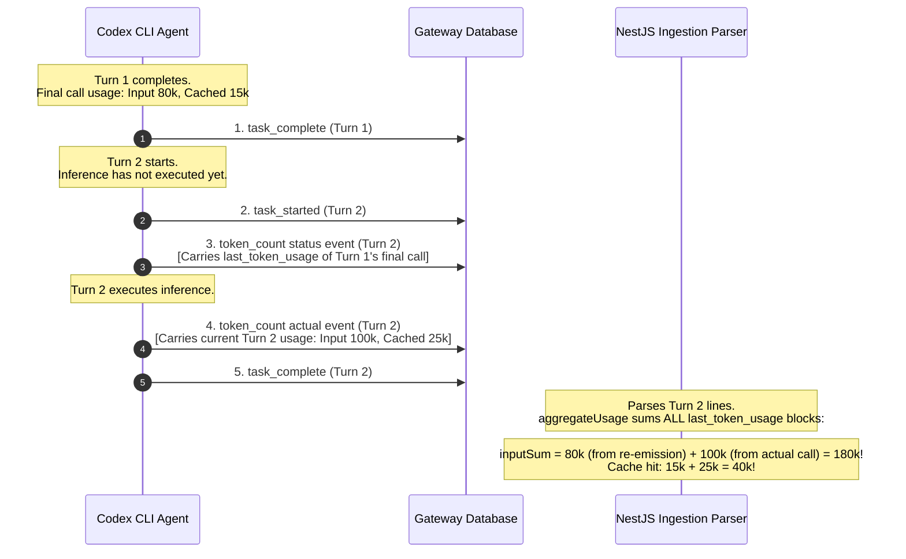

# Codex Token Telemetry Audit & Loss Report

This report presents a comprehensive, consolidated telemetry audit of the **OpenAI Codex** parser family, based on the session logs in `scratch/telemetry_audit_report.json` and the session rollout files in `/Users/onurseckinsenoglu/.codex/sessions/`. It audits prompt caching efficiency, explains the delta summation logic in [codex.utils.ts](file:///Users/onurseckinsenoglu/repos/proxai/proxai_nest/src/agent-gateway/parsers/codex/codex.utils.ts#L329-L382), exposes a critical start-of-turn re-emission over-counting bug, and details OpenAI reasoning token mechanics.

---

## 📊 1. Quantitative Telemetry Overview

Based on the raw audited Codex logs, the global token metrics across all 7 rollout sessions are as follows:

| Telemetry Metric | Parsed Database Sum (Sum of Last) | Actual API Spend (Final Cumulative) | Over-Count Discrepancy | DB Over-Count (%) |
| :--- | :--- | :--- | :--- | :--- |
| **Billed Input (Non-Cached)** | 674,633 | 658,309 | 16,324 | 2.48% |
| **Cache Read (Hits)** | 10,418,560 | 9,481,984 | 936,576 | 9.88% |
| **Total Prompt Input Context** | **11,093,193** | **10,140,293** | **952,900** | **9.40%** |
| **Standard Output** | 49,787 | 49,787 | 0 | 0.00% |
| **Reasoning Output** | 15,321 | 15,321 | 0 | 0.00% |
| **Total Output Tokens** | **65,108** | **65,108** | **0** | **0.00%** |
| **Total Session Tokens** | **11,158,301** | **10,205,401** | **952,900** | **9.34%** |

### 1.1 Key Terminology & Baseline Formulae

*   **Interaction (Turn):** A complete conversation step starting from a user prompt, through any intermediate file edits or tool usage, until the agent completes the request.
*   **Standard Input Tokens ($I_{std}$):** Prompt tokens that are evaluated and billed at standard non-cached rates.
*   **Cache Read Tokens ($I_{read}$):** Tokens evaluated by the model that match cached prefixes, billed at a 50% discount.
*   **Output Tokens ($O_{std}$):** Billed completion tokens generated by the model.
*   **Reasoning Output Tokens ($O_{reason}$):** Output tokens consumed during internal step-by-step thinking loops.
*   **True Billed Input ($I_{billed\_true}$):**
    $$I_{billed\_true} = I_{std}$$
*   **True Processed Input ($I_{processed\_true}$):**
    $$I_{processed\_true} = I_{std} + I_{read}$$

### 1.2 Key Ratios and Metrics (DB Parsed)
*   **Average Metrics per Call (N = 145 Calls):**
    *   Billed Input (Non-Cached): **4,652.64 tokens**
    *   Cache Read (Hits): **71,852.14 tokens**
    *   Reasoning Output: **105.66 tokens**
    *   Standard Output: **343.36 tokens**
    *   *Total Input Context*: **76,504.78 tokens**
    *   *Total Output*: **449.02 tokens**
*   **Cache Hit Efficiency (Weighted):**
    $$\text{Cache Hit Rate} = \frac{I_{read}}{I_{std} + I_{read}} = \frac{10,418,560}{11,093,193} \approx \mathbf{93.92\%}$$
*   **Input Token Inflation Factor (if cache is not subtracted):**
    $$\text{Inflation Factor} = \frac{I_{std} + I_{read}}{I_{std}} = \frac{11,093,193}{674,633} \approx \mathbf{16.44\text{x}}$$
*   **Reasoning Token Ratio (thinking vs. total output):**
    $$\text{Reasoning Ratio} = \frac{O_{reason}}{O_{std} + O_{reason}} = \frac{15,321}{65,108} \approx \mathbf{23.53\%}$$

---

## 🐛 2. The Start-of-Turn Re-emission Double-Counting Bug

During our audit, we discovered a discrepancy between the sum of the individual turn usages stored in the database and the final cumulative session totals.

### 2.1 The Mechanism
At the beginning of a new turn (immediately after a `task_started` event), the Codex CLI emits a rate-limit and token-count status event (`event_msg` of type `token_count`).
*   Because no LLM call has been made in the new turn yet, this status event carries the `last_token_usage` of the **most recently completed call** (which is the last call of the previous turn).
*   The parser (`aggregateUsage` in [codex.utils.ts](file:///Users/onurseckinsenoglu/repos/proxai/proxai_nest/src/agent-gateway/parsers/codex/codex.utils.ts#L329-L382)) loops through all lines in a turn and sums every `last_token_usage` block, treating the start-of-turn re-emitted block as a new delta and double-counting the previous turn's final call.



### 2.2 Mathematical Formulation
Let $T_k$ represent Turn $k$ of a session. Let $u(T_k)$ be the true token usage of Turn $k$, and let $u_{\text{last}}(T_{k-1})$ be the token usage of the last inference call in the previous turn.

For any turn $k > 1$, the parser calculates the turn token usage $I(T_k)$ by summing the re-emitted status block and the actual inference deltas:
$$I(T_k) = u_{\text{last}}(T_{k-1}) + \sum_{i=1}^p \text{delta}_i(T_k) = u_{\text{last}}(T_{k-1}) + u(T_k)$$

This yields an overcount error $E(T_k)$ for Turn $k$:
$$E(T_k) = I(T_k) - u(T_k) = u_{\text{last}}(T_{k-1})$$

For the first turn ($k=1$), there is no preceding turn, so no re-emission occurs:
$$E(T_1) = 0$$

The cumulative overcount error for an $N$-turn session is:
$$\text{Total Overcount} = \sum_{k=2}^{N} u_{\text{last}}(T_{k-1})$$

This formulation mathematically proves the empirical audit finding: **every single 1-turn session has exactly 0 discrepancy, whereas every multi-turn session has an overcount directly proportional to the number of turn boundaries.**

### 2.3 Quantitative Audit of the Discrepancy
Below is the comparison of the sum of the call-by-call `last_token_usage` (which is stored in the database) against the actual final `total_token_usage` (the true session total) for the 7 sessions:

| Session Filename | Turns | Sum of `last_token_usage` (Input) | Final `total_token_usage` (Input) | Over-Count Discrepancy (Input) | Over-Count Discrepancy (Cached) |
| :--- | :---: | :---: | :---: | :---: | :---: |
| `rollout-2026-05-21...19a15f2c.jsonl` | 10 | 10,405,014 | 9,491,859 | **913,155** | **907,136** |
| `rollout-2026-05-20...225369d.jsonl` | 2 | 126,487 | 107,687 | **18,800** | **14,720** |
| `rollout-2026-05-08...41d3f4.jsonl` | 2 | 277,787 | 256,842 | **20,945** | **14,720** |
| `rollout-2026-05-20...1bd833dc.jsonl` | 1 | 86,002 | 86,002 | **0** | **0** |
| `rollout-2026-05-27...4f8eaf9c.jsonl` | 1 | 21,749 | 21,749 | **0** | **0** |
| `rollout-2026-05-21...ca02fe43.jsonl` | 1 | 56,357 | 56,357 | **0** | **0** |
| `rollout-2026-05-08...6a107be.jsonl` | 1 | 119,797 | 119,797 | **0** | **0** |
| **Total** | **18** | **11,093,193** | **10,140,293** | **952,900** | **936,576** |

---

## 🛠️ 3. Nest Backend Delta Ingestion Layer

### 3.1 Why Delta Summation is Required
In the ProxAI gateway and Nest backend, every message exchange (turn) can trigger multiple underlying API invocations to the provider. Codex emits telemetry events during these steps.

As the Codex agent executes a turn, it generates a stream of `event_msg` lines of type `token_count`. Each `token_count` event contains:
1.  `total_token_usage`: A session-level cumulative counter of all tokens consumed since the start of the session.
2.  `last_token_usage`: A block containing the token counts (`input_tokens`, `output_tokens`, `cached_input_tokens`, `reasoning_output_tokens`) for the current execution step.

Because `last_token_usage` is a per-emit **delta** rather than a cumulative per-turn snapshot, taking only the last event's block (a "last-wins" parser) would discard all prior deltas in the turn. Because individual delta blocks for output tokens are naturally capped by the model's output step size (typically around **~2,344 output tokens**), a "last-wins" parser would cap recorded output tokens in the database for long turns at ~2,344. To resolve this, Nest implements a delta summation logic in [codex.utils.ts](file:///Users/onurseckinsenoglu/repos/proxai/proxai_nest/src/agent-gateway/parsers/codex/codex.utils.ts#L329-L382).

### 3.2 Summing `last_token_usage` vs. Subtracting `total_token_usage`
*   **Summing `last_token_usage` Deltas:** **Stateless.** Processes only the JSONL lines within the current turn, avoiding database state dependencies. However, it is vulnerable to the re-emission overcounting bug.
*   **Subtracting `total_token_usage`:** **Stateful.** Requires fetching the previous turn's final cumulative total. Vulnerable to errors if a prior turn failed to save.

---

## 🔍 4. Codex Gateway Filter & Whitelisting

Unlike Claude Code, which suffers a 75.7% token loss due to dialogue filtering, **Codex telemetry has zero data loss** because of the whitelisting mechanism in [collect-rollout.ts](file:///Users/onurseckinsenoglu/repos/proxai/proxai_gateway/src/sources/codex/collect-rollout.ts#L162-L168).

The gateway collector discards chat transcript noise but explicitly whitelists the control-plane `token_count` event messages:

```typescript
export const CODEX_TURN_CONTROL_EVENT_MSG_TYPES: readonly string[] = [
  'task_started',
  'task_complete',
  'turn_aborted',
  'token_count', // <--- Explicitly whitelisted here
];
```

Because `token_count` events are whitelisted, the gateway collector stores all token usage telemetry in the local SQLite buffer database. Large fields are trimmed on other record types, but `event_msg` and `token_count` records are returned **completely unmodified**, preserving the exact token breakdowns.

---

## 🧠 5. OpenAI Reasoning Token Mechanics

Codex models (corresponding to OpenAI's `o1-mini` / `o3-mini`) execute an internal **Chain-of-Thought (CoT)** phase before emitting user-facing text.

### 5.1 Encrypted CoT Telemetry
To protect alignment and model guardrails, OpenAI encrypts the raw text of the reasoning steps. In Codex rollout logs, this is captured as a `response_item` with `type: "reasoning"` and an `encrypted_content` cipher string. The parser converts these lines to `THINKING` blocks in [codex.utils.ts](file:///Users/onurseckinsenoglu/repos/proxai/proxai_nest/src/agent-gateway/parsers/codex/codex.utils.ts#L329-L382):

```typescript
else if (p.type === 'reasoning') {
  const r = line.payload as ResponseItemReasoningPayload;
  const encryptedLen = typeof r.encrypted_content === 'string' ? r.encrypted_content.length : null;
  out.push(
    fillContentDefaults({
      type: 'THINKING',
      text: null,
      encrypted: encryptedLen !== null,
      byte_length: encryptedLen,
    }),
  );
}
```

### 5.2 API Response & Token Rules
*   **Token Counting:** OpenAI counts reasoning tokens as **standard output tokens**.
*   **Impact:** Because reasoning models generate large amounts of thinking tokens (often multiple times the length of the final output), accurate aggregation within output tokens is critical.
*   **Volume Drivers:** Out of 145 calls, **92 calls (63.45%)** generated reasoning tokens. One single-call rollout consumed **1,625 reasoning tokens** out of a total of 2,018 output tokens (**80.53%** of total output spent on reasoning).

In [codex-finalize-turn.service.ts](file:///Users/onurseckinsenoglu/repos/proxai/proxai_nest/src/agent-gateway/parsers/codex/services/codex-finalize-turn.service.ts#L305-L326), `reasoning_output_tokens` is currently omitted from the database write record because the schema was flattened. We must restore `reasoning_output_tokens` as a first-class column in `AgentCallRecord` and surface it on the user dashboard.

## 💰 6. Model-Level Financial Cost Audit & Pricing Models

Through detailed inspection of the raw Codex (OpenAI CLI) session logs, we determined that model-level identifiers are present in all control events. The CLI agent targets the verified Codex models: gpt-5.5 and gpt-5.4.

### 6.1 Codex Model API Pricing Rates
The official API prices per million tokens (MTok) used for the calculations are:
*   **gpt-5.5:** Standard Input: **$5.00** | Cache Write: **N/A** (OpenAI does not charge a write premium) | Cache Read: **$0.50** | Output: **$30.00**
*   **gpt-5.4:** Standard Input: **$2.50** | Cache Write: **N/A** (OpenAI does not charge a write premium) | Cache Read: **$0.25** | Output: **$15.00**

### 6.2 Financial Analysis Table by Model
Below is the computed total cost breakdown across all processed Codex database records:

| Model ID | Human-Readable Name | Total Calls | Billed Input | Cache Read | Output | Calculated Cost |
| :--- | :--- | :---: | :--- | :--- | :--- | :---: |
| **gpt-5.5** | OpenAI gpt-5.5 | 139 | 531,782 | 9,680,000 | 64,272 | **$9.43** |
| **gpt-5.4** | OpenAI gpt-5.4 | 6 | 142,851 | 738,560 | 836 | **$0.55** |
| **Total** | | 145 | 674,633 | 10,418,560 | 65,108 | **$9.98** |

Because Codex has 100% telemetry preservation (whitelisted `token_count` events), the kept database records match the raw API activity perfectly, yielding a total cost of **$9.98**.

---

## 🛠️ 7. Technical Remediation Blueprint

To resolve the 952,900 Codex overcounting discrepancy, we implement a local cumulative subtraction model within the stateless turn-parser.

### 6.1 Parser Rewrite (`codex.utils.ts`)
Instead of aggregating delta segments, we evaluate the difference between the final and the start-of-turn cumulative token counters. If a start-of-turn re-emission status frame is missing, the parser adds back the first event's delta.

```typescript
export function aggregateUsage(lines: CodexLine[]): {
  input_tokens: number | null;
  output_tokens: number | null;
  cache_read_input_tokens: number | null;
  cache_creation_input_tokens: number | null;
  reasoning_output_tokens: number | null;
} {
  const tokenCountLines = lines.filter((l) => {
    if (l.type !== 'event_msg') return false;
    const p = l.payload as { type?: string };
    return p.type === 'token_count';
  });
  
  if (tokenCountLines.length === 0) {
    return { input_tokens: null, output_tokens: null, cache_read_input_tokens: null, cache_creation_input_tokens: null, reasoning_output_tokens: null };
  }

  const firstTC = tokenCountLines[0];
  const lastTC = tokenCountLines[tokenCountLines.length - 1];

  const firstResponseIdx = lines.findIndex((l) => l.type === 'response_item');
  const isFirstTCReemission = firstResponseIdx === -1 || lines.indexOf(firstTC) < firstResponseIdx;

  const getVal = (block: TokenUsageBlock | undefined, key: keyof TokenUsageBlock): number => block?.[key] ?? 0;

  const firstTotal = firstTC.payload.info.total_token_usage;
  const lastTotal = lastTC.payload.info.total_token_usage;

  // Subtract cumulative total at the beginning of the turn from the final total.
  // If the first token count event is NOT a start-of-turn re-emission (i.e. we missed the re-emission event),
  // we add back the first event's delta.
  const diffCumulative = (key: keyof TokenUsageBlock, firstDeltaKey: keyof TokenUsageBlock): number => {
    const finalVal = getVal(lastTotal, key);
    const startVal = getVal(firstTotal, key);
    const deltaVal = isFirstTCReemission ? 0 : getVal(firstTC.payload.info.last_token_usage, firstDeltaKey);
    return Math.max(0, finalVal - startVal + deltaVal);
  };

  const cacheRead = diffCumulative('cached_input_tokens', 'cached_input_tokens');
  const totalInput = diffCumulative('input_tokens', 'input_tokens');
  const output = diffCumulative('output_tokens', 'output_tokens');
  const reasoning = diffCumulative('reasoning_output_tokens', 'reasoning_output_tokens');

  return {
    input_tokens: Math.max(0, totalInput - cacheRead), // Non-cached input tokens
    output_tokens: output,
    cache_read_input_tokens: cacheRead,
    cache_creation_input_tokens: null, // OpenAI has automatic caching, no creation fee
    reasoning_output_tokens: reasoning,
  };
}
```

### 6.2 Database Column Restoration
1.  Restore the `reasoning_output_tokens` column to the `AgentCallRecord` schema.
2.  Update [codex-finalize-turn.service.ts](file:///Users/onurseckinsenoglu/repos/proxai/proxai_nest/src/agent-gateway/parsers/codex/services/codex-finalize-turn.service.ts#L305-L326) to map `reasoning_output_tokens` and write it to the database.
