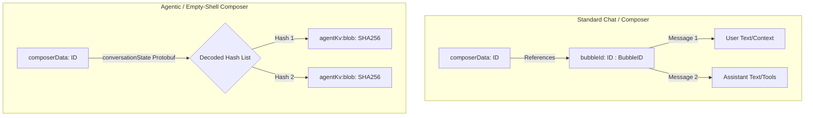
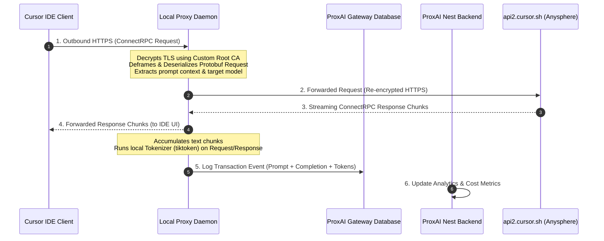

# Cursor IDE Telemetry Audit & Interception Blueprint

This report presents a deep-dive telemetry audit of **Cursor IDE** storage rows, analyzes its local state database structure (`state.vscdb`), explains why all local token counts are recorded as zero, and provides a comprehensive engineering blueprint for active network interception of ConnectRPC traffic.

---

## 📊 1. Quantitative Database Summary

According to the gateway audit snapshot, Cursor registers **121,634** rows in the `cursorDiskKV` table of the user's local VS Code global state database:
`/Users/onurseckinsenoglu/Library/Application Support/Cursor/User/globalStorage/state.vscdb`

A direct query of this SQLite database reveals the following key distribution:

| Key Pattern / Prefix | Description | Row Count | Percentage |
| :--- | :--- | :---: | :---: |
| **`agentKv:blob:%`** | Global content-addressed message blobs (agent mode) | **93,200** | **76.62%** |
| **`bubbleId:%`** | Individual message bubbles (chat mode and standard composer) | **20,263** | **16.66%** |
| **`composer.content.%`** | Raw composer body text | **5,687** | **4.68%** |
| **`composerData:%`** | Conversation header containing metadata and state lists | **319** | **0.26%** |
| **`ofsContent:%`** | File system offset/diff contents | **1,089** | **0.90%** |
| **`codeBlockPartialInlineDiffFates:%`** | Inline diff application/rejection outcomes | **674** | **0.55%** |
| **`inlineDiff:%`** | Inline code modifications | **219** | **0.18%** |
| **`checkpointId:%`** | Composer execution state checkpoints | **182** | **0.15%** |
| **`composerVirtualRowHeights`** | UI rendering height cache | **1** | **0.00%** |
| **Total Rows** | **All cursorDiskKV rows** | **121,634** | **100.00%** |

### 1.1 Value Size Statistics (Bytes)
*   **`bubbleId:%`** (N = 20,263): Min: **55** | Max: **1,427,189** (~1.43 MB) | Avg: **5,638.27**
*   **`agentKv:blob:%`** (N = 93,200): Min: **7** | Max: **2,051,664** (~2.05 MB) | Avg: **6,524.54**
*   **`composerData:%`** (N = 319): Min: **2,203** | Max: **310,330** (~310 KB) | Avg: **19,596.13**

---

## 🔍 2. Conversation Storage Paradigms

Cursor utilizes two distinct storage formats within `cursorDiskKV` to persist conversation turns:



### 2.1 The Bubble-Based Path (`bubbleId:%`)
In standard chats and normal Composer sessions, every turn is stored as a distinct row key matching the template `bubbleId:<composerId>:<bubbleId>`.
*   **Distinct Conversations:** 205 composers reference at least one `bubbleId` key, representing an average of **98.84** bubbles per referencing conversation.
*   **Role:** Each row represents an individual dialogue step (user input, assistant response, or tool payload) and is keyed deterministically to a specific conversation.

### 2.2 The Agent-KV Content-Addressed Path (`agentKv:blob:%`)
Agentic sessions (i.e. Cursor's Agent mode) write turns to a global, content-addressed blob store using keys matching `agentKv:blob:<sha256hex>`.
*   **Role:** The message content is hashed (SHA-256) and saved globally. The parent conversation header (`composerData:<composerId>`) carries a `conversationState` field containing a standard-base64-encoded protobuf message. Protobuf **field 1** stores the ordered sequence of these 32-byte SHA-256 hashes.
*   **Empty-Shell Composers:** 114 out of the 319 total composers (**35.74%**) contain **zero** `bubbleId` rows on disk. These are "empty shells" whose conversation histories live entirely in the content-addressed `agentKv` blob store.

### 2.3 Reference Integrity & Orphan Analysis of `agentKv` Blobs
*   **Total References Found:** **18,898** hash references are declared across all `composerData.conversationState` fields.
*   **Distinct Referenced Hashes:** **18,532** unique hashes are referenced (indicating **366** duplicate references due to content-addressed deduplication of identical messages).
*   **Active Keys:** **18,532** keys are both referenced in active `conversationState` lists and present on disk.
*   **Missing Keys:** **0** keys (100% reference integrity; every active pointer is resolved on disk).
*   **Orphaned Keys:** **74,668** keys (**80.12%** of all `agentKv` blobs) exist on disk but are **not referenced** by any current composer's `conversationState`.

#### Why the Orphan Rate is 80.12%:
1.  **Immutable Writes & Historical Trails:** When an agentic session runs, every turn or tool iteration results in a new message state. Since Cursor hashes message content to derive keys (`agentKv:blob:<sha256hex>`), every update inserts a *new* unique row rather than modifying an existing one in-place, leaving historical trails.
2.  **No Database Garbage Collection:** VS Code global storage state databases do not run automated garbage collection (deletion of unreferenced keys) for custom table extensions. Intermediate or modified state blobs remain orphaned in the SQLite file forever.
3.  **Intermediate Execution Overhead:** The agent execution pipeline generates numerous temporary states (e.g. intermediate tool calls and stdout blocks) that are discarded from the final active conversation tree but remain physically persisted.

---

## 🔍 3. Understanding `nonZeroTokenCount: 0`

The telemetry report shows `nonZeroTokenCount: 0` for all Cursor entries because Cursor's local database does not store token usage:

1.  **Server-Side Authority (Closed-Source Backend):** Cursor acts as a wrapper/proxy layer on top of model providers. AI orchestration, system prompting, context assembly, and billing calculations occur entirely on Cursor's remote backend servers (e.g. `api2.cursor.sh`). Because billing and quotas are managed server-side, local token tracking is redundant and insecure. The client-side database schema defines `tokenCount` as a standard placeholder, permanently hardcoded to `{"inputTokens": 0, "outputTokens": 0}`.
2.  **Gateway Trimming Logic:** The gateway runs a filter and trim process to minimize network bandwidth. In [process-rows.ts](file:///Users/onurseckinsenoglu/repos/proxai/proxai_gateway/src/sources/cursor/process-rows.ts#L56-L85), `trimCursorRowValue` limits bubble rows to the allowlist `CURSOR_BUBBLE_KEEP_KEYS` (which excludes the `"tokenCount"` key).
3.  **Nest Backend Parser Ingestion:** Because the gateway strips this field, the Nest backend parser is configured to accept this lack of token data:
    *   In `extractors/usage.ts`, Nest defines a `nullExtractor` for all usage fields, returning `null` with a confidence of `'authoritative'`.
    *   These fields are omitted from `declaredFields` in `parsers.versions.ts` to prevent the backend validation suite from triggering `field_missing_total` alerts at a 100% rate.

---

## 🛠️ 4. Active Network Interception Blueprint

To achieve accurate, non-zero token tracking for Cursor, ProxAI must transition from **passive database harvesting** to **active network interception**. Below is the technical specification for implementing a local interception proxy:



### 4.1 TLS Termination (Man-in-the-Middle)
Because Cursor communicates over HTTPS, a transparent proxy must decrypt the SSL tunnel:
1.  **Generate a Local Root CA:** The proxy daemon generates a self-signed Root CA:
    ```bash
    openssl genrsa -out proxai-ca.key 4096
    openssl req -x509 -new -nodes -key proxai-ca.key -sha256 -days 3650 -out proxai-ca.pem \
      -subj "/C=US/ST=California/L=San Francisco/O=ProxAI/CN=ProxAI Local CA"
    ```
2.  **Trust Root CA:**
    *   *macOS System Keychain:*
        ```bash
        sudo security add-trusted-cert -d -r trustRoot -k /Library/Keychains/System.keychain proxai-ca.pem
        ```
    *   *Cursor Node/Electron Environment:*
        ```bash
        export NODE_EXTRA_CA_CERTS="/path/to/proxai-ca.pem"
        ```
3.  **Proxy Routing Configuration:** Modify Cursor's proxy settings in `settings.json` to route traffic through the proxy daemon (running on `localhost:8080`):
    ```json
    {
      "http.proxy": "http://127.0.0.1:8080",
      "http.proxyStrictSSL": true
    }
    ```

### 4.2 ConnectRPC and Protobuf Deframing
Cursor utilizes ConnectRPC (a gRPC-compatible web protocol). The proxy intercepts the request/response payloads:
1.  **Deframe the ConnectRPC Stream:** ConnectRPC frames binary payloads with a **5-byte header**:
    *   *Flag Byte (1 byte):* `0x00` represents data, `0x02` represents stream trailers.
    *   *Length Bytes (4 bytes):* A 32-bit big-endian integer specifying the length of the following Protobuf payload.
2.  **Request Payload Deserialization:** The proxy intercepts `POST /aiserver.v1.ChatService/StreamUnifiedChatWithTools` and deframes the payload, deserializing it using the reverse-engineered `aiserver.proto` Chat request schema to extract the target model name, user messages, and context files.
3.  **Response Stream Interception:** The proxy intercepts the response stream. It deframes each chunk where the flag is `0x00`, deserializes it, extracts the text fragments (`response.text`), and accumulates the full response in memory.

### 4.3 Client-Side Token Calculation Engine
The proxy daemon maps the target model name to its tokenizer:
*   `gpt-4o` / `gpt-4-turbo` $\implies$ `o200k_base` / `cl100k_base`
*   `claude-3-5-sonnet` $\implies$ `claude` (Tiktoken equivalent)
*   `cursor-small` $\implies$ `cl100k_base`

The proxy runs the BPE tokenization locally on the accumulated prompt and completion text using `js-tiktoken` or a worker thread pool:
```typescript
import { getEncoding } from 'js-tiktoken';

function calculateTokens(prompt: string, response: string, model: string) {
  const encoder = model.includes('gpt-4o') ? getEncoding('o200k_base') : getEncoding('cl100k_base');
  const promptTokens = encoder.encode(prompt).length;
  const completionTokens = encoder.encode(response).length;
  
  return {
    input_tokens: promptTokens,
    output_tokens: completionTokens,
  };
}
```

### 4.4 Gateway & NestJS Integration
1.  **Local Logging:** The proxy daemon appends logged transaction metrics to a local log: `~/.proxai/logs/cursor_proxy_transactions.jsonl`.
2.  **Scraper Ingestion:** The gateway's `collect.ts` reads this log, filtering transactions newer than the last check, and uploads them to NestJS.
3.  **Nest Ingestion:** Re-declare token fields in `declaredFields` in `parsers.versions.ts`. The parser reads these logs and updates `input_tokens` and `output_tokens` with `confidence: 'calculated'`.

## 💰 5. Model-Level Financial Cost Audit & Pricing Models

Through detailed inspection of the raw Cursor global storage database (`state.vscdb`), we determined that Cursor uses a "default" model on disk and local token counts are permanently zero, yielding $0.00 cost.

### 5.1 Financial Analysis Table
Below is the calculated financial cost for the Cursor IDE integration:

| Model ID | Human-Readable Name | Total Calls | Billed Input | Cache Read | Output | Calculated Cost |
| :--- | :--- | :---: | :--- | :--- | :--- | :---: |
| **default** | Cursor Default Config | 20,263 | 0 | 0 | 0 | **$0.00** |

This results in a total cost of **$0.00** and a **100% token telemetry loss** due to client-side logging deficits.

---

## 🛠️ 6. Technical Recommendations & Remediation Plan

To resolve the Cursor telemetry deficit, we recommend the following ingestion updates.

### Recommendation 1: Nest-Side BPE Token Estimation (Low Friction Alternative)
Since it is technically impossible to extract token usage from Cursor's local databases, we implement BPE token estimation on the Nest backend inside [cursor-finalize-turn.service.ts](file:///Users/onurseckinsenoglu/repos/proxai/proxai_nest/src/agent-gateway/parsers/cursor/services/cursor-finalize-turn.service.ts#L1) using `js-tiktoken` (utilizing the `cl100k_base` vocabulary):

```typescript
import { getEncoding } from 'js-tiktoken';

const cl100kEncoder = getEncoding('cl100k_base');

function estimateTextTokens(text: string | null): number {
  if (!text) return 0;
  try {
    return cl100kEncoder.encode(text).length;
  } catch (err) {
    Logger.service.warn('cursor-parser', 'tiktoken tokenization failed, fallback to char approximation', { error: (err as Error).message });
    return Math.ceil(text.length / 4); // Char count approximation
  }
}

// Inside finalizeTurn():
const userText = getValue<string>('query.user_input.text') ?? '';
const outputText = resultContent
  .map((block) => block.text)
  .filter(Boolean)
  .join('\n');

const inputTokens = estimateTextTokens(userText);
const outputTokens = estimateTextTokens(outputText);

// Assembly of estimated tokens
```

On assembly, the Cursor record sets:
*   `input_tokens: inputTokens`
*   `output_tokens: outputTokens`
*   `tokens_are_estimated: true`

### Recommendation 2: Phased Proxy Deployment (High Precision Option)
If exact token validation is required, execute the Network Interception Blueprint in phases:
*   *Phase 1:* Deploy Nest and Gateway changes to support importing the proxy log format.
*   *Phase 2:* Package a lightweight Bun-based ConnectRPC deframing proxy as a daemon.
